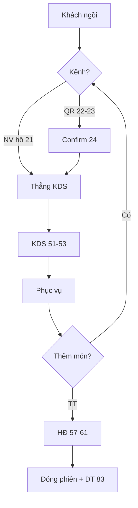

# Đặc tả nghiệp vụ chi tiết — Hệ thống Order tại bàn (OrderPum)

Tài liệu này mô tả **nghiệp vụ tổng thể** và **chi tiết từng chức năng STT 1–105** để người khác / AI khác đọc rồi triển khai đúng.

| File | Vai trò |
|------|---------|
| [`Yeu_cau_chuc_nang_App_Order_Nha_Hang.md`](./Yeu_cau_chuc_nang_App_Order_Nha_Hang.md) | Danh mục ngắn + phân quyền |
| [`Checklist_phat_trien_App_Order_Nha_Hang.md`](./Checklist_phat_trien_App_Order_Nha_Hang.md) | Khi nào làm |
| **File này** | Vì sao / luồng / rule / ngoại lệ / nghiệm thu |
| `Source code/README.md` | Stack kỹ thuật |

---

# Phần I — Nghiệp vụ tổng thể

## 1. Bài toán

1. Thay order giấy / gọi miệng.
2. Hai kênh order **song song** cùng bàn: **NV order hộ (STT 21)** và **Khách QR (STT 22–33)**.
3. Đồng bộ bếp (KDS), thu ngân (POS), app NV, web quản trị.
4. Hệ thống **khép kín**; chỉ mở ra ngoài: cổng thanh toán (102) và HĐĐT (103).

## 2. Client

| Client | User | Việc chính |
|--------|------|------------|
| Web Quản trị | GĐ, CNH, QL | Master data, cấu hình, KM, kho, HR, báo cáo |
| App/Web NV | NVCT, NVTV, TBP | Floor map, order hộ, confirm QR, phục vụ |
| Web Order QR | Khách | Menu, order, gọi NV/TT, tạm tính |
| KDS | Bếp/Bar | Nhận món, cập nhật trạng thái |
| POS | Thu ngân | Hóa đơn, thanh toán, đối soát ca |

## 3. Domain lõi

```
Branch → Area → DiningTable(+QrToken) → TableSession
  ├─ OrderTicket(Source=StaffAssisted|CustomerQr) → OrderLine(status, snapshot giá)
  └─ Invoice + Payment(s)
```

| Thuật ngữ | Nghĩa |
|-----------|-------|
| TableSession | Một lần phục vụ tại bàn đến khi thanh toán xong |
| OrderTicket | Một lần gửi món; luôn có Source |
| OrderLine | Một dòng món; snapshot giá; có vòng đời status |
| StaffAssisted | NV hộ — gửi thẳng KDS |
| CustomerQr | Khách QR — phải confirm (STT 24) trước khi vào bếp |

**OrderLine:** `PendingConfirm` → `SentToKitchen` → `Preparing` → `Ready` → `Served` | `Cancelled`  
**Session:** `Open` → `Paying` → `Closed`

## 4. Luồng ngày bán



## 5. Quy tắc xuyên suốt

1. Gắn BranchId; filter theo quyền.
2. Order có SessionId + Source.
3. Giá line là snapshot.
4. Tiền/hủy/sửa giá/đổi quyền → audit khi đã có STT 6.
5. Không đẩy data ra ngoài ngoài 102 & 103.

---

# Phần II — Chi tiết từng chức năng (đủ STT 1–105)

Mỗi STT có đủ 10 mục: Mục đích · Tiền điều kiện · Luồng · Input · Output · Quy tắc · Ngoại lệ · Side effects · Liên kết · Nghiệm thu.


---

## Module 1. Tài khoản & Phân quyền

### STT 1 — Đăng nhập theo tài khoản/vai trò

| Thuộc tính | Giá trị |
|---|---|
| Module | Module 1. Tài khoản & Phân quyền |
| Nhóm | Đăng nhập/bảo mật |
| Nền tảng | Web Quản trị / App / Web NV |
| Vai trò chính | Tất cả NV |
| Độ ưu tiên | Bắt buộc (MVP) |
| Giai đoạn | GĐ1 |
| Tóm tắt | Đăng nhập SĐT/email + mật khẩu hoặc mã PIN nhanh (NV bấm nhanh tại quầy) |

**1. Mục đích nghiệp vụ**

**Đăng nhập theo tài khoản/vai trò** thuộc Module 1. Tài khoản & Phân quyền / nhóm «Đăng nhập/bảo mật».

Mục tiêu nghiệp vụ: Đăng nhập SĐT/email + mật khẩu hoặc mã PIN nhanh (NV bấm nhanh tại quầy)

Giá trị mang lại: giúp đúng người (Tất cả NV) thực hiện đúng việc trên Web Quản trị / App / Web NV, đảm bảo dữ liệu nhất quán với phiên bàn / chi nhánh / phân quyền.

**2. Tiền điều kiện**

- Người dùng thuộc vai trò phù hợp: Tất cả NV
- Thao tác trên nền tảng: Web Quản trị / App / Web NV
- Đã xác thực (trừ chức năng khách ẩn danh trên Web Order QR)
- Dữ liệu master liên quan đã sẵn (chi nhánh/bàn/menu/user tùy chức năng)

**3. Luồng xử lý chi tiết**

1. Nhập SĐT/email + mật khẩu hoặc PIN
2. Máy chủ kiểm tra hash + trạng thái khóa + (optional) giới hạn thiết bị
3. Phát hành token/session kèm role, branchId, displayName
4. Client lưu phiên và điều hướng theo quyền

**4. Dữ liệu đầu vào**

- phoneOrEmail
- password hoặc pin
- deviceId (optional)

**5. Dữ liệu đầu ra / trạng thái**

- accessToken
- role
- branchId
- displayName

**6. Quy tắc nghiệp vụ**

- Đăng nhập SĐT/email + mật khẩu hoặc mã PIN nhanh (NV bấm nhanh tại quầy)
- User bị khóa không đăng nhập được
- PIN chỉ dùng khi đã cấu hình

**7. Ngoại lệ & xử lý lỗi**

- Không đủ quyền → từ chối rõ ràng
- Input invalid → báo đúng field
- Xung đột trạng thái (đã đóng/đã thanh toán/đã hủy) → chặn
- Lỗi hệ thống → rollback transaction, không để dữ liệu dở

**8. Ảnh hưởng hệ thống (side effects)**

- Cập nhật dữ liệu module liên quan trong hệ thống nội bộ
- Có thể phát sự kiện realtime (order/bàn/thông báo)
- Có thể ghi audit với thao tác nhạy cảm (tiền, hủy, quyền, kho)

**9. Liên kết chức năng**

STT 1, STT 2, STT 4, STT 105

**10. Tiêu chí nghiệm thu**

- [ ] Thực hiện đúng mô tả chức năng: Đăng nhập SĐT/email + mật khẩu hoặc mã PIN nhanh (NV bấm nhanh tại quầy)
- [ ] Đúng actor/nền tảng: Tất cả NV trên Web Quản trị / App / Web NV
- [ ] User không đủ quyền bị chặn
- [ ] Các lỗi phổ biến có message rõ; không làm hỏng dữ liệu
- [ ] Khớp giai đoạn checklist GĐ1 khi đến lượt triển khai


### STT 2 — Phân quyền theo 6 cấp bậc

| Thuộc tính | Giá trị |
|---|---|
| Module | Module 1. Tài khoản & Phân quyền |
| Nhóm | Đăng nhập/bảo mật |
| Nền tảng | Web Quản trị |
| Vai trò chính | GĐ/CNH/QL/TBP |
| Độ ưu tiên | Bắt buộc (MVP) |
| Giai đoạn | GĐ1 |
| Tóm tắt | GĐ chuỗi > CNH > QL > TBP > NVCT > NVTV; mỗi cấp giới hạn phạm vi dữ liệu & chức năng |

**1. Mục đích nghiệp vụ**

**Phân quyền theo 6 cấp bậc** thuộc Module 1. Tài khoản & Phân quyền / nhóm «Đăng nhập/bảo mật».

Mục tiêu nghiệp vụ: GĐ chuỗi > CNH > QL > TBP > NVCT > NVTV; mỗi cấp giới hạn phạm vi dữ liệu & chức năng

Giá trị mang lại: giúp đúng người (GĐ/CNH/QL/TBP) thực hiện đúng việc trên Web Quản trị, đảm bảo dữ liệu nhất quán với phiên bàn / chi nhánh / phân quyền.

**2. Tiền điều kiện**

- Người dùng thuộc vai trò phù hợp: GĐ/CNH/QL/TBP
- Thao tác trên nền tảng: Web Quản trị
- Đã xác thực (trừ chức năng khách ẩn danh trên Web Order QR)
- Dữ liệu master liên quan đã sẵn (chi nhánh/bàn/menu/user tùy chức năng)

**3. Luồng xử lý chi tiết**

1. Nhập SĐT/email + mật khẩu hoặc PIN
2. Máy chủ kiểm tra hash + trạng thái khóa + (optional) giới hạn thiết bị
3. Phát hành token/session kèm role, branchId, displayName
4. Client lưu phiên và điều hướng theo quyền

**4. Dữ liệu đầu vào**

- phoneOrEmail
- password hoặc pin
- deviceId (optional)

**5. Dữ liệu đầu ra / trạng thái**

- accessToken
- role
- branchId
- displayName

**6. Quy tắc nghiệp vụ**

- GĐ chuỗi > CNH > QL > TBP > NVCT > NVTV; mỗi cấp giới hạn phạm vi dữ liệu & chức năng
- User bị khóa không đăng nhập được
- PIN chỉ dùng khi đã cấu hình

**7. Ngoại lệ & xử lý lỗi**

- Không đủ quyền → từ chối rõ ràng
- Input invalid → báo đúng field
- Xung đột trạng thái (đã đóng/đã thanh toán/đã hủy) → chặn
- Lỗi hệ thống → rollback transaction, không để dữ liệu dở

**8. Ảnh hưởng hệ thống (side effects)**

- Cập nhật dữ liệu module liên quan trong hệ thống nội bộ
- Có thể phát sự kiện realtime (order/bàn/thông báo)
- Có thể ghi audit với thao tác nhạy cảm (tiền, hủy, quyền, kho)

**9. Liên kết chức năng**

STT 1, STT 2, STT 4, STT 105

**10. Tiêu chí nghiệm thu**

- [ ] Thực hiện đúng mô tả chức năng: GĐ chuỗi > CNH > QL > TBP > NVCT > NVTV; mỗi cấp giới hạn phạm vi dữ liệu & chức năng
- [ ] Đúng actor/nền tảng: GĐ/CNH/QL/TBP trên Web Quản trị
- [ ] User không đủ quyền bị chặn
- [ ] Các lỗi phổ biến có message rõ; không làm hỏng dữ liệu
- [ ] Khớp giai đoạn checklist GĐ1 khi đến lượt triển khai


### STT 3 — Ma trận phân quyền chi tiết theo module

| Thuộc tính | Giá trị |
|---|---|
| Module | Module 1. Tài khoản & Phân quyền |
| Nhóm | Đăng nhập/bảo mật |
| Nền tảng | Web Quản trị |
| Vai trò chính | GĐ/CNH |
| Độ ưu tiên | Quan trọng |
| Giai đoạn | GĐ2 |
| Tóm tắt | CNH/QL tự cấu hình quyền (xem/thêm/sửa/xóa/duyệt) theo vai trò × module |

**1. Mục đích nghiệp vụ**

**Ma trận phân quyền chi tiết theo module** thuộc Module 1. Tài khoản & Phân quyền / nhóm «Đăng nhập/bảo mật».

Mục tiêu nghiệp vụ: CNH/QL tự cấu hình quyền (xem/thêm/sửa/xóa/duyệt) theo vai trò × module

Giá trị mang lại: giúp đúng người (GĐ/CNH) thực hiện đúng việc trên Web Quản trị, đảm bảo dữ liệu nhất quán với phiên bàn / chi nhánh / phân quyền.

**2. Tiền điều kiện**

- Người dùng thuộc vai trò phù hợp: GĐ/CNH
- Thao tác trên nền tảng: Web Quản trị
- Đã xác thực (trừ chức năng khách ẩn danh trên Web Order QR)
- Dữ liệu master liên quan đã sẵn (chi nhánh/bàn/menu/user tùy chức năng)

**3. Luồng xử lý chi tiết**

1. Nhập SĐT/email + mật khẩu hoặc PIN
2. Máy chủ kiểm tra hash + trạng thái khóa + (optional) giới hạn thiết bị
3. Phát hành token/session kèm role, branchId, displayName
4. Client lưu phiên và điều hướng theo quyền

**4. Dữ liệu đầu vào**

- phoneOrEmail
- password hoặc pin
- deviceId (optional)

**5. Dữ liệu đầu ra / trạng thái**

- accessToken
- role
- branchId
- displayName

**6. Quy tắc nghiệp vụ**

- CNH/QL tự cấu hình quyền (xem/thêm/sửa/xóa/duyệt) theo vai trò × module
- User bị khóa không đăng nhập được
- PIN chỉ dùng khi đã cấu hình

**7. Ngoại lệ & xử lý lỗi**

- Không đủ quyền → từ chối rõ ràng
- Input invalid → báo đúng field
- Xung đột trạng thái (đã đóng/đã thanh toán/đã hủy) → chặn
- Lỗi hệ thống → rollback transaction, không để dữ liệu dở

**8. Ảnh hưởng hệ thống (side effects)**

- Cập nhật dữ liệu module liên quan trong hệ thống nội bộ
- Có thể phát sự kiện realtime (order/bàn/thông báo)
- Có thể ghi audit với thao tác nhạy cảm (tiền, hủy, quyền, kho)

**9. Liên kết chức năng**

STT 1, STT 2, STT 4, STT 105

**10. Tiêu chí nghiệm thu**

- [ ] Thực hiện đúng mô tả chức năng: CNH/QL tự cấu hình quyền (xem/thêm/sửa/xóa/duyệt) theo vai trò × module
- [ ] Đúng actor/nền tảng: GĐ/CNH trên Web Quản trị
- [ ] User không đủ quyền bị chặn
- [ ] Các lỗi phổ biến có message rõ; không làm hỏng dữ liệu
- [ ] Khớp giai đoạn checklist GĐ2 khi đến lượt triển khai


### STT 4 — CRUD tài khoản nhân viên

| Thuộc tính | Giá trị |
|---|---|
| Module | Module 1. Tài khoản & Phân quyền |
| Nhóm | Quản lý tài khoản |
| Nền tảng | Web Quản trị |
| Vai trò chính | CNH/QL |
| Độ ưu tiên | Bắt buộc (MVP) |
| Giai đoạn | GĐ1 |
| Tóm tắt | Tạo, sửa, khóa/mở, xóa; gán vai trò, gán chi nhánh |

**1. Mục đích nghiệp vụ**

**CRUD tài khoản nhân viên** thuộc Module 1. Tài khoản & Phân quyền / nhóm «Quản lý tài khoản».

Mục tiêu nghiệp vụ: Tạo, sửa, khóa/mở, xóa; gán vai trò, gán chi nhánh

Giá trị mang lại: giúp đúng người (CNH/QL) thực hiện đúng việc trên Web Quản trị, đảm bảo dữ liệu nhất quán với phiên bàn / chi nhánh / phân quyền.

**2. Tiền điều kiện**

- Người dùng thuộc vai trò phù hợp: CNH/QL
- Thao tác trên nền tảng: Web Quản trị
- Đã xác thực (trừ chức năng khách ẩn danh trên Web Order QR)
- Dữ liệu master liên quan đã sẵn (chi nhánh/bàn/menu/user tùy chức năng)

**3. Luồng xử lý chi tiết**

1. Mở danh sách đối tượng theo chi nhánh (nếu có)
2. Tạo mới: nhập form → validate → lưu → nhận ID
3. Xem chi tiết / sửa: tải bản ghi → chỉnh → lưu
4. Vô hiệu hóa hoặc xóa mềm khi không còn dùng; chặn xóa cứng nếu đã phát sinh giao dịch
5. Tìm kiếm, lọc, sắp xếp, phân trang

**4. Dữ liệu đầu vào**

- Các trường nghiệp vụ của đối tượng
- branchId (nếu dữ liệu theo CN)
- trạng thái active

**5. Dữ liệu đầu ra / trạng thái**

- Bản ghi tạo/cập nhật
- Danh sách sau thay đổi

**6. Quy tắc nghiệp vụ**

- Tạo, sửa, khóa/mở, xóa; gán vai trò, gán chi nhánh
- Ưu tiên soft-delete / ngưng dùng thay vì xóa cứng
- Ràng buộc unique theo phạm vi chi nhánh khi cần
- Tuân thủ phân quyền STT 2/3

**7. Ngoại lệ & xử lý lỗi**

- Không đủ quyền → từ chối rõ ràng
- Input invalid → báo đúng field
- Xung đột trạng thái (đã đóng/đã thanh toán/đã hủy) → chặn
- Lỗi hệ thống → rollback transaction, không để dữ liệu dở

**8. Ảnh hưởng hệ thống (side effects)**

- Cập nhật dữ liệu module liên quan trong hệ thống nội bộ
- Có thể phát sự kiện realtime (order/bàn/thông báo)
- Có thể ghi audit với thao tác nhạy cảm (tiền, hủy, quyền, kho)

**9. Liên kết chức năng**

STT 1, STT 2, STT 4, STT 105

**10. Tiêu chí nghiệm thu**

- [ ] Thực hiện đúng mô tả chức năng: Tạo, sửa, khóa/mở, xóa; gán vai trò, gán chi nhánh
- [ ] Đúng actor/nền tảng: CNH/QL trên Web Quản trị
- [ ] User không đủ quyền bị chặn
- [ ] Các lỗi phổ biến có message rõ; không làm hỏng dữ liệu
- [ ] Khớp giai đoạn checklist GĐ1 khi đến lượt triển khai


### STT 5 — Hồ sơ nhân viên

| Thuộc tính | Giá trị |
|---|---|
| Module | Module 1. Tài khoản & Phân quyền |
| Nhóm | Quản lý tài khoản |
| Nền tảng | Web Quản trị |
| Vai trò chính | CNH/QL |
| Độ ưu tiên | Quan trọng |
| Giai đoạn | GĐ2 |
| Tóm tắt | Thông tin cá nhân, HĐLĐ, ngày vào làm, Fulltime/Parttime, mức lương |

**1. Mục đích nghiệp vụ**

**Hồ sơ nhân viên** thuộc Module 1. Tài khoản & Phân quyền / nhóm «Quản lý tài khoản».

Mục tiêu nghiệp vụ: Thông tin cá nhân, HĐLĐ, ngày vào làm, Fulltime/Parttime, mức lương

Giá trị mang lại: giúp đúng người (CNH/QL) thực hiện đúng việc trên Web Quản trị, đảm bảo dữ liệu nhất quán với phiên bàn / chi nhánh / phân quyền.

**2. Tiền điều kiện**

- Người dùng thuộc vai trò phù hợp: CNH/QL
- Thao tác trên nền tảng: Web Quản trị
- Đã xác thực (trừ chức năng khách ẩn danh trên Web Order QR)
- Dữ liệu master liên quan đã sẵn (chi nhánh/bàn/menu/user tùy chức năng)

**3. Luồng xử lý chi tiết**

1. Chọn loại thao tác kho / khai báo định mức
2. Nhập chi tiết mặt hàng, số lượng, đơn giá/HSD/lý do/tham chiếu order
3. Duyệt phiếu nếu quy trình yêu cầu
4. Cập nhật tồn kho và giá vốn theo policy thống nhất (bình quân hoặc FIFO)
5. Phát cảnh báo min/HSD nếu chạm ngưỡng

**4. Dữ liệu đầu vào**

- itemId
- qty
- unit
- unitCost?
- reason
- ref (order/NCC/CN)

**5. Dữ liệu đầu ra / trạng thái**

- StockMovement
- Tồn mới
- COGS/BOM records tùy chức năng

**6. Quy tắc nghiệp vụ**

- Thông tin cá nhân, HĐLĐ, ngày vào làm, Fulltime/Parttime, mức lương
- Xuất tay bắt buộc lý do + audit
- Xuất auto theo BOM khi món vào bếp/confirm
- Không để tồn âm nếu policy chặn

**7. Ngoại lệ & xử lý lỗi**

- Không đủ quyền → từ chối rõ ràng
- Input invalid → báo đúng field
- Xung đột trạng thái (đã đóng/đã thanh toán/đã hủy) → chặn
- Lỗi hệ thống → rollback transaction, không để dữ liệu dở

**8. Ảnh hưởng hệ thống (side effects)**

- Cập nhật dữ liệu module liên quan trong hệ thống nội bộ
- Có thể phát sự kiện realtime (order/bàn/thông báo)
- Có thể ghi audit với thao tác nhạy cảm (tiền, hủy, quyền, kho)

**9. Liên kết chức năng**

STT 1, STT 2, STT 4, STT 105

**10. Tiêu chí nghiệm thu**

- [ ] Thực hiện đúng mô tả chức năng: Thông tin cá nhân, HĐLĐ, ngày vào làm, Fulltime/Parttime, mức lương
- [ ] Đúng actor/nền tảng: CNH/QL trên Web Quản trị
- [ ] User không đủ quyền bị chặn
- [ ] Các lỗi phổ biến có message rõ; không làm hỏng dữ liệu
- [ ] Khớp giai đoạn checklist GĐ2 khi đến lượt triển khai


### STT 6 — Nhật ký hoạt động (Audit log)

| Thuộc tính | Giá trị |
|---|---|
| Module | Module 1. Tài khoản & Phân quyền |
| Nhóm | Bảo mật & nhật ký |
| Nền tảng | Web Quản trị |
| Vai trò chính | GĐ/CNH/QL |
| Độ ưu tiên | Quan trọng |
| Giai đoạn | GĐ2 |
| Tóm tắt | Ghi thao tác quan trọng: sửa giá, hủy món, hủy HĐ, đổi ca… + người + thời gian |

**1. Mục đích nghiệp vụ**

**Nhật ký hoạt động (Audit log)** thuộc Module 1. Tài khoản & Phân quyền / nhóm «Bảo mật & nhật ký».

Mục tiêu nghiệp vụ: Ghi thao tác quan trọng: sửa giá, hủy món, hủy HĐ, đổi ca… + người + thời gian

Giá trị mang lại: giúp đúng người (GĐ/CNH/QL) thực hiện đúng việc trên Web Quản trị, đảm bảo dữ liệu nhất quán với phiên bàn / chi nhánh / phân quyền.

**2. Tiền điều kiện**

- Người dùng thuộc vai trò phù hợp: GĐ/CNH/QL
- Thao tác trên nền tảng: Web Quản trị
- Đã xác thực (trừ chức năng khách ẩn danh trên Web Order QR)
- Dữ liệu master liên quan đã sẵn (chi nhánh/bàn/menu/user tùy chức năng)

**3. Luồng xử lý chi tiết**

1. Nhận ticket/line từ order NV hộ hoặc QR đã confirm
2. Hiển thị theo bàn/trạm; cho phép đổi trạng thái chế biến
3. Đồng bộ trạng thái về App NV và Web QR
4. Hủy/đổi món: kiểm tra giai đoạn chế biến → yêu cầu duyệt nếu cần → ghi lý do

**4. Dữ liệu đầu vào**

- ticket/line ids
- new status
- cancel reason
- approver

**5. Dữ liệu đầu ra / trạng thái**

- Line status updates
- Realtime events
- Optional print jobs

**6. Quy tắc nghiệp vụ**

- Ghi thao tác quan trọng: sửa giá, hủy món, hủy HĐ, đổi ca… + người + thời gian
- Chỉ nhận line đủ điều kiện vào bếp
- Hủy sau khi đã làm cần duyệt + audit
- SLA tô màu chờ lâu

**7. Ngoại lệ & xử lý lỗi**

- Không đủ quyền → từ chối rõ ràng
- Input invalid → báo đúng field
- Xung đột trạng thái (đã đóng/đã thanh toán/đã hủy) → chặn
- Lỗi hệ thống → rollback transaction, không để dữ liệu dở

**8. Ảnh hưởng hệ thống (side effects)**

- Cập nhật dữ liệu module liên quan trong hệ thống nội bộ
- Có thể phát sự kiện realtime (order/bàn/thông báo)
- Có thể ghi audit với thao tác nhạy cảm (tiền, hủy, quyền, kho)

**9. Liên kết chức năng**

STT 1, STT 2, STT 4, STT 105

**10. Tiêu chí nghiệm thu**

- [ ] Thực hiện đúng mô tả chức năng: Ghi thao tác quan trọng: sửa giá, hủy món, hủy HĐ, đổi ca… + người + thời gian
- [ ] Đúng actor/nền tảng: GĐ/CNH/QL trên Web Quản trị
- [ ] User không đủ quyền bị chặn
- [ ] Các lỗi phổ biến có message rõ; không làm hỏng dữ liệu
- [ ] Khớp giai đoạn checklist GĐ2 khi đến lượt triển khai


### STT 7 — Đăng xuất tự động / giới hạn thiết bị

| Thuộc tính | Giá trị |
|---|---|
| Module | Module 1. Tài khoản & Phân quyền |
| Nhóm | Bảo mật & nhật ký |
| Nền tảng | App/Web NV |
| Vai trò chính | Tất cả NV |
| Độ ưu tiên | Nên có |
| Giai đoạn | GĐ3 |
| Tóm tắt | Auto logout khi idle; giới hạn số thiết bị đăng nhập đồng thời (POS) |

**1. Mục đích nghiệp vụ**

**Đăng xuất tự động / giới hạn thiết bị** thuộc Module 1. Tài khoản & Phân quyền / nhóm «Bảo mật & nhật ký».

Mục tiêu nghiệp vụ: Auto logout khi idle; giới hạn số thiết bị đăng nhập đồng thời (POS)

Giá trị mang lại: giúp đúng người (Tất cả NV) thực hiện đúng việc trên App/Web NV, đảm bảo dữ liệu nhất quán với phiên bàn / chi nhánh / phân quyền.

**2. Tiền điều kiện**

- Người dùng thuộc vai trò phù hợp: Tất cả NV
- Thao tác trên nền tảng: App/Web NV
- Đã xác thực (trừ chức năng khách ẩn danh trên Web Order QR)
- Dữ liệu master liên quan đã sẵn (chi nhánh/bàn/menu/user tùy chức năng)

**3. Luồng xử lý chi tiết**

1. Nhập SĐT/email + mật khẩu hoặc PIN
2. Máy chủ kiểm tra hash + trạng thái khóa + (optional) giới hạn thiết bị
3. Phát hành token/session kèm role, branchId, displayName
4. Client lưu phiên và điều hướng theo quyền

**4. Dữ liệu đầu vào**

- phoneOrEmail
- password hoặc pin
- deviceId (optional)

**5. Dữ liệu đầu ra / trạng thái**

- accessToken
- role
- branchId
- displayName

**6. Quy tắc nghiệp vụ**

- Auto logout khi idle; giới hạn số thiết bị đăng nhập đồng thời (POS)
- User bị khóa không đăng nhập được
- PIN chỉ dùng khi đã cấu hình

**7. Ngoại lệ & xử lý lỗi**

- Không đủ quyền → từ chối rõ ràng
- Input invalid → báo đúng field
- Xung đột trạng thái (đã đóng/đã thanh toán/đã hủy) → chặn
- Lỗi hệ thống → rollback transaction, không để dữ liệu dở

**8. Ảnh hưởng hệ thống (side effects)**

- Cập nhật dữ liệu module liên quan trong hệ thống nội bộ
- Có thể phát sự kiện realtime (order/bàn/thông báo)
- Có thể ghi audit với thao tác nhạy cảm (tiền, hủy, quyền, kho)

**9. Liên kết chức năng**

STT 1, STT 2, STT 4, STT 105

**10. Tiêu chí nghiệm thu**

- [ ] Thực hiện đúng mô tả chức năng: Auto logout khi idle; giới hạn số thiết bị đăng nhập đồng thời (POS)
- [ ] Đúng actor/nền tảng: Tất cả NV trên App/Web NV
- [ ] User không đủ quyền bị chặn
- [ ] Các lỗi phổ biến có message rõ; không làm hỏng dữ liệu
- [ ] Khớp giai đoạn checklist GĐ3 khi đến lượt triển khai


---

## Module 2. Quản lý chi nhánh / chuỗi

### STT 8 — CRUD chi nhánh nhà hàng

| Thuộc tính | Giá trị |
|---|---|
| Module | Module 2. Quản lý chi nhánh / chuỗi |
| Nhóm | Chi nhánh |
| Nền tảng | Web Quản trị |
| Vai trò chính | GĐ/CNH |
| Độ ưu tiên | Bắt buộc (MVP) |
| Giai đoạn | GĐ1 |
| Tóm tắt | Tên, địa chỉ, SĐT, giờ hoạt động, ảnh đại diện |

**1. Mục đích nghiệp vụ**

**CRUD chi nhánh nhà hàng** thuộc Module 2. Quản lý chi nhánh / chuỗi / nhóm «Chi nhánh».

Mục tiêu nghiệp vụ: Tên, địa chỉ, SĐT, giờ hoạt động, ảnh đại diện

Giá trị mang lại: giúp đúng người (GĐ/CNH) thực hiện đúng việc trên Web Quản trị, đảm bảo dữ liệu nhất quán với phiên bàn / chi nhánh / phân quyền.

**2. Tiền điều kiện**

- Người dùng thuộc vai trò phù hợp: GĐ/CNH
- Thao tác trên nền tảng: Web Quản trị
- Đã xác thực (trừ chức năng khách ẩn danh trên Web Order QR)
- Dữ liệu master liên quan đã sẵn (chi nhánh/bàn/menu/user tùy chức năng)

**3. Luồng xử lý chi tiết**

1. Mở danh sách đối tượng theo chi nhánh (nếu có)
2. Tạo mới: nhập form → validate → lưu → nhận ID
3. Xem chi tiết / sửa: tải bản ghi → chỉnh → lưu
4. Vô hiệu hóa hoặc xóa mềm khi không còn dùng; chặn xóa cứng nếu đã phát sinh giao dịch
5. Tìm kiếm, lọc, sắp xếp, phân trang

**4. Dữ liệu đầu vào**

- Các trường nghiệp vụ của đối tượng
- branchId (nếu dữ liệu theo CN)
- trạng thái active

**5. Dữ liệu đầu ra / trạng thái**

- Bản ghi tạo/cập nhật
- Danh sách sau thay đổi

**6. Quy tắc nghiệp vụ**

- Tên, địa chỉ, SĐT, giờ hoạt động, ảnh đại diện
- Ưu tiên soft-delete / ngưng dùng thay vì xóa cứng
- Ràng buộc unique theo phạm vi chi nhánh khi cần
- Tuân thủ phân quyền STT 2/3

**7. Ngoại lệ & xử lý lỗi**

- Không đủ quyền → từ chối rõ ràng
- Input invalid → báo đúng field
- Xung đột trạng thái (đã đóng/đã thanh toán/đã hủy) → chặn
- Lỗi hệ thống → rollback transaction, không để dữ liệu dở

**8. Ảnh hưởng hệ thống (side effects)**

- Cập nhật dữ liệu module liên quan trong hệ thống nội bộ
- Có thể phát sự kiện realtime (order/bàn/thông báo)
- Có thể ghi audit với thao tác nhạy cảm (tiền, hủy, quyền, kho)

**9. Liên kết chức năng**

STT 1, STT 2, STT 4, STT 105

**10. Tiêu chí nghiệm thu**

- [ ] Thực hiện đúng mô tả chức năng: Tên, địa chỉ, SĐT, giờ hoạt động, ảnh đại diện
- [ ] Đúng actor/nền tảng: GĐ/CNH trên Web Quản trị
- [ ] User không đủ quyền bị chặn
- [ ] Các lỗi phổ biến có message rõ; không làm hỏng dữ liệu
- [ ] Khớp giai đoạn checklist GĐ1 khi đến lượt triển khai


### STT 9 — Cấu hình riêng theo chi nhánh

| Thuộc tính | Giá trị |
|---|---|
| Module | Module 2. Quản lý chi nhánh / chuỗi |
| Nhóm | Chi nhánh |
| Nền tảng | Web Quản trị |
| Vai trò chính | GĐ/CNH |
| Độ ưu tiên | Quan trọng |
| Giai đoạn | GĐ3 |
| Tóm tắt | Thuế suất, phí dịch vụ, đơn vị tiền, mẫu HĐ, giờ bán riêng |

**1. Mục đích nghiệp vụ**

**Cấu hình riêng theo chi nhánh** thuộc Module 2. Quản lý chi nhánh / chuỗi / nhóm «Chi nhánh».

Mục tiêu nghiệp vụ: Thuế suất, phí dịch vụ, đơn vị tiền, mẫu HĐ, giờ bán riêng

Giá trị mang lại: giúp đúng người (GĐ/CNH) thực hiện đúng việc trên Web Quản trị, đảm bảo dữ liệu nhất quán với phiên bàn / chi nhánh / phân quyền.

**2. Tiền điều kiện**

- Người dùng thuộc vai trò phù hợp: GĐ/CNH
- Thao tác trên nền tảng: Web Quản trị
- Đã xác thực (trừ chức năng khách ẩn danh trên Web Order QR)
- Dữ liệu master liên quan đã sẵn (chi nhánh/bàn/menu/user tùy chức năng)

**3. Luồng xử lý chi tiết**

1. Admin/Kỹ thuật mở cấu hình hệ thống hoặc kết nối tích hợp
2. Nhập tham số (thuế, template, API key cổng TT/HĐĐT, lịch backup…)
3. Kiểm tra kết nối / chạy thử
4. Lưu cấu hình; áp dụng cho giao dịch mới

**4. Dữ liệu đầu vào**

- config keys
- credentials/endpoints
- templates

**5. Dữ liệu đầu ra / trạng thái**

- System settings
- integration health

**6. Quy tắc nghiệp vụ**

- Thuế suất, phí dịch vụ, đơn vị tiền, mẫu HĐ, giờ bán riêng
- Bí mật không log plaintext
- Chỉ 2 tích hợp ngoài: TT + HĐĐT
- Backup nội bộ

**7. Ngoại lệ & xử lý lỗi**

- Không đủ quyền → từ chối rõ ràng
- Input invalid → báo đúng field
- Xung đột trạng thái (đã đóng/đã thanh toán/đã hủy) → chặn
- Lỗi hệ thống → rollback transaction, không để dữ liệu dở

**8. Ảnh hưởng hệ thống (side effects)**

- Cập nhật dữ liệu module liên quan trong hệ thống nội bộ
- Có thể phát sự kiện realtime (order/bàn/thông báo)
- Có thể ghi audit với thao tác nhạy cảm (tiền, hủy, quyền, kho)

**9. Liên kết chức năng**

STT 1, STT 2, STT 4, STT 105

**10. Tiêu chí nghiệm thu**

- [ ] Thực hiện đúng mô tả chức năng: Thuế suất, phí dịch vụ, đơn vị tiền, mẫu HĐ, giờ bán riêng
- [ ] Đúng actor/nền tảng: GĐ/CNH trên Web Quản trị
- [ ] User không đủ quyền bị chặn
- [ ] Các lỗi phổ biến có message rõ; không làm hỏng dữ liệu
- [ ] Khớp giai đoạn checklist GĐ3 khi đến lượt triển khai


### STT 10 — Menu/giá riêng theo chi nhánh

| Thuộc tính | Giá trị |
|---|---|
| Module | Module 2. Quản lý chi nhánh / chuỗi |
| Nhóm | Chi nhánh |
| Nền tảng | Web Quản trị |
| Vai trò chính | GĐ/CNH |
| Độ ưu tiên | Quan trọng |
| Giai đoạn | GĐ3 |
| Tóm tắt | Một món có giá khác nhau hoặc chỉ bán ở một số chi nhánh |

**1. Mục đích nghiệp vụ**

**Menu/giá riêng theo chi nhánh** thuộc Module 2. Quản lý chi nhánh / chuỗi / nhóm «Chi nhánh».

Mục tiêu nghiệp vụ: Một món có giá khác nhau hoặc chỉ bán ở một số chi nhánh

Giá trị mang lại: giúp đúng người (GĐ/CNH) thực hiện đúng việc trên Web Quản trị, đảm bảo dữ liệu nhất quán với phiên bàn / chi nhánh / phân quyền.

**2. Tiền điều kiện**

- Người dùng thuộc vai trò phù hợp: GĐ/CNH
- Thao tác trên nền tảng: Web Quản trị
- Đã xác thực (trừ chức năng khách ẩn danh trên Web Order QR)
- Dữ liệu master liên quan đã sẵn (chi nhánh/bàn/menu/user tùy chức năng)

**3. Luồng xử lý chi tiết**

1. Mở quản trị thực đơn theo chi nhánh
2. Tạo/sửa danh mục-món-biến thể hoặc cấu hình hiển thị
3. Lưu và phát hành lên QR/App NV/POS
4. Order mới đọc availability/giá mới; order cũ giữ snapshot

**4. Dữ liệu đầu vào**

- category/item/option fields
- schedule/branch availability

**5. Dữ liệu đầu ra / trạng thái**

- Menu entities
- Availability flags

**6. Quy tắc nghiệp vụ**

- Một món có giá khác nhau hoặc chỉ bán ở một số chi nhánh
- Ngừng bán/86'd ẩn khỏi kênh bán
- Option có thể cộng giá

**7. Ngoại lệ & xử lý lỗi**

- Không đủ quyền → từ chối rõ ràng
- Input invalid → báo đúng field
- Xung đột trạng thái (đã đóng/đã thanh toán/đã hủy) → chặn
- Lỗi hệ thống → rollback transaction, không để dữ liệu dở

**8. Ảnh hưởng hệ thống (side effects)**

- Cập nhật dữ liệu module liên quan trong hệ thống nội bộ
- Có thể phát sự kiện realtime (order/bàn/thông báo)
- Có thể ghi audit với thao tác nhạy cảm (tiền, hủy, quyền, kho)

**9. Liên kết chức năng**

STT 1, STT 2, STT 4, STT 105

**10. Tiêu chí nghiệm thu**

- [ ] Thực hiện đúng mô tả chức năng: Một món có giá khác nhau hoặc chỉ bán ở một số chi nhánh
- [ ] Đúng actor/nền tảng: GĐ/CNH trên Web Quản trị
- [ ] User không đủ quyền bị chặn
- [ ] Các lỗi phổ biến có message rõ; không làm hỏng dữ liệu
- [ ] Khớp giai đoạn checklist GĐ3 khi đến lượt triển khai


### STT 11 — Dashboard tổng hợp toàn chuỗi

| Thuộc tính | Giá trị |
|---|---|
| Module | Module 2. Quản lý chi nhánh / chuỗi |
| Nhóm | Tổng hợp chuỗi |
| Nền tảng | Web Quản trị |
| Vai trò chính | GĐ chuỗi |
| Độ ưu tiên | Quan trọng |
| Giai đoạn | GĐ3 |
| Tóm tắt | Doanh thu, bàn đang phục vụ, tình trạng vận hành mọi chi nhánh |

**1. Mục đích nghiệp vụ**

**Dashboard tổng hợp toàn chuỗi** thuộc Module 2. Quản lý chi nhánh / chuỗi / nhóm «Tổng hợp chuỗi».

Mục tiêu nghiệp vụ: Doanh thu, bàn đang phục vụ, tình trạng vận hành mọi chi nhánh

Giá trị mang lại: giúp đúng người (GĐ chuỗi) thực hiện đúng việc trên Web Quản trị, đảm bảo dữ liệu nhất quán với phiên bàn / chi nhánh / phân quyền.

**2. Tiền điều kiện**

- Người dùng thuộc vai trò phù hợp: GĐ chuỗi
- Thao tác trên nền tảng: Web Quản trị
- Đã xác thực (trừ chức năng khách ẩn danh trên Web Order QR)
- Dữ liệu master liên quan đã sẵn (chi nhánh/bàn/menu/user tùy chức năng)

**3. Luồng xử lý chi tiết**

1. Chọn kỳ thời gian và bộ lọc (CN/khu/bàn/món/NV…)
2. Hệ thống tổng hợp từ hóa đơn/order/kho/công đã ghi nhận
3. Hiển thị bảng + biểu đồ/chỉ số
4. Cho phép drill-down khi có
5. Xuất Excel/PDF nếu STT 91 đã có

**4. Dữ liệu đầu vào**

- from-to
- filters
- groupBy / metric

**5. Dữ liệu đầu ra / trạng thái**

- Dataset báo cáo
- Chỉ số tổng hợp

**6. Quy tắc nghiệp vụ**

- Doanh thu, bàn đang phục vụ, tình trạng vận hành mọi chi nhánh
- Doanh thu mặc định chỉ tính hóa đơn Paid thành công
- Phạm vi dữ liệu theo quyền (toàn chuỗi vs 1 CN)
- Màn báo cáo không sửa dữ liệu nguồn

**7. Ngoại lệ & xử lý lỗi**

- Không đủ quyền → từ chối rõ ràng
- Input invalid → báo đúng field
- Xung đột trạng thái (đã đóng/đã thanh toán/đã hủy) → chặn
- Lỗi hệ thống → rollback transaction, không để dữ liệu dở

**8. Ảnh hưởng hệ thống (side effects)**

- Cập nhật dữ liệu module liên quan trong hệ thống nội bộ
- Có thể phát sự kiện realtime (order/bàn/thông báo)
- Có thể ghi audit với thao tác nhạy cảm (tiền, hủy, quyền, kho)

**9. Liên kết chức năng**

STT 1, STT 2, STT 4, STT 105

**10. Tiêu chí nghiệm thu**

- [ ] Thực hiện đúng mô tả chức năng: Doanh thu, bàn đang phục vụ, tình trạng vận hành mọi chi nhánh
- [ ] Đúng actor/nền tảng: GĐ chuỗi trên Web Quản trị
- [ ] User không đủ quyền bị chặn
- [ ] Các lỗi phổ biến có message rõ; không làm hỏng dữ liệu
- [ ] Khớp giai đoạn checklist GĐ3 khi đến lượt triển khai


### STT 12 — So sánh hiệu quả giữa các chi nhánh

| Thuộc tính | Giá trị |
|---|---|
| Module | Module 2. Quản lý chi nhánh / chuỗi |
| Nhóm | Tổng hợp chuỗi |
| Nền tảng | Web Quản trị |
| Vai trò chính | GĐ chuỗi |
| Độ ưu tiên | Nên có |
| Giai đoạn | GĐ3 |
| Tóm tắt | Doanh thu, chi phí, lợi nhuận, năng suất NV giữa chi nhánh/khu vực |

**1. Mục đích nghiệp vụ**

**So sánh hiệu quả giữa các chi nhánh** thuộc Module 2. Quản lý chi nhánh / chuỗi / nhóm «Tổng hợp chuỗi».

Mục tiêu nghiệp vụ: Doanh thu, chi phí, lợi nhuận, năng suất NV giữa chi nhánh/khu vực

Giá trị mang lại: giúp đúng người (GĐ chuỗi) thực hiện đúng việc trên Web Quản trị, đảm bảo dữ liệu nhất quán với phiên bàn / chi nhánh / phân quyền.

**2. Tiền điều kiện**

- Người dùng thuộc vai trò phù hợp: GĐ chuỗi
- Thao tác trên nền tảng: Web Quản trị
- Đã xác thực (trừ chức năng khách ẩn danh trên Web Order QR)
- Dữ liệu master liên quan đã sẵn (chi nhánh/bàn/menu/user tùy chức năng)

**3. Luồng xử lý chi tiết**

1. Chọn kỳ thời gian và bộ lọc (CN/khu/bàn/món/NV…)
2. Hệ thống tổng hợp từ hóa đơn/order/kho/công đã ghi nhận
3. Hiển thị bảng + biểu đồ/chỉ số
4. Cho phép drill-down khi có
5. Xuất Excel/PDF nếu STT 91 đã có

**4. Dữ liệu đầu vào**

- from-to
- filters
- groupBy / metric

**5. Dữ liệu đầu ra / trạng thái**

- Dataset báo cáo
- Chỉ số tổng hợp

**6. Quy tắc nghiệp vụ**

- Doanh thu, chi phí, lợi nhuận, năng suất NV giữa chi nhánh/khu vực
- Doanh thu mặc định chỉ tính hóa đơn Paid thành công
- Phạm vi dữ liệu theo quyền (toàn chuỗi vs 1 CN)
- Màn báo cáo không sửa dữ liệu nguồn

**7. Ngoại lệ & xử lý lỗi**

- Không đủ quyền → từ chối rõ ràng
- Input invalid → báo đúng field
- Xung đột trạng thái (đã đóng/đã thanh toán/đã hủy) → chặn
- Lỗi hệ thống → rollback transaction, không để dữ liệu dở

**8. Ảnh hưởng hệ thống (side effects)**

- Cập nhật dữ liệu module liên quan trong hệ thống nội bộ
- Có thể phát sự kiện realtime (order/bàn/thông báo)
- Có thể ghi audit với thao tác nhạy cảm (tiền, hủy, quyền, kho)

**9. Liên kết chức năng**

STT 1, STT 2, STT 4, STT 105

**10. Tiêu chí nghiệm thu**

- [ ] Thực hiện đúng mô tả chức năng: Doanh thu, chi phí, lợi nhuận, năng suất NV giữa chi nhánh/khu vực
- [ ] Đúng actor/nền tảng: GĐ chuỗi trên Web Quản trị
- [ ] User không đủ quyền bị chặn
- [ ] Các lỗi phổ biến có message rõ; không làm hỏng dữ liệu
- [ ] Khớp giai đoạn checklist GĐ3 khi đến lượt triển khai


---

## Module 3. Khu vực – Tầng – Bàn

### STT 13 — CRUD khu vực/tầng

| Thuộc tính | Giá trị |
|---|---|
| Module | Module 3. Khu vực – Tầng – Bàn |
| Nhóm | Khu vực/Tầng |
| Nền tảng | Web Quản trị |
| Vai trò chính | CNH/QL |
| Độ ưu tiên | Bắt buộc (MVP) |
| Giai đoạn | GĐ1 |
| Tóm tắt | VD: Tầng 1, Sân vườn, Phòng VIP… |

**1. Mục đích nghiệp vụ**

**CRUD khu vực/tầng** thuộc Module 3. Khu vực – Tầng – Bàn / nhóm «Khu vực/Tầng».

Mục tiêu nghiệp vụ: VD: Tầng 1, Sân vườn, Phòng VIP…

Giá trị mang lại: giúp đúng người (CNH/QL) thực hiện đúng việc trên Web Quản trị, đảm bảo dữ liệu nhất quán với phiên bàn / chi nhánh / phân quyền.

**2. Tiền điều kiện**

- Người dùng thuộc vai trò phù hợp: CNH/QL
- Thao tác trên nền tảng: Web Quản trị
- Đã xác thực (trừ chức năng khách ẩn danh trên Web Order QR)
- Dữ liệu master liên quan đã sẵn (chi nhánh/bàn/menu/user tùy chức năng)

**3. Luồng xử lý chi tiết**

1. Mở danh sách đối tượng theo chi nhánh (nếu có)
2. Tạo mới: nhập form → validate → lưu → nhận ID
3. Xem chi tiết / sửa: tải bản ghi → chỉnh → lưu
4. Vô hiệu hóa hoặc xóa mềm khi không còn dùng; chặn xóa cứng nếu đã phát sinh giao dịch
5. Tìm kiếm, lọc, sắp xếp, phân trang

**4. Dữ liệu đầu vào**

- Các trường nghiệp vụ của đối tượng
- branchId (nếu dữ liệu theo CN)
- trạng thái active

**5. Dữ liệu đầu ra / trạng thái**

- Bản ghi tạo/cập nhật
- Danh sách sau thay đổi

**6. Quy tắc nghiệp vụ**

- VD: Tầng 1, Sân vườn, Phòng VIP…
- Ưu tiên soft-delete / ngưng dùng thay vì xóa cứng
- Ràng buộc unique theo phạm vi chi nhánh khi cần
- Tuân thủ phân quyền STT 2/3

**7. Ngoại lệ & xử lý lỗi**

- Không đủ quyền → từ chối rõ ràng
- Input invalid → báo đúng field
- Xung đột trạng thái (đã đóng/đã thanh toán/đã hủy) → chặn
- Lỗi hệ thống → rollback transaction, không để dữ liệu dở

**8. Ảnh hưởng hệ thống (side effects)**

- Cập nhật dữ liệu module liên quan trong hệ thống nội bộ
- Có thể phát sự kiện realtime (order/bàn/thông báo)
- Có thể ghi audit với thao tác nhạy cảm (tiền, hủy, quyền, kho)

**9. Liên kết chức năng**

STT 8, STT 13, STT 14, STT 15, STT 16, STT 21

**10. Tiêu chí nghiệm thu**

- [ ] Thực hiện đúng mô tả chức năng: VD: Tầng 1, Sân vườn, Phòng VIP…
- [ ] Đúng actor/nền tảng: CNH/QL trên Web Quản trị
- [ ] User không đủ quyền bị chặn
- [ ] Các lỗi phổ biến có message rõ; không làm hỏng dữ liệu
- [ ] Khớp giai đoạn checklist GĐ1 khi đến lượt triển khai


### STT 14 — CRUD bàn theo khu vực/tầng

| Thuộc tính | Giá trị |
|---|---|
| Module | Module 3. Khu vực – Tầng – Bàn |
| Nhóm | Bàn |
| Nền tảng | Web Quản trị |
| Vai trò chính | CNH/QL |
| Độ ưu tiên | Bắt buộc (MVP) |
| Giai đoạn | GĐ1 |
| Tóm tắt | Tên/số bàn, sức chứa, thuộc khu vực |

**1. Mục đích nghiệp vụ**

**CRUD bàn theo khu vực/tầng** thuộc Module 3. Khu vực – Tầng – Bàn / nhóm «Bàn».

Mục tiêu nghiệp vụ: Tên/số bàn, sức chứa, thuộc khu vực

Giá trị mang lại: giúp đúng người (CNH/QL) thực hiện đúng việc trên Web Quản trị, đảm bảo dữ liệu nhất quán với phiên bàn / chi nhánh / phân quyền.

**2. Tiền điều kiện**

- Người dùng thuộc vai trò phù hợp: CNH/QL
- Thao tác trên nền tảng: Web Quản trị
- Đã xác thực (trừ chức năng khách ẩn danh trên Web Order QR)
- Dữ liệu master liên quan đã sẵn (chi nhánh/bàn/menu/user tùy chức năng)

**3. Luồng xử lý chi tiết**

1. Mở danh sách đối tượng theo chi nhánh (nếu có)
2. Tạo mới: nhập form → validate → lưu → nhận ID
3. Xem chi tiết / sửa: tải bản ghi → chỉnh → lưu
4. Vô hiệu hóa hoặc xóa mềm khi không còn dùng; chặn xóa cứng nếu đã phát sinh giao dịch
5. Tìm kiếm, lọc, sắp xếp, phân trang

**4. Dữ liệu đầu vào**

- Các trường nghiệp vụ của đối tượng
- branchId (nếu dữ liệu theo CN)
- trạng thái active

**5. Dữ liệu đầu ra / trạng thái**

- Bản ghi tạo/cập nhật
- Danh sách sau thay đổi

**6. Quy tắc nghiệp vụ**

- Tên/số bàn, sức chứa, thuộc khu vực
- Ưu tiên soft-delete / ngưng dùng thay vì xóa cứng
- Ràng buộc unique theo phạm vi chi nhánh khi cần
- Tuân thủ phân quyền STT 2/3

**7. Ngoại lệ & xử lý lỗi**

- Không đủ quyền → từ chối rõ ràng
- Input invalid → báo đúng field
- Xung đột trạng thái (đã đóng/đã thanh toán/đã hủy) → chặn
- Lỗi hệ thống → rollback transaction, không để dữ liệu dở

**8. Ảnh hưởng hệ thống (side effects)**

- Cập nhật dữ liệu module liên quan trong hệ thống nội bộ
- Có thể phát sự kiện realtime (order/bàn/thông báo)
- Có thể ghi audit với thao tác nhạy cảm (tiền, hủy, quyền, kho)

**9. Liên kết chức năng**

STT 8, STT 13, STT 14, STT 15, STT 16, STT 21

**10. Tiêu chí nghiệm thu**

- [ ] Thực hiện đúng mô tả chức năng: Tên/số bàn, sức chứa, thuộc khu vực
- [ ] Đúng actor/nền tảng: CNH/QL trên Web Quản trị
- [ ] User không đủ quyền bị chặn
- [ ] Các lỗi phổ biến có message rõ; không làm hỏng dữ liệu
- [ ] Khớp giai đoạn checklist GĐ1 khi đến lượt triển khai


### STT 15 — Gen mã QR cho từng bàn

| Thuộc tính | Giá trị |
|---|---|
| Module | Module 3. Khu vực – Tầng – Bàn |
| Nhóm | Bàn |
| Nền tảng | Web Quản trị |
| Vai trò chính | CNH/QL |
| Độ ưu tiên | Bắt buộc (MVP) |
| Giai đoạn | GĐ1 |
| Tóm tắt | Sinh QR gắn ID bàn, xuất PDF/PNG; QR dẫn vào menu đúng bàn |

**1. Mục đích nghiệp vụ**

**Gen mã QR cho từng bàn** thuộc Module 3. Khu vực – Tầng – Bàn / nhóm «Bàn».

Mục tiêu nghiệp vụ: Sinh QR gắn ID bàn, xuất PDF/PNG; QR dẫn vào menu đúng bàn

Giá trị mang lại: giúp đúng người (CNH/QL) thực hiện đúng việc trên Web Quản trị, đảm bảo dữ liệu nhất quán với phiên bàn / chi nhánh / phân quyền.

**2. Tiền điều kiện**

- Người dùng thuộc vai trò phù hợp: CNH/QL
- Thao tác trên nền tảng: Web Quản trị
- Đã xác thực (trừ chức năng khách ẩn danh trên Web Order QR)
- Dữ liệu master liên quan đã sẵn (chi nhánh/bàn/menu/user tùy chức năng)

**3. Luồng xử lý chi tiết**

1. Chọn chi nhánh/khu vực liên quan
2. Thực hiện tạo/sửa bàn hoặc thao tác chuyển/ghép/tách/đặt trước
3. Cập nhật trạng thái bàn trên floor map
4. Đồng bộ session/order/HĐ nếu thao tác ảnh hưởng phiên đang chạy

**4. Dữ liệu đầu vào**

- branchId/areaId/tableId
- sessionIds
- reservation fields

**5. Dữ liệu đầu ra / trạng thái**

- Table/Area/Reservation/Session updates

**6. Quy tắc nghiệp vụ**

- Sinh QR gắn ID bàn, xuất PDF/PNG; QR dẫn vào menu đúng bàn
- Không làm mất order khi chuyển/ghép
- Trạng thái bàn: Trống/Đang phục vụ/Đặt trước/Cần dọn

**7. Ngoại lệ & xử lý lỗi**

- Không đủ quyền → từ chối rõ ràng
- Input invalid → báo đúng field
- Xung đột trạng thái (đã đóng/đã thanh toán/đã hủy) → chặn
- Lỗi hệ thống → rollback transaction, không để dữ liệu dở

**8. Ảnh hưởng hệ thống (side effects)**

- Cập nhật dữ liệu module liên quan trong hệ thống nội bộ
- Có thể phát sự kiện realtime (order/bàn/thông báo)
- Có thể ghi audit với thao tác nhạy cảm (tiền, hủy, quyền, kho)

**9. Liên kết chức năng**

STT 8, STT 13, STT 14, STT 15, STT 16, STT 21

**10. Tiêu chí nghiệm thu**

- [ ] Thực hiện đúng mô tả chức năng: Sinh QR gắn ID bàn, xuất PDF/PNG; QR dẫn vào menu đúng bàn
- [ ] Đúng actor/nền tảng: CNH/QL trên Web Quản trị
- [ ] User không đủ quyền bị chặn
- [ ] Các lỗi phổ biến có message rõ; không làm hỏng dữ liệu
- [ ] Khớp giai đoạn checklist GĐ1 khi đến lượt triển khai


### STT 16 — Sơ đồ bàn trực quan (Floor map)

| Thuộc tính | Giá trị |
|---|---|
| Module | Module 3. Khu vực – Tầng – Bàn |
| Nhóm | Bàn |
| Nền tảng | App/Web NV / Web Quản trị |
| Vai trò chính | QL/TBP/NVCT |
| Độ ưu tiên | Bắt buộc (MVP) |
| Giai đoạn | GĐ1 |
| Tóm tắt | Màu trạng thái: Trống – Đang phục vụ – Đã đặt trước – Cần dọn |

**1. Mục đích nghiệp vụ**

**Sơ đồ bàn trực quan (Floor map)** thuộc Module 3. Khu vực – Tầng – Bàn / nhóm «Bàn».

Mục tiêu nghiệp vụ: Màu trạng thái: Trống – Đang phục vụ – Đã đặt trước – Cần dọn

Giá trị mang lại: giúp đúng người (QL/TBP/NVCT) thực hiện đúng việc trên App/Web NV / Web Quản trị, đảm bảo dữ liệu nhất quán với phiên bàn / chi nhánh / phân quyền.

**2. Tiền điều kiện**

- Người dùng thuộc vai trò phù hợp: QL/TBP/NVCT
- Thao tác trên nền tảng: App/Web NV / Web Quản trị
- Đã xác thực (trừ chức năng khách ẩn danh trên Web Order QR)
- Dữ liệu master liên quan đã sẵn (chi nhánh/bàn/menu/user tùy chức năng)

**3. Luồng xử lý chi tiết**

1. Chọn chi nhánh/khu vực liên quan
2. Thực hiện tạo/sửa bàn hoặc thao tác chuyển/ghép/tách/đặt trước
3. Cập nhật trạng thái bàn trên floor map
4. Đồng bộ session/order/HĐ nếu thao tác ảnh hưởng phiên đang chạy

**4. Dữ liệu đầu vào**

- branchId/areaId/tableId
- sessionIds
- reservation fields

**5. Dữ liệu đầu ra / trạng thái**

- Table/Area/Reservation/Session updates

**6. Quy tắc nghiệp vụ**

- Màu trạng thái: Trống – Đang phục vụ – Đã đặt trước – Cần dọn
- Không làm mất order khi chuyển/ghép
- Trạng thái bàn: Trống/Đang phục vụ/Đặt trước/Cần dọn

**7. Ngoại lệ & xử lý lỗi**

- Không đủ quyền → từ chối rõ ràng
- Input invalid → báo đúng field
- Xung đột trạng thái (đã đóng/đã thanh toán/đã hủy) → chặn
- Lỗi hệ thống → rollback transaction, không để dữ liệu dở

**8. Ảnh hưởng hệ thống (side effects)**

- Cập nhật dữ liệu module liên quan trong hệ thống nội bộ
- Có thể phát sự kiện realtime (order/bàn/thông báo)
- Có thể ghi audit với thao tác nhạy cảm (tiền, hủy, quyền, kho)

**9. Liên kết chức năng**

STT 8, STT 13, STT 14, STT 15, STT 16, STT 21

**10. Tiêu chí nghiệm thu**

- [ ] Thực hiện đúng mô tả chức năng: Màu trạng thái: Trống – Đang phục vụ – Đã đặt trước – Cần dọn
- [ ] Đúng actor/nền tảng: QL/TBP/NVCT trên App/Web NV / Web Quản trị
- [ ] User không đủ quyền bị chặn
- [ ] Các lỗi phổ biến có message rõ; không làm hỏng dữ liệu
- [ ] Khớp giai đoạn checklist GĐ1 khi đến lượt triển khai


### STT 17 — Chuyển bàn

| Thuộc tính | Giá trị |
|---|---|
| Module | Module 3. Khu vực – Tầng – Bàn |
| Nhóm | Bàn |
| Nền tảng | App/Web NV |
| Vai trò chính | NVCT/NVTV |
| Độ ưu tiên | Bắt buộc (MVP) |
| Giai đoạn | GĐ1 |
| Tóm tắt | Chuyển toàn bộ order + trạng thái sang bàn khác |

**1. Mục đích nghiệp vụ**

**Chuyển bàn** thuộc Module 3. Khu vực – Tầng – Bàn / nhóm «Bàn».

Mục tiêu nghiệp vụ: Chuyển toàn bộ order + trạng thái sang bàn khác

Giá trị mang lại: giúp đúng người (NVCT/NVTV) thực hiện đúng việc trên App/Web NV, đảm bảo dữ liệu nhất quán với phiên bàn / chi nhánh / phân quyền.

**2. Tiền điều kiện**

- Người dùng thuộc vai trò phù hợp: NVCT/NVTV
- Thao tác trên nền tảng: App/Web NV
- Đã xác thực (trừ chức năng khách ẩn danh trên Web Order QR)
- Dữ liệu master liên quan đã sẵn (chi nhánh/bàn/menu/user tùy chức năng)

**3. Luồng xử lý chi tiết**

1. Chọn chi nhánh/khu vực liên quan
2. Thực hiện tạo/sửa bàn hoặc thao tác chuyển/ghép/tách/đặt trước
3. Cập nhật trạng thái bàn trên floor map
4. Đồng bộ session/order/HĐ nếu thao tác ảnh hưởng phiên đang chạy

**4. Dữ liệu đầu vào**

- branchId/areaId/tableId
- sessionIds
- reservation fields

**5. Dữ liệu đầu ra / trạng thái**

- Table/Area/Reservation/Session updates

**6. Quy tắc nghiệp vụ**

- Chuyển toàn bộ order + trạng thái sang bàn khác
- Không làm mất order khi chuyển/ghép
- Trạng thái bàn: Trống/Đang phục vụ/Đặt trước/Cần dọn

**7. Ngoại lệ & xử lý lỗi**

- Không đủ quyền → từ chối rõ ràng
- Input invalid → báo đúng field
- Xung đột trạng thái (đã đóng/đã thanh toán/đã hủy) → chặn
- Lỗi hệ thống → rollback transaction, không để dữ liệu dở

**8. Ảnh hưởng hệ thống (side effects)**

- Cập nhật dữ liệu module liên quan trong hệ thống nội bộ
- Có thể phát sự kiện realtime (order/bàn/thông báo)
- Có thể ghi audit với thao tác nhạy cảm (tiền, hủy, quyền, kho)

**9. Liên kết chức năng**

STT 8, STT 13, STT 14, STT 15, STT 16, STT 21

**10. Tiêu chí nghiệm thu**

- [ ] Thực hiện đúng mô tả chức năng: Chuyển toàn bộ order + trạng thái sang bàn khác
- [ ] Đúng actor/nền tảng: NVCT/NVTV trên App/Web NV
- [ ] User không đủ quyền bị chặn
- [ ] Các lỗi phổ biến có message rõ; không làm hỏng dữ liệu
- [ ] Khớp giai đoạn checklist GĐ1 khi đến lượt triển khai


### STT 18 — Ghép bàn / Tách bàn

| Thuộc tính | Giá trị |
|---|---|
| Module | Module 3. Khu vực – Tầng – Bàn |
| Nhóm | Bàn |
| Nền tảng | App/Web NV |
| Vai trò chính | NVCT/TBP |
| Độ ưu tiên | Quan trọng |
| Giai đoạn | GĐ2 |
| Tóm tắt | Ghép nhiều bàn → 1 HĐ; tách 1 bàn → nhiều HĐ |

**1. Mục đích nghiệp vụ**

**Ghép bàn / Tách bàn** thuộc Module 3. Khu vực – Tầng – Bàn / nhóm «Bàn».

Mục tiêu nghiệp vụ: Ghép nhiều bàn → 1 HĐ; tách 1 bàn → nhiều HĐ

Giá trị mang lại: giúp đúng người (NVCT/TBP) thực hiện đúng việc trên App/Web NV, đảm bảo dữ liệu nhất quán với phiên bàn / chi nhánh / phân quyền.

**2. Tiền điều kiện**

- Người dùng thuộc vai trò phù hợp: NVCT/TBP
- Thao tác trên nền tảng: App/Web NV
- Đã xác thực (trừ chức năng khách ẩn danh trên Web Order QR)
- Dữ liệu master liên quan đã sẵn (chi nhánh/bàn/menu/user tùy chức năng)

**3. Luồng xử lý chi tiết**

1. Chọn chi nhánh/khu vực liên quan
2. Thực hiện tạo/sửa bàn hoặc thao tác chuyển/ghép/tách/đặt trước
3. Cập nhật trạng thái bàn trên floor map
4. Đồng bộ session/order/HĐ nếu thao tác ảnh hưởng phiên đang chạy

**4. Dữ liệu đầu vào**

- branchId/areaId/tableId
- sessionIds
- reservation fields

**5. Dữ liệu đầu ra / trạng thái**

- Table/Area/Reservation/Session updates

**6. Quy tắc nghiệp vụ**

- Ghép nhiều bàn → 1 HĐ; tách 1 bàn → nhiều HĐ
- Không làm mất order khi chuyển/ghép
- Trạng thái bàn: Trống/Đang phục vụ/Đặt trước/Cần dọn

**7. Ngoại lệ & xử lý lỗi**

- Không đủ quyền → từ chối rõ ràng
- Input invalid → báo đúng field
- Xung đột trạng thái (đã đóng/đã thanh toán/đã hủy) → chặn
- Lỗi hệ thống → rollback transaction, không để dữ liệu dở

**8. Ảnh hưởng hệ thống (side effects)**

- Cập nhật dữ liệu module liên quan trong hệ thống nội bộ
- Có thể phát sự kiện realtime (order/bàn/thông báo)
- Có thể ghi audit với thao tác nhạy cảm (tiền, hủy, quyền, kho)

**9. Liên kết chức năng**

STT 8, STT 13, STT 14, STT 15, STT 16, STT 21

**10. Tiêu chí nghiệm thu**

- [ ] Thực hiện đúng mô tả chức năng: Ghép nhiều bàn → 1 HĐ; tách 1 bàn → nhiều HĐ
- [ ] Đúng actor/nền tảng: NVCT/TBP trên App/Web NV
- [ ] User không đủ quyền bị chặn
- [ ] Các lỗi phổ biến có message rõ; không làm hỏng dữ liệu
- [ ] Khớp giai đoạn checklist GĐ2 khi đến lượt triển khai


### STT 19 — Đặt bàn trước (Reservation)

| Thuộc tính | Giá trị |
|---|---|
| Module | Module 3. Khu vực – Tầng – Bàn |
| Nhóm | Bàn |
| Nền tảng | Web Order QR / App/Web NV |
| Vai trò chính | QL/TBP + KH |
| Độ ưu tiên | Quan trọng |
| Giai đoạn | GĐ2 |
| Tóm tắt | Đặt theo khung giờ, số khách; giữ bàn + nhắc NV |

**1. Mục đích nghiệp vụ**

**Đặt bàn trước (Reservation)** thuộc Module 3. Khu vực – Tầng – Bàn / nhóm «Bàn».

Mục tiêu nghiệp vụ: Đặt theo khung giờ, số khách; giữ bàn + nhắc NV

Giá trị mang lại: giúp đúng người (QL/TBP + KH) thực hiện đúng việc trên Web Order QR / App/Web NV, đảm bảo dữ liệu nhất quán với phiên bàn / chi nhánh / phân quyền.

**2. Tiền điều kiện**

- Người dùng thuộc vai trò phù hợp: QL/TBP + KH
- Thao tác trên nền tảng: Web Order QR / App/Web NV
- Đã xác thực (trừ chức năng khách ẩn danh trên Web Order QR)
- Dữ liệu master liên quan đã sẵn (chi nhánh/bàn/menu/user tùy chức năng)

**3. Luồng xử lý chi tiết**

1. Chọn chi nhánh/khu vực liên quan
2. Thực hiện tạo/sửa bàn hoặc thao tác chuyển/ghép/tách/đặt trước
3. Cập nhật trạng thái bàn trên floor map
4. Đồng bộ session/order/HĐ nếu thao tác ảnh hưởng phiên đang chạy

**4. Dữ liệu đầu vào**

- branchId/areaId/tableId
- sessionIds
- reservation fields

**5. Dữ liệu đầu ra / trạng thái**

- Table/Area/Reservation/Session updates

**6. Quy tắc nghiệp vụ**

- Đặt theo khung giờ, số khách; giữ bàn + nhắc NV
- Không làm mất order khi chuyển/ghép
- Trạng thái bàn: Trống/Đang phục vụ/Đặt trước/Cần dọn

**7. Ngoại lệ & xử lý lỗi**

- Không đủ quyền → từ chối rõ ràng
- Input invalid → báo đúng field
- Xung đột trạng thái (đã đóng/đã thanh toán/đã hủy) → chặn
- Lỗi hệ thống → rollback transaction, không để dữ liệu dở

**8. Ảnh hưởng hệ thống (side effects)**

- Cập nhật dữ liệu module liên quan trong hệ thống nội bộ
- Có thể phát sự kiện realtime (order/bàn/thông báo)
- Có thể ghi audit với thao tác nhạy cảm (tiền, hủy, quyền, kho)

**9. Liên kết chức năng**

STT 8, STT 13, STT 14, STT 15, STT 16, STT 21

**10. Tiêu chí nghiệm thu**

- [ ] Thực hiện đúng mô tả chức năng: Đặt theo khung giờ, số khách; giữ bàn + nhắc NV
- [ ] Đúng actor/nền tảng: QL/TBP + KH trên Web Order QR / App/Web NV
- [ ] User không đủ quyền bị chặn
- [ ] Các lỗi phổ biến có message rõ; không làm hỏng dữ liệu
- [ ] Khớp giai đoạn checklist GĐ2 khi đến lượt triển khai


### STT 20 — Đặt cọc khi đặt bàn

| Thuộc tính | Giá trị |
|---|---|
| Module | Module 3. Khu vực – Tầng – Bàn |
| Nhóm | Bàn |
| Nền tảng | Web Order QR |
| Vai trò chính | KH |
| Độ ưu tiên | Giai đoạn sau |
| Giai đoạn | GĐ4 |
| Tóm tắt | Thu cọc online; hoàn/trừ khi khách đến |

**1. Mục đích nghiệp vụ**

**Đặt cọc khi đặt bàn** thuộc Module 3. Khu vực – Tầng – Bàn / nhóm «Bàn».

Mục tiêu nghiệp vụ: Thu cọc online; hoàn/trừ khi khách đến

Giá trị mang lại: giúp đúng người (KH) thực hiện đúng việc trên Web Order QR, đảm bảo dữ liệu nhất quán với phiên bàn / chi nhánh / phân quyền.

**2. Tiền điều kiện**

- Người dùng thuộc vai trò phù hợp: KH
- Thao tác trên nền tảng: Web Order QR
- Đã xác thực (trừ chức năng khách ẩn danh trên Web Order QR)
- Dữ liệu master liên quan đã sẵn (chi nhánh/bàn/menu/user tùy chức năng)

**3. Luồng xử lý chi tiết**

1. Chọn chi nhánh/khu vực liên quan
2. Thực hiện tạo/sửa bàn hoặc thao tác chuyển/ghép/tách/đặt trước
3. Cập nhật trạng thái bàn trên floor map
4. Đồng bộ session/order/HĐ nếu thao tác ảnh hưởng phiên đang chạy

**4. Dữ liệu đầu vào**

- branchId/areaId/tableId
- sessionIds
- reservation fields

**5. Dữ liệu đầu ra / trạng thái**

- Table/Area/Reservation/Session updates

**6. Quy tắc nghiệp vụ**

- Thu cọc online; hoàn/trừ khi khách đến
- Không làm mất order khi chuyển/ghép
- Trạng thái bàn: Trống/Đang phục vụ/Đặt trước/Cần dọn

**7. Ngoại lệ & xử lý lỗi**

- Không đủ quyền → từ chối rõ ràng
- Input invalid → báo đúng field
- Xung đột trạng thái (đã đóng/đã thanh toán/đã hủy) → chặn
- Lỗi hệ thống → rollback transaction, không để dữ liệu dở

**8. Ảnh hưởng hệ thống (side effects)**

- Cập nhật dữ liệu module liên quan trong hệ thống nội bộ
- Có thể phát sự kiện realtime (order/bàn/thông báo)
- Có thể ghi audit với thao tác nhạy cảm (tiền, hủy, quyền, kho)

**9. Liên kết chức năng**

STT 8, STT 13, STT 14, STT 15, STT 16, STT 21

**10. Tiêu chí nghiệm thu**

- [ ] Thực hiện đúng mô tả chức năng: Thu cọc online; hoàn/trừ khi khách đến
- [ ] Đúng actor/nền tảng: KH trên Web Order QR
- [ ] User không đủ quyền bị chặn
- [ ] Các lỗi phổ biến có message rõ; không làm hỏng dữ liệu
- [ ] Khớp giai đoạn checklist GĐ4 khi đến lượt triển khai


---

## Module 4. Order tại bàn (QR khách + NV order hộ)

### STT 21 — Nhân viên order hộ khách tại bàn

| Thuộc tính | Giá trị |
|---|---|
| Module | Module 4. Order tại bàn (QR khách + NV order hộ) |
| Nhóm | NV order hộ |
| Nền tảng | App/Web NV |
| Vai trò chính | NVCT/NVTV/TBP |
| Độ ưu tiên | Bắt buộc (MVP) |
| Giai đoạn | GĐ1 |
| Tóm tắt | Chọn bàn → nhập món theo ý khách → gửi thẳng KDS; gọi thêm trong phiên; dùng song song với QR trên cùng bàn. |

**1. Mục đích nghiệp vụ**

**Nhân viên order hộ** là luồng phục vụ truyền thống số hóa: NV đến bàn, nghe khách gọi món và nhập giúp. Khách không cần tự quét QR. Luồng này chạy **song song** với Order QR trên cùng bàn/cùng phiên.

**2. Tiền điều kiện**

- NV đã đăng nhập (STT 1)
- Bàn tồn tại thuộc chi nhánh đang làm việc
- Menu có món đang bán
- Nếu bật STT 80: NV được phân công đúng khu/bàn

**3. Luồng xử lý chi tiết**

1. NV chọn bàn trên Floor map (STT 16) hoặc quét QR bàn trên app NV
2. Nếu chưa có TableSession Open → mở phiên mới
3. Nhập món theo ý khách: món, SL, biến thể, ghi chú
4. Gửi → tạo OrderTicket Source=StaffAssisted, gắn CreatedByUserId
5. Mỗi OrderLine = SentToKitchen ngay (không PendingConfirm)
6. Realtime tới KDS (STT 51) và thông báo (STT 95)
7. Có thể gửi thêm nhiều lần trong cùng session
8. Có thể xen kẽ order QR trên cùng session / cùng tạm tính

**4. Dữ liệu đầu vào**

- tableId hoặc sessionId
- lines[]: menuItemId, quantity, options, note

**5. Dữ liệu đầu ra / trạng thái**

- OrderTicket StaffAssisted
- event order.created
- tạm tính phiên tăng
- bàn = Đang phục vụ

**6. Quy tắc nghiệp vụ**

- KHÔNG qua bước xác nhận chống spam STT 24
- Snapshot tên/giá tại lúc gửi
- Chỉ món available; món 86'd thì chặn
- Ghi Source=StaffAssisted để KDS/HĐ/audit phân biệt
- Chung SessionId với order QR nếu cùng bàn
- Session Paying/Closed: mặc định không cho order thêm

**7. Ngoại lệ & xử lý lỗi**

- Không đủ quyền → từ chối rõ ràng
- Input invalid → báo đúng field
- Xung đột trạng thái (đã đóng/đã thanh toán/đã hủy) → chặn
- Lỗi hệ thống → rollback transaction, không để dữ liệu dở

**8. Ảnh hưởng hệ thống (side effects)**

- Cập nhật dữ liệu module liên quan trong hệ thống nội bộ
- Có thể phát sự kiện realtime (order/bàn/thông báo)
- Có thể ghi audit với thao tác nhạy cảm (tiền, hủy, quyền, kho)

**9. Liên kết chức năng**

STT 21, STT 22, STT 24, STT 25, STT 51, STT 57, STT 95

**10. Tiêu chí nghiệm thu**

- [ ] Thực hiện đúng mô tả chức năng: Chọn bàn → nhập món theo ý khách → gửi thẳng KDS; gọi thêm trong phiên; dùng song song với QR trên cùng bàn.
- [ ] Đúng actor/nền tảng: NVCT/NVTV/TBP trên App/Web NV
- [ ] User không đủ quyền bị chặn
- [ ] Các lỗi phổ biến có message rõ; không làm hỏng dữ liệu
- [ ] Khớp giai đoạn checklist GĐ1 khi đến lượt triển khai


### STT 22 — Quét QR xem menu tại bàn

| Thuộc tính | Giá trị |
|---|---|
| Module | Module 4. Order tại bàn (QR khách + NV order hộ) |
| Nhóm | Truy cập menu |
| Nền tảng | Web Order QR |
| Vai trò chính | KH |
| Độ ưu tiên | Bắt buộc (MVP) |
| Giai đoạn | GĐ1 |
| Tóm tắt | Mở menu đúng chi nhánh/bàn, không cần tải app |

**1. Mục đích nghiệp vụ**

**Quét QR xem menu tại bàn** thuộc Module 4. Order tại bàn (QR khách + NV order hộ) / nhóm «Truy cập menu».

Mục tiêu nghiệp vụ: Mở menu đúng chi nhánh/bàn, không cần tải app

Giá trị mang lại: giúp đúng người (KH) thực hiện đúng việc trên Web Order QR, đảm bảo dữ liệu nhất quán với phiên bàn / chi nhánh / phân quyền.

**2. Tiền điều kiện**

- Người dùng thuộc vai trò phù hợp: KH
- Thao tác trên nền tảng: Web Order QR
- Đã xác thực (trừ chức năng khách ẩn danh trên Web Order QR)
- Dữ liệu master liên quan đã sẵn (chi nhánh/bàn/menu/user tùy chức năng)

**3. Luồng xử lý chi tiết**

1. Khách/NV thao tác trên đúng ngữ cảnh bàn
2. Chọn/cấu hình món và gửi theo kênh (QR có confirm, NV hộ gửi thẳng)
3. Hệ thống tạo ticket/line đúng Source và status
4. Cập nhật tạm tính phiên và đẩy sự kiện liên quan

**4. Dữ liệu đầu vào**

- qrToken/sessionId
- cart/lines

**5. Dữ liệu đầu ra / trạng thái**

- OrderTicket/OrderLines
- events

**6. Quy tắc nghiệp vụ**

- Mở menu đúng chi nhánh/bàn, không cần tải app
- Đúng Source
- Session Open mới cho order thêm

**7. Ngoại lệ & xử lý lỗi**

- Không đủ quyền → từ chối rõ ràng
- Input invalid → báo đúng field
- Xung đột trạng thái (đã đóng/đã thanh toán/đã hủy) → chặn
- Lỗi hệ thống → rollback transaction, không để dữ liệu dở

**8. Ảnh hưởng hệ thống (side effects)**

- Cập nhật dữ liệu module liên quan trong hệ thống nội bộ
- Có thể phát sự kiện realtime (order/bàn/thông báo)
- Có thể ghi audit với thao tác nhạy cảm (tiền, hủy, quyền, kho)

**9. Liên kết chức năng**

STT 21, STT 22, STT 24, STT 25, STT 51, STT 57, STT 95

**10. Tiêu chí nghiệm thu**

- [ ] Thực hiện đúng mô tả chức năng: Mở menu đúng chi nhánh/bàn, không cần tải app
- [ ] Đúng actor/nền tảng: KH trên Web Order QR
- [ ] User không đủ quyền bị chặn
- [ ] Các lỗi phổ biến có message rõ; không làm hỏng dữ liệu
- [ ] Khớp giai đoạn checklist GĐ1 khi đến lượt triển khai


### STT 23 — Chọn món, số lượng, ghi chú

| Thuộc tính | Giá trị |
|---|---|
| Module | Module 4. Order tại bàn (QR khách + NV order hộ) |
| Nhóm | Đặt món |
| Nền tảng | Web Order QR |
| Vai trò chính | KH |
| Độ ưu tiên | Bắt buộc (MVP) |
| Giai đoạn | GĐ1 |
| Tóm tắt | Giỏ hàng, ghi chú (không hành, ít cay…), biến thể (size, topping…) |

**1. Mục đích nghiệp vụ**

**Chọn món, số lượng, ghi chú** thuộc Module 4. Order tại bàn (QR khách + NV order hộ) / nhóm «Đặt món».

Mục tiêu nghiệp vụ: Giỏ hàng, ghi chú (không hành, ít cay…), biến thể (size, topping…)

Giá trị mang lại: giúp đúng người (KH) thực hiện đúng việc trên Web Order QR, đảm bảo dữ liệu nhất quán với phiên bàn / chi nhánh / phân quyền.

**2. Tiền điều kiện**

- Người dùng thuộc vai trò phù hợp: KH
- Thao tác trên nền tảng: Web Order QR
- Đã xác thực (trừ chức năng khách ẩn danh trên Web Order QR)
- Dữ liệu master liên quan đã sẵn (chi nhánh/bàn/menu/user tùy chức năng)

**3. Luồng xử lý chi tiết**

1. Nhập SĐT/email + mật khẩu hoặc PIN
2. Máy chủ kiểm tra hash + trạng thái khóa + (optional) giới hạn thiết bị
3. Phát hành token/session kèm role, branchId, displayName
4. Client lưu phiên và điều hướng theo quyền

**4. Dữ liệu đầu vào**

- phoneOrEmail
- password hoặc pin
- deviceId (optional)

**5. Dữ liệu đầu ra / trạng thái**

- accessToken
- role
- branchId
- displayName

**6. Quy tắc nghiệp vụ**

- Giỏ hàng, ghi chú (không hành, ít cay…), biến thể (size, topping…)
- User bị khóa không đăng nhập được
- PIN chỉ dùng khi đã cấu hình

**7. Ngoại lệ & xử lý lỗi**

- Không đủ quyền → từ chối rõ ràng
- Input invalid → báo đúng field
- Xung đột trạng thái (đã đóng/đã thanh toán/đã hủy) → chặn
- Lỗi hệ thống → rollback transaction, không để dữ liệu dở

**8. Ảnh hưởng hệ thống (side effects)**

- Cập nhật dữ liệu module liên quan trong hệ thống nội bộ
- Có thể phát sự kiện realtime (order/bàn/thông báo)
- Có thể ghi audit với thao tác nhạy cảm (tiền, hủy, quyền, kho)

**9. Liên kết chức năng**

STT 21, STT 22, STT 24, STT 25, STT 51, STT 57, STT 95

**10. Tiêu chí nghiệm thu**

- [ ] Thực hiện đúng mô tả chức năng: Giỏ hàng, ghi chú (không hành, ít cay…), biến thể (size, topping…)
- [ ] Đúng actor/nền tảng: KH trên Web Order QR
- [ ] User không đủ quyền bị chặn
- [ ] Các lỗi phổ biến có message rõ; không làm hỏng dữ liệu
- [ ] Khớp giai đoạn checklist GĐ1 khi đến lượt triển khai


### STT 24 — Gửi order tới bếp/NV xác nhận

| Thuộc tính | Giá trị |
|---|---|
| Module | Module 4. Order tại bàn (QR khách + NV order hộ) |
| Nhóm | Đặt món |
| Nền tảng | Web Order QR / App/Web NV |
| Vai trò chính | KH → NVCT |
| Độ ưu tiên | Bắt buộc (MVP) |
| Giai đoạn | GĐ1 |
| Tóm tắt | Chỉ order khách QR (chống spam); order NV hộ (21) gửi thẳng bếp |

**1. Mục đích nghiệp vụ**

Bảo vệ bếp khỏi order rác/spam từ phía khách QR bằng bước **NV xác nhận** trước khi món vào KDS. **Không áp dụng** cho order nhân viên hộ (STT 21).

**2. Tiền điều kiện**

- Người dùng thuộc vai trò phù hợp: KH → NVCT
- Thao tác trên nền tảng: Web Order QR / App/Web NV
- Đã xác thực (trừ chức năng khách ẩn danh trên Web Order QR)
- Dữ liệu master liên quan đã sẵn (chi nhánh/bàn/menu/user tùy chức năng)

**3. Luồng xử lý chi tiết**

1. Khách bấm gửi trên Web QR
2. Tạo OrderTicket Source=CustomerQr; lines = PendingConfirm
3. Đẩy TB realtime tới NV khu vực (STT 95/96)
4. NV xác nhận hoặc từ chối (kèm lý do)
5. Xác nhận → SentToKitchen → lên KDS
6. Từ chối → Cancelled; khách thấy trạng thái

**4. Dữ liệu đầu vào**

- ticket/line ids
- new status
- cancel reason
- approver

**5. Dữ liệu đầu ra / trạng thái**

- Line status updates
- Realtime events
- Optional print jobs

**6. Quy tắc nghiệp vụ**

- Chỉ áp dụng CustomerQr
- StaffAssisted bỏ qua hoàn toàn
- Confirm idempotent
- Có thể timeout auto-cancel pending theo cấu hình

**7. Ngoại lệ & xử lý lỗi**

- Không đủ quyền → từ chối rõ ràng
- Input invalid → báo đúng field
- Xung đột trạng thái (đã đóng/đã thanh toán/đã hủy) → chặn
- Lỗi hệ thống → rollback transaction, không để dữ liệu dở

**8. Ảnh hưởng hệ thống (side effects)**

- Cập nhật dữ liệu module liên quan trong hệ thống nội bộ
- Có thể phát sự kiện realtime (order/bàn/thông báo)
- Có thể ghi audit với thao tác nhạy cảm (tiền, hủy, quyền, kho)

**9. Liên kết chức năng**

STT 21, STT 22, STT 24, STT 25, STT 51, STT 57, STT 95

**10. Tiêu chí nghiệm thu**

- [ ] Thực hiện đúng mô tả chức năng: Chỉ order khách QR (chống spam); order NV hộ (21) gửi thẳng bếp
- [ ] Đúng actor/nền tảng: KH → NVCT trên Web Order QR / App/Web NV
- [ ] User không đủ quyền bị chặn
- [ ] Các lỗi phổ biến có message rõ; không làm hỏng dữ liệu
- [ ] Khớp giai đoạn checklist GĐ1 khi đến lượt triển khai


### STT 25 — Gọi thêm món trong lúc ăn (QR)

| Thuộc tính | Giá trị |
|---|---|
| Module | Module 4. Order tại bàn (QR khách + NV order hộ) |
| Nhóm | Đặt món |
| Nền tảng | Web Order QR |
| Vai trò chính | KH |
| Độ ưu tiên | Bắt buộc (MVP) |
| Giai đoạn | GĐ1 |
| Tóm tắt | Khách order thêm bất cứ lúc nào trong phiên; món gộp cùng phiên với order do NV nhập hộ nếu cùng bàn |

**1. Mục đích nghiệp vụ**

**Gọi thêm món trong lúc ăn (QR)** thuộc Module 4. Order tại bàn (QR khách + NV order hộ) / nhóm «Đặt món».

Mục tiêu nghiệp vụ: Khách order thêm bất cứ lúc nào trong phiên; món gộp cùng phiên với order do NV nhập hộ nếu cùng bàn

Giá trị mang lại: giúp đúng người (KH) thực hiện đúng việc trên Web Order QR, đảm bảo dữ liệu nhất quán với phiên bàn / chi nhánh / phân quyền.

**2. Tiền điều kiện**

- Người dùng thuộc vai trò phù hợp: KH
- Thao tác trên nền tảng: Web Order QR
- Đã xác thực (trừ chức năng khách ẩn danh trên Web Order QR)
- Dữ liệu master liên quan đã sẵn (chi nhánh/bàn/menu/user tùy chức năng)

**3. Luồng xử lý chi tiết**

1. Khách/NV thao tác trên đúng ngữ cảnh bàn
2. Chọn/cấu hình món và gửi theo kênh (QR có confirm, NV hộ gửi thẳng)
3. Hệ thống tạo ticket/line đúng Source và status
4. Cập nhật tạm tính phiên và đẩy sự kiện liên quan

**4. Dữ liệu đầu vào**

- qrToken/sessionId
- cart/lines

**5. Dữ liệu đầu ra / trạng thái**

- OrderTicket/OrderLines
- events

**6. Quy tắc nghiệp vụ**

- Khách order thêm bất cứ lúc nào trong phiên; món gộp cùng phiên với order do NV nhập hộ nếu cùng bàn
- Đúng Source
- Session Open mới cho order thêm

**7. Ngoại lệ & xử lý lỗi**

- Không đủ quyền → từ chối rõ ràng
- Input invalid → báo đúng field
- Xung đột trạng thái (đã đóng/đã thanh toán/đã hủy) → chặn
- Lỗi hệ thống → rollback transaction, không để dữ liệu dở

**8. Ảnh hưởng hệ thống (side effects)**

- Cập nhật dữ liệu module liên quan trong hệ thống nội bộ
- Có thể phát sự kiện realtime (order/bàn/thông báo)
- Có thể ghi audit với thao tác nhạy cảm (tiền, hủy, quyền, kho)

**9. Liên kết chức năng**

STT 21, STT 22, STT 24, STT 25, STT 51, STT 57, STT 95

**10. Tiêu chí nghiệm thu**

- [ ] Thực hiện đúng mô tả chức năng: Khách order thêm bất cứ lúc nào trong phiên; món gộp cùng phiên với order do NV nhập hộ nếu cùng bàn
- [ ] Đúng actor/nền tảng: KH trên Web Order QR
- [ ] User không đủ quyền bị chặn
- [ ] Các lỗi phổ biến có message rõ; không làm hỏng dữ liệu
- [ ] Khớp giai đoạn checklist GĐ1 khi đến lượt triển khai


### STT 26 — Theo dõi trạng thái món ăn

| Thuộc tính | Giá trị |
|---|---|
| Module | Module 4. Order tại bàn (QR khách + NV order hộ) |
| Nhóm | Đặt món |
| Nền tảng | Web Order QR |
| Vai trò chính | KH |
| Độ ưu tiên | Quan trọng |
| Giai đoạn | GĐ2 |
| Tóm tắt | Đã gửi bếp → Đang chế biến → Đã lên món → Đã phục vụ (mọi nguồn order trên bàn) |

**1. Mục đích nghiệp vụ**

**Theo dõi trạng thái món ăn** thuộc Module 4. Order tại bàn (QR khách + NV order hộ) / nhóm «Đặt món».

Mục tiêu nghiệp vụ: Đã gửi bếp → Đang chế biến → Đã lên món → Đã phục vụ (mọi nguồn order trên bàn)

Giá trị mang lại: giúp đúng người (KH) thực hiện đúng việc trên Web Order QR, đảm bảo dữ liệu nhất quán với phiên bàn / chi nhánh / phân quyền.

**2. Tiền điều kiện**

- Người dùng thuộc vai trò phù hợp: KH
- Thao tác trên nền tảng: Web Order QR
- Đã xác thực (trừ chức năng khách ẩn danh trên Web Order QR)
- Dữ liệu master liên quan đã sẵn (chi nhánh/bàn/menu/user tùy chức năng)

**3. Luồng xử lý chi tiết**

1. Nhận ticket/line từ order NV hộ hoặc QR đã confirm
2. Hiển thị theo bàn/trạm; cho phép đổi trạng thái chế biến
3. Đồng bộ trạng thái về App NV và Web QR
4. Hủy/đổi món: kiểm tra giai đoạn chế biến → yêu cầu duyệt nếu cần → ghi lý do

**4. Dữ liệu đầu vào**

- ticket/line ids
- new status
- cancel reason
- approver

**5. Dữ liệu đầu ra / trạng thái**

- Line status updates
- Realtime events
- Optional print jobs

**6. Quy tắc nghiệp vụ**

- Đã gửi bếp → Đang chế biến → Đã lên món → Đã phục vụ (mọi nguồn order trên bàn)
- Chỉ nhận line đủ điều kiện vào bếp
- Hủy sau khi đã làm cần duyệt + audit
- SLA tô màu chờ lâu

**7. Ngoại lệ & xử lý lỗi**

- Không đủ quyền → từ chối rõ ràng
- Input invalid → báo đúng field
- Xung đột trạng thái (đã đóng/đã thanh toán/đã hủy) → chặn
- Lỗi hệ thống → rollback transaction, không để dữ liệu dở

**8. Ảnh hưởng hệ thống (side effects)**

- Cập nhật dữ liệu module liên quan trong hệ thống nội bộ
- Có thể phát sự kiện realtime (order/bàn/thông báo)
- Có thể ghi audit với thao tác nhạy cảm (tiền, hủy, quyền, kho)

**9. Liên kết chức năng**

STT 21, STT 22, STT 24, STT 25, STT 51, STT 57, STT 95

**10. Tiêu chí nghiệm thu**

- [ ] Thực hiện đúng mô tả chức năng: Đã gửi bếp → Đang chế biến → Đã lên món → Đã phục vụ (mọi nguồn order trên bàn)
- [ ] Đúng actor/nền tảng: KH trên Web Order QR
- [ ] User không đủ quyền bị chặn
- [ ] Các lỗi phổ biến có message rõ; không làm hỏng dữ liệu
- [ ] Khớp giai đoạn checklist GĐ2 khi đến lượt triển khai


### STT 27 — Gọi nhân viên

| Thuộc tính | Giá trị |
|---|---|
| Module | Module 4. Order tại bàn (QR khách + NV order hộ) |
| Nhóm | Tương tác tại bàn |
| Nền tảng | Web Order QR |
| Vai trò chính | KH |
| Độ ưu tiên | Bắt buộc (MVP) |
| Giai đoạn | GĐ1 |
| Tóm tắt | Thông báo realtime tới NV khu vực + số bàn |

**1. Mục đích nghiệp vụ**

**Gọi nhân viên** thuộc Module 4. Order tại bàn (QR khách + NV order hộ) / nhóm «Tương tác tại bàn».

Mục tiêu nghiệp vụ: Thông báo realtime tới NV khu vực + số bàn

Giá trị mang lại: giúp đúng người (KH) thực hiện đúng việc trên Web Order QR, đảm bảo dữ liệu nhất quán với phiên bàn / chi nhánh / phân quyền.

**2. Tiền điều kiện**

- Người dùng thuộc vai trò phù hợp: KH
- Thao tác trên nền tảng: Web Order QR
- Đã xác thực (trừ chức năng khách ẩn danh trên Web Order QR)
- Dữ liệu master liên quan đã sẵn (chi nhánh/bàn/menu/user tùy chức năng)

**3. Luồng xử lý chi tiết**

1. Phát sinh sự kiện nghiệp vụ (order/gọi NV/gọi TT/cảnh báo…)
2. Xác định danh sách người nhận theo vai trò + phân công khu (STT 80/96)
3. Đẩy realtime (SignalR/push) và/hoặc lưu hộp thư thông báo
4. Người nhận mở chi tiết và xử lý; có thể đánh dấu đã đọc

**4. Dữ liệu đầu vào**

- eventType
- tableId/sessionId/branchId
- payload
- priority

**5. Dữ liệu đầu ra / trạng thái**

- Notification records
- Realtime push

**6. Quy tắc nghiệp vụ**

- Thông báo realtime tới NV khu vực + số bàn
- Rate-limit chống spam
- Đúng người phụ trách khi đã bật phân luồng

**7. Ngoại lệ & xử lý lỗi**

- Không đủ quyền → từ chối rõ ràng
- Input invalid → báo đúng field
- Xung đột trạng thái (đã đóng/đã thanh toán/đã hủy) → chặn
- Lỗi hệ thống → rollback transaction, không để dữ liệu dở

**8. Ảnh hưởng hệ thống (side effects)**

- Cập nhật dữ liệu module liên quan trong hệ thống nội bộ
- Có thể phát sự kiện realtime (order/bàn/thông báo)
- Có thể ghi audit với thao tác nhạy cảm (tiền, hủy, quyền, kho)

**9. Liên kết chức năng**

STT 21, STT 22, STT 24, STT 25, STT 51, STT 57, STT 95

**10. Tiêu chí nghiệm thu**

- [ ] Thực hiện đúng mô tả chức năng: Thông báo realtime tới NV khu vực + số bàn
- [ ] Đúng actor/nền tảng: KH trên Web Order QR
- [ ] User không đủ quyền bị chặn
- [ ] Các lỗi phổ biến có message rõ; không làm hỏng dữ liệu
- [ ] Khớp giai đoạn checklist GĐ1 khi đến lượt triển khai


### STT 28 — Gọi thanh toán

| Thuộc tính | Giá trị |
|---|---|
| Module | Module 4. Order tại bàn (QR khách + NV order hộ) |
| Nhóm | Tương tác tại bàn |
| Nền tảng | Web Order QR |
| Vai trò chính | KH |
| Độ ưu tiên | Bắt buộc (MVP) |
| Giai đoạn | GĐ1 |
| Tóm tắt | Thông báo thu ngân/NV phụ trách bàn |

**1. Mục đích nghiệp vụ**

**Gọi thanh toán** thuộc Module 4. Order tại bàn (QR khách + NV order hộ) / nhóm «Tương tác tại bàn».

Mục tiêu nghiệp vụ: Thông báo thu ngân/NV phụ trách bàn

Giá trị mang lại: giúp đúng người (KH) thực hiện đúng việc trên Web Order QR, đảm bảo dữ liệu nhất quán với phiên bàn / chi nhánh / phân quyền.

**2. Tiền điều kiện**

- Người dùng thuộc vai trò phù hợp: KH
- Thao tác trên nền tảng: Web Order QR
- Đã xác thực (trừ chức năng khách ẩn danh trên Web Order QR)
- Dữ liệu master liên quan đã sẵn (chi nhánh/bàn/menu/user tùy chức năng)

**3. Luồng xử lý chi tiết**

1. Phát sinh sự kiện nghiệp vụ (order/gọi NV/gọi TT/cảnh báo…)
2. Xác định danh sách người nhận theo vai trò + phân công khu (STT 80/96)
3. Đẩy realtime (SignalR/push) và/hoặc lưu hộp thư thông báo
4. Người nhận mở chi tiết và xử lý; có thể đánh dấu đã đọc

**4. Dữ liệu đầu vào**

- eventType
- tableId/sessionId/branchId
- payload
- priority

**5. Dữ liệu đầu ra / trạng thái**

- Notification records
- Realtime push

**6. Quy tắc nghiệp vụ**

- Thông báo thu ngân/NV phụ trách bàn
- Rate-limit chống spam
- Đúng người phụ trách khi đã bật phân luồng

**7. Ngoại lệ & xử lý lỗi**

- Không đủ quyền → từ chối rõ ràng
- Input invalid → báo đúng field
- Xung đột trạng thái (đã đóng/đã thanh toán/đã hủy) → chặn
- Lỗi hệ thống → rollback transaction, không để dữ liệu dở

**8. Ảnh hưởng hệ thống (side effects)**

- Cập nhật dữ liệu module liên quan trong hệ thống nội bộ
- Có thể phát sự kiện realtime (order/bàn/thông báo)
- Có thể ghi audit với thao tác nhạy cảm (tiền, hủy, quyền, kho)

**9. Liên kết chức năng**

STT 21, STT 22, STT 24, STT 25, STT 51, STT 57, STT 95

**10. Tiêu chí nghiệm thu**

- [ ] Thực hiện đúng mô tả chức năng: Thông báo thu ngân/NV phụ trách bàn
- [ ] Đúng actor/nền tảng: KH trên Web Order QR
- [ ] User không đủ quyền bị chặn
- [ ] Các lỗi phổ biến có message rõ; không làm hỏng dữ liệu
- [ ] Khớp giai đoạn checklist GĐ1 khi đến lượt triển khai


### STT 29 — Xem lại lịch sử order trong phiên

| Thuộc tính | Giá trị |
|---|---|
| Module | Module 4. Order tại bàn (QR khách + NV order hộ) |
| Nhóm | Tương tác tại bàn |
| Nền tảng | Web Order QR |
| Vai trò chính | KH |
| Độ ưu tiên | Quan trọng |
| Giai đoạn | GĐ2 |
| Tóm tắt | Toàn bộ món đã gọi (từ QR và/hoặc NV order hộ) + tạm tính |

**1. Mục đích nghiệp vụ**

**Xem lại lịch sử order trong phiên** thuộc Module 4. Order tại bàn (QR khách + NV order hộ) / nhóm «Tương tác tại bàn».

Mục tiêu nghiệp vụ: Toàn bộ món đã gọi (từ QR và/hoặc NV order hộ) + tạm tính

Giá trị mang lại: giúp đúng người (KH) thực hiện đúng việc trên Web Order QR, đảm bảo dữ liệu nhất quán với phiên bàn / chi nhánh / phân quyền.

**2. Tiền điều kiện**

- Người dùng thuộc vai trò phù hợp: KH
- Thao tác trên nền tảng: Web Order QR
- Đã xác thực (trừ chức năng khách ẩn danh trên Web Order QR)
- Dữ liệu master liên quan đã sẵn (chi nhánh/bàn/menu/user tùy chức năng)

**3. Luồng xử lý chi tiết**

1. Thiết lập mẫu ca/lịch hoặc thực hiện check-in/out / phân công
2. Ghi nhận thời điểm, ca, chi nhánh, khu vực phụ trách
3. Đối chiếu với lịch (đi trễ/về sớm/tăng ca) khi có
4. Dùng dữ liệu cho lương/KPI/thông báo theo khu

**4. Dữ liệu đầu vào**

- userId
- shiftId/schedule
- timestamps
- areaIds

**5. Dữ liệu đầu ra / trạng thái**

- Attendance/Schedule/Assignment/Payroll draft

**6. Quy tắc nghiệp vụ**

- Toàn bộ món đã gọi (từ QR và/hoặc NV order hộ) + tạm tính
- Một NV chỉ có một trạng thái đang trong ca
- Phân khu quyết định nhận TB order

**7. Ngoại lệ & xử lý lỗi**

- Không đủ quyền → từ chối rõ ràng
- Input invalid → báo đúng field
- Xung đột trạng thái (đã đóng/đã thanh toán/đã hủy) → chặn
- Lỗi hệ thống → rollback transaction, không để dữ liệu dở

**8. Ảnh hưởng hệ thống (side effects)**

- Cập nhật dữ liệu module liên quan trong hệ thống nội bộ
- Có thể phát sự kiện realtime (order/bàn/thông báo)
- Có thể ghi audit với thao tác nhạy cảm (tiền, hủy, quyền, kho)

**9. Liên kết chức năng**

STT 21, STT 22, STT 24, STT 25, STT 51, STT 57, STT 95

**10. Tiêu chí nghiệm thu**

- [ ] Thực hiện đúng mô tả chức năng: Toàn bộ món đã gọi (từ QR và/hoặc NV order hộ) + tạm tính
- [ ] Đúng actor/nền tảng: KH trên Web Order QR
- [ ] User không đủ quyền bị chặn
- [ ] Các lỗi phổ biến có message rõ; không làm hỏng dữ liệu
- [ ] Khớp giai đoạn checklist GĐ2 khi đến lượt triển khai


### STT 30 — Khách tự thanh toán qua QR/ví

| Thuộc tính | Giá trị |
|---|---|
| Module | Module 4. Order tại bàn (QR khách + NV order hộ) |
| Nhóm | Thanh toán & phản hồi |
| Nền tảng | Web Order QR |
| Vai trò chính | KH |
| Độ ưu tiên | Nên có |
| Giai đoạn | GĐ3 |
| Tóm tắt | Thanh toán online trên web order, không chờ POS |

**1. Mục đích nghiệp vụ**

**Khách tự thanh toán qua QR/ví** thuộc Module 4. Order tại bàn (QR khách + NV order hộ) / nhóm «Thanh toán & phản hồi».

Mục tiêu nghiệp vụ: Thanh toán online trên web order, không chờ POS

Giá trị mang lại: giúp đúng người (KH) thực hiện đúng việc trên Web Order QR, đảm bảo dữ liệu nhất quán với phiên bàn / chi nhánh / phân quyền.

**2. Tiền điều kiện**

- Người dùng thuộc vai trò phù hợp: KH
- Thao tác trên nền tảng: Web Order QR
- Đã xác thực (trừ chức năng khách ẩn danh trên Web Order QR)
- Dữ liệu master liên quan đã sẵn (chi nhánh/bàn/menu/user tùy chức năng)

**3. Luồng xử lý chi tiết**

1. Chọn phiên bàn hoặc hóa đơn cần xử lý
2. Tính tạm tính từ các OrderLine hợp lệ (loại canceled)
3. Áp KM (nếu có) → phí dịch vụ → thuế theo cấu hình CN
4. Nhận một hoặc nhiều phương thức thanh toán / gọi cổng TT / xuất HĐĐT
5. Cập nhật Paid, đóng session khi đủ điều kiện; ghi nhận ca/quỹ nếu liên quan

**4. Dữ liệu đầu vào**

- sessionId/invoiceId
- payment methods & amounts
- promo code (optional)

**5. Dữ liệu đầu ra / trạng thái**

- Invoice
- Payment(s)
- Session status
- Mã HĐĐT (nếu có)

**6. Quy tắc nghiệp vụ**

- Thanh toán online trên web order, không chờ POS
- Chống thanh toán trùng (idempotent)
- Số tiền HĐ là snapshot
- Webhook cổng TT phải an toàn & idempotent

**7. Ngoại lệ & xử lý lỗi**

- Không đủ quyền → từ chối rõ ràng
- Input invalid → báo đúng field
- Xung đột trạng thái (đã đóng/đã thanh toán/đã hủy) → chặn
- Lỗi hệ thống → rollback transaction, không để dữ liệu dở

**8. Ảnh hưởng hệ thống (side effects)**

- Cập nhật dữ liệu module liên quan trong hệ thống nội bộ
- Có thể phát sự kiện realtime (order/bàn/thông báo)
- Có thể ghi audit với thao tác nhạy cảm (tiền, hủy, quyền, kho)

**9. Liên kết chức năng**

STT 21, STT 22, STT 24, STT 25, STT 51, STT 57, STT 95

**10. Tiêu chí nghiệm thu**

- [ ] Thực hiện đúng mô tả chức năng: Thanh toán online trên web order, không chờ POS
- [ ] Đúng actor/nền tảng: KH trên Web Order QR
- [ ] User không đủ quyền bị chặn
- [ ] Các lỗi phổ biến có message rõ; không làm hỏng dữ liệu
- [ ] Khớp giai đoạn checklist GĐ3 khi đến lượt triển khai


### STT 31 — Đánh giá/feedback sau bữa ăn

| Thuộc tính | Giá trị |
|---|---|
| Module | Module 4. Order tại bàn (QR khách + NV order hộ) |
| Nhóm | Thanh toán & phản hồi |
| Nền tảng | Web Order QR |
| Vai trò chính | KH |
| Độ ưu tiên | Nên có |
| Giai đoạn | GĐ3 |
| Tóm tắt | Đánh giá món & phục vụ sau thanh toán |

**1. Mục đích nghiệp vụ**

**Đánh giá/feedback sau bữa ăn** thuộc Module 4. Order tại bàn (QR khách + NV order hộ) / nhóm «Thanh toán & phản hồi».

Mục tiêu nghiệp vụ: Đánh giá món & phục vụ sau thanh toán

Giá trị mang lại: giúp đúng người (KH) thực hiện đúng việc trên Web Order QR, đảm bảo dữ liệu nhất quán với phiên bàn / chi nhánh / phân quyền.

**2. Tiền điều kiện**

- Người dùng thuộc vai trò phù hợp: KH
- Thao tác trên nền tảng: Web Order QR
- Đã xác thực (trừ chức năng khách ẩn danh trên Web Order QR)
- Dữ liệu master liên quan đã sẵn (chi nhánh/bàn/menu/user tùy chức năng)

**3. Luồng xử lý chi tiết**

1. Chọn phiên bàn hoặc hóa đơn cần xử lý
2. Tính tạm tính từ các OrderLine hợp lệ (loại canceled)
3. Áp KM (nếu có) → phí dịch vụ → thuế theo cấu hình CN
4. Nhận một hoặc nhiều phương thức thanh toán / gọi cổng TT / xuất HĐĐT
5. Cập nhật Paid, đóng session khi đủ điều kiện; ghi nhận ca/quỹ nếu liên quan

**4. Dữ liệu đầu vào**

- sessionId/invoiceId
- payment methods & amounts
- promo code (optional)

**5. Dữ liệu đầu ra / trạng thái**

- Invoice
- Payment(s)
- Session status
- Mã HĐĐT (nếu có)

**6. Quy tắc nghiệp vụ**

- Đánh giá món & phục vụ sau thanh toán
- Chống thanh toán trùng (idempotent)
- Số tiền HĐ là snapshot
- Webhook cổng TT phải an toàn & idempotent

**7. Ngoại lệ & xử lý lỗi**

- Không đủ quyền → từ chối rõ ràng
- Input invalid → báo đúng field
- Xung đột trạng thái (đã đóng/đã thanh toán/đã hủy) → chặn
- Lỗi hệ thống → rollback transaction, không để dữ liệu dở

**8. Ảnh hưởng hệ thống (side effects)**

- Cập nhật dữ liệu module liên quan trong hệ thống nội bộ
- Có thể phát sự kiện realtime (order/bàn/thông báo)
- Có thể ghi audit với thao tác nhạy cảm (tiền, hủy, quyền, kho)

**9. Liên kết chức năng**

STT 21, STT 22, STT 24, STT 25, STT 51, STT 57, STT 95

**10. Tiêu chí nghiệm thu**

- [ ] Thực hiện đúng mô tả chức năng: Đánh giá món & phục vụ sau thanh toán
- [ ] Đúng actor/nền tảng: KH trên Web Order QR
- [ ] User không đủ quyền bị chặn
- [ ] Các lỗi phổ biến có message rõ; không làm hỏng dữ liệu
- [ ] Khớp giai đoạn checklist GĐ3 khi đến lượt triển khai


### STT 32 — Đa ngôn ngữ trên menu điện tử

| Thuộc tính | Giá trị |
|---|---|
| Module | Module 4. Order tại bàn (QR khách + NV order hộ) |
| Nhóm | Trải nghiệm |
| Nền tảng | Web Order QR |
| Vai trò chính | KH |
| Độ ưu tiên | Nên có |
| Giai đoạn | GĐ4 |
| Tóm tắt | Tối thiểu VI–EN (và ngôn ngữ khác nếu cần) |

**1. Mục đích nghiệp vụ**

**Đa ngôn ngữ trên menu điện tử** thuộc Module 4. Order tại bàn (QR khách + NV order hộ) / nhóm «Trải nghiệm».

Mục tiêu nghiệp vụ: Tối thiểu VI–EN (và ngôn ngữ khác nếu cần)

Giá trị mang lại: giúp đúng người (KH) thực hiện đúng việc trên Web Order QR, đảm bảo dữ liệu nhất quán với phiên bàn / chi nhánh / phân quyền.

**2. Tiền điều kiện**

- Người dùng thuộc vai trò phù hợp: KH
- Thao tác trên nền tảng: Web Order QR
- Đã xác thực (trừ chức năng khách ẩn danh trên Web Order QR)
- Dữ liệu master liên quan đã sẵn (chi nhánh/bàn/menu/user tùy chức năng)

**3. Luồng xử lý chi tiết**

1. Mở quản trị thực đơn theo chi nhánh
2. Tạo/sửa danh mục-món-biến thể hoặc cấu hình hiển thị
3. Lưu và phát hành lên QR/App NV/POS
4. Order mới đọc availability/giá mới; order cũ giữ snapshot

**4. Dữ liệu đầu vào**

- category/item/option fields
- schedule/branch availability

**5. Dữ liệu đầu ra / trạng thái**

- Menu entities
- Availability flags

**6. Quy tắc nghiệp vụ**

- Tối thiểu VI–EN (và ngôn ngữ khác nếu cần)
- Ngừng bán/86'd ẩn khỏi kênh bán
- Option có thể cộng giá

**7. Ngoại lệ & xử lý lỗi**

- Không đủ quyền → từ chối rõ ràng
- Input invalid → báo đúng field
- Xung đột trạng thái (đã đóng/đã thanh toán/đã hủy) → chặn
- Lỗi hệ thống → rollback transaction, không để dữ liệu dở

**8. Ảnh hưởng hệ thống (side effects)**

- Cập nhật dữ liệu module liên quan trong hệ thống nội bộ
- Có thể phát sự kiện realtime (order/bàn/thông báo)
- Có thể ghi audit với thao tác nhạy cảm (tiền, hủy, quyền, kho)

**9. Liên kết chức năng**

STT 21, STT 22, STT 24, STT 25, STT 51, STT 57, STT 95

**10. Tiêu chí nghiệm thu**

- [ ] Thực hiện đúng mô tả chức năng: Tối thiểu VI–EN (và ngôn ngữ khác nếu cần)
- [ ] Đúng actor/nền tảng: KH trên Web Order QR
- [ ] User không đủ quyền bị chặn
- [ ] Các lỗi phổ biến có message rõ; không làm hỏng dữ liệu
- [ ] Khớp giai đoạn checklist GĐ4 khi đến lượt triển khai


### STT 33 — Gợi ý món / bán kèm (Upsale)

| Thuộc tính | Giá trị |
|---|---|
| Module | Module 4. Order tại bàn (QR khách + NV order hộ) |
| Nhóm | Trải nghiệm |
| Nền tảng | Web Order QR |
| Vai trò chính | KH |
| Độ ưu tiên | Giai đoạn sau |
| Giai đoạn | GĐ4 |
| Tóm tắt | Gợi ý món kèm, bán chạy, combo |

**1. Mục đích nghiệp vụ**

**Gợi ý món / bán kèm (Upsale)** thuộc Module 4. Order tại bàn (QR khách + NV order hộ) / nhóm «Trải nghiệm».

Mục tiêu nghiệp vụ: Gợi ý món kèm, bán chạy, combo

Giá trị mang lại: giúp đúng người (KH) thực hiện đúng việc trên Web Order QR, đảm bảo dữ liệu nhất quán với phiên bàn / chi nhánh / phân quyền.

**2. Tiền điều kiện**

- Người dùng thuộc vai trò phù hợp: KH
- Thao tác trên nền tảng: Web Order QR
- Đã xác thực (trừ chức năng khách ẩn danh trên Web Order QR)
- Dữ liệu master liên quan đã sẵn (chi nhánh/bàn/menu/user tùy chức năng)

**3. Luồng xử lý chi tiết**

1. Thiết lập chương trình/điều kiện/mã hoặc rule gợi ý
2. Khi order/thanh toán: engine kiểm tra điều kiện áp dụng
3. Tính số tiền giảm / gợi ý món kèm
4. Ghi nhận lượt sử dụng để báo cáo hiệu quả

**4. Dữ liệu đầu vào**

- promo definition hoặc code
- invoice/cart context

**5. Dữ liệu đầu ra / trạng thái**

- discountAmount / suggestions
- usage log

**6. Quy tắc nghiệp vụ**

- Gợi ý món kèm, bán chạy, combo
- Kiểm tra hiệu lực, CN, lượt dùng, đối tượng KH
- Không làm âm tiền HĐ
- Stack KM theo cấu hình

**7. Ngoại lệ & xử lý lỗi**

- Không đủ quyền → từ chối rõ ràng
- Input invalid → báo đúng field
- Xung đột trạng thái (đã đóng/đã thanh toán/đã hủy) → chặn
- Lỗi hệ thống → rollback transaction, không để dữ liệu dở

**8. Ảnh hưởng hệ thống (side effects)**

- Cập nhật dữ liệu module liên quan trong hệ thống nội bộ
- Có thể phát sự kiện realtime (order/bàn/thông báo)
- Có thể ghi audit với thao tác nhạy cảm (tiền, hủy, quyền, kho)

**9. Liên kết chức năng**

STT 21, STT 22, STT 24, STT 25, STT 51, STT 57, STT 95

**10. Tiêu chí nghiệm thu**

- [ ] Thực hiện đúng mô tả chức năng: Gợi ý món kèm, bán chạy, combo
- [ ] Đúng actor/nền tảng: KH trên Web Order QR
- [ ] User không đủ quyền bị chặn
- [ ] Các lỗi phổ biến có message rõ; không làm hỏng dữ liệu
- [ ] Khớp giai đoạn checklist GĐ4 khi đến lượt triển khai


---

## Module 5. Thực đơn & Sản phẩm

### STT 34 — CRUD danh mục món ăn

| Thuộc tính | Giá trị |
|---|---|
| Module | Module 5. Thực đơn & Sản phẩm |
| Nhóm | Danh mục & món |
| Nền tảng | Web Quản trị |
| Vai trò chính | CNH/QL |
| Độ ưu tiên | Bắt buộc (MVP) |
| Giai đoạn | GĐ1 |
| Tóm tắt | Khai vị, Món chính, Đồ uống, Tráng miệng… |

**1. Mục đích nghiệp vụ**

**CRUD danh mục món ăn** thuộc Module 5. Thực đơn & Sản phẩm / nhóm «Danh mục & món».

Mục tiêu nghiệp vụ: Khai vị, Món chính, Đồ uống, Tráng miệng…

Giá trị mang lại: giúp đúng người (CNH/QL) thực hiện đúng việc trên Web Quản trị, đảm bảo dữ liệu nhất quán với phiên bàn / chi nhánh / phân quyền.

**2. Tiền điều kiện**

- Người dùng thuộc vai trò phù hợp: CNH/QL
- Thao tác trên nền tảng: Web Quản trị
- Đã xác thực (trừ chức năng khách ẩn danh trên Web Order QR)
- Dữ liệu master liên quan đã sẵn (chi nhánh/bàn/menu/user tùy chức năng)

**3. Luồng xử lý chi tiết**

1. Mở danh sách đối tượng theo chi nhánh (nếu có)
2. Tạo mới: nhập form → validate → lưu → nhận ID
3. Xem chi tiết / sửa: tải bản ghi → chỉnh → lưu
4. Vô hiệu hóa hoặc xóa mềm khi không còn dùng; chặn xóa cứng nếu đã phát sinh giao dịch
5. Tìm kiếm, lọc, sắp xếp, phân trang

**4. Dữ liệu đầu vào**

- Các trường nghiệp vụ của đối tượng
- branchId (nếu dữ liệu theo CN)
- trạng thái active

**5. Dữ liệu đầu ra / trạng thái**

- Bản ghi tạo/cập nhật
- Danh sách sau thay đổi

**6. Quy tắc nghiệp vụ**

- Khai vị, Món chính, Đồ uống, Tráng miệng…
- Ưu tiên soft-delete / ngưng dùng thay vì xóa cứng
- Ràng buộc unique theo phạm vi chi nhánh khi cần
- Tuân thủ phân quyền STT 2/3

**7. Ngoại lệ & xử lý lỗi**

- Không đủ quyền → từ chối rõ ràng
- Input invalid → báo đúng field
- Xung đột trạng thái (đã đóng/đã thanh toán/đã hủy) → chặn
- Lỗi hệ thống → rollback transaction, không để dữ liệu dở

**8. Ảnh hưởng hệ thống (side effects)**

- Cập nhật dữ liệu module liên quan trong hệ thống nội bộ
- Có thể phát sự kiện realtime (order/bàn/thông báo)
- Có thể ghi audit với thao tác nhạy cảm (tiền, hủy, quyền, kho)

**9. Liên kết chức năng**

STT 8, STT 21, STT 22, STT 35, STT 36, STT 38

**10. Tiêu chí nghiệm thu**

- [ ] Thực hiện đúng mô tả chức năng: Khai vị, Món chính, Đồ uống, Tráng miệng…
- [ ] Đúng actor/nền tảng: CNH/QL trên Web Quản trị
- [ ] User không đủ quyền bị chặn
- [ ] Các lỗi phổ biến có message rõ; không làm hỏng dữ liệu
- [ ] Khớp giai đoạn checklist GĐ1 khi đến lượt triển khai


### STT 35 — CRUD món ăn/sản phẩm

| Thuộc tính | Giá trị |
|---|---|
| Module | Module 5. Thực đơn & Sản phẩm |
| Nhóm | Danh mục & món |
| Nền tảng | Web Quản trị |
| Vai trò chính | CNH/QL |
| Độ ưu tiên | Bắt buộc (MVP) |
| Giai đoạn | GĐ1 |
| Tóm tắt | Tên, mô tả, ảnh, giá, ĐVT, danh mục, đang bán/ngừng |

**1. Mục đích nghiệp vụ**

**CRUD món ăn/sản phẩm** thuộc Module 5. Thực đơn & Sản phẩm / nhóm «Danh mục & món».

Mục tiêu nghiệp vụ: Tên, mô tả, ảnh, giá, ĐVT, danh mục, đang bán/ngừng

Giá trị mang lại: giúp đúng người (CNH/QL) thực hiện đúng việc trên Web Quản trị, đảm bảo dữ liệu nhất quán với phiên bàn / chi nhánh / phân quyền.

**2. Tiền điều kiện**

- Người dùng thuộc vai trò phù hợp: CNH/QL
- Thao tác trên nền tảng: Web Quản trị
- Đã xác thực (trừ chức năng khách ẩn danh trên Web Order QR)
- Dữ liệu master liên quan đã sẵn (chi nhánh/bàn/menu/user tùy chức năng)

**3. Luồng xử lý chi tiết**

1. Mở danh sách đối tượng theo chi nhánh (nếu có)
2. Tạo mới: nhập form → validate → lưu → nhận ID
3. Xem chi tiết / sửa: tải bản ghi → chỉnh → lưu
4. Vô hiệu hóa hoặc xóa mềm khi không còn dùng; chặn xóa cứng nếu đã phát sinh giao dịch
5. Tìm kiếm, lọc, sắp xếp, phân trang

**4. Dữ liệu đầu vào**

- Các trường nghiệp vụ của đối tượng
- branchId (nếu dữ liệu theo CN)
- trạng thái active

**5. Dữ liệu đầu ra / trạng thái**

- Bản ghi tạo/cập nhật
- Danh sách sau thay đổi

**6. Quy tắc nghiệp vụ**

- Tên, mô tả, ảnh, giá, ĐVT, danh mục, đang bán/ngừng
- Ưu tiên soft-delete / ngưng dùng thay vì xóa cứng
- Ràng buộc unique theo phạm vi chi nhánh khi cần
- Tuân thủ phân quyền STT 2/3

**7. Ngoại lệ & xử lý lỗi**

- Không đủ quyền → từ chối rõ ràng
- Input invalid → báo đúng field
- Xung đột trạng thái (đã đóng/đã thanh toán/đã hủy) → chặn
- Lỗi hệ thống → rollback transaction, không để dữ liệu dở

**8. Ảnh hưởng hệ thống (side effects)**

- Cập nhật dữ liệu module liên quan trong hệ thống nội bộ
- Có thể phát sự kiện realtime (order/bàn/thông báo)
- Có thể ghi audit với thao tác nhạy cảm (tiền, hủy, quyền, kho)

**9. Liên kết chức năng**

STT 8, STT 21, STT 22, STT 35, STT 36, STT 38

**10. Tiêu chí nghiệm thu**

- [ ] Thực hiện đúng mô tả chức năng: Tên, mô tả, ảnh, giá, ĐVT, danh mục, đang bán/ngừng
- [ ] Đúng actor/nền tảng: CNH/QL trên Web Quản trị
- [ ] User không đủ quyền bị chặn
- [ ] Các lỗi phổ biến có message rõ; không làm hỏng dữ liệu
- [ ] Khớp giai đoạn checklist GĐ1 khi đến lượt triển khai


### STT 36 — Biến thể món (size, topping, mức độ)

| Thuộc tính | Giá trị |
|---|---|
| Module | Module 5. Thực đơn & Sản phẩm |
| Nhóm | Danh mục & món |
| Nền tảng | Web Quản trị |
| Vai trò chính | CNH/QL |
| Độ ưu tiên | Bắt buộc (MVP) |
| Giai đoạn | GĐ1 |
| Tóm tắt | Size S/M/L, topping, độ ngọt/cay; có thể cộng giá |

**1. Mục đích nghiệp vụ**

**Biến thể món (size, topping, mức độ)** thuộc Module 5. Thực đơn & Sản phẩm / nhóm «Danh mục & món».

Mục tiêu nghiệp vụ: Size S/M/L, topping, độ ngọt/cay; có thể cộng giá

Giá trị mang lại: giúp đúng người (CNH/QL) thực hiện đúng việc trên Web Quản trị, đảm bảo dữ liệu nhất quán với phiên bàn / chi nhánh / phân quyền.

**2. Tiền điều kiện**

- Người dùng thuộc vai trò phù hợp: CNH/QL
- Thao tác trên nền tảng: Web Quản trị
- Đã xác thực (trừ chức năng khách ẩn danh trên Web Order QR)
- Dữ liệu master liên quan đã sẵn (chi nhánh/bàn/menu/user tùy chức năng)

**3. Luồng xử lý chi tiết**

1. Nhập SĐT/email + mật khẩu hoặc PIN
2. Máy chủ kiểm tra hash + trạng thái khóa + (optional) giới hạn thiết bị
3. Phát hành token/session kèm role, branchId, displayName
4. Client lưu phiên và điều hướng theo quyền

**4. Dữ liệu đầu vào**

- phoneOrEmail
- password hoặc pin
- deviceId (optional)

**5. Dữ liệu đầu ra / trạng thái**

- accessToken
- role
- branchId
- displayName

**6. Quy tắc nghiệp vụ**

- Size S/M/L, topping, độ ngọt/cay; có thể cộng giá
- User bị khóa không đăng nhập được
- PIN chỉ dùng khi đã cấu hình

**7. Ngoại lệ & xử lý lỗi**

- Không đủ quyền → từ chối rõ ràng
- Input invalid → báo đúng field
- Xung đột trạng thái (đã đóng/đã thanh toán/đã hủy) → chặn
- Lỗi hệ thống → rollback transaction, không để dữ liệu dở

**8. Ảnh hưởng hệ thống (side effects)**

- Cập nhật dữ liệu module liên quan trong hệ thống nội bộ
- Có thể phát sự kiện realtime (order/bàn/thông báo)
- Có thể ghi audit với thao tác nhạy cảm (tiền, hủy, quyền, kho)

**9. Liên kết chức năng**

STT 8, STT 21, STT 22, STT 35, STT 36, STT 38

**10. Tiêu chí nghiệm thu**

- [ ] Thực hiện đúng mô tả chức năng: Size S/M/L, topping, độ ngọt/cay; có thể cộng giá
- [ ] Đúng actor/nền tảng: CNH/QL trên Web Quản trị
- [ ] User không đủ quyền bị chặn
- [ ] Các lỗi phổ biến có message rõ; không làm hỏng dữ liệu
- [ ] Khớp giai đoạn checklist GĐ1 khi đến lượt triển khai


### STT 37 — Combo / Set menu

| Thuộc tính | Giá trị |
|---|---|
| Module | Module 5. Thực đơn & Sản phẩm |
| Nhóm | Danh mục & món |
| Nền tảng | Web Quản trị |
| Vai trò chính | CNH/QL |
| Độ ưu tiên | Quan trọng |
| Giai đoạn | GĐ2 |
| Tóm tắt | Gộp món thành combo giá ưu đãi / set theo phần |

**1. Mục đích nghiệp vụ**

**Combo / Set menu** thuộc Module 5. Thực đơn & Sản phẩm / nhóm «Danh mục & món».

Mục tiêu nghiệp vụ: Gộp món thành combo giá ưu đãi / set theo phần

Giá trị mang lại: giúp đúng người (CNH/QL) thực hiện đúng việc trên Web Quản trị, đảm bảo dữ liệu nhất quán với phiên bàn / chi nhánh / phân quyền.

**2. Tiền điều kiện**

- Người dùng thuộc vai trò phù hợp: CNH/QL
- Thao tác trên nền tảng: Web Quản trị
- Đã xác thực (trừ chức năng khách ẩn danh trên Web Order QR)
- Dữ liệu master liên quan đã sẵn (chi nhánh/bàn/menu/user tùy chức năng)

**3. Luồng xử lý chi tiết**

1. Thiết lập chương trình/điều kiện/mã hoặc rule gợi ý
2. Khi order/thanh toán: engine kiểm tra điều kiện áp dụng
3. Tính số tiền giảm / gợi ý món kèm
4. Ghi nhận lượt sử dụng để báo cáo hiệu quả

**4. Dữ liệu đầu vào**

- promo definition hoặc code
- invoice/cart context

**5. Dữ liệu đầu ra / trạng thái**

- discountAmount / suggestions
- usage log

**6. Quy tắc nghiệp vụ**

- Gộp món thành combo giá ưu đãi / set theo phần
- Kiểm tra hiệu lực, CN, lượt dùng, đối tượng KH
- Không làm âm tiền HĐ
- Stack KM theo cấu hình

**7. Ngoại lệ & xử lý lỗi**

- Không đủ quyền → từ chối rõ ràng
- Input invalid → báo đúng field
- Xung đột trạng thái (đã đóng/đã thanh toán/đã hủy) → chặn
- Lỗi hệ thống → rollback transaction, không để dữ liệu dở

**8. Ảnh hưởng hệ thống (side effects)**

- Cập nhật dữ liệu module liên quan trong hệ thống nội bộ
- Có thể phát sự kiện realtime (order/bàn/thông báo)
- Có thể ghi audit với thao tác nhạy cảm (tiền, hủy, quyền, kho)

**9. Liên kết chức năng**

STT 8, STT 21, STT 22, STT 35, STT 36, STT 38

**10. Tiêu chí nghiệm thu**

- [ ] Thực hiện đúng mô tả chức năng: Gộp món thành combo giá ưu đãi / set theo phần
- [ ] Đúng actor/nền tảng: CNH/QL trên Web Quản trị
- [ ] User không đủ quyền bị chặn
- [ ] Các lỗi phổ biến có message rõ; không làm hỏng dữ liệu
- [ ] Khớp giai đoạn checklist GĐ2 khi đến lượt triển khai


### STT 38 — Định lượng NVL theo món (BOM)

| Thuộc tính | Giá trị |
|---|---|
| Module | Module 5. Thực đơn & Sản phẩm |
| Nhóm | Định lượng |
| Nền tảng | Web Quản trị |
| Vai trò chính | CNH/QL/TBP bếp |
| Độ ưu tiên | Quan trọng |
| Giai đoạn | GĐ2 |
| Tóm tắt | Công thức trừ kho tự động + tính giá vốn |

**1. Mục đích nghiệp vụ**

**Định lượng NVL theo món (BOM)** thuộc Module 5. Thực đơn & Sản phẩm / nhóm «Định lượng».

Mục tiêu nghiệp vụ: Công thức trừ kho tự động + tính giá vốn

Giá trị mang lại: giúp đúng người (CNH/QL/TBP bếp) thực hiện đúng việc trên Web Quản trị, đảm bảo dữ liệu nhất quán với phiên bàn / chi nhánh / phân quyền.

**2. Tiền điều kiện**

- Người dùng thuộc vai trò phù hợp: CNH/QL/TBP bếp
- Thao tác trên nền tảng: Web Quản trị
- Đã xác thực (trừ chức năng khách ẩn danh trên Web Order QR)
- Dữ liệu master liên quan đã sẵn (chi nhánh/bàn/menu/user tùy chức năng)

**3. Luồng xử lý chi tiết**

1. Chọn loại thao tác kho / khai báo định mức
2. Nhập chi tiết mặt hàng, số lượng, đơn giá/HSD/lý do/tham chiếu order
3. Duyệt phiếu nếu quy trình yêu cầu
4. Cập nhật tồn kho và giá vốn theo policy thống nhất (bình quân hoặc FIFO)
5. Phát cảnh báo min/HSD nếu chạm ngưỡng

**4. Dữ liệu đầu vào**

- itemId
- qty
- unit
- unitCost?
- reason
- ref (order/NCC/CN)

**5. Dữ liệu đầu ra / trạng thái**

- StockMovement
- Tồn mới
- COGS/BOM records tùy chức năng

**6. Quy tắc nghiệp vụ**

- Công thức trừ kho tự động + tính giá vốn
- Xuất tay bắt buộc lý do + audit
- Xuất auto theo BOM khi món vào bếp/confirm
- Không để tồn âm nếu policy chặn

**7. Ngoại lệ & xử lý lỗi**

- Không đủ quyền → từ chối rõ ràng
- Input invalid → báo đúng field
- Xung đột trạng thái (đã đóng/đã thanh toán/đã hủy) → chặn
- Lỗi hệ thống → rollback transaction, không để dữ liệu dở

**8. Ảnh hưởng hệ thống (side effects)**

- Cập nhật dữ liệu module liên quan trong hệ thống nội bộ
- Có thể phát sự kiện realtime (order/bàn/thông báo)
- Có thể ghi audit với thao tác nhạy cảm (tiền, hủy, quyền, kho)

**9. Liên kết chức năng**

STT 8, STT 21, STT 22, STT 35, STT 36, STT 38

**10. Tiêu chí nghiệm thu**

- [ ] Thực hiện đúng mô tả chức năng: Công thức trừ kho tự động + tính giá vốn
- [ ] Đúng actor/nền tảng: CNH/QL/TBP bếp trên Web Quản trị
- [ ] User không đủ quyền bị chặn
- [ ] Các lỗi phổ biến có message rõ; không làm hỏng dữ liệu
- [ ] Khớp giai đoạn checklist GĐ2 khi đến lượt triển khai


### STT 39 — Ẩn/hiện món theo khung giờ, chi nhánh

| Thuộc tính | Giá trị |
|---|---|
| Module | Module 5. Thực đơn & Sản phẩm |
| Nhóm | Vận hành menu |
| Nền tảng | Web Quản trị |
| Vai trò chính | CNH/QL |
| Độ ưu tiên | Quan trọng |
| Giai đoạn | GĐ2 |
| Tóm tắt | Menu sáng, happy hour, chỉ bán một số CN |

**1. Mục đích nghiệp vụ**

**Ẩn/hiện món theo khung giờ, chi nhánh** thuộc Module 5. Thực đơn & Sản phẩm / nhóm «Vận hành menu».

Mục tiêu nghiệp vụ: Menu sáng, happy hour, chỉ bán một số CN

Giá trị mang lại: giúp đúng người (CNH/QL) thực hiện đúng việc trên Web Quản trị, đảm bảo dữ liệu nhất quán với phiên bàn / chi nhánh / phân quyền.

**2. Tiền điều kiện**

- Người dùng thuộc vai trò phù hợp: CNH/QL
- Thao tác trên nền tảng: Web Quản trị
- Đã xác thực (trừ chức năng khách ẩn danh trên Web Order QR)
- Dữ liệu master liên quan đã sẵn (chi nhánh/bàn/menu/user tùy chức năng)

**3. Luồng xử lý chi tiết**

1. Mở quản trị thực đơn theo chi nhánh
2. Tạo/sửa danh mục-món-biến thể hoặc cấu hình hiển thị
3. Lưu và phát hành lên QR/App NV/POS
4. Order mới đọc availability/giá mới; order cũ giữ snapshot

**4. Dữ liệu đầu vào**

- category/item/option fields
- schedule/branch availability

**5. Dữ liệu đầu ra / trạng thái**

- Menu entities
- Availability flags

**6. Quy tắc nghiệp vụ**

- Menu sáng, happy hour, chỉ bán một số CN
- Ngừng bán/86'd ẩn khỏi kênh bán
- Option có thể cộng giá

**7. Ngoại lệ & xử lý lỗi**

- Không đủ quyền → từ chối rõ ràng
- Input invalid → báo đúng field
- Xung đột trạng thái (đã đóng/đã thanh toán/đã hủy) → chặn
- Lỗi hệ thống → rollback transaction, không để dữ liệu dở

**8. Ảnh hưởng hệ thống (side effects)**

- Cập nhật dữ liệu module liên quan trong hệ thống nội bộ
- Có thể phát sự kiện realtime (order/bàn/thông báo)
- Có thể ghi audit với thao tác nhạy cảm (tiền, hủy, quyền, kho)

**9. Liên kết chức năng**

STT 8, STT 21, STT 22, STT 35, STT 36, STT 38

**10. Tiêu chí nghiệm thu**

- [ ] Thực hiện đúng mô tả chức năng: Menu sáng, happy hour, chỉ bán một số CN
- [ ] Đúng actor/nền tảng: CNH/QL trên Web Quản trị
- [ ] User không đủ quyền bị chặn
- [ ] Các lỗi phổ biến có message rõ; không làm hỏng dữ liệu
- [ ] Khớp giai đoạn checklist GĐ2 khi đến lượt triển khai


### STT 40 — Tự động ẩn món khi hết NVL (86'd)

| Thuộc tính | Giá trị |
|---|---|
| Module | Module 5. Thực đơn & Sản phẩm |
| Nhóm | Vận hành menu |
| Nền tảng | Web Quản trị |
| Vai trò chính | Hệ thống |
| Độ ưu tiên | Quan trọng |
| Giai đoạn | GĐ2 |
| Tóm tắt | Tồn NVL = 0 → ẩn/đánh dấu “Hết món” trên QR, App NV & POS |

**1. Mục đích nghiệp vụ**

**Tự động ẩn món khi hết NVL (86'd)** thuộc Module 5. Thực đơn & Sản phẩm / nhóm «Vận hành menu».

Mục tiêu nghiệp vụ: Tồn NVL = 0 → ẩn/đánh dấu “Hết món” trên QR, App NV & POS

Giá trị mang lại: giúp đúng người (Hệ thống) thực hiện đúng việc trên Web Quản trị, đảm bảo dữ liệu nhất quán với phiên bàn / chi nhánh / phân quyền.

**2. Tiền điều kiện**

- Người dùng thuộc vai trò phù hợp: Hệ thống
- Thao tác trên nền tảng: Web Quản trị
- Đã xác thực (trừ chức năng khách ẩn danh trên Web Order QR)
- Dữ liệu master liên quan đã sẵn (chi nhánh/bàn/menu/user tùy chức năng)

**3. Luồng xử lý chi tiết**

1. Chọn loại thao tác kho / khai báo định mức
2. Nhập chi tiết mặt hàng, số lượng, đơn giá/HSD/lý do/tham chiếu order
3. Duyệt phiếu nếu quy trình yêu cầu
4. Cập nhật tồn kho và giá vốn theo policy thống nhất (bình quân hoặc FIFO)
5. Phát cảnh báo min/HSD nếu chạm ngưỡng

**4. Dữ liệu đầu vào**

- itemId
- qty
- unit
- unitCost?
- reason
- ref (order/NCC/CN)

**5. Dữ liệu đầu ra / trạng thái**

- StockMovement
- Tồn mới
- COGS/BOM records tùy chức năng

**6. Quy tắc nghiệp vụ**

- Tồn NVL = 0 → ẩn/đánh dấu “Hết món” trên QR, App NV & POS
- Xuất tay bắt buộc lý do + audit
- Xuất auto theo BOM khi món vào bếp/confirm
- Không để tồn âm nếu policy chặn

**7. Ngoại lệ & xử lý lỗi**

- Không đủ quyền → từ chối rõ ràng
- Input invalid → báo đúng field
- Xung đột trạng thái (đã đóng/đã thanh toán/đã hủy) → chặn
- Lỗi hệ thống → rollback transaction, không để dữ liệu dở

**8. Ảnh hưởng hệ thống (side effects)**

- Cập nhật dữ liệu module liên quan trong hệ thống nội bộ
- Có thể phát sự kiện realtime (order/bàn/thông báo)
- Có thể ghi audit với thao tác nhạy cảm (tiền, hủy, quyền, kho)

**9. Liên kết chức năng**

STT 8, STT 21, STT 22, STT 35, STT 36, STT 38

**10. Tiêu chí nghiệm thu**

- [ ] Thực hiện đúng mô tả chức năng: Tồn NVL = 0 → ẩn/đánh dấu “Hết món” trên QR, App NV & POS
- [ ] Đúng actor/nền tảng: Hệ thống trên Web Quản trị
- [ ] User không đủ quyền bị chặn
- [ ] Các lỗi phổ biến có message rõ; không làm hỏng dữ liệu
- [ ] Khớp giai đoạn checklist GĐ2 khi đến lượt triển khai


### STT 41 — Món bán chạy / gợi ý của bếp

| Thuộc tính | Giá trị |
|---|---|
| Module | Module 5. Thực đơn & Sản phẩm |
| Nhóm | Vận hành menu |
| Nền tảng | Web Quản trị |
| Vai trò chính | CNH/QL |
| Độ ưu tiên | Nên có |
| Giai đoạn | GĐ3 |
| Tóm tắt | Nhãn: Bán chạy, Món mới, Đề xuất đầu bếp |

**1. Mục đích nghiệp vụ**

**Món bán chạy / gợi ý của bếp** thuộc Module 5. Thực đơn & Sản phẩm / nhóm «Vận hành menu».

Mục tiêu nghiệp vụ: Nhãn: Bán chạy, Món mới, Đề xuất đầu bếp

Giá trị mang lại: giúp đúng người (CNH/QL) thực hiện đúng việc trên Web Quản trị, đảm bảo dữ liệu nhất quán với phiên bàn / chi nhánh / phân quyền.

**2. Tiền điều kiện**

- Người dùng thuộc vai trò phù hợp: CNH/QL
- Thao tác trên nền tảng: Web Quản trị
- Đã xác thực (trừ chức năng khách ẩn danh trên Web Order QR)
- Dữ liệu master liên quan đã sẵn (chi nhánh/bàn/menu/user tùy chức năng)

**3. Luồng xử lý chi tiết**

1. Nhận ticket/line từ order NV hộ hoặc QR đã confirm
2. Hiển thị theo bàn/trạm; cho phép đổi trạng thái chế biến
3. Đồng bộ trạng thái về App NV và Web QR
4. Hủy/đổi món: kiểm tra giai đoạn chế biến → yêu cầu duyệt nếu cần → ghi lý do

**4. Dữ liệu đầu vào**

- ticket/line ids
- new status
- cancel reason
- approver

**5. Dữ liệu đầu ra / trạng thái**

- Line status updates
- Realtime events
- Optional print jobs

**6. Quy tắc nghiệp vụ**

- Nhãn: Bán chạy, Món mới, Đề xuất đầu bếp
- Chỉ nhận line đủ điều kiện vào bếp
- Hủy sau khi đã làm cần duyệt + audit
- SLA tô màu chờ lâu

**7. Ngoại lệ & xử lý lỗi**

- Không đủ quyền → từ chối rõ ràng
- Input invalid → báo đúng field
- Xung đột trạng thái (đã đóng/đã thanh toán/đã hủy) → chặn
- Lỗi hệ thống → rollback transaction, không để dữ liệu dở

**8. Ảnh hưởng hệ thống (side effects)**

- Cập nhật dữ liệu module liên quan trong hệ thống nội bộ
- Có thể phát sự kiện realtime (order/bàn/thông báo)
- Có thể ghi audit với thao tác nhạy cảm (tiền, hủy, quyền, kho)

**9. Liên kết chức năng**

STT 8, STT 21, STT 22, STT 35, STT 36, STT 38

**10. Tiêu chí nghiệm thu**

- [ ] Thực hiện đúng mô tả chức năng: Nhãn: Bán chạy, Món mới, Đề xuất đầu bếp
- [ ] Đúng actor/nền tảng: CNH/QL trên Web Quản trị
- [ ] User không đủ quyền bị chặn
- [ ] Các lỗi phổ biến có message rõ; không làm hỏng dữ liệu
- [ ] Khớp giai đoạn checklist GĐ3 khi đến lượt triển khai


---

## Module 6. Kho – Nguyên vật liệu – Định lượng

### STT 42 — CRUD NVL, bán thành phẩm, thành phẩm

| Thuộc tính | Giá trị |
|---|---|
| Module | Module 6. Kho – Nguyên vật liệu – Định lượng |
| Nhóm | Danh mục kho |
| Nền tảng | Web Quản trị |
| Vai trò chính | CNH/QL/TBP bếp |
| Độ ưu tiên | Quan trọng |
| Giai đoạn | GĐ2 |
| Tóm tắt | 3 cấp: NVL thô → bán TP → thành phẩm; ĐVT riêng |

**1. Mục đích nghiệp vụ**

**CRUD NVL, bán thành phẩm, thành phẩm** thuộc Module 6. Kho – Nguyên vật liệu – Định lượng / nhóm «Danh mục kho».

Mục tiêu nghiệp vụ: 3 cấp: NVL thô → bán TP → thành phẩm; ĐVT riêng

Giá trị mang lại: giúp đúng người (CNH/QL/TBP bếp) thực hiện đúng việc trên Web Quản trị, đảm bảo dữ liệu nhất quán với phiên bàn / chi nhánh / phân quyền.

**2. Tiền điều kiện**

- Người dùng thuộc vai trò phù hợp: CNH/QL/TBP bếp
- Thao tác trên nền tảng: Web Quản trị
- Đã xác thực (trừ chức năng khách ẩn danh trên Web Order QR)
- Dữ liệu master liên quan đã sẵn (chi nhánh/bàn/menu/user tùy chức năng)

**3. Luồng xử lý chi tiết**

1. Mở danh sách đối tượng theo chi nhánh (nếu có)
2. Tạo mới: nhập form → validate → lưu → nhận ID
3. Xem chi tiết / sửa: tải bản ghi → chỉnh → lưu
4. Vô hiệu hóa hoặc xóa mềm khi không còn dùng; chặn xóa cứng nếu đã phát sinh giao dịch
5. Tìm kiếm, lọc, sắp xếp, phân trang

**4. Dữ liệu đầu vào**

- Các trường nghiệp vụ của đối tượng
- branchId (nếu dữ liệu theo CN)
- trạng thái active

**5. Dữ liệu đầu ra / trạng thái**

- Bản ghi tạo/cập nhật
- Danh sách sau thay đổi

**6. Quy tắc nghiệp vụ**

- 3 cấp: NVL thô → bán TP → thành phẩm; ĐVT riêng
- Ưu tiên soft-delete / ngưng dùng thay vì xóa cứng
- Ràng buộc unique theo phạm vi chi nhánh khi cần
- Tuân thủ phân quyền STT 2/3

**7. Ngoại lệ & xử lý lỗi**

- Không đủ quyền → từ chối rõ ràng
- Input invalid → báo đúng field
- Xung đột trạng thái (đã đóng/đã thanh toán/đã hủy) → chặn
- Lỗi hệ thống → rollback transaction, không để dữ liệu dở

**8. Ảnh hưởng hệ thống (side effects)**

- Cập nhật dữ liệu module liên quan trong hệ thống nội bộ
- Có thể phát sự kiện realtime (order/bàn/thông báo)
- Có thể ghi audit với thao tác nhạy cảm (tiền, hủy, quyền, kho)

**9. Liên kết chức năng**

STT 38, STT 42, STT 44, STT 49, STT 87

**10. Tiêu chí nghiệm thu**

- [ ] Thực hiện đúng mô tả chức năng: 3 cấp: NVL thô → bán TP → thành phẩm; ĐVT riêng
- [ ] Đúng actor/nền tảng: CNH/QL/TBP bếp trên Web Quản trị
- [ ] User không đủ quyền bị chặn
- [ ] Các lỗi phổ biến có message rõ; không làm hỏng dữ liệu
- [ ] Khớp giai đoạn checklist GĐ2 khi đến lượt triển khai


### STT 43 — Nhập kho

| Thuộc tính | Giá trị |
|---|---|
| Module | Module 6. Kho – Nguyên vật liệu – Định lượng |
| Nhóm | Nhập – xuất kho |
| Nền tảng | Web Quản trị |
| Vai trò chính | TBP kho/QL |
| Độ ưu tiên | Quan trọng |
| Giai đoạn | GĐ2 |
| Tóm tắt | Từ NCC: SL, đơn giá, HSD, người nhập |

**1. Mục đích nghiệp vụ**

**Nhập kho** thuộc Module 6. Kho – Nguyên vật liệu – Định lượng / nhóm «Nhập – xuất kho».

Mục tiêu nghiệp vụ: Từ NCC: SL, đơn giá, HSD, người nhập

Giá trị mang lại: giúp đúng người (TBP kho/QL) thực hiện đúng việc trên Web Quản trị, đảm bảo dữ liệu nhất quán với phiên bàn / chi nhánh / phân quyền.

**2. Tiền điều kiện**

- Người dùng thuộc vai trò phù hợp: TBP kho/QL
- Thao tác trên nền tảng: Web Quản trị
- Đã xác thực (trừ chức năng khách ẩn danh trên Web Order QR)
- Dữ liệu master liên quan đã sẵn (chi nhánh/bàn/menu/user tùy chức năng)

**3. Luồng xử lý chi tiết**

1. Chọn loại thao tác kho / khai báo định mức
2. Nhập chi tiết mặt hàng, số lượng, đơn giá/HSD/lý do/tham chiếu order
3. Duyệt phiếu nếu quy trình yêu cầu
4. Cập nhật tồn kho và giá vốn theo policy thống nhất (bình quân hoặc FIFO)
5. Phát cảnh báo min/HSD nếu chạm ngưỡng

**4. Dữ liệu đầu vào**

- itemId
- qty
- unit
- unitCost?
- reason
- ref (order/NCC/CN)

**5. Dữ liệu đầu ra / trạng thái**

- StockMovement
- Tồn mới
- COGS/BOM records tùy chức năng

**6. Quy tắc nghiệp vụ**

- Từ NCC: SL, đơn giá, HSD, người nhập
- Xuất tay bắt buộc lý do + audit
- Xuất auto theo BOM khi món vào bếp/confirm
- Không để tồn âm nếu policy chặn

**7. Ngoại lệ & xử lý lỗi**

- Không đủ quyền → từ chối rõ ràng
- Input invalid → báo đúng field
- Xung đột trạng thái (đã đóng/đã thanh toán/đã hủy) → chặn
- Lỗi hệ thống → rollback transaction, không để dữ liệu dở

**8. Ảnh hưởng hệ thống (side effects)**

- Cập nhật dữ liệu module liên quan trong hệ thống nội bộ
- Có thể phát sự kiện realtime (order/bàn/thông báo)
- Có thể ghi audit với thao tác nhạy cảm (tiền, hủy, quyền, kho)

**9. Liên kết chức năng**

STT 38, STT 42, STT 44, STT 49, STT 87

**10. Tiêu chí nghiệm thu**

- [ ] Thực hiện đúng mô tả chức năng: Từ NCC: SL, đơn giá, HSD, người nhập
- [ ] Đúng actor/nền tảng: TBP kho/QL trên Web Quản trị
- [ ] User không đủ quyền bị chặn
- [ ] Các lỗi phổ biến có message rõ; không làm hỏng dữ liệu
- [ ] Khớp giai đoạn checklist GĐ2 khi đến lượt triển khai


### STT 44 — Xuất kho tự động theo order

| Thuộc tính | Giá trị |
|---|---|
| Module | Module 6. Kho – Nguyên vật liệu – Định lượng |
| Nhóm | Nhập – xuất kho |
| Nền tảng | Hệ thống |
| Vai trò chính | Hệ thống |
| Độ ưu tiên | Quan trọng |
| Giai đoạn | GĐ2 |
| Tóm tắt | Khi order gửi bếp (NV hộ) hoặc được xác nhận (QR) → trừ kho theo BOM |

**1. Mục đích nghiệp vụ**

**Xuất kho tự động theo order** thuộc Module 6. Kho – Nguyên vật liệu – Định lượng / nhóm «Nhập – xuất kho».

Mục tiêu nghiệp vụ: Khi order gửi bếp (NV hộ) hoặc được xác nhận (QR) → trừ kho theo BOM

Giá trị mang lại: giúp đúng người (Hệ thống) thực hiện đúng việc trên Hệ thống, đảm bảo dữ liệu nhất quán với phiên bàn / chi nhánh / phân quyền.

**2. Tiền điều kiện**

- Người dùng thuộc vai trò phù hợp: Hệ thống
- Thao tác trên nền tảng: Hệ thống
- Đã xác thực (trừ chức năng khách ẩn danh trên Web Order QR)
- Dữ liệu master liên quan đã sẵn (chi nhánh/bàn/menu/user tùy chức năng)

**3. Luồng xử lý chi tiết**

1. Chọn loại thao tác kho / khai báo định mức
2. Nhập chi tiết mặt hàng, số lượng, đơn giá/HSD/lý do/tham chiếu order
3. Duyệt phiếu nếu quy trình yêu cầu
4. Cập nhật tồn kho và giá vốn theo policy thống nhất (bình quân hoặc FIFO)
5. Phát cảnh báo min/HSD nếu chạm ngưỡng

**4. Dữ liệu đầu vào**

- itemId
- qty
- unit
- unitCost?
- reason
- ref (order/NCC/CN)

**5. Dữ liệu đầu ra / trạng thái**

- StockMovement
- Tồn mới
- COGS/BOM records tùy chức năng

**6. Quy tắc nghiệp vụ**

- Khi order gửi bếp (NV hộ) hoặc được xác nhận (QR) → trừ kho theo BOM
- Xuất tay bắt buộc lý do + audit
- Xuất auto theo BOM khi món vào bếp/confirm
- Không để tồn âm nếu policy chặn

**7. Ngoại lệ & xử lý lỗi**

- Không đủ quyền → từ chối rõ ràng
- Input invalid → báo đúng field
- Xung đột trạng thái (đã đóng/đã thanh toán/đã hủy) → chặn
- Lỗi hệ thống → rollback transaction, không để dữ liệu dở

**8. Ảnh hưởng hệ thống (side effects)**

- Cập nhật dữ liệu module liên quan trong hệ thống nội bộ
- Có thể phát sự kiện realtime (order/bàn/thông báo)
- Có thể ghi audit với thao tác nhạy cảm (tiền, hủy, quyền, kho)

**9. Liên kết chức năng**

STT 38, STT 42, STT 44, STT 49, STT 87

**10. Tiêu chí nghiệm thu**

- [ ] Thực hiện đúng mô tả chức năng: Khi order gửi bếp (NV hộ) hoặc được xác nhận (QR) → trừ kho theo BOM
- [ ] Đúng actor/nền tảng: Hệ thống trên Hệ thống
- [ ] User không đủ quyền bị chặn
- [ ] Các lỗi phổ biến có message rõ; không làm hỏng dữ liệu
- [ ] Khớp giai đoạn checklist GĐ2 khi đến lượt triển khai


### STT 45 — Xuất kho thủ công / điều chỉnh

| Thuộc tính | Giá trị |
|---|---|
| Module | Module 6. Kho – Nguyên vật liệu – Định lượng |
| Nhóm | Nhập – xuất kho |
| Nền tảng | Web Quản trị |
| Vai trò chính | TBP kho/QL |
| Độ ưu tiên | Quan trọng |
| Giai đoạn | GĐ2 |
| Tóm tắt | Hủy hư hỏng, hết hạn, hao hụt, chuyển kho; ghi lý do |

**1. Mục đích nghiệp vụ**

**Xuất kho thủ công / điều chỉnh** thuộc Module 6. Kho – Nguyên vật liệu – Định lượng / nhóm «Nhập – xuất kho».

Mục tiêu nghiệp vụ: Hủy hư hỏng, hết hạn, hao hụt, chuyển kho; ghi lý do

Giá trị mang lại: giúp đúng người (TBP kho/QL) thực hiện đúng việc trên Web Quản trị, đảm bảo dữ liệu nhất quán với phiên bàn / chi nhánh / phân quyền.

**2. Tiền điều kiện**

- Người dùng thuộc vai trò phù hợp: TBP kho/QL
- Thao tác trên nền tảng: Web Quản trị
- Đã xác thực (trừ chức năng khách ẩn danh trên Web Order QR)
- Dữ liệu master liên quan đã sẵn (chi nhánh/bàn/menu/user tùy chức năng)

**3. Luồng xử lý chi tiết**

1. Chọn loại thao tác kho / khai báo định mức
2. Nhập chi tiết mặt hàng, số lượng, đơn giá/HSD/lý do/tham chiếu order
3. Duyệt phiếu nếu quy trình yêu cầu
4. Cập nhật tồn kho và giá vốn theo policy thống nhất (bình quân hoặc FIFO)
5. Phát cảnh báo min/HSD nếu chạm ngưỡng

**4. Dữ liệu đầu vào**

- itemId
- qty
- unit
- unitCost?
- reason
- ref (order/NCC/CN)

**5. Dữ liệu đầu ra / trạng thái**

- StockMovement
- Tồn mới
- COGS/BOM records tùy chức năng

**6. Quy tắc nghiệp vụ**

- Hủy hư hỏng, hết hạn, hao hụt, chuyển kho; ghi lý do
- Xuất tay bắt buộc lý do + audit
- Xuất auto theo BOM khi món vào bếp/confirm
- Không để tồn âm nếu policy chặn

**7. Ngoại lệ & xử lý lỗi**

- Không đủ quyền → từ chối rõ ràng
- Input invalid → báo đúng field
- Xung đột trạng thái (đã đóng/đã thanh toán/đã hủy) → chặn
- Lỗi hệ thống → rollback transaction, không để dữ liệu dở

**8. Ảnh hưởng hệ thống (side effects)**

- Cập nhật dữ liệu module liên quan trong hệ thống nội bộ
- Có thể phát sự kiện realtime (order/bàn/thông báo)
- Có thể ghi audit với thao tác nhạy cảm (tiền, hủy, quyền, kho)

**9. Liên kết chức năng**

STT 38, STT 42, STT 44, STT 49, STT 87

**10. Tiêu chí nghiệm thu**

- [ ] Thực hiện đúng mô tả chức năng: Hủy hư hỏng, hết hạn, hao hụt, chuyển kho; ghi lý do
- [ ] Đúng actor/nền tảng: TBP kho/QL trên Web Quản trị
- [ ] User không đủ quyền bị chặn
- [ ] Các lỗi phổ biến có message rõ; không làm hỏng dữ liệu
- [ ] Khớp giai đoạn checklist GĐ2 khi đến lượt triển khai


### STT 46 — Kiểm kê kho định kỳ

| Thuộc tính | Giá trị |
|---|---|
| Module | Module 6. Kho – Nguyên vật liệu – Định lượng |
| Nhóm | Kiểm kê & cảnh báo |
| Nền tảng | Web Quản trị |
| Vai trò chính | TBP/QL |
| Độ ưu tiên | Quan trọng |
| Giai đoạn | GĐ2 |
| Tóm tắt | Đối chiếu thực tế vs hệ thống; tính thất thoát |

**1. Mục đích nghiệp vụ**

**Kiểm kê kho định kỳ** thuộc Module 6. Kho – Nguyên vật liệu – Định lượng / nhóm «Kiểm kê & cảnh báo».

Mục tiêu nghiệp vụ: Đối chiếu thực tế vs hệ thống; tính thất thoát

Giá trị mang lại: giúp đúng người (TBP/QL) thực hiện đúng việc trên Web Quản trị, đảm bảo dữ liệu nhất quán với phiên bàn / chi nhánh / phân quyền.

**2. Tiền điều kiện**

- Người dùng thuộc vai trò phù hợp: TBP/QL
- Thao tác trên nền tảng: Web Quản trị
- Đã xác thực (trừ chức năng khách ẩn danh trên Web Order QR)
- Dữ liệu master liên quan đã sẵn (chi nhánh/bàn/menu/user tùy chức năng)

**3. Luồng xử lý chi tiết**

1. Phát sinh sự kiện nghiệp vụ (order/gọi NV/gọi TT/cảnh báo…)
2. Xác định danh sách người nhận theo vai trò + phân công khu (STT 80/96)
3. Đẩy realtime (SignalR/push) và/hoặc lưu hộp thư thông báo
4. Người nhận mở chi tiết và xử lý; có thể đánh dấu đã đọc

**4. Dữ liệu đầu vào**

- eventType
- tableId/sessionId/branchId
- payload
- priority

**5. Dữ liệu đầu ra / trạng thái**

- Notification records
- Realtime push

**6. Quy tắc nghiệp vụ**

- Đối chiếu thực tế vs hệ thống; tính thất thoát
- Rate-limit chống spam
- Đúng người phụ trách khi đã bật phân luồng

**7. Ngoại lệ & xử lý lỗi**

- Không đủ quyền → từ chối rõ ràng
- Input invalid → báo đúng field
- Xung đột trạng thái (đã đóng/đã thanh toán/đã hủy) → chặn
- Lỗi hệ thống → rollback transaction, không để dữ liệu dở

**8. Ảnh hưởng hệ thống (side effects)**

- Cập nhật dữ liệu module liên quan trong hệ thống nội bộ
- Có thể phát sự kiện realtime (order/bàn/thông báo)
- Có thể ghi audit với thao tác nhạy cảm (tiền, hủy, quyền, kho)

**9. Liên kết chức năng**

STT 38, STT 42, STT 44, STT 49, STT 87

**10. Tiêu chí nghiệm thu**

- [ ] Thực hiện đúng mô tả chức năng: Đối chiếu thực tế vs hệ thống; tính thất thoát
- [ ] Đúng actor/nền tảng: TBP/QL trên Web Quản trị
- [ ] User không đủ quyền bị chặn
- [ ] Các lỗi phổ biến có message rõ; không làm hỏng dữ liệu
- [ ] Khớp giai đoạn checklist GĐ2 khi đến lượt triển khai


### STT 47 — Cảnh báo tồn tối thiểu / sắp hết hạn

| Thuộc tính | Giá trị |
|---|---|
| Module | Module 6. Kho – Nguyên vật liệu – Định lượng |
| Nhóm | Kiểm kê & cảnh báo |
| Nền tảng | Web Quản trị |
| Vai trò chính | TBP/QL |
| Độ ưu tiên | Quan trọng |
| Giai đoạn | GĐ2 |
| Tóm tắt | Ngưỡng min + cảnh báo HSD |

**1. Mục đích nghiệp vụ**

**Cảnh báo tồn tối thiểu / sắp hết hạn** thuộc Module 6. Kho – Nguyên vật liệu – Định lượng / nhóm «Kiểm kê & cảnh báo».

Mục tiêu nghiệp vụ: Ngưỡng min + cảnh báo HSD

Giá trị mang lại: giúp đúng người (TBP/QL) thực hiện đúng việc trên Web Quản trị, đảm bảo dữ liệu nhất quán với phiên bàn / chi nhánh / phân quyền.

**2. Tiền điều kiện**

- Người dùng thuộc vai trò phù hợp: TBP/QL
- Thao tác trên nền tảng: Web Quản trị
- Đã xác thực (trừ chức năng khách ẩn danh trên Web Order QR)
- Dữ liệu master liên quan đã sẵn (chi nhánh/bàn/menu/user tùy chức năng)

**3. Luồng xử lý chi tiết**

1. Phát sinh sự kiện nghiệp vụ (order/gọi NV/gọi TT/cảnh báo…)
2. Xác định danh sách người nhận theo vai trò + phân công khu (STT 80/96)
3. Đẩy realtime (SignalR/push) và/hoặc lưu hộp thư thông báo
4. Người nhận mở chi tiết và xử lý; có thể đánh dấu đã đọc

**4. Dữ liệu đầu vào**

- eventType
- tableId/sessionId/branchId
- payload
- priority

**5. Dữ liệu đầu ra / trạng thái**

- Notification records
- Realtime push

**6. Quy tắc nghiệp vụ**

- Ngưỡng min + cảnh báo HSD
- Rate-limit chống spam
- Đúng người phụ trách khi đã bật phân luồng

**7. Ngoại lệ & xử lý lỗi**

- Không đủ quyền → từ chối rõ ràng
- Input invalid → báo đúng field
- Xung đột trạng thái (đã đóng/đã thanh toán/đã hủy) → chặn
- Lỗi hệ thống → rollback transaction, không để dữ liệu dở

**8. Ảnh hưởng hệ thống (side effects)**

- Cập nhật dữ liệu module liên quan trong hệ thống nội bộ
- Có thể phát sự kiện realtime (order/bàn/thông báo)
- Có thể ghi audit với thao tác nhạy cảm (tiền, hủy, quyền, kho)

**9. Liên kết chức năng**

STT 38, STT 42, STT 44, STT 49, STT 87

**10. Tiêu chí nghiệm thu**

- [ ] Thực hiện đúng mô tả chức năng: Ngưỡng min + cảnh báo HSD
- [ ] Đúng actor/nền tảng: TBP/QL trên Web Quản trị
- [ ] User không đủ quyền bị chặn
- [ ] Các lỗi phổ biến có message rõ; không làm hỏng dữ liệu
- [ ] Khớp giai đoạn checklist GĐ2 khi đến lượt triển khai


### STT 48 — Quản lý nhà cung cấp

| Thuộc tính | Giá trị |
|---|---|
| Module | Module 6. Kho – Nguyên vật liệu – Định lượng |
| Nhóm | Nhà cung cấp |
| Nền tảng | Web Quản trị |
| Vai trò chính | QL/Kế toán |
| Độ ưu tiên | Nên có |
| Giai đoạn | GĐ3 |
| Tóm tắt | CRUD NCC, lịch sử nhập, công nợ phải trả |

**1. Mục đích nghiệp vụ**

**Quản lý nhà cung cấp** thuộc Module 6. Kho – Nguyên vật liệu – Định lượng / nhóm «Nhà cung cấp».

Mục tiêu nghiệp vụ: CRUD NCC, lịch sử nhập, công nợ phải trả

Giá trị mang lại: giúp đúng người (QL/Kế toán) thực hiện đúng việc trên Web Quản trị, đảm bảo dữ liệu nhất quán với phiên bàn / chi nhánh / phân quyền.

**2. Tiền điều kiện**

- Người dùng thuộc vai trò phù hợp: QL/Kế toán
- Thao tác trên nền tảng: Web Quản trị
- Đã xác thực (trừ chức năng khách ẩn danh trên Web Order QR)
- Dữ liệu master liên quan đã sẵn (chi nhánh/bàn/menu/user tùy chức năng)

**3. Luồng xử lý chi tiết**

1. Mở danh sách đối tượng theo chi nhánh (nếu có)
2. Tạo mới: nhập form → validate → lưu → nhận ID
3. Xem chi tiết / sửa: tải bản ghi → chỉnh → lưu
4. Vô hiệu hóa hoặc xóa mềm khi không còn dùng; chặn xóa cứng nếu đã phát sinh giao dịch
5. Tìm kiếm, lọc, sắp xếp, phân trang

**4. Dữ liệu đầu vào**

- Các trường nghiệp vụ của đối tượng
- branchId (nếu dữ liệu theo CN)
- trạng thái active

**5. Dữ liệu đầu ra / trạng thái**

- Bản ghi tạo/cập nhật
- Danh sách sau thay đổi

**6. Quy tắc nghiệp vụ**

- CRUD NCC, lịch sử nhập, công nợ phải trả
- Ưu tiên soft-delete / ngưng dùng thay vì xóa cứng
- Ràng buộc unique theo phạm vi chi nhánh khi cần
- Tuân thủ phân quyền STT 2/3

**7. Ngoại lệ & xử lý lỗi**

- Không đủ quyền → từ chối rõ ràng
- Input invalid → báo đúng field
- Xung đột trạng thái (đã đóng/đã thanh toán/đã hủy) → chặn
- Lỗi hệ thống → rollback transaction, không để dữ liệu dở

**8. Ảnh hưởng hệ thống (side effects)**

- Cập nhật dữ liệu module liên quan trong hệ thống nội bộ
- Có thể phát sự kiện realtime (order/bàn/thông báo)
- Có thể ghi audit với thao tác nhạy cảm (tiền, hủy, quyền, kho)

**9. Liên kết chức năng**

STT 38, STT 42, STT 44, STT 49, STT 87

**10. Tiêu chí nghiệm thu**

- [ ] Thực hiện đúng mô tả chức năng: CRUD NCC, lịch sử nhập, công nợ phải trả
- [ ] Đúng actor/nền tảng: QL/Kế toán trên Web Quản trị
- [ ] User không đủ quyền bị chặn
- [ ] Các lỗi phổ biến có message rõ; không làm hỏng dữ liệu
- [ ] Khớp giai đoạn checklist GĐ3 khi đến lượt triển khai


### STT 49 — Giá vốn hàng bán (COGS) theo món

| Thuộc tính | Giá trị |
|---|---|
| Module | Module 6. Kho – Nguyên vật liệu – Định lượng |
| Nhóm | Chi phí |
| Nền tảng | Web Quản trị |
| Vai trò chính | GĐ/CNH/QL |
| Độ ưu tiên | Quan trọng |
| Giai đoạn | GĐ2 |
| Tóm tắt | Từ BOM + giá nhập NVL → lợi nhuận gộp |

**1. Mục đích nghiệp vụ**

**Giá vốn hàng bán (COGS) theo món** thuộc Module 6. Kho – Nguyên vật liệu – Định lượng / nhóm «Chi phí».

Mục tiêu nghiệp vụ: Từ BOM + giá nhập NVL → lợi nhuận gộp

Giá trị mang lại: giúp đúng người (GĐ/CNH/QL) thực hiện đúng việc trên Web Quản trị, đảm bảo dữ liệu nhất quán với phiên bàn / chi nhánh / phân quyền.

**2. Tiền điều kiện**

- Người dùng thuộc vai trò phù hợp: GĐ/CNH/QL
- Thao tác trên nền tảng: Web Quản trị
- Đã xác thực (trừ chức năng khách ẩn danh trên Web Order QR)
- Dữ liệu master liên quan đã sẵn (chi nhánh/bàn/menu/user tùy chức năng)

**3. Luồng xử lý chi tiết**

1. Chọn loại thao tác kho / khai báo định mức
2. Nhập chi tiết mặt hàng, số lượng, đơn giá/HSD/lý do/tham chiếu order
3. Duyệt phiếu nếu quy trình yêu cầu
4. Cập nhật tồn kho và giá vốn theo policy thống nhất (bình quân hoặc FIFO)
5. Phát cảnh báo min/HSD nếu chạm ngưỡng

**4. Dữ liệu đầu vào**

- itemId
- qty
- unit
- unitCost?
- reason
- ref (order/NCC/CN)

**5. Dữ liệu đầu ra / trạng thái**

- StockMovement
- Tồn mới
- COGS/BOM records tùy chức năng

**6. Quy tắc nghiệp vụ**

- Từ BOM + giá nhập NVL → lợi nhuận gộp
- Xuất tay bắt buộc lý do + audit
- Xuất auto theo BOM khi món vào bếp/confirm
- Không để tồn âm nếu policy chặn

**7. Ngoại lệ & xử lý lỗi**

- Không đủ quyền → từ chối rõ ràng
- Input invalid → báo đúng field
- Xung đột trạng thái (đã đóng/đã thanh toán/đã hủy) → chặn
- Lỗi hệ thống → rollback transaction, không để dữ liệu dở

**8. Ảnh hưởng hệ thống (side effects)**

- Cập nhật dữ liệu module liên quan trong hệ thống nội bộ
- Có thể phát sự kiện realtime (order/bàn/thông báo)
- Có thể ghi audit với thao tác nhạy cảm (tiền, hủy, quyền, kho)

**9. Liên kết chức năng**

STT 38, STT 42, STT 44, STT 49, STT 87

**10. Tiêu chí nghiệm thu**

- [ ] Thực hiện đúng mô tả chức năng: Từ BOM + giá nhập NVL → lợi nhuận gộp
- [ ] Đúng actor/nền tảng: GĐ/CNH/QL trên Web Quản trị
- [ ] User không đủ quyền bị chặn
- [ ] Các lỗi phổ biến có message rõ; không làm hỏng dữ liệu
- [ ] Khớp giai đoạn checklist GĐ2 khi đến lượt triển khai


### STT 50 — Chuyển kho giữa các chi nhánh

| Thuộc tính | Giá trị |
|---|---|
| Module | Module 6. Kho – Nguyên vật liệu – Định lượng |
| Nhóm | Chi phí |
| Nền tảng | Web Quản trị |
| Vai trò chính | QL |
| Độ ưu tiên | Nên có |
| Giai đoạn | GĐ3 |
| Tóm tắt | Phiếu điều chuyển NVL/hàng trong chuỗi |

**1. Mục đích nghiệp vụ**

**Chuyển kho giữa các chi nhánh** thuộc Module 6. Kho – Nguyên vật liệu – Định lượng / nhóm «Chi phí».

Mục tiêu nghiệp vụ: Phiếu điều chuyển NVL/hàng trong chuỗi

Giá trị mang lại: giúp đúng người (QL) thực hiện đúng việc trên Web Quản trị, đảm bảo dữ liệu nhất quán với phiên bàn / chi nhánh / phân quyền.

**2. Tiền điều kiện**

- Người dùng thuộc vai trò phù hợp: QL
- Thao tác trên nền tảng: Web Quản trị
- Đã xác thực (trừ chức năng khách ẩn danh trên Web Order QR)
- Dữ liệu master liên quan đã sẵn (chi nhánh/bàn/menu/user tùy chức năng)

**3. Luồng xử lý chi tiết**

1. Chọn loại thao tác kho / khai báo định mức
2. Nhập chi tiết mặt hàng, số lượng, đơn giá/HSD/lý do/tham chiếu order
3. Duyệt phiếu nếu quy trình yêu cầu
4. Cập nhật tồn kho và giá vốn theo policy thống nhất (bình quân hoặc FIFO)
5. Phát cảnh báo min/HSD nếu chạm ngưỡng

**4. Dữ liệu đầu vào**

- itemId
- qty
- unit
- unitCost?
- reason
- ref (order/NCC/CN)

**5. Dữ liệu đầu ra / trạng thái**

- StockMovement
- Tồn mới
- COGS/BOM records tùy chức năng

**6. Quy tắc nghiệp vụ**

- Phiếu điều chuyển NVL/hàng trong chuỗi
- Xuất tay bắt buộc lý do + audit
- Xuất auto theo BOM khi món vào bếp/confirm
- Không để tồn âm nếu policy chặn

**7. Ngoại lệ & xử lý lỗi**

- Không đủ quyền → từ chối rõ ràng
- Input invalid → báo đúng field
- Xung đột trạng thái (đã đóng/đã thanh toán/đã hủy) → chặn
- Lỗi hệ thống → rollback transaction, không để dữ liệu dở

**8. Ảnh hưởng hệ thống (side effects)**

- Cập nhật dữ liệu module liên quan trong hệ thống nội bộ
- Có thể phát sự kiện realtime (order/bàn/thông báo)
- Có thể ghi audit với thao tác nhạy cảm (tiền, hủy, quyền, kho)

**9. Liên kết chức năng**

STT 38, STT 42, STT 44, STT 49, STT 87

**10. Tiêu chí nghiệm thu**

- [ ] Thực hiện đúng mô tả chức năng: Phiếu điều chuyển NVL/hàng trong chuỗi
- [ ] Đúng actor/nền tảng: QL trên Web Quản trị
- [ ] User không đủ quyền bị chặn
- [ ] Các lỗi phổ biến có message rõ; không làm hỏng dữ liệu
- [ ] Khớp giai đoạn checklist GĐ3 khi đến lượt triển khai


---

## Module 7. Bếp / Bar – KDS

### STT 51 — Màn hình bếp/bar nhận order realtime (KDS)

| Thuộc tính | Giá trị |
|---|---|
| Module | Module 7. Bếp / Bar – KDS |
| Nhóm | Nhận order |
| Nền tảng | Màn hình Bếp/Bar (KDS) |
| Vai trò chính | NV bếp/bar |
| Độ ưu tiên | Bắt buộc (MVP) |
| Giai đoạn | GĐ1 |
| Tóm tắt | Order từ QR hoặc NV nhập hộ hiển thị theo bàn |

**1. Mục đích nghiệp vụ**

**Màn hình bếp/bar nhận order realtime (KDS)** thuộc Module 7. Bếp / Bar – KDS / nhóm «Nhận order».

Mục tiêu nghiệp vụ: Order từ QR hoặc NV nhập hộ hiển thị theo bàn

Giá trị mang lại: giúp đúng người (NV bếp/bar) thực hiện đúng việc trên Màn hình Bếp/Bar (KDS), đảm bảo dữ liệu nhất quán với phiên bàn / chi nhánh / phân quyền.

**2. Tiền điều kiện**

- Người dùng thuộc vai trò phù hợp: NV bếp/bar
- Thao tác trên nền tảng: Màn hình Bếp/Bar (KDS)
- Đã xác thực (trừ chức năng khách ẩn danh trên Web Order QR)
- Dữ liệu master liên quan đã sẵn (chi nhánh/bàn/menu/user tùy chức năng)

**3. Luồng xử lý chi tiết**

1. Nhận ticket/line từ order NV hộ hoặc QR đã confirm
2. Hiển thị theo bàn/trạm; cho phép đổi trạng thái chế biến
3. Đồng bộ trạng thái về App NV và Web QR
4. Hủy/đổi món: kiểm tra giai đoạn chế biến → yêu cầu duyệt nếu cần → ghi lý do

**4. Dữ liệu đầu vào**

- ticket/line ids
- new status
- cancel reason
- approver

**5. Dữ liệu đầu ra / trạng thái**

- Line status updates
- Realtime events
- Optional print jobs

**6. Quy tắc nghiệp vụ**

- Order từ QR hoặc NV nhập hộ hiển thị theo bàn
- Chỉ nhận line đủ điều kiện vào bếp
- Hủy sau khi đã làm cần duyệt + audit
- SLA tô màu chờ lâu

**7. Ngoại lệ & xử lý lỗi**

- Không đủ quyền → từ chối rõ ràng
- Input invalid → báo đúng field
- Xung đột trạng thái (đã đóng/đã thanh toán/đã hủy) → chặn
- Lỗi hệ thống → rollback transaction, không để dữ liệu dở

**8. Ảnh hưởng hệ thống (side effects)**

- Cập nhật dữ liệu module liên quan trong hệ thống nội bộ
- Có thể phát sự kiện realtime (order/bàn/thông báo)
- Có thể ghi audit với thao tác nhạy cảm (tiền, hủy, quyền, kho)

**9. Liên kết chức năng**

STT 21, STT 24, STT 51, STT 53, STT 56, STT 95

**10. Tiêu chí nghiệm thu**

- [ ] Thực hiện đúng mô tả chức năng: Order từ QR hoặc NV nhập hộ hiển thị theo bàn
- [ ] Đúng actor/nền tảng: NV bếp/bar trên Màn hình Bếp/Bar (KDS)
- [ ] User không đủ quyền bị chặn
- [ ] Các lỗi phổ biến có message rõ; không làm hỏng dữ liệu
- [ ] Khớp giai đoạn checklist GĐ1 khi đến lượt triển khai


### STT 52 — Phân luồng order theo trạm chế biến

| Thuộc tính | Giá trị |
|---|---|
| Module | Module 7. Bếp / Bar – KDS |
| Nhóm | Nhận order |
| Nền tảng | KDS |
| Vai trò chính | NV bếp/bar |
| Độ ưu tiên | Quan trọng |
| Giai đoạn | GĐ2 |
| Tóm tắt | Chia món tới bếp nóng / lạnh / bar theo danh mục |

**1. Mục đích nghiệp vụ**

**Phân luồng order theo trạm chế biến** thuộc Module 7. Bếp / Bar – KDS / nhóm «Nhận order».

Mục tiêu nghiệp vụ: Chia món tới bếp nóng / lạnh / bar theo danh mục

Giá trị mang lại: giúp đúng người (NV bếp/bar) thực hiện đúng việc trên KDS, đảm bảo dữ liệu nhất quán với phiên bàn / chi nhánh / phân quyền.

**2. Tiền điều kiện**

- Người dùng thuộc vai trò phù hợp: NV bếp/bar
- Thao tác trên nền tảng: KDS
- Đã xác thực (trừ chức năng khách ẩn danh trên Web Order QR)
- Dữ liệu master liên quan đã sẵn (chi nhánh/bàn/menu/user tùy chức năng)

**3. Luồng xử lý chi tiết**

1. Nhận ticket/line từ order NV hộ hoặc QR đã confirm
2. Hiển thị theo bàn/trạm; cho phép đổi trạng thái chế biến
3. Đồng bộ trạng thái về App NV và Web QR
4. Hủy/đổi món: kiểm tra giai đoạn chế biến → yêu cầu duyệt nếu cần → ghi lý do

**4. Dữ liệu đầu vào**

- ticket/line ids
- new status
- cancel reason
- approver

**5. Dữ liệu đầu ra / trạng thái**

- Line status updates
- Realtime events
- Optional print jobs

**6. Quy tắc nghiệp vụ**

- Chia món tới bếp nóng / lạnh / bar theo danh mục
- Chỉ nhận line đủ điều kiện vào bếp
- Hủy sau khi đã làm cần duyệt + audit
- SLA tô màu chờ lâu

**7. Ngoại lệ & xử lý lỗi**

- Không đủ quyền → từ chối rõ ràng
- Input invalid → báo đúng field
- Xung đột trạng thái (đã đóng/đã thanh toán/đã hủy) → chặn
- Lỗi hệ thống → rollback transaction, không để dữ liệu dở

**8. Ảnh hưởng hệ thống (side effects)**

- Cập nhật dữ liệu module liên quan trong hệ thống nội bộ
- Có thể phát sự kiện realtime (order/bàn/thông báo)
- Có thể ghi audit với thao tác nhạy cảm (tiền, hủy, quyền, kho)

**9. Liên kết chức năng**

STT 21, STT 24, STT 51, STT 53, STT 56, STT 95

**10. Tiêu chí nghiệm thu**

- [ ] Thực hiện đúng mô tả chức năng: Chia món tới bếp nóng / lạnh / bar theo danh mục
- [ ] Đúng actor/nền tảng: NV bếp/bar trên KDS
- [ ] User không đủ quyền bị chặn
- [ ] Các lỗi phổ biến có message rõ; không làm hỏng dữ liệu
- [ ] Khớp giai đoạn checklist GĐ2 khi đến lượt triển khai


### STT 53 — Cập nhật trạng thái món

| Thuộc tính | Giá trị |
|---|---|
| Module | Module 7. Bếp / Bar – KDS |
| Nhóm | Xử lý order |
| Nền tảng | KDS |
| Vai trò chính | NV bếp/bar |
| Độ ưu tiên | Bắt buộc (MVP) |
| Giai đoạn | GĐ1 |
| Tóm tắt | Chờ xử lý → Đang làm → Hoàn thành → Đã phục vụ; đồng bộ KH & NV |

**1. Mục đích nghiệp vụ**

**Cập nhật trạng thái món** thuộc Module 7. Bếp / Bar – KDS / nhóm «Xử lý order».

Mục tiêu nghiệp vụ: Chờ xử lý → Đang làm → Hoàn thành → Đã phục vụ; đồng bộ KH & NV

Giá trị mang lại: giúp đúng người (NV bếp/bar) thực hiện đúng việc trên KDS, đảm bảo dữ liệu nhất quán với phiên bàn / chi nhánh / phân quyền.

**2. Tiền điều kiện**

- Người dùng thuộc vai trò phù hợp: NV bếp/bar
- Thao tác trên nền tảng: KDS
- Đã xác thực (trừ chức năng khách ẩn danh trên Web Order QR)
- Dữ liệu master liên quan đã sẵn (chi nhánh/bàn/menu/user tùy chức năng)

**3. Luồng xử lý chi tiết**

1. Nhận ticket/line từ order NV hộ hoặc QR đã confirm
2. Hiển thị theo bàn/trạm; cho phép đổi trạng thái chế biến
3. Đồng bộ trạng thái về App NV và Web QR
4. Hủy/đổi món: kiểm tra giai đoạn chế biến → yêu cầu duyệt nếu cần → ghi lý do

**4. Dữ liệu đầu vào**

- ticket/line ids
- new status
- cancel reason
- approver

**5. Dữ liệu đầu ra / trạng thái**

- Line status updates
- Realtime events
- Optional print jobs

**6. Quy tắc nghiệp vụ**

- Chờ xử lý → Đang làm → Hoàn thành → Đã phục vụ; đồng bộ KH & NV
- Chỉ nhận line đủ điều kiện vào bếp
- Hủy sau khi đã làm cần duyệt + audit
- SLA tô màu chờ lâu

**7. Ngoại lệ & xử lý lỗi**

- Không đủ quyền → từ chối rõ ràng
- Input invalid → báo đúng field
- Xung đột trạng thái (đã đóng/đã thanh toán/đã hủy) → chặn
- Lỗi hệ thống → rollback transaction, không để dữ liệu dở

**8. Ảnh hưởng hệ thống (side effects)**

- Cập nhật dữ liệu module liên quan trong hệ thống nội bộ
- Có thể phát sự kiện realtime (order/bàn/thông báo)
- Có thể ghi audit với thao tác nhạy cảm (tiền, hủy, quyền, kho)

**9. Liên kết chức năng**

STT 21, STT 24, STT 51, STT 53, STT 56, STT 95

**10. Tiêu chí nghiệm thu**

- [ ] Thực hiện đúng mô tả chức năng: Chờ xử lý → Đang làm → Hoàn thành → Đã phục vụ; đồng bộ KH & NV
- [ ] Đúng actor/nền tảng: NV bếp/bar trên KDS
- [ ] User không đủ quyền bị chặn
- [ ] Các lỗi phổ biến có message rõ; không làm hỏng dữ liệu
- [ ] Khớp giai đoạn checklist GĐ1 khi đến lượt triển khai


### STT 54 — Ưu tiên order theo thời gian chờ

| Thuộc tính | Giá trị |
|---|---|
| Module | Module 7. Bếp / Bar – KDS |
| Nhóm | Xử lý order |
| Nền tảng | KDS |
| Vai trò chính | NV bếp/bar |
| Độ ưu tiên | Quan trọng |
| Giai đoạn | GĐ2 |
| Tóm tắt | Sắp xếp/tô màu order chờ quá lâu |

**1. Mục đích nghiệp vụ**

**Ưu tiên order theo thời gian chờ** thuộc Module 7. Bếp / Bar – KDS / nhóm «Xử lý order».

Mục tiêu nghiệp vụ: Sắp xếp/tô màu order chờ quá lâu

Giá trị mang lại: giúp đúng người (NV bếp/bar) thực hiện đúng việc trên KDS, đảm bảo dữ liệu nhất quán với phiên bàn / chi nhánh / phân quyền.

**2. Tiền điều kiện**

- Người dùng thuộc vai trò phù hợp: NV bếp/bar
- Thao tác trên nền tảng: KDS
- Đã xác thực (trừ chức năng khách ẩn danh trên Web Order QR)
- Dữ liệu master liên quan đã sẵn (chi nhánh/bàn/menu/user tùy chức năng)

**3. Luồng xử lý chi tiết**

1. Người dùng mở «Ưu tiên order theo thời gian chờ» trên KDS
2. Thực hiện đúng mô tả: Sắp xếp/tô màu order chờ quá lâu
3. Hệ thống kiểm tra quyền và validate
4. Lưu kết quả / phát sự kiện
5. Trả về thành công hoặc lỗi rõ

**4. Dữ liệu đầu vào**

- Dữ liệu nghiệp vụ theo mô tả
- userId, branchId, sessionId nếu liên quan

**5. Dữ liệu đầu ra / trạng thái**

- Trạng thái/bản ghi đã cập nhật

**6. Quy tắc nghiệp vụ**

- Sắp xếp/tô màu order chờ quá lâu
- Đúng phân quyền
- Audit nếu thao tác nhạy cảm

**7. Ngoại lệ & xử lý lỗi**

- Không đủ quyền → từ chối rõ ràng
- Input invalid → báo đúng field
- Xung đột trạng thái (đã đóng/đã thanh toán/đã hủy) → chặn
- Lỗi hệ thống → rollback transaction, không để dữ liệu dở

**8. Ảnh hưởng hệ thống (side effects)**

- Cập nhật dữ liệu module liên quan trong hệ thống nội bộ
- Có thể phát sự kiện realtime (order/bàn/thông báo)
- Có thể ghi audit với thao tác nhạy cảm (tiền, hủy, quyền, kho)

**9. Liên kết chức năng**

STT 21, STT 24, STT 51, STT 53, STT 56, STT 95

**10. Tiêu chí nghiệm thu**

- [ ] Thực hiện đúng mô tả chức năng: Sắp xếp/tô màu order chờ quá lâu
- [ ] Đúng actor/nền tảng: NV bếp/bar trên KDS
- [ ] User không đủ quyền bị chặn
- [ ] Các lỗi phổ biến có message rõ; không làm hỏng dữ liệu
- [ ] Khớp giai đoạn checklist GĐ2 khi đến lượt triển khai


### STT 55 — In phiếu order (bill bếp) dự phòng

| Thuộc tính | Giá trị |
|---|---|
| Module | Module 7. Bếp / Bar – KDS |
| Nhóm | Xử lý order |
| Nền tảng | KDS |
| Vai trò chính | NV bếp/bar |
| Độ ưu tiên | Nên có |
| Giai đoạn | GĐ3 |
| Tóm tắt | In nhiệt / bản cứng khi cần |

**1. Mục đích nghiệp vụ**

**In phiếu order (bill bếp) dự phòng** thuộc Module 7. Bếp / Bar – KDS / nhóm «Xử lý order».

Mục tiêu nghiệp vụ: In nhiệt / bản cứng khi cần

Giá trị mang lại: giúp đúng người (NV bếp/bar) thực hiện đúng việc trên KDS, đảm bảo dữ liệu nhất quán với phiên bàn / chi nhánh / phân quyền.

**2. Tiền điều kiện**

- Người dùng thuộc vai trò phù hợp: NV bếp/bar
- Thao tác trên nền tảng: KDS
- Đã xác thực (trừ chức năng khách ẩn danh trên Web Order QR)
- Dữ liệu master liên quan đã sẵn (chi nhánh/bàn/menu/user tùy chức năng)

**3. Luồng xử lý chi tiết**

1. Nhận ticket/line từ order NV hộ hoặc QR đã confirm
2. Hiển thị theo bàn/trạm; cho phép đổi trạng thái chế biến
3. Đồng bộ trạng thái về App NV và Web QR
4. Hủy/đổi món: kiểm tra giai đoạn chế biến → yêu cầu duyệt nếu cần → ghi lý do

**4. Dữ liệu đầu vào**

- ticket/line ids
- new status
- cancel reason
- approver

**5. Dữ liệu đầu ra / trạng thái**

- Line status updates
- Realtime events
- Optional print jobs

**6. Quy tắc nghiệp vụ**

- In nhiệt / bản cứng khi cần
- Chỉ nhận line đủ điều kiện vào bếp
- Hủy sau khi đã làm cần duyệt + audit
- SLA tô màu chờ lâu

**7. Ngoại lệ & xử lý lỗi**

- Không đủ quyền → từ chối rõ ràng
- Input invalid → báo đúng field
- Xung đột trạng thái (đã đóng/đã thanh toán/đã hủy) → chặn
- Lỗi hệ thống → rollback transaction, không để dữ liệu dở

**8. Ảnh hưởng hệ thống (side effects)**

- Cập nhật dữ liệu module liên quan trong hệ thống nội bộ
- Có thể phát sự kiện realtime (order/bàn/thông báo)
- Có thể ghi audit với thao tác nhạy cảm (tiền, hủy, quyền, kho)

**9. Liên kết chức năng**

STT 21, STT 24, STT 51, STT 53, STT 56, STT 95

**10. Tiêu chí nghiệm thu**

- [ ] Thực hiện đúng mô tả chức năng: In nhiệt / bản cứng khi cần
- [ ] Đúng actor/nền tảng: NV bếp/bar trên KDS
- [ ] User không đủ quyền bị chặn
- [ ] Các lỗi phổ biến có message rõ; không làm hỏng dữ liệu
- [ ] Khớp giai đoạn checklist GĐ3 khi đến lượt triển khai


### STT 56 — Hủy món / đổi món có xác nhận

| Thuộc tính | Giá trị |
|---|---|
| Module | Module 7. Bếp / Bar – KDS |
| Nhóm | Thay đổi order |
| Nền tảng | App/Web NV / KDS |
| Vai trò chính | TBP/QL duyệt |
| Độ ưu tiên | Quan trọng |
| Giai đoạn | GĐ2 |
| Tóm tắt | Ghi lý do; cần TBP/QL duyệt nếu đã bắt đầu chế biến |

**1. Mục đích nghiệp vụ**

**Hủy món / đổi món có xác nhận** thuộc Module 7. Bếp / Bar – KDS / nhóm «Thay đổi order».

Mục tiêu nghiệp vụ: Ghi lý do; cần TBP/QL duyệt nếu đã bắt đầu chế biến

Giá trị mang lại: giúp đúng người (TBP/QL duyệt) thực hiện đúng việc trên App/Web NV / KDS, đảm bảo dữ liệu nhất quán với phiên bàn / chi nhánh / phân quyền.

**2. Tiền điều kiện**

- Người dùng thuộc vai trò phù hợp: TBP/QL duyệt
- Thao tác trên nền tảng: App/Web NV / KDS
- Đã xác thực (trừ chức năng khách ẩn danh trên Web Order QR)
- Dữ liệu master liên quan đã sẵn (chi nhánh/bàn/menu/user tùy chức năng)

**3. Luồng xử lý chi tiết**

1. Nhận ticket/line từ order NV hộ hoặc QR đã confirm
2. Hiển thị theo bàn/trạm; cho phép đổi trạng thái chế biến
3. Đồng bộ trạng thái về App NV và Web QR
4. Hủy/đổi món: kiểm tra giai đoạn chế biến → yêu cầu duyệt nếu cần → ghi lý do

**4. Dữ liệu đầu vào**

- ticket/line ids
- new status
- cancel reason
- approver

**5. Dữ liệu đầu ra / trạng thái**

- Line status updates
- Realtime events
- Optional print jobs

**6. Quy tắc nghiệp vụ**

- Ghi lý do; cần TBP/QL duyệt nếu đã bắt đầu chế biến
- Chỉ nhận line đủ điều kiện vào bếp
- Hủy sau khi đã làm cần duyệt + audit
- SLA tô màu chờ lâu

**7. Ngoại lệ & xử lý lỗi**

- Không đủ quyền → từ chối rõ ràng
- Input invalid → báo đúng field
- Xung đột trạng thái (đã đóng/đã thanh toán/đã hủy) → chặn
- Lỗi hệ thống → rollback transaction, không để dữ liệu dở

**8. Ảnh hưởng hệ thống (side effects)**

- Cập nhật dữ liệu module liên quan trong hệ thống nội bộ
- Có thể phát sự kiện realtime (order/bàn/thông báo)
- Có thể ghi audit với thao tác nhạy cảm (tiền, hủy, quyền, kho)

**9. Liên kết chức năng**

STT 21, STT 24, STT 51, STT 53, STT 56, STT 95

**10. Tiêu chí nghiệm thu**

- [ ] Thực hiện đúng mô tả chức năng: Ghi lý do; cần TBP/QL duyệt nếu đã bắt đầu chế biến
- [ ] Đúng actor/nền tảng: TBP/QL duyệt trên App/Web NV / KDS
- [ ] User không đủ quyền bị chặn
- [ ] Các lỗi phổ biến có message rõ; không làm hỏng dữ liệu
- [ ] Khớp giai đoạn checklist GĐ2 khi đến lượt triển khai


---

## Module 8. Thanh toán & Hóa đơn

### STT 57 — Tạo hóa đơn từ order của bàn

| Thuộc tính | Giá trị |
|---|---|
| Module | Module 8. Thanh toán & Hóa đơn |
| Nhóm | Hóa đơn |
| Nền tảng | POS / App/Web NV |
| Vai trò chính | NVCT/Thu ngân |
| Độ ưu tiên | Bắt buộc (MVP) |
| Giai đoạn | GĐ1 |
| Tóm tắt | Tổng hợp món trong phiên → 1 HĐ |

**1. Mục đích nghiệp vụ**

**Tạo hóa đơn từ order của bàn** thuộc Module 8. Thanh toán & Hóa đơn / nhóm «Hóa đơn».

Mục tiêu nghiệp vụ: Tổng hợp món trong phiên → 1 HĐ

Giá trị mang lại: giúp đúng người (NVCT/Thu ngân) thực hiện đúng việc trên POS / App/Web NV, đảm bảo dữ liệu nhất quán với phiên bàn / chi nhánh / phân quyền.

**2. Tiền điều kiện**

- Người dùng thuộc vai trò phù hợp: NVCT/Thu ngân
- Thao tác trên nền tảng: POS / App/Web NV
- Đã xác thực (trừ chức năng khách ẩn danh trên Web Order QR)
- Dữ liệu master liên quan đã sẵn (chi nhánh/bàn/menu/user tùy chức năng)

**3. Luồng xử lý chi tiết**

1. Chọn phiên bàn hoặc hóa đơn cần xử lý
2. Tính tạm tính từ các OrderLine hợp lệ (loại canceled)
3. Áp KM (nếu có) → phí dịch vụ → thuế theo cấu hình CN
4. Nhận một hoặc nhiều phương thức thanh toán / gọi cổng TT / xuất HĐĐT
5. Cập nhật Paid, đóng session khi đủ điều kiện; ghi nhận ca/quỹ nếu liên quan

**4. Dữ liệu đầu vào**

- sessionId/invoiceId
- payment methods & amounts
- promo code (optional)

**5. Dữ liệu đầu ra / trạng thái**

- Invoice
- Payment(s)
- Session status
- Mã HĐĐT (nếu có)

**6. Quy tắc nghiệp vụ**

- Tổng hợp món trong phiên → 1 HĐ
- Chống thanh toán trùng (idempotent)
- Số tiền HĐ là snapshot
- Webhook cổng TT phải an toàn & idempotent

**7. Ngoại lệ & xử lý lỗi**

- Không đủ quyền → từ chối rõ ràng
- Input invalid → báo đúng field
- Xung đột trạng thái (đã đóng/đã thanh toán/đã hủy) → chặn
- Lỗi hệ thống → rollback transaction, không để dữ liệu dở

**8. Ảnh hưởng hệ thống (side effects)**

- Cập nhật dữ liệu module liên quan trong hệ thống nội bộ
- Có thể phát sự kiện realtime (order/bàn/thông báo)
- Có thể ghi audit với thao tác nhạy cảm (tiền, hủy, quyền, kho)

**9. Liên kết chức năng**

STT 21, STT 29, STT 57, STT 60, STT 61, STT 102

**10. Tiêu chí nghiệm thu**

- [ ] Thực hiện đúng mô tả chức năng: Tổng hợp món trong phiên → 1 HĐ
- [ ] Đúng actor/nền tảng: NVCT/Thu ngân trên POS / App/Web NV
- [ ] User không đủ quyền bị chặn
- [ ] Các lỗi phổ biến có message rõ; không làm hỏng dữ liệu
- [ ] Khớp giai đoạn checklist GĐ1 khi đến lượt triển khai


### STT 58 — Tách / Gộp hóa đơn

| Thuộc tính | Giá trị |
|---|---|
| Module | Module 8. Thanh toán & Hóa đơn |
| Nhóm | Hóa đơn |
| Nền tảng | POS |
| Vai trò chính | Thu ngân/TBP |
| Độ ưu tiên | Bắt buộc (MVP) |
| Giai đoạn | GĐ1 |
| Tóm tắt | Tách theo khách/món; gộp nhiều bàn |

**1. Mục đích nghiệp vụ**

**Tách / Gộp hóa đơn** thuộc Module 8. Thanh toán & Hóa đơn / nhóm «Hóa đơn».

Mục tiêu nghiệp vụ: Tách theo khách/món; gộp nhiều bàn

Giá trị mang lại: giúp đúng người (Thu ngân/TBP) thực hiện đúng việc trên POS, đảm bảo dữ liệu nhất quán với phiên bàn / chi nhánh / phân quyền.

**2. Tiền điều kiện**

- Người dùng thuộc vai trò phù hợp: Thu ngân/TBP
- Thao tác trên nền tảng: POS
- Đã xác thực (trừ chức năng khách ẩn danh trên Web Order QR)
- Dữ liệu master liên quan đã sẵn (chi nhánh/bàn/menu/user tùy chức năng)

**3. Luồng xử lý chi tiết**

1. Chọn phiên bàn hoặc hóa đơn cần xử lý
2. Tính tạm tính từ các OrderLine hợp lệ (loại canceled)
3. Áp KM (nếu có) → phí dịch vụ → thuế theo cấu hình CN
4. Nhận một hoặc nhiều phương thức thanh toán / gọi cổng TT / xuất HĐĐT
5. Cập nhật Paid, đóng session khi đủ điều kiện; ghi nhận ca/quỹ nếu liên quan

**4. Dữ liệu đầu vào**

- sessionId/invoiceId
- payment methods & amounts
- promo code (optional)

**5. Dữ liệu đầu ra / trạng thái**

- Invoice
- Payment(s)
- Session status
- Mã HĐĐT (nếu có)

**6. Quy tắc nghiệp vụ**

- Tách theo khách/món; gộp nhiều bàn
- Chống thanh toán trùng (idempotent)
- Số tiền HĐ là snapshot
- Webhook cổng TT phải an toàn & idempotent

**7. Ngoại lệ & xử lý lỗi**

- Không đủ quyền → từ chối rõ ràng
- Input invalid → báo đúng field
- Xung đột trạng thái (đã đóng/đã thanh toán/đã hủy) → chặn
- Lỗi hệ thống → rollback transaction, không để dữ liệu dở

**8. Ảnh hưởng hệ thống (side effects)**

- Cập nhật dữ liệu module liên quan trong hệ thống nội bộ
- Có thể phát sự kiện realtime (order/bàn/thông báo)
- Có thể ghi audit với thao tác nhạy cảm (tiền, hủy, quyền, kho)

**9. Liên kết chức năng**

STT 21, STT 29, STT 57, STT 60, STT 61, STT 102

**10. Tiêu chí nghiệm thu**

- [ ] Thực hiện đúng mô tả chức năng: Tách theo khách/món; gộp nhiều bàn
- [ ] Đúng actor/nền tảng: Thu ngân/TBP trên POS
- [ ] User không đủ quyền bị chặn
- [ ] Các lỗi phổ biến có message rõ; không làm hỏng dữ liệu
- [ ] Khớp giai đoạn checklist GĐ1 khi đến lượt triển khai


### STT 59 — Đa phương thức thanh toán

| Thuộc tính | Giá trị |
|---|---|
| Module | Module 8. Thanh toán & Hóa đơn |
| Nhóm | Thanh toán |
| Nền tảng | POS |
| Vai trò chính | Thu ngân |
| Độ ưu tiên | Bắt buộc (MVP) |
| Giai đoạn | GĐ1 |
| Tóm tắt | Tiền mặt, thẻ, ví (Momo, ZaloPay…), CK, QR động, thanh toán một phần nhiều hình thức |

**1. Mục đích nghiệp vụ**

**Đa phương thức thanh toán** thuộc Module 8. Thanh toán & Hóa đơn / nhóm «Thanh toán».

Mục tiêu nghiệp vụ: Tiền mặt, thẻ, ví (Momo, ZaloPay…), CK, QR động, thanh toán một phần nhiều hình thức

Giá trị mang lại: giúp đúng người (Thu ngân) thực hiện đúng việc trên POS, đảm bảo dữ liệu nhất quán với phiên bàn / chi nhánh / phân quyền.

**2. Tiền điều kiện**

- Người dùng thuộc vai trò phù hợp: Thu ngân
- Thao tác trên nền tảng: POS
- Đã xác thực (trừ chức năng khách ẩn danh trên Web Order QR)
- Dữ liệu master liên quan đã sẵn (chi nhánh/bàn/menu/user tùy chức năng)

**3. Luồng xử lý chi tiết**

1. Chọn phiên bàn hoặc hóa đơn cần xử lý
2. Tính tạm tính từ các OrderLine hợp lệ (loại canceled)
3. Áp KM (nếu có) → phí dịch vụ → thuế theo cấu hình CN
4. Nhận một hoặc nhiều phương thức thanh toán / gọi cổng TT / xuất HĐĐT
5. Cập nhật Paid, đóng session khi đủ điều kiện; ghi nhận ca/quỹ nếu liên quan

**4. Dữ liệu đầu vào**

- sessionId/invoiceId
- payment methods & amounts
- promo code (optional)

**5. Dữ liệu đầu ra / trạng thái**

- Invoice
- Payment(s)
- Session status
- Mã HĐĐT (nếu có)

**6. Quy tắc nghiệp vụ**

- Tiền mặt, thẻ, ví (Momo, ZaloPay…), CK, QR động, thanh toán một phần nhiều hình thức
- Chống thanh toán trùng (idempotent)
- Số tiền HĐ là snapshot
- Webhook cổng TT phải an toàn & idempotent

**7. Ngoại lệ & xử lý lỗi**

- Không đủ quyền → từ chối rõ ràng
- Input invalid → báo đúng field
- Xung đột trạng thái (đã đóng/đã thanh toán/đã hủy) → chặn
- Lỗi hệ thống → rollback transaction, không để dữ liệu dở

**8. Ảnh hưởng hệ thống (side effects)**

- Cập nhật dữ liệu module liên quan trong hệ thống nội bộ
- Có thể phát sự kiện realtime (order/bàn/thông báo)
- Có thể ghi audit với thao tác nhạy cảm (tiền, hủy, quyền, kho)

**9. Liên kết chức năng**

STT 21, STT 29, STT 57, STT 60, STT 61, STT 102

**10. Tiêu chí nghiệm thu**

- [ ] Thực hiện đúng mô tả chức năng: Tiền mặt, thẻ, ví (Momo, ZaloPay…), CK, QR động, thanh toán một phần nhiều hình thức
- [ ] Đúng actor/nền tảng: Thu ngân trên POS
- [ ] User không đủ quyền bị chặn
- [ ] Các lỗi phổ biến có message rõ; không làm hỏng dữ liệu
- [ ] Khớp giai đoạn checklist GĐ1 khi đến lượt triển khai


### STT 60 — Áp dụng KM / mã giảm giá

| Thuộc tính | Giá trị |
|---|---|
| Module | Module 8. Thanh toán & Hóa đơn |
| Nhóm | Thanh toán |
| Nền tảng | POS |
| Vai trò chính | Thu ngân/TBP |
| Độ ưu tiên | Bắt buộc (MVP) |
| Giai đoạn | GĐ1 |
| Tóm tắt | Tự động hoặc thủ công; kiểm tra điều kiện |

**1. Mục đích nghiệp vụ**

**Áp dụng KM / mã giảm giá** thuộc Module 8. Thanh toán & Hóa đơn / nhóm «Thanh toán».

Mục tiêu nghiệp vụ: Tự động hoặc thủ công; kiểm tra điều kiện

Giá trị mang lại: giúp đúng người (Thu ngân/TBP) thực hiện đúng việc trên POS, đảm bảo dữ liệu nhất quán với phiên bàn / chi nhánh / phân quyền.

**2. Tiền điều kiện**

- Người dùng thuộc vai trò phù hợp: Thu ngân/TBP
- Thao tác trên nền tảng: POS
- Đã xác thực (trừ chức năng khách ẩn danh trên Web Order QR)
- Dữ liệu master liên quan đã sẵn (chi nhánh/bàn/menu/user tùy chức năng)

**3. Luồng xử lý chi tiết**

1. Chọn phiên bàn hoặc hóa đơn cần xử lý
2. Tính tạm tính từ các OrderLine hợp lệ (loại canceled)
3. Áp KM (nếu có) → phí dịch vụ → thuế theo cấu hình CN
4. Nhận một hoặc nhiều phương thức thanh toán / gọi cổng TT / xuất HĐĐT
5. Cập nhật Paid, đóng session khi đủ điều kiện; ghi nhận ca/quỹ nếu liên quan

**4. Dữ liệu đầu vào**

- sessionId/invoiceId
- payment methods & amounts
- promo code (optional)

**5. Dữ liệu đầu ra / trạng thái**

- Invoice
- Payment(s)
- Session status
- Mã HĐĐT (nếu có)

**6. Quy tắc nghiệp vụ**

- Tự động hoặc thủ công; kiểm tra điều kiện
- Chống thanh toán trùng (idempotent)
- Số tiền HĐ là snapshot
- Webhook cổng TT phải an toàn & idempotent

**7. Ngoại lệ & xử lý lỗi**

- Không đủ quyền → từ chối rõ ràng
- Input invalid → báo đúng field
- Xung đột trạng thái (đã đóng/đã thanh toán/đã hủy) → chặn
- Lỗi hệ thống → rollback transaction, không để dữ liệu dở

**8. Ảnh hưởng hệ thống (side effects)**

- Cập nhật dữ liệu module liên quan trong hệ thống nội bộ
- Có thể phát sự kiện realtime (order/bàn/thông báo)
- Có thể ghi audit với thao tác nhạy cảm (tiền, hủy, quyền, kho)

**9. Liên kết chức năng**

STT 21, STT 29, STT 57, STT 60, STT 61, STT 102

**10. Tiêu chí nghiệm thu**

- [ ] Thực hiện đúng mô tả chức năng: Tự động hoặc thủ công; kiểm tra điều kiện
- [ ] Đúng actor/nền tảng: Thu ngân/TBP trên POS
- [ ] User không đủ quyền bị chặn
- [ ] Các lỗi phổ biến có message rõ; không làm hỏng dữ liệu
- [ ] Khớp giai đoạn checklist GĐ1 khi đến lượt triển khai


### STT 61 — Tính thuế và phí dịch vụ

| Thuộc tính | Giá trị |
|---|---|
| Module | Module 8. Thanh toán & Hóa đơn |
| Nhóm | Thanh toán |
| Nền tảng | POS |
| Vai trò chính | Hệ thống |
| Độ ưu tiên | Bắt buộc (MVP) |
| Giai đoạn | GĐ1 |
| Tóm tắt | VAT, service charge % theo cấu hình CN |

**1. Mục đích nghiệp vụ**

**Tính thuế và phí dịch vụ** thuộc Module 8. Thanh toán & Hóa đơn / nhóm «Thanh toán».

Mục tiêu nghiệp vụ: VAT, service charge % theo cấu hình CN

Giá trị mang lại: giúp đúng người (Hệ thống) thực hiện đúng việc trên POS, đảm bảo dữ liệu nhất quán với phiên bàn / chi nhánh / phân quyền.

**2. Tiền điều kiện**

- Người dùng thuộc vai trò phù hợp: Hệ thống
- Thao tác trên nền tảng: POS
- Đã xác thực (trừ chức năng khách ẩn danh trên Web Order QR)
- Dữ liệu master liên quan đã sẵn (chi nhánh/bàn/menu/user tùy chức năng)

**3. Luồng xử lý chi tiết**

1. Chọn phiên bàn hoặc hóa đơn cần xử lý
2. Tính tạm tính từ các OrderLine hợp lệ (loại canceled)
3. Áp KM (nếu có) → phí dịch vụ → thuế theo cấu hình CN
4. Nhận một hoặc nhiều phương thức thanh toán / gọi cổng TT / xuất HĐĐT
5. Cập nhật Paid, đóng session khi đủ điều kiện; ghi nhận ca/quỹ nếu liên quan

**4. Dữ liệu đầu vào**

- sessionId/invoiceId
- payment methods & amounts
- promo code (optional)

**5. Dữ liệu đầu ra / trạng thái**

- Invoice
- Payment(s)
- Session status
- Mã HĐĐT (nếu có)

**6. Quy tắc nghiệp vụ**

- VAT, service charge % theo cấu hình CN
- Chống thanh toán trùng (idempotent)
- Số tiền HĐ là snapshot
- Webhook cổng TT phải an toàn & idempotent

**7. Ngoại lệ & xử lý lỗi**

- Không đủ quyền → từ chối rõ ràng
- Input invalid → báo đúng field
- Xung đột trạng thái (đã đóng/đã thanh toán/đã hủy) → chặn
- Lỗi hệ thống → rollback transaction, không để dữ liệu dở

**8. Ảnh hưởng hệ thống (side effects)**

- Cập nhật dữ liệu module liên quan trong hệ thống nội bộ
- Có thể phát sự kiện realtime (order/bàn/thông báo)
- Có thể ghi audit với thao tác nhạy cảm (tiền, hủy, quyền, kho)

**9. Liên kết chức năng**

STT 21, STT 29, STT 57, STT 60, STT 61, STT 102

**10. Tiêu chí nghiệm thu**

- [ ] Thực hiện đúng mô tả chức năng: VAT, service charge % theo cấu hình CN
- [ ] Đúng actor/nền tảng: Hệ thống trên POS
- [ ] User không đủ quyền bị chặn
- [ ] Các lỗi phổ biến có message rõ; không làm hỏng dữ liệu
- [ ] Khớp giai đoạn checklist GĐ1 khi đến lượt triển khai


### STT 62 — Xuất HĐĐT theo quy định thuế VN

| Thuộc tính | Giá trị |
|---|---|
| Module | Module 8. Thanh toán & Hóa đơn |
| Nhóm | Hóa đơn điện tử |
| Nền tảng | POS |
| Vai trò chính | Kế toán/QL |
| Độ ưu tiên | Quan trọng |
| Giai đoạn | GĐ3 |
| Tóm tắt | Kết nối NCC HĐĐT |

**1. Mục đích nghiệp vụ**

**Xuất HĐĐT theo quy định thuế VN** thuộc Module 8. Thanh toán & Hóa đơn / nhóm «Hóa đơn điện tử».

Mục tiêu nghiệp vụ: Kết nối NCC HĐĐT

Giá trị mang lại: giúp đúng người (Kế toán/QL) thực hiện đúng việc trên POS, đảm bảo dữ liệu nhất quán với phiên bàn / chi nhánh / phân quyền.

**2. Tiền điều kiện**

- Người dùng thuộc vai trò phù hợp: Kế toán/QL
- Thao tác trên nền tảng: POS
- Đã xác thực (trừ chức năng khách ẩn danh trên Web Order QR)
- Dữ liệu master liên quan đã sẵn (chi nhánh/bàn/menu/user tùy chức năng)

**3. Luồng xử lý chi tiết**

1. Chọn phiên bàn hoặc hóa đơn cần xử lý
2. Tính tạm tính từ các OrderLine hợp lệ (loại canceled)
3. Áp KM (nếu có) → phí dịch vụ → thuế theo cấu hình CN
4. Nhận một hoặc nhiều phương thức thanh toán / gọi cổng TT / xuất HĐĐT
5. Cập nhật Paid, đóng session khi đủ điều kiện; ghi nhận ca/quỹ nếu liên quan

**4. Dữ liệu đầu vào**

- sessionId/invoiceId
- payment methods & amounts
- promo code (optional)

**5. Dữ liệu đầu ra / trạng thái**

- Invoice
- Payment(s)
- Session status
- Mã HĐĐT (nếu có)

**6. Quy tắc nghiệp vụ**

- Kết nối NCC HĐĐT
- Chống thanh toán trùng (idempotent)
- Số tiền HĐ là snapshot
- Webhook cổng TT phải an toàn & idempotent

**7. Ngoại lệ & xử lý lỗi**

- Không đủ quyền → từ chối rõ ràng
- Input invalid → báo đúng field
- Xung đột trạng thái (đã đóng/đã thanh toán/đã hủy) → chặn
- Lỗi hệ thống → rollback transaction, không để dữ liệu dở

**8. Ảnh hưởng hệ thống (side effects)**

- Cập nhật dữ liệu module liên quan trong hệ thống nội bộ
- Có thể phát sự kiện realtime (order/bàn/thông báo)
- Có thể ghi audit với thao tác nhạy cảm (tiền, hủy, quyền, kho)

**9. Liên kết chức năng**

STT 21, STT 29, STT 57, STT 60, STT 61, STT 102

**10. Tiêu chí nghiệm thu**

- [ ] Thực hiện đúng mô tả chức năng: Kết nối NCC HĐĐT
- [ ] Đúng actor/nền tảng: Kế toán/QL trên POS
- [ ] User không đủ quyền bị chặn
- [ ] Các lỗi phổ biến có message rõ; không làm hỏng dữ liệu
- [ ] Khớp giai đoạn checklist GĐ3 khi đến lượt triển khai


### STT 63 — Đối soát ca thu ngân

| Thuộc tính | Giá trị |
|---|---|
| Module | Module 8. Thanh toán & Hóa đơn |
| Nhóm | Đối soát |
| Nền tảng | POS |
| Vai trò chính | Thu ngân/QL |
| Độ ưu tiên | Quan trọng |
| Giai đoạn | GĐ2 |
| Tóm tắt | Đối chiếu tiền thực tế vs hệ thống khi giao/đóng ca |

**1. Mục đích nghiệp vụ**

**Đối soát ca thu ngân** thuộc Module 8. Thanh toán & Hóa đơn / nhóm «Đối soát».

Mục tiêu nghiệp vụ: Đối chiếu tiền thực tế vs hệ thống khi giao/đóng ca

Giá trị mang lại: giúp đúng người (Thu ngân/QL) thực hiện đúng việc trên POS, đảm bảo dữ liệu nhất quán với phiên bàn / chi nhánh / phân quyền.

**2. Tiền điều kiện**

- Người dùng thuộc vai trò phù hợp: Thu ngân/QL
- Thao tác trên nền tảng: POS
- Đã xác thực (trừ chức năng khách ẩn danh trên Web Order QR)
- Dữ liệu master liên quan đã sẵn (chi nhánh/bàn/menu/user tùy chức năng)

**3. Luồng xử lý chi tiết**

1. Chọn phiên bàn hoặc hóa đơn cần xử lý
2. Tính tạm tính từ các OrderLine hợp lệ (loại canceled)
3. Áp KM (nếu có) → phí dịch vụ → thuế theo cấu hình CN
4. Nhận một hoặc nhiều phương thức thanh toán / gọi cổng TT / xuất HĐĐT
5. Cập nhật Paid, đóng session khi đủ điều kiện; ghi nhận ca/quỹ nếu liên quan

**4. Dữ liệu đầu vào**

- sessionId/invoiceId
- payment methods & amounts
- promo code (optional)

**5. Dữ liệu đầu ra / trạng thái**

- Invoice
- Payment(s)
- Session status
- Mã HĐĐT (nếu có)

**6. Quy tắc nghiệp vụ**

- Đối chiếu tiền thực tế vs hệ thống khi giao/đóng ca
- Chống thanh toán trùng (idempotent)
- Số tiền HĐ là snapshot
- Webhook cổng TT phải an toàn & idempotent

**7. Ngoại lệ & xử lý lỗi**

- Không đủ quyền → từ chối rõ ràng
- Input invalid → báo đúng field
- Xung đột trạng thái (đã đóng/đã thanh toán/đã hủy) → chặn
- Lỗi hệ thống → rollback transaction, không để dữ liệu dở

**8. Ảnh hưởng hệ thống (side effects)**

- Cập nhật dữ liệu module liên quan trong hệ thống nội bộ
- Có thể phát sự kiện realtime (order/bàn/thông báo)
- Có thể ghi audit với thao tác nhạy cảm (tiền, hủy, quyền, kho)

**9. Liên kết chức năng**

STT 21, STT 29, STT 57, STT 60, STT 61, STT 102

**10. Tiêu chí nghiệm thu**

- [ ] Thực hiện đúng mô tả chức năng: Đối chiếu tiền thực tế vs hệ thống khi giao/đóng ca
- [ ] Đúng actor/nền tảng: Thu ngân/QL trên POS
- [ ] User không đủ quyền bị chặn
- [ ] Các lỗi phổ biến có message rõ; không làm hỏng dữ liệu
- [ ] Khớp giai đoạn checklist GĐ2 khi đến lượt triển khai


---

## Module 9. Khuyến mãi & Mã giảm giá

### STT 64 — CRUD chương trình khuyến mãi

| Thuộc tính | Giá trị |
|---|---|
| Module | Module 9. Khuyến mãi & Mã giảm giá |
| Nhóm | Chương trình KM |
| Nền tảng | Web Quản trị |
| Vai trò chính | GĐ/CNH/QL |
| Độ ưu tiên | Bắt buộc (MVP) |
| Giai đoạn | GĐ1 |
| Tóm tắt | Tạo/sửa/xóa/tạm dừng; tên, mô tả, thời gian hiệu lực |

**1. Mục đích nghiệp vụ**

**CRUD chương trình khuyến mãi** thuộc Module 9. Khuyến mãi & Mã giảm giá / nhóm «Chương trình KM».

Mục tiêu nghiệp vụ: Tạo/sửa/xóa/tạm dừng; tên, mô tả, thời gian hiệu lực

Giá trị mang lại: giúp đúng người (GĐ/CNH/QL) thực hiện đúng việc trên Web Quản trị, đảm bảo dữ liệu nhất quán với phiên bàn / chi nhánh / phân quyền.

**2. Tiền điều kiện**

- Người dùng thuộc vai trò phù hợp: GĐ/CNH/QL
- Thao tác trên nền tảng: Web Quản trị
- Đã xác thực (trừ chức năng khách ẩn danh trên Web Order QR)
- Dữ liệu master liên quan đã sẵn (chi nhánh/bàn/menu/user tùy chức năng)

**3. Luồng xử lý chi tiết**

1. Mở danh sách đối tượng theo chi nhánh (nếu có)
2. Tạo mới: nhập form → validate → lưu → nhận ID
3. Xem chi tiết / sửa: tải bản ghi → chỉnh → lưu
4. Vô hiệu hóa hoặc xóa mềm khi không còn dùng; chặn xóa cứng nếu đã phát sinh giao dịch
5. Tìm kiếm, lọc, sắp xếp, phân trang

**4. Dữ liệu đầu vào**

- Các trường nghiệp vụ của đối tượng
- branchId (nếu dữ liệu theo CN)
- trạng thái active

**5. Dữ liệu đầu ra / trạng thái**

- Bản ghi tạo/cập nhật
- Danh sách sau thay đổi

**6. Quy tắc nghiệp vụ**

- Tạo/sửa/xóa/tạm dừng; tên, mô tả, thời gian hiệu lực
- Ưu tiên soft-delete / ngưng dùng thay vì xóa cứng
- Ràng buộc unique theo phạm vi chi nhánh khi cần
- Tuân thủ phân quyền STT 2/3

**7. Ngoại lệ & xử lý lỗi**

- Không đủ quyền → từ chối rõ ràng
- Input invalid → báo đúng field
- Xung đột trạng thái (đã đóng/đã thanh toán/đã hủy) → chặn
- Lỗi hệ thống → rollback transaction, không để dữ liệu dở

**8. Ảnh hưởng hệ thống (side effects)**

- Cập nhật dữ liệu module liên quan trong hệ thống nội bộ
- Có thể phát sự kiện realtime (order/bàn/thông báo)
- Có thể ghi audit với thao tác nhạy cảm (tiền, hủy, quyền, kho)

**9. Liên kết chức năng**

STT 37, STT 60, STT 64, STT 71

**10. Tiêu chí nghiệm thu**

- [ ] Thực hiện đúng mô tả chức năng: Tạo/sửa/xóa/tạm dừng; tên, mô tả, thời gian hiệu lực
- [ ] Đúng actor/nền tảng: GĐ/CNH/QL trên Web Quản trị
- [ ] User không đủ quyền bị chặn
- [ ] Các lỗi phổ biến có message rõ; không làm hỏng dữ liệu
- [ ] Khớp giai đoạn checklist GĐ1 khi đến lượt triển khai


### STT 65 — Giảm giá theo món / nhóm SP

| Thuộc tính | Giá trị |
|---|---|
| Module | Module 9. Khuyến mãi & Mã giảm giá |
| Nhóm | Điều kiện áp dụng |
| Nền tảng | Web Quản trị |
| Vai trò chính | GĐ/CNH/QL |
| Độ ưu tiên | Bắt buộc (MVP) |
| Giai đoạn | GĐ1 |
| Tóm tắt | % hoặc số tiền cố định cho món/danh mục |

**1. Mục đích nghiệp vụ**

**Giảm giá theo món / nhóm SP** thuộc Module 9. Khuyến mãi & Mã giảm giá / nhóm «Điều kiện áp dụng».

Mục tiêu nghiệp vụ: % hoặc số tiền cố định cho món/danh mục

Giá trị mang lại: giúp đúng người (GĐ/CNH/QL) thực hiện đúng việc trên Web Quản trị, đảm bảo dữ liệu nhất quán với phiên bàn / chi nhánh / phân quyền.

**2. Tiền điều kiện**

- Người dùng thuộc vai trò phù hợp: GĐ/CNH/QL
- Thao tác trên nền tảng: Web Quản trị
- Đã xác thực (trừ chức năng khách ẩn danh trên Web Order QR)
- Dữ liệu master liên quan đã sẵn (chi nhánh/bàn/menu/user tùy chức năng)

**3. Luồng xử lý chi tiết**

1. Thiết lập chương trình/điều kiện/mã hoặc rule gợi ý
2. Khi order/thanh toán: engine kiểm tra điều kiện áp dụng
3. Tính số tiền giảm / gợi ý món kèm
4. Ghi nhận lượt sử dụng để báo cáo hiệu quả

**4. Dữ liệu đầu vào**

- promo definition hoặc code
- invoice/cart context

**5. Dữ liệu đầu ra / trạng thái**

- discountAmount / suggestions
- usage log

**6. Quy tắc nghiệp vụ**

- % hoặc số tiền cố định cho món/danh mục
- Kiểm tra hiệu lực, CN, lượt dùng, đối tượng KH
- Không làm âm tiền HĐ
- Stack KM theo cấu hình

**7. Ngoại lệ & xử lý lỗi**

- Không đủ quyền → từ chối rõ ràng
- Input invalid → báo đúng field
- Xung đột trạng thái (đã đóng/đã thanh toán/đã hủy) → chặn
- Lỗi hệ thống → rollback transaction, không để dữ liệu dở

**8. Ảnh hưởng hệ thống (side effects)**

- Cập nhật dữ liệu module liên quan trong hệ thống nội bộ
- Có thể phát sự kiện realtime (order/bàn/thông báo)
- Có thể ghi audit với thao tác nhạy cảm (tiền, hủy, quyền, kho)

**9. Liên kết chức năng**

STT 37, STT 60, STT 64, STT 71

**10. Tiêu chí nghiệm thu**

- [ ] Thực hiện đúng mô tả chức năng: % hoặc số tiền cố định cho món/danh mục
- [ ] Đúng actor/nền tảng: GĐ/CNH/QL trên Web Quản trị
- [ ] User không đủ quyền bị chặn
- [ ] Các lỗi phổ biến có message rõ; không làm hỏng dữ liệu
- [ ] Khớp giai đoạn checklist GĐ1 khi đến lượt triển khai


### STT 66 — Giảm giá theo hóa đơn

| Thuộc tính | Giá trị |
|---|---|
| Module | Module 9. Khuyến mãi & Mã giảm giá |
| Nhóm | Điều kiện áp dụng |
| Nền tảng | Web Quản trị |
| Vai trò chính | GĐ/CNH/QL |
| Độ ưu tiên | Bắt buộc (MVP) |
| Giai đoạn | GĐ1 |
| Tóm tắt | VD: HĐ từ 500k giảm 10% |

**1. Mục đích nghiệp vụ**

**Giảm giá theo hóa đơn** thuộc Module 9. Khuyến mãi & Mã giảm giá / nhóm «Điều kiện áp dụng».

Mục tiêu nghiệp vụ: VD: HĐ từ 500k giảm 10%

Giá trị mang lại: giúp đúng người (GĐ/CNH/QL) thực hiện đúng việc trên Web Quản trị, đảm bảo dữ liệu nhất quán với phiên bàn / chi nhánh / phân quyền.

**2. Tiền điều kiện**

- Người dùng thuộc vai trò phù hợp: GĐ/CNH/QL
- Thao tác trên nền tảng: Web Quản trị
- Đã xác thực (trừ chức năng khách ẩn danh trên Web Order QR)
- Dữ liệu master liên quan đã sẵn (chi nhánh/bàn/menu/user tùy chức năng)

**3. Luồng xử lý chi tiết**

1. Chọn phiên bàn hoặc hóa đơn cần xử lý
2. Tính tạm tính từ các OrderLine hợp lệ (loại canceled)
3. Áp KM (nếu có) → phí dịch vụ → thuế theo cấu hình CN
4. Nhận một hoặc nhiều phương thức thanh toán / gọi cổng TT / xuất HĐĐT
5. Cập nhật Paid, đóng session khi đủ điều kiện; ghi nhận ca/quỹ nếu liên quan

**4. Dữ liệu đầu vào**

- sessionId/invoiceId
- payment methods & amounts
- promo code (optional)

**5. Dữ liệu đầu ra / trạng thái**

- Invoice
- Payment(s)
- Session status
- Mã HĐĐT (nếu có)

**6. Quy tắc nghiệp vụ**

- VD: HĐ từ 500k giảm 10%
- Chống thanh toán trùng (idempotent)
- Số tiền HĐ là snapshot
- Webhook cổng TT phải an toàn & idempotent

**7. Ngoại lệ & xử lý lỗi**

- Không đủ quyền → từ chối rõ ràng
- Input invalid → báo đúng field
- Xung đột trạng thái (đã đóng/đã thanh toán/đã hủy) → chặn
- Lỗi hệ thống → rollback transaction, không để dữ liệu dở

**8. Ảnh hưởng hệ thống (side effects)**

- Cập nhật dữ liệu module liên quan trong hệ thống nội bộ
- Có thể phát sự kiện realtime (order/bàn/thông báo)
- Có thể ghi audit với thao tác nhạy cảm (tiền, hủy, quyền, kho)

**9. Liên kết chức năng**

STT 37, STT 60, STT 64, STT 71

**10. Tiêu chí nghiệm thu**

- [ ] Thực hiện đúng mô tả chức năng: VD: HĐ từ 500k giảm 10%
- [ ] Đúng actor/nền tảng: GĐ/CNH/QL trên Web Quản trị
- [ ] User không đủ quyền bị chặn
- [ ] Các lỗi phổ biến có message rõ; không làm hỏng dữ liệu
- [ ] Khớp giai đoạn checklist GĐ1 khi đến lượt triển khai


### STT 67 — Giảm giá theo thời gian

| Thuộc tính | Giá trị |
|---|---|
| Module | Module 9. Khuyến mãi & Mã giảm giá |
| Nhóm | Điều kiện áp dụng |
| Nền tảng | Web Quản trị |
| Vai trò chính | GĐ/CNH/QL |
| Độ ưu tiên | Quan trọng |
| Giai đoạn | GĐ2 |
| Tóm tắt | Happy hour, ngày trong tuần, ngày lễ |

**1. Mục đích nghiệp vụ**

**Giảm giá theo thời gian** thuộc Module 9. Khuyến mãi & Mã giảm giá / nhóm «Điều kiện áp dụng».

Mục tiêu nghiệp vụ: Happy hour, ngày trong tuần, ngày lễ

Giá trị mang lại: giúp đúng người (GĐ/CNH/QL) thực hiện đúng việc trên Web Quản trị, đảm bảo dữ liệu nhất quán với phiên bàn / chi nhánh / phân quyền.

**2. Tiền điều kiện**

- Người dùng thuộc vai trò phù hợp: GĐ/CNH/QL
- Thao tác trên nền tảng: Web Quản trị
- Đã xác thực (trừ chức năng khách ẩn danh trên Web Order QR)
- Dữ liệu master liên quan đã sẵn (chi nhánh/bàn/menu/user tùy chức năng)

**3. Luồng xử lý chi tiết**

1. Thiết lập chương trình/điều kiện/mã hoặc rule gợi ý
2. Khi order/thanh toán: engine kiểm tra điều kiện áp dụng
3. Tính số tiền giảm / gợi ý món kèm
4. Ghi nhận lượt sử dụng để báo cáo hiệu quả

**4. Dữ liệu đầu vào**

- promo definition hoặc code
- invoice/cart context

**5. Dữ liệu đầu ra / trạng thái**

- discountAmount / suggestions
- usage log

**6. Quy tắc nghiệp vụ**

- Happy hour, ngày trong tuần, ngày lễ
- Kiểm tra hiệu lực, CN, lượt dùng, đối tượng KH
- Không làm âm tiền HĐ
- Stack KM theo cấu hình

**7. Ngoại lệ & xử lý lỗi**

- Không đủ quyền → từ chối rõ ràng
- Input invalid → báo đúng field
- Xung đột trạng thái (đã đóng/đã thanh toán/đã hủy) → chặn
- Lỗi hệ thống → rollback transaction, không để dữ liệu dở

**8. Ảnh hưởng hệ thống (side effects)**

- Cập nhật dữ liệu module liên quan trong hệ thống nội bộ
- Có thể phát sự kiện realtime (order/bàn/thông báo)
- Có thể ghi audit với thao tác nhạy cảm (tiền, hủy, quyền, kho)

**9. Liên kết chức năng**

STT 37, STT 60, STT 64, STT 71

**10. Tiêu chí nghiệm thu**

- [ ] Thực hiện đúng mô tả chức năng: Happy hour, ngày trong tuần, ngày lễ
- [ ] Đúng actor/nền tảng: GĐ/CNH/QL trên Web Quản trị
- [ ] User không đủ quyền bị chặn
- [ ] Các lỗi phổ biến có message rõ; không làm hỏng dữ liệu
- [ ] Khớp giai đoạn checklist GĐ2 khi đến lượt triển khai


### STT 68 — Giảm giá theo chi nhánh

| Thuộc tính | Giá trị |
|---|---|
| Module | Module 9. Khuyến mãi & Mã giảm giá |
| Nhóm | Điều kiện áp dụng |
| Nền tảng | Web Quản trị |
| Vai trò chính | GĐ/CNH |
| Độ ưu tiên | Quan trọng |
| Giai đoạn | GĐ2 |
| Tóm tắt | Chỉ áp dụng một/một số CN |

**1. Mục đích nghiệp vụ**

**Giảm giá theo chi nhánh** thuộc Module 9. Khuyến mãi & Mã giảm giá / nhóm «Điều kiện áp dụng».

Mục tiêu nghiệp vụ: Chỉ áp dụng một/một số CN

Giá trị mang lại: giúp đúng người (GĐ/CNH) thực hiện đúng việc trên Web Quản trị, đảm bảo dữ liệu nhất quán với phiên bàn / chi nhánh / phân quyền.

**2. Tiền điều kiện**

- Người dùng thuộc vai trò phù hợp: GĐ/CNH
- Thao tác trên nền tảng: Web Quản trị
- Đã xác thực (trừ chức năng khách ẩn danh trên Web Order QR)
- Dữ liệu master liên quan đã sẵn (chi nhánh/bàn/menu/user tùy chức năng)

**3. Luồng xử lý chi tiết**

1. Thiết lập chương trình/điều kiện/mã hoặc rule gợi ý
2. Khi order/thanh toán: engine kiểm tra điều kiện áp dụng
3. Tính số tiền giảm / gợi ý món kèm
4. Ghi nhận lượt sử dụng để báo cáo hiệu quả

**4. Dữ liệu đầu vào**

- promo definition hoặc code
- invoice/cart context

**5. Dữ liệu đầu ra / trạng thái**

- discountAmount / suggestions
- usage log

**6. Quy tắc nghiệp vụ**

- Chỉ áp dụng một/một số CN
- Kiểm tra hiệu lực, CN, lượt dùng, đối tượng KH
- Không làm âm tiền HĐ
- Stack KM theo cấu hình

**7. Ngoại lệ & xử lý lỗi**

- Không đủ quyền → từ chối rõ ràng
- Input invalid → báo đúng field
- Xung đột trạng thái (đã đóng/đã thanh toán/đã hủy) → chặn
- Lỗi hệ thống → rollback transaction, không để dữ liệu dở

**8. Ảnh hưởng hệ thống (side effects)**

- Cập nhật dữ liệu module liên quan trong hệ thống nội bộ
- Có thể phát sự kiện realtime (order/bàn/thông báo)
- Có thể ghi audit với thao tác nhạy cảm (tiền, hủy, quyền, kho)

**9. Liên kết chức năng**

STT 37, STT 60, STT 64, STT 71

**10. Tiêu chí nghiệm thu**

- [ ] Thực hiện đúng mô tả chức năng: Chỉ áp dụng một/một số CN
- [ ] Đúng actor/nền tảng: GĐ/CNH trên Web Quản trị
- [ ] User không đủ quyền bị chặn
- [ ] Các lỗi phổ biến có message rõ; không làm hỏng dữ liệu
- [ ] Khớp giai đoạn checklist GĐ2 khi đến lượt triển khai


### STT 69 — Giảm giá theo đối tượng KH

| Thuộc tính | Giá trị |
|---|---|
| Module | Module 9. Khuyến mãi & Mã giảm giá |
| Nhóm | Điều kiện áp dụng |
| Nền tảng | Web Quản trị |
| Vai trò chính | GĐ/CNH/QL |
| Độ ưu tiên | Nên có |
| Giai đoạn | GĐ3 |
| Tóm tắt | Hạng TV, khách mới, sinh nhật, số lần ghé |

**1. Mục đích nghiệp vụ**

**Giảm giá theo đối tượng KH** thuộc Module 9. Khuyến mãi & Mã giảm giá / nhóm «Điều kiện áp dụng».

Mục tiêu nghiệp vụ: Hạng TV, khách mới, sinh nhật, số lần ghé

Giá trị mang lại: giúp đúng người (GĐ/CNH/QL) thực hiện đúng việc trên Web Quản trị, đảm bảo dữ liệu nhất quán với phiên bàn / chi nhánh / phân quyền.

**2. Tiền điều kiện**

- Người dùng thuộc vai trò phù hợp: GĐ/CNH/QL
- Thao tác trên nền tảng: Web Quản trị
- Đã xác thực (trừ chức năng khách ẩn danh trên Web Order QR)
- Dữ liệu master liên quan đã sẵn (chi nhánh/bàn/menu/user tùy chức năng)

**3. Luồng xử lý chi tiết**

1. Thiết lập chương trình/điều kiện/mã hoặc rule gợi ý
2. Khi order/thanh toán: engine kiểm tra điều kiện áp dụng
3. Tính số tiền giảm / gợi ý món kèm
4. Ghi nhận lượt sử dụng để báo cáo hiệu quả

**4. Dữ liệu đầu vào**

- promo definition hoặc code
- invoice/cart context

**5. Dữ liệu đầu ra / trạng thái**

- discountAmount / suggestions
- usage log

**6. Quy tắc nghiệp vụ**

- Hạng TV, khách mới, sinh nhật, số lần ghé
- Kiểm tra hiệu lực, CN, lượt dùng, đối tượng KH
- Không làm âm tiền HĐ
- Stack KM theo cấu hình

**7. Ngoại lệ & xử lý lỗi**

- Không đủ quyền → từ chối rõ ràng
- Input invalid → báo đúng field
- Xung đột trạng thái (đã đóng/đã thanh toán/đã hủy) → chặn
- Lỗi hệ thống → rollback transaction, không để dữ liệu dở

**8. Ảnh hưởng hệ thống (side effects)**

- Cập nhật dữ liệu module liên quan trong hệ thống nội bộ
- Có thể phát sự kiện realtime (order/bàn/thông báo)
- Có thể ghi audit với thao tác nhạy cảm (tiền, hủy, quyền, kho)

**9. Liên kết chức năng**

STT 37, STT 60, STT 64, STT 71

**10. Tiêu chí nghiệm thu**

- [ ] Thực hiện đúng mô tả chức năng: Hạng TV, khách mới, sinh nhật, số lần ghé
- [ ] Đúng actor/nền tảng: GĐ/CNH/QL trên Web Quản trị
- [ ] User không đủ quyền bị chặn
- [ ] Các lỗi phổ biến có message rõ; không làm hỏng dữ liệu
- [ ] Khớp giai đoạn checklist GĐ3 khi đến lượt triển khai


### STT 70 — Mã giảm giá (Voucher/Coupon)

| Thuộc tính | Giá trị |
|---|---|
| Module | Module 9. Khuyến mãi & Mã giảm giá |
| Nhóm | Hình thức |
| Nền tảng | Web Quản trị / Web Order QR |
| Vai trò chính | GĐ/CNH/QL |
| Độ ưu tiên | Quan trọng |
| Giai đoạn | GĐ2 |
| Tóm tắt | Mã ngẫu nhiên/cố định; giới hạn lượt/KH và tổng lượt |

**1. Mục đích nghiệp vụ**

**Mã giảm giá (Voucher/Coupon)** thuộc Module 9. Khuyến mãi & Mã giảm giá / nhóm «Hình thức».

Mục tiêu nghiệp vụ: Mã ngẫu nhiên/cố định; giới hạn lượt/KH và tổng lượt

Giá trị mang lại: giúp đúng người (GĐ/CNH/QL) thực hiện đúng việc trên Web Quản trị / Web Order QR, đảm bảo dữ liệu nhất quán với phiên bàn / chi nhánh / phân quyền.

**2. Tiền điều kiện**

- Người dùng thuộc vai trò phù hợp: GĐ/CNH/QL
- Thao tác trên nền tảng: Web Quản trị / Web Order QR
- Đã xác thực (trừ chức năng khách ẩn danh trên Web Order QR)
- Dữ liệu master liên quan đã sẵn (chi nhánh/bàn/menu/user tùy chức năng)

**3. Luồng xử lý chi tiết**

1. Thiết lập chương trình/điều kiện/mã hoặc rule gợi ý
2. Khi order/thanh toán: engine kiểm tra điều kiện áp dụng
3. Tính số tiền giảm / gợi ý món kèm
4. Ghi nhận lượt sử dụng để báo cáo hiệu quả

**4. Dữ liệu đầu vào**

- promo definition hoặc code
- invoice/cart context

**5. Dữ liệu đầu ra / trạng thái**

- discountAmount / suggestions
- usage log

**6. Quy tắc nghiệp vụ**

- Mã ngẫu nhiên/cố định; giới hạn lượt/KH và tổng lượt
- Kiểm tra hiệu lực, CN, lượt dùng, đối tượng KH
- Không làm âm tiền HĐ
- Stack KM theo cấu hình

**7. Ngoại lệ & xử lý lỗi**

- Không đủ quyền → từ chối rõ ràng
- Input invalid → báo đúng field
- Xung đột trạng thái (đã đóng/đã thanh toán/đã hủy) → chặn
- Lỗi hệ thống → rollback transaction, không để dữ liệu dở

**8. Ảnh hưởng hệ thống (side effects)**

- Cập nhật dữ liệu module liên quan trong hệ thống nội bộ
- Có thể phát sự kiện realtime (order/bàn/thông báo)
- Có thể ghi audit với thao tác nhạy cảm (tiền, hủy, quyền, kho)

**9. Liên kết chức năng**

STT 37, STT 60, STT 64, STT 71

**10. Tiêu chí nghiệm thu**

- [ ] Thực hiện đúng mô tả chức năng: Mã ngẫu nhiên/cố định; giới hạn lượt/KH và tổng lượt
- [ ] Đúng actor/nền tảng: GĐ/CNH/QL trên Web Quản trị / Web Order QR
- [ ] User không đủ quyền bị chặn
- [ ] Các lỗi phổ biến có message rõ; không làm hỏng dữ liệu
- [ ] Khớp giai đoạn checklist GĐ2 khi đến lượt triển khai


### STT 71 — Khuyến mãi tự động (không cần mã)

| Thuộc tính | Giá trị |
|---|---|
| Module | Module 9. Khuyến mãi & Mã giảm giá |
| Nhóm | Hình thức |
| Nền tảng | Hệ thống |
| Vai trò chính | Hệ thống |
| Độ ưu tiên | Bắt buộc (MVP) |
| Giai đoạn | GĐ1 |
| Tóm tắt | Tự áp khi đơn thỏa điều kiện |

**1. Mục đích nghiệp vụ**

**Khuyến mãi tự động (không cần mã)** thuộc Module 9. Khuyến mãi & Mã giảm giá / nhóm «Hình thức».

Mục tiêu nghiệp vụ: Tự áp khi đơn thỏa điều kiện

Giá trị mang lại: giúp đúng người (Hệ thống) thực hiện đúng việc trên Hệ thống, đảm bảo dữ liệu nhất quán với phiên bàn / chi nhánh / phân quyền.

**2. Tiền điều kiện**

- Người dùng thuộc vai trò phù hợp: Hệ thống
- Thao tác trên nền tảng: Hệ thống
- Đã xác thực (trừ chức năng khách ẩn danh trên Web Order QR)
- Dữ liệu master liên quan đã sẵn (chi nhánh/bàn/menu/user tùy chức năng)

**3. Luồng xử lý chi tiết**

1. Thiết lập chương trình/điều kiện/mã hoặc rule gợi ý
2. Khi order/thanh toán: engine kiểm tra điều kiện áp dụng
3. Tính số tiền giảm / gợi ý món kèm
4. Ghi nhận lượt sử dụng để báo cáo hiệu quả

**4. Dữ liệu đầu vào**

- promo definition hoặc code
- invoice/cart context

**5. Dữ liệu đầu ra / trạng thái**

- discountAmount / suggestions
- usage log

**6. Quy tắc nghiệp vụ**

- Tự áp khi đơn thỏa điều kiện
- Kiểm tra hiệu lực, CN, lượt dùng, đối tượng KH
- Không làm âm tiền HĐ
- Stack KM theo cấu hình

**7. Ngoại lệ & xử lý lỗi**

- Không đủ quyền → từ chối rõ ràng
- Input invalid → báo đúng field
- Xung đột trạng thái (đã đóng/đã thanh toán/đã hủy) → chặn
- Lỗi hệ thống → rollback transaction, không để dữ liệu dở

**8. Ảnh hưởng hệ thống (side effects)**

- Cập nhật dữ liệu module liên quan trong hệ thống nội bộ
- Có thể phát sự kiện realtime (order/bàn/thông báo)
- Có thể ghi audit với thao tác nhạy cảm (tiền, hủy, quyền, kho)

**9. Liên kết chức năng**

STT 37, STT 60, STT 64, STT 71

**10. Tiêu chí nghiệm thu**

- [ ] Thực hiện đúng mô tả chức năng: Tự áp khi đơn thỏa điều kiện
- [ ] Đúng actor/nền tảng: Hệ thống trên Hệ thống
- [ ] User không đủ quyền bị chặn
- [ ] Các lỗi phổ biến có message rõ; không làm hỏng dữ liệu
- [ ] Khớp giai đoạn checklist GĐ1 khi đến lượt triển khai


### STT 72 — Combo giá ưu đãi

| Thuộc tính | Giá trị |
|---|---|
| Module | Module 9. Khuyến mãi & Mã giảm giá |
| Nhóm | Hình thức |
| Nền tảng | Web Quản trị |
| Vai trò chính | GĐ/CNH/QL |
| Độ ưu tiên | Nên có |
| Giai đoạn | GĐ2 |
| Tóm tắt | Liên kết module Thực đơn – Combo |

**1. Mục đích nghiệp vụ**

**Combo giá ưu đãi** thuộc Module 9. Khuyến mãi & Mã giảm giá / nhóm «Hình thức».

Mục tiêu nghiệp vụ: Liên kết module Thực đơn – Combo

Giá trị mang lại: giúp đúng người (GĐ/CNH/QL) thực hiện đúng việc trên Web Quản trị, đảm bảo dữ liệu nhất quán với phiên bàn / chi nhánh / phân quyền.

**2. Tiền điều kiện**

- Người dùng thuộc vai trò phù hợp: GĐ/CNH/QL
- Thao tác trên nền tảng: Web Quản trị
- Đã xác thực (trừ chức năng khách ẩn danh trên Web Order QR)
- Dữ liệu master liên quan đã sẵn (chi nhánh/bàn/menu/user tùy chức năng)

**3. Luồng xử lý chi tiết**

1. Thiết lập chương trình/điều kiện/mã hoặc rule gợi ý
2. Khi order/thanh toán: engine kiểm tra điều kiện áp dụng
3. Tính số tiền giảm / gợi ý món kèm
4. Ghi nhận lượt sử dụng để báo cáo hiệu quả

**4. Dữ liệu đầu vào**

- promo definition hoặc code
- invoice/cart context

**5. Dữ liệu đầu ra / trạng thái**

- discountAmount / suggestions
- usage log

**6. Quy tắc nghiệp vụ**

- Liên kết module Thực đơn – Combo
- Kiểm tra hiệu lực, CN, lượt dùng, đối tượng KH
- Không làm âm tiền HĐ
- Stack KM theo cấu hình

**7. Ngoại lệ & xử lý lỗi**

- Không đủ quyền → từ chối rõ ràng
- Input invalid → báo đúng field
- Xung đột trạng thái (đã đóng/đã thanh toán/đã hủy) → chặn
- Lỗi hệ thống → rollback transaction, không để dữ liệu dở

**8. Ảnh hưởng hệ thống (side effects)**

- Cập nhật dữ liệu module liên quan trong hệ thống nội bộ
- Có thể phát sự kiện realtime (order/bàn/thông báo)
- Có thể ghi audit với thao tác nhạy cảm (tiền, hủy, quyền, kho)

**9. Liên kết chức năng**

STT 37, STT 60, STT 64, STT 71

**10. Tiêu chí nghiệm thu**

- [ ] Thực hiện đúng mô tả chức năng: Liên kết module Thực đơn – Combo
- [ ] Đúng actor/nền tảng: GĐ/CNH/QL trên Web Quản trị
- [ ] User không đủ quyền bị chặn
- [ ] Các lỗi phổ biến có message rõ; không làm hỏng dữ liệu
- [ ] Khớp giai đoạn checklist GĐ2 khi đến lượt triển khai


### STT 73 — Báo cáo hiệu quả khuyến mãi

| Thuộc tính | Giá trị |
|---|---|
| Module | Module 9. Khuyến mãi & Mã giảm giá |
| Nhóm | Theo dõi |
| Nền tảng | Web Quản trị |
| Vai trò chính | GĐ/CNH/QL |
| Độ ưu tiên | Nên có |
| Giai đoạn | GĐ3 |
| Tóm tắt | Lượt dùng, doanh thu, chi phí KM theo CT |

**1. Mục đích nghiệp vụ**

**Báo cáo hiệu quả khuyến mãi** thuộc Module 9. Khuyến mãi & Mã giảm giá / nhóm «Theo dõi».

Mục tiêu nghiệp vụ: Lượt dùng, doanh thu, chi phí KM theo CT

Giá trị mang lại: giúp đúng người (GĐ/CNH/QL) thực hiện đúng việc trên Web Quản trị, đảm bảo dữ liệu nhất quán với phiên bàn / chi nhánh / phân quyền.

**2. Tiền điều kiện**

- Người dùng thuộc vai trò phù hợp: GĐ/CNH/QL
- Thao tác trên nền tảng: Web Quản trị
- Đã xác thực (trừ chức năng khách ẩn danh trên Web Order QR)
- Dữ liệu master liên quan đã sẵn (chi nhánh/bàn/menu/user tùy chức năng)

**3. Luồng xử lý chi tiết**

1. Chọn kỳ thời gian và bộ lọc (CN/khu/bàn/món/NV…)
2. Hệ thống tổng hợp từ hóa đơn/order/kho/công đã ghi nhận
3. Hiển thị bảng + biểu đồ/chỉ số
4. Cho phép drill-down khi có
5. Xuất Excel/PDF nếu STT 91 đã có

**4. Dữ liệu đầu vào**

- from-to
- filters
- groupBy / metric

**5. Dữ liệu đầu ra / trạng thái**

- Dataset báo cáo
- Chỉ số tổng hợp

**6. Quy tắc nghiệp vụ**

- Lượt dùng, doanh thu, chi phí KM theo CT
- Doanh thu mặc định chỉ tính hóa đơn Paid thành công
- Phạm vi dữ liệu theo quyền (toàn chuỗi vs 1 CN)
- Màn báo cáo không sửa dữ liệu nguồn

**7. Ngoại lệ & xử lý lỗi**

- Không đủ quyền → từ chối rõ ràng
- Input invalid → báo đúng field
- Xung đột trạng thái (đã đóng/đã thanh toán/đã hủy) → chặn
- Lỗi hệ thống → rollback transaction, không để dữ liệu dở

**8. Ảnh hưởng hệ thống (side effects)**

- Cập nhật dữ liệu module liên quan trong hệ thống nội bộ
- Có thể phát sự kiện realtime (order/bàn/thông báo)
- Có thể ghi audit với thao tác nhạy cảm (tiền, hủy, quyền, kho)

**9. Liên kết chức năng**

STT 37, STT 60, STT 64, STT 71

**10. Tiêu chí nghiệm thu**

- [ ] Thực hiện đúng mô tả chức năng: Lượt dùng, doanh thu, chi phí KM theo CT
- [ ] Đúng actor/nền tảng: GĐ/CNH/QL trên Web Quản trị
- [ ] User không đủ quyền bị chặn
- [ ] Các lỗi phổ biến có message rõ; không làm hỏng dữ liệu
- [ ] Khớp giai đoạn checklist GĐ3 khi đến lượt triển khai


---

## Module 10. Nhân sự – Ca làm – Chấm công

### STT 74 — Tạo & quản lý mẫu ca

| Thuộc tính | Giá trị |
|---|---|
| Module | Module 10. Nhân sự – Ca làm – Chấm công |
| Nhóm | Ca làm việc |
| Nền tảng | Web Quản trị |
| Vai trò chính | QL/TBP |
| Độ ưu tiên | Bắt buộc (MVP) |
| Giai đoạn | GĐ1 |
| Tóm tắt | Ca sáng/chiều/tối; giờ bắt đầu/kết thúc |

**1. Mục đích nghiệp vụ**

**Tạo & quản lý mẫu ca** thuộc Module 10. Nhân sự – Ca làm – Chấm công / nhóm «Ca làm việc».

Mục tiêu nghiệp vụ: Ca sáng/chiều/tối; giờ bắt đầu/kết thúc

Giá trị mang lại: giúp đúng người (QL/TBP) thực hiện đúng việc trên Web Quản trị, đảm bảo dữ liệu nhất quán với phiên bàn / chi nhánh / phân quyền.

**2. Tiền điều kiện**

- Người dùng thuộc vai trò phù hợp: QL/TBP
- Thao tác trên nền tảng: Web Quản trị
- Đã xác thực (trừ chức năng khách ẩn danh trên Web Order QR)
- Dữ liệu master liên quan đã sẵn (chi nhánh/bàn/menu/user tùy chức năng)

**3. Luồng xử lý chi tiết**

1. Thiết lập mẫu ca/lịch hoặc thực hiện check-in/out / phân công
2. Ghi nhận thời điểm, ca, chi nhánh, khu vực phụ trách
3. Đối chiếu với lịch (đi trễ/về sớm/tăng ca) khi có
4. Dùng dữ liệu cho lương/KPI/thông báo theo khu

**4. Dữ liệu đầu vào**

- userId
- shiftId/schedule
- timestamps
- areaIds

**5. Dữ liệu đầu ra / trạng thái**

- Attendance/Schedule/Assignment/Payroll draft

**6. Quy tắc nghiệp vụ**

- Ca sáng/chiều/tối; giờ bắt đầu/kết thúc
- Một NV chỉ có một trạng thái đang trong ca
- Phân khu quyết định nhận TB order

**7. Ngoại lệ & xử lý lỗi**

- Không đủ quyền → từ chối rõ ràng
- Input invalid → báo đúng field
- Xung đột trạng thái (đã đóng/đã thanh toán/đã hủy) → chặn
- Lỗi hệ thống → rollback transaction, không để dữ liệu dở

**8. Ảnh hưởng hệ thống (side effects)**

- Cập nhật dữ liệu module liên quan trong hệ thống nội bộ
- Có thể phát sự kiện realtime (order/bàn/thông báo)
- Có thể ghi audit với thao tác nhạy cảm (tiền, hủy, quyền, kho)

**9. Liên kết chức năng**

STT 4, STT 5, STT 75, STT 77, STT 80, STT 95

**10. Tiêu chí nghiệm thu**

- [ ] Thực hiện đúng mô tả chức năng: Ca sáng/chiều/tối; giờ bắt đầu/kết thúc
- [ ] Đúng actor/nền tảng: QL/TBP trên Web Quản trị
- [ ] User không đủ quyền bị chặn
- [ ] Các lỗi phổ biến có message rõ; không làm hỏng dữ liệu
- [ ] Khớp giai đoạn checklist GĐ1 khi đến lượt triển khai


### STT 75 — Xếp lịch làm việc cho NV

| Thuộc tính | Giá trị |
|---|---|
| Module | Module 10. Nhân sự – Ca làm – Chấm công |
| Nhóm | Ca làm việc |
| Nền tảng | Web Quản trị / App/Web NV |
| Vai trò chính | QL/TBP |
| Độ ưu tiên | Bắt buộc (MVP) |
| Giai đoạn | GĐ1 |
| Tóm tắt | Phân ca theo tuần/tháng; lịch theo bộ phận/CN |

**1. Mục đích nghiệp vụ**

**Xếp lịch làm việc cho NV** thuộc Module 10. Nhân sự – Ca làm – Chấm công / nhóm «Ca làm việc».

Mục tiêu nghiệp vụ: Phân ca theo tuần/tháng; lịch theo bộ phận/CN

Giá trị mang lại: giúp đúng người (QL/TBP) thực hiện đúng việc trên Web Quản trị / App/Web NV, đảm bảo dữ liệu nhất quán với phiên bàn / chi nhánh / phân quyền.

**2. Tiền điều kiện**

- Người dùng thuộc vai trò phù hợp: QL/TBP
- Thao tác trên nền tảng: Web Quản trị / App/Web NV
- Đã xác thực (trừ chức năng khách ẩn danh trên Web Order QR)
- Dữ liệu master liên quan đã sẵn (chi nhánh/bàn/menu/user tùy chức năng)

**3. Luồng xử lý chi tiết**

1. Thiết lập mẫu ca/lịch hoặc thực hiện check-in/out / phân công
2. Ghi nhận thời điểm, ca, chi nhánh, khu vực phụ trách
3. Đối chiếu với lịch (đi trễ/về sớm/tăng ca) khi có
4. Dùng dữ liệu cho lương/KPI/thông báo theo khu

**4. Dữ liệu đầu vào**

- userId
- shiftId/schedule
- timestamps
- areaIds

**5. Dữ liệu đầu ra / trạng thái**

- Attendance/Schedule/Assignment/Payroll draft

**6. Quy tắc nghiệp vụ**

- Phân ca theo tuần/tháng; lịch theo bộ phận/CN
- Một NV chỉ có một trạng thái đang trong ca
- Phân khu quyết định nhận TB order

**7. Ngoại lệ & xử lý lỗi**

- Không đủ quyền → từ chối rõ ràng
- Input invalid → báo đúng field
- Xung đột trạng thái (đã đóng/đã thanh toán/đã hủy) → chặn
- Lỗi hệ thống → rollback transaction, không để dữ liệu dở

**8. Ảnh hưởng hệ thống (side effects)**

- Cập nhật dữ liệu module liên quan trong hệ thống nội bộ
- Có thể phát sự kiện realtime (order/bàn/thông báo)
- Có thể ghi audit với thao tác nhạy cảm (tiền, hủy, quyền, kho)

**9. Liên kết chức năng**

STT 4, STT 5, STT 75, STT 77, STT 80, STT 95

**10. Tiêu chí nghiệm thu**

- [ ] Thực hiện đúng mô tả chức năng: Phân ca theo tuần/tháng; lịch theo bộ phận/CN
- [ ] Đúng actor/nền tảng: QL/TBP trên Web Quản trị / App/Web NV
- [ ] User không đủ quyền bị chặn
- [ ] Các lỗi phổ biến có message rõ; không làm hỏng dữ liệu
- [ ] Khớp giai đoạn checklist GĐ1 khi đến lượt triển khai


### STT 76 — Đăng ký ca / Đổi ca / Xin nghỉ

| Thuộc tính | Giá trị |
|---|---|
| Module | Module 10. Nhân sự – Ca làm – Chấm công |
| Nhóm | Ca làm việc |
| Nền tảng | App/Web NV |
| Vai trò chính | NVCT/NVTV → TBP/QL |
| Độ ưu tiên | Quan trọng |
| Giai đoạn | GĐ2 |
| Tóm tắt | PT tự đăng ký; đổi ca/nghỉ cần TBP/QL duyệt |

**1. Mục đích nghiệp vụ**

**Đăng ký ca / Đổi ca / Xin nghỉ** thuộc Module 10. Nhân sự – Ca làm – Chấm công / nhóm «Ca làm việc».

Mục tiêu nghiệp vụ: PT tự đăng ký; đổi ca/nghỉ cần TBP/QL duyệt

Giá trị mang lại: giúp đúng người (NVCT/NVTV → TBP/QL) thực hiện đúng việc trên App/Web NV, đảm bảo dữ liệu nhất quán với phiên bàn / chi nhánh / phân quyền.

**2. Tiền điều kiện**

- Người dùng thuộc vai trò phù hợp: NVCT/NVTV → TBP/QL
- Thao tác trên nền tảng: App/Web NV
- Đã xác thực (trừ chức năng khách ẩn danh trên Web Order QR)
- Dữ liệu master liên quan đã sẵn (chi nhánh/bàn/menu/user tùy chức năng)

**3. Luồng xử lý chi tiết**

1. Thiết lập mẫu ca/lịch hoặc thực hiện check-in/out / phân công
2. Ghi nhận thời điểm, ca, chi nhánh, khu vực phụ trách
3. Đối chiếu với lịch (đi trễ/về sớm/tăng ca) khi có
4. Dùng dữ liệu cho lương/KPI/thông báo theo khu

**4. Dữ liệu đầu vào**

- userId
- shiftId/schedule
- timestamps
- areaIds

**5. Dữ liệu đầu ra / trạng thái**

- Attendance/Schedule/Assignment/Payroll draft

**6. Quy tắc nghiệp vụ**

- PT tự đăng ký; đổi ca/nghỉ cần TBP/QL duyệt
- Một NV chỉ có một trạng thái đang trong ca
- Phân khu quyết định nhận TB order

**7. Ngoại lệ & xử lý lỗi**

- Không đủ quyền → từ chối rõ ràng
- Input invalid → báo đúng field
- Xung đột trạng thái (đã đóng/đã thanh toán/đã hủy) → chặn
- Lỗi hệ thống → rollback transaction, không để dữ liệu dở

**8. Ảnh hưởng hệ thống (side effects)**

- Cập nhật dữ liệu module liên quan trong hệ thống nội bộ
- Có thể phát sự kiện realtime (order/bàn/thông báo)
- Có thể ghi audit với thao tác nhạy cảm (tiền, hủy, quyền, kho)

**9. Liên kết chức năng**

STT 4, STT 5, STT 75, STT 77, STT 80, STT 95

**10. Tiêu chí nghiệm thu**

- [ ] Thực hiện đúng mô tả chức năng: PT tự đăng ký; đổi ca/nghỉ cần TBP/QL duyệt
- [ ] Đúng actor/nền tảng: NVCT/NVTV → TBP/QL trên App/Web NV
- [ ] User không đủ quyền bị chặn
- [ ] Các lỗi phổ biến có message rõ; không làm hỏng dữ liệu
- [ ] Khớp giai đoạn checklist GĐ2 khi đến lượt triển khai


### STT 77 — Check-in/out

| Thuộc tính | Giá trị |
|---|---|
| Module | Module 10. Nhân sự – Ca làm – Chấm công |
| Nhóm | Chấm công |
| Nền tảng | App/Web NV |
| Vai trò chính | Tất cả NV |
| Độ ưu tiên | Bắt buộc (MVP) |
| Giai đoạn | GĐ1 |
| Tóm tắt | App (GPS/khuôn mặt) hoặc quét mã tại quầy |

**1. Mục đích nghiệp vụ**

**Check-in/out** thuộc Module 10. Nhân sự – Ca làm – Chấm công / nhóm «Chấm công».

Mục tiêu nghiệp vụ: App (GPS/khuôn mặt) hoặc quét mã tại quầy

Giá trị mang lại: giúp đúng người (Tất cả NV) thực hiện đúng việc trên App/Web NV, đảm bảo dữ liệu nhất quán với phiên bàn / chi nhánh / phân quyền.

**2. Tiền điều kiện**

- Người dùng thuộc vai trò phù hợp: Tất cả NV
- Thao tác trên nền tảng: App/Web NV
- Đã xác thực (trừ chức năng khách ẩn danh trên Web Order QR)
- Dữ liệu master liên quan đã sẵn (chi nhánh/bàn/menu/user tùy chức năng)

**3. Luồng xử lý chi tiết**

1. Thiết lập mẫu ca/lịch hoặc thực hiện check-in/out / phân công
2. Ghi nhận thời điểm, ca, chi nhánh, khu vực phụ trách
3. Đối chiếu với lịch (đi trễ/về sớm/tăng ca) khi có
4. Dùng dữ liệu cho lương/KPI/thông báo theo khu

**4. Dữ liệu đầu vào**

- userId
- shiftId/schedule
- timestamps
- areaIds

**5. Dữ liệu đầu ra / trạng thái**

- Attendance/Schedule/Assignment/Payroll draft

**6. Quy tắc nghiệp vụ**

- App (GPS/khuôn mặt) hoặc quét mã tại quầy
- Một NV chỉ có một trạng thái đang trong ca
- Phân khu quyết định nhận TB order

**7. Ngoại lệ & xử lý lỗi**

- Không đủ quyền → từ chối rõ ràng
- Input invalid → báo đúng field
- Xung đột trạng thái (đã đóng/đã thanh toán/đã hủy) → chặn
- Lỗi hệ thống → rollback transaction, không để dữ liệu dở

**8. Ảnh hưởng hệ thống (side effects)**

- Cập nhật dữ liệu module liên quan trong hệ thống nội bộ
- Có thể phát sự kiện realtime (order/bàn/thông báo)
- Có thể ghi audit với thao tác nhạy cảm (tiền, hủy, quyền, kho)

**9. Liên kết chức năng**

STT 4, STT 5, STT 75, STT 77, STT 80, STT 95

**10. Tiêu chí nghiệm thu**

- [ ] Thực hiện đúng mô tả chức năng: App (GPS/khuôn mặt) hoặc quét mã tại quầy
- [ ] Đúng actor/nền tảng: Tất cả NV trên App/Web NV
- [ ] User không đủ quyền bị chặn
- [ ] Các lỗi phổ biến có message rõ; không làm hỏng dữ liệu
- [ ] Khớp giai đoạn checklist GĐ1 khi đến lượt triển khai


### STT 78 — Đối chiếu công thực tế vs lịch

| Thuộc tính | Giá trị |
|---|---|
| Module | Module 10. Nhân sự – Ca làm – Chấm công |
| Nhóm | Chấm công |
| Nền tảng | Web Quản trị |
| Vai trò chính | QL/TBP |
| Độ ưu tiên | Quan trọng |
| Giai đoạn | GĐ2 |
| Tóm tắt | Tính đi trễ / về sớm / tăng ca |

**1. Mục đích nghiệp vụ**

**Đối chiếu công thực tế vs lịch** thuộc Module 10. Nhân sự – Ca làm – Chấm công / nhóm «Chấm công».

Mục tiêu nghiệp vụ: Tính đi trễ / về sớm / tăng ca

Giá trị mang lại: giúp đúng người (QL/TBP) thực hiện đúng việc trên Web Quản trị, đảm bảo dữ liệu nhất quán với phiên bàn / chi nhánh / phân quyền.

**2. Tiền điều kiện**

- Người dùng thuộc vai trò phù hợp: QL/TBP
- Thao tác trên nền tảng: Web Quản trị
- Đã xác thực (trừ chức năng khách ẩn danh trên Web Order QR)
- Dữ liệu master liên quan đã sẵn (chi nhánh/bàn/menu/user tùy chức năng)

**3. Luồng xử lý chi tiết**

1. Thiết lập mẫu ca/lịch hoặc thực hiện check-in/out / phân công
2. Ghi nhận thời điểm, ca, chi nhánh, khu vực phụ trách
3. Đối chiếu với lịch (đi trễ/về sớm/tăng ca) khi có
4. Dùng dữ liệu cho lương/KPI/thông báo theo khu

**4. Dữ liệu đầu vào**

- userId
- shiftId/schedule
- timestamps
- areaIds

**5. Dữ liệu đầu ra / trạng thái**

- Attendance/Schedule/Assignment/Payroll draft

**6. Quy tắc nghiệp vụ**

- Tính đi trễ / về sớm / tăng ca
- Một NV chỉ có một trạng thái đang trong ca
- Phân khu quyết định nhận TB order

**7. Ngoại lệ & xử lý lỗi**

- Không đủ quyền → từ chối rõ ràng
- Input invalid → báo đúng field
- Xung đột trạng thái (đã đóng/đã thanh toán/đã hủy) → chặn
- Lỗi hệ thống → rollback transaction, không để dữ liệu dở

**8. Ảnh hưởng hệ thống (side effects)**

- Cập nhật dữ liệu module liên quan trong hệ thống nội bộ
- Có thể phát sự kiện realtime (order/bàn/thông báo)
- Có thể ghi audit với thao tác nhạy cảm (tiền, hủy, quyền, kho)

**9. Liên kết chức năng**

STT 4, STT 5, STT 75, STT 77, STT 80, STT 95

**10. Tiêu chí nghiệm thu**

- [ ] Thực hiện đúng mô tả chức năng: Tính đi trễ / về sớm / tăng ca
- [ ] Đúng actor/nền tảng: QL/TBP trên Web Quản trị
- [ ] User không đủ quyền bị chặn
- [ ] Các lỗi phổ biến có message rõ; không làm hỏng dữ liệu
- [ ] Khớp giai đoạn checklist GĐ2 khi đến lượt triển khai


### STT 79 — Phân công NV theo chi nhánh

| Thuộc tính | Giá trị |
|---|---|
| Module | Module 10. Nhân sự – Ca làm – Chấm công |
| Nhóm | Phân công |
| Nền tảng | Web Quản trị |
| Vai trò chính | GĐ/CNH/QL |
| Độ ưu tiên | Bắt buộc (MVP) |
| Giai đoạn | GĐ1 |
| Tóm tắt | Cố định hoặc luân chuyển giữa CN |

**1. Mục đích nghiệp vụ**

**Phân công NV theo chi nhánh** thuộc Module 10. Nhân sự – Ca làm – Chấm công / nhóm «Phân công».

Mục tiêu nghiệp vụ: Cố định hoặc luân chuyển giữa CN

Giá trị mang lại: giúp đúng người (GĐ/CNH/QL) thực hiện đúng việc trên Web Quản trị, đảm bảo dữ liệu nhất quán với phiên bàn / chi nhánh / phân quyền.

**2. Tiền điều kiện**

- Người dùng thuộc vai trò phù hợp: GĐ/CNH/QL
- Thao tác trên nền tảng: Web Quản trị
- Đã xác thực (trừ chức năng khách ẩn danh trên Web Order QR)
- Dữ liệu master liên quan đã sẵn (chi nhánh/bàn/menu/user tùy chức năng)

**3. Luồng xử lý chi tiết**

1. Thiết lập mẫu ca/lịch hoặc thực hiện check-in/out / phân công
2. Ghi nhận thời điểm, ca, chi nhánh, khu vực phụ trách
3. Đối chiếu với lịch (đi trễ/về sớm/tăng ca) khi có
4. Dùng dữ liệu cho lương/KPI/thông báo theo khu

**4. Dữ liệu đầu vào**

- userId
- shiftId/schedule
- timestamps
- areaIds

**5. Dữ liệu đầu ra / trạng thái**

- Attendance/Schedule/Assignment/Payroll draft

**6. Quy tắc nghiệp vụ**

- Cố định hoặc luân chuyển giữa CN
- Một NV chỉ có một trạng thái đang trong ca
- Phân khu quyết định nhận TB order

**7. Ngoại lệ & xử lý lỗi**

- Không đủ quyền → từ chối rõ ràng
- Input invalid → báo đúng field
- Xung đột trạng thái (đã đóng/đã thanh toán/đã hủy) → chặn
- Lỗi hệ thống → rollback transaction, không để dữ liệu dở

**8. Ảnh hưởng hệ thống (side effects)**

- Cập nhật dữ liệu module liên quan trong hệ thống nội bộ
- Có thể phát sự kiện realtime (order/bàn/thông báo)
- Có thể ghi audit với thao tác nhạy cảm (tiền, hủy, quyền, kho)

**9. Liên kết chức năng**

STT 4, STT 5, STT 75, STT 77, STT 80, STT 95

**10. Tiêu chí nghiệm thu**

- [ ] Thực hiện đúng mô tả chức năng: Cố định hoặc luân chuyển giữa CN
- [ ] Đúng actor/nền tảng: GĐ/CNH/QL trên Web Quản trị
- [ ] User không đủ quyền bị chặn
- [ ] Các lỗi phổ biến có message rõ; không làm hỏng dữ liệu
- [ ] Khớp giai đoạn checklist GĐ1 khi đến lượt triển khai


### STT 80 — Phân công theo khu vực/tầng trong ca

| Thuộc tính | Giá trị |
|---|---|
| Module | Module 10. Nhân sự – Ca làm – Chấm công |
| Nhóm | Phân công |
| Nền tảng | App/Web NV |
| Vai trò chính | QL/TBP |
| Độ ưu tiên | Bắt buộc (MVP) |
| Giai đoạn | GĐ1 |
| Tóm tắt | Phụ trách khu/tầng/nhóm bàn → nhận đúng thông báo |

**1. Mục đích nghiệp vụ**

**Phân công theo khu vực/tầng trong ca** thuộc Module 10. Nhân sự – Ca làm – Chấm công / nhóm «Phân công».

Mục tiêu nghiệp vụ: Phụ trách khu/tầng/nhóm bàn → nhận đúng thông báo

Giá trị mang lại: giúp đúng người (QL/TBP) thực hiện đúng việc trên App/Web NV, đảm bảo dữ liệu nhất quán với phiên bàn / chi nhánh / phân quyền.

**2. Tiền điều kiện**

- Người dùng thuộc vai trò phù hợp: QL/TBP
- Thao tác trên nền tảng: App/Web NV
- Đã xác thực (trừ chức năng khách ẩn danh trên Web Order QR)
- Dữ liệu master liên quan đã sẵn (chi nhánh/bàn/menu/user tùy chức năng)

**3. Luồng xử lý chi tiết**

1. Phát sinh sự kiện nghiệp vụ (order/gọi NV/gọi TT/cảnh báo…)
2. Xác định danh sách người nhận theo vai trò + phân công khu (STT 80/96)
3. Đẩy realtime (SignalR/push) và/hoặc lưu hộp thư thông báo
4. Người nhận mở chi tiết và xử lý; có thể đánh dấu đã đọc

**4. Dữ liệu đầu vào**

- eventType
- tableId/sessionId/branchId
- payload
- priority

**5. Dữ liệu đầu ra / trạng thái**

- Notification records
- Realtime push

**6. Quy tắc nghiệp vụ**

- Phụ trách khu/tầng/nhóm bàn → nhận đúng thông báo
- Rate-limit chống spam
- Đúng người phụ trách khi đã bật phân luồng

**7. Ngoại lệ & xử lý lỗi**

- Không đủ quyền → từ chối rõ ràng
- Input invalid → báo đúng field
- Xung đột trạng thái (đã đóng/đã thanh toán/đã hủy) → chặn
- Lỗi hệ thống → rollback transaction, không để dữ liệu dở

**8. Ảnh hưởng hệ thống (side effects)**

- Cập nhật dữ liệu module liên quan trong hệ thống nội bộ
- Có thể phát sự kiện realtime (order/bàn/thông báo)
- Có thể ghi audit với thao tác nhạy cảm (tiền, hủy, quyền, kho)

**9. Liên kết chức năng**

STT 4, STT 5, STT 75, STT 77, STT 80, STT 95

**10. Tiêu chí nghiệm thu**

- [ ] Thực hiện đúng mô tả chức năng: Phụ trách khu/tầng/nhóm bàn → nhận đúng thông báo
- [ ] Đúng actor/nền tảng: QL/TBP trên App/Web NV
- [ ] User không đủ quyền bị chặn
- [ ] Các lỗi phổ biến có message rõ; không làm hỏng dữ liệu
- [ ] Khớp giai đoạn checklist GĐ1 khi đến lượt triển khai


### STT 81 — Tính lương theo giờ công/ca

| Thuộc tính | Giá trị |
|---|---|
| Module | Module 10. Nhân sự – Ca làm – Chấm công |
| Nhóm | Tiền lương & KPI |
| Nền tảng | Web Quản trị |
| Vai trò chính | QL/Kế toán |
| Độ ưu tiên | Quan trọng |
| Giai đoạn | GĐ2 |
| Tóm tắt | Từ bảng công + lương/giờ hoặc lương/ca |

**1. Mục đích nghiệp vụ**

**Tính lương theo giờ công/ca** thuộc Module 10. Nhân sự – Ca làm – Chấm công / nhóm «Tiền lương & KPI».

Mục tiêu nghiệp vụ: Từ bảng công + lương/giờ hoặc lương/ca

Giá trị mang lại: giúp đúng người (QL/Kế toán) thực hiện đúng việc trên Web Quản trị, đảm bảo dữ liệu nhất quán với phiên bàn / chi nhánh / phân quyền.

**2. Tiền điều kiện**

- Người dùng thuộc vai trò phù hợp: QL/Kế toán
- Thao tác trên nền tảng: Web Quản trị
- Đã xác thực (trừ chức năng khách ẩn danh trên Web Order QR)
- Dữ liệu master liên quan đã sẵn (chi nhánh/bàn/menu/user tùy chức năng)

**3. Luồng xử lý chi tiết**

1. Thiết lập mẫu ca/lịch hoặc thực hiện check-in/out / phân công
2. Ghi nhận thời điểm, ca, chi nhánh, khu vực phụ trách
3. Đối chiếu với lịch (đi trễ/về sớm/tăng ca) khi có
4. Dùng dữ liệu cho lương/KPI/thông báo theo khu

**4. Dữ liệu đầu vào**

- userId
- shiftId/schedule
- timestamps
- areaIds

**5. Dữ liệu đầu ra / trạng thái**

- Attendance/Schedule/Assignment/Payroll draft

**6. Quy tắc nghiệp vụ**

- Từ bảng công + lương/giờ hoặc lương/ca
- Một NV chỉ có một trạng thái đang trong ca
- Phân khu quyết định nhận TB order

**7. Ngoại lệ & xử lý lỗi**

- Không đủ quyền → từ chối rõ ràng
- Input invalid → báo đúng field
- Xung đột trạng thái (đã đóng/đã thanh toán/đã hủy) → chặn
- Lỗi hệ thống → rollback transaction, không để dữ liệu dở

**8. Ảnh hưởng hệ thống (side effects)**

- Cập nhật dữ liệu module liên quan trong hệ thống nội bộ
- Có thể phát sự kiện realtime (order/bàn/thông báo)
- Có thể ghi audit với thao tác nhạy cảm (tiền, hủy, quyền, kho)

**9. Liên kết chức năng**

STT 4, STT 5, STT 75, STT 77, STT 80, STT 95

**10. Tiêu chí nghiệm thu**

- [ ] Thực hiện đúng mô tả chức năng: Từ bảng công + lương/giờ hoặc lương/ca
- [ ] Đúng actor/nền tảng: QL/Kế toán trên Web Quản trị
- [ ] User không đủ quyền bị chặn
- [ ] Các lỗi phổ biến có message rõ; không làm hỏng dữ liệu
- [ ] Khớp giai đoạn checklist GĐ2 khi đến lượt triển khai


### STT 82 — Đánh giá hiệu suất NV

| Thuộc tính | Giá trị |
|---|---|
| Module | Module 10. Nhân sự – Ca làm – Chấm công |
| Nhóm | Tiền lương & KPI |
| Nền tảng | Web Quản trị |
| Vai trò chính | QL/TBP |
| Độ ưu tiên | Giai đoạn sau |
| Giai đoạn | GĐ3 |
| Tóm tắt | Số bàn, doanh thu, đánh giá KH → khen thưởng |

**1. Mục đích nghiệp vụ**

**Đánh giá hiệu suất NV** thuộc Module 10. Nhân sự – Ca làm – Chấm công / nhóm «Tiền lương & KPI».

Mục tiêu nghiệp vụ: Số bàn, doanh thu, đánh giá KH → khen thưởng

Giá trị mang lại: giúp đúng người (QL/TBP) thực hiện đúng việc trên Web Quản trị, đảm bảo dữ liệu nhất quán với phiên bàn / chi nhánh / phân quyền.

**2. Tiền điều kiện**

- Người dùng thuộc vai trò phù hợp: QL/TBP
- Thao tác trên nền tảng: Web Quản trị
- Đã xác thực (trừ chức năng khách ẩn danh trên Web Order QR)
- Dữ liệu master liên quan đã sẵn (chi nhánh/bàn/menu/user tùy chức năng)

**3. Luồng xử lý chi tiết**

1. Chọn kỳ thời gian và bộ lọc (CN/khu/bàn/món/NV…)
2. Hệ thống tổng hợp từ hóa đơn/order/kho/công đã ghi nhận
3. Hiển thị bảng + biểu đồ/chỉ số
4. Cho phép drill-down khi có
5. Xuất Excel/PDF nếu STT 91 đã có

**4. Dữ liệu đầu vào**

- from-to
- filters
- groupBy / metric

**5. Dữ liệu đầu ra / trạng thái**

- Dataset báo cáo
- Chỉ số tổng hợp

**6. Quy tắc nghiệp vụ**

- Số bàn, doanh thu, đánh giá KH → khen thưởng
- Doanh thu mặc định chỉ tính hóa đơn Paid thành công
- Phạm vi dữ liệu theo quyền (toàn chuỗi vs 1 CN)
- Màn báo cáo không sửa dữ liệu nguồn

**7. Ngoại lệ & xử lý lỗi**

- Không đủ quyền → từ chối rõ ràng
- Input invalid → báo đúng field
- Xung đột trạng thái (đã đóng/đã thanh toán/đã hủy) → chặn
- Lỗi hệ thống → rollback transaction, không để dữ liệu dở

**8. Ảnh hưởng hệ thống (side effects)**

- Cập nhật dữ liệu module liên quan trong hệ thống nội bộ
- Có thể phát sự kiện realtime (order/bàn/thông báo)
- Có thể ghi audit với thao tác nhạy cảm (tiền, hủy, quyền, kho)

**9. Liên kết chức năng**

STT 4, STT 5, STT 75, STT 77, STT 80, STT 95

**10. Tiêu chí nghiệm thu**

- [ ] Thực hiện đúng mô tả chức năng: Số bàn, doanh thu, đánh giá KH → khen thưởng
- [ ] Đúng actor/nền tảng: QL/TBP trên Web Quản trị
- [ ] User không đủ quyền bị chặn
- [ ] Các lỗi phổ biến có message rõ; không làm hỏng dữ liệu
- [ ] Khớp giai đoạn checklist GĐ3 khi đến lượt triển khai


---

## Module 11. Doanh thu – Báo cáo – PnL

### STT 83 — Báo cáo DT theo thời gian

| Thuộc tính | Giá trị |
|---|---|
| Module | Module 11. Doanh thu – Báo cáo – PnL |
| Nhóm | Doanh thu |
| Nền tảng | Web Quản trị |
| Vai trò chính | GĐ/CNH/QL |
| Độ ưu tiên | Bắt buộc (MVP) |
| Giai đoạn | GĐ1 |
| Tóm tắt | Ngày/tuần/tháng/quý/năm; xu hướng; so sánh cùng kỳ |

**1. Mục đích nghiệp vụ**

**Báo cáo DT theo thời gian** thuộc Module 11. Doanh thu – Báo cáo – PnL / nhóm «Doanh thu».

Mục tiêu nghiệp vụ: Ngày/tuần/tháng/quý/năm; xu hướng; so sánh cùng kỳ

Giá trị mang lại: giúp đúng người (GĐ/CNH/QL) thực hiện đúng việc trên Web Quản trị, đảm bảo dữ liệu nhất quán với phiên bàn / chi nhánh / phân quyền.

**2. Tiền điều kiện**

- Người dùng thuộc vai trò phù hợp: GĐ/CNH/QL
- Thao tác trên nền tảng: Web Quản trị
- Đã xác thực (trừ chức năng khách ẩn danh trên Web Order QR)
- Dữ liệu master liên quan đã sẵn (chi nhánh/bàn/menu/user tùy chức năng)

**3. Luồng xử lý chi tiết**

1. Chọn kỳ thời gian và bộ lọc (CN/khu/bàn/món/NV…)
2. Hệ thống tổng hợp từ hóa đơn/order/kho/công đã ghi nhận
3. Hiển thị bảng + biểu đồ/chỉ số
4. Cho phép drill-down khi có
5. Xuất Excel/PDF nếu STT 91 đã có

**4. Dữ liệu đầu vào**

- from-to
- filters
- groupBy / metric

**5. Dữ liệu đầu ra / trạng thái**

- Dataset báo cáo
- Chỉ số tổng hợp

**6. Quy tắc nghiệp vụ**

- Ngày/tuần/tháng/quý/năm; xu hướng; so sánh cùng kỳ
- Doanh thu mặc định chỉ tính hóa đơn Paid thành công
- Phạm vi dữ liệu theo quyền (toàn chuỗi vs 1 CN)
- Màn báo cáo không sửa dữ liệu nguồn

**7. Ngoại lệ & xử lý lỗi**

- Không đủ quyền → từ chối rõ ràng
- Input invalid → báo đúng field
- Xung đột trạng thái (đã đóng/đã thanh toán/đã hủy) → chặn
- Lỗi hệ thống → rollback transaction, không để dữ liệu dở

**8. Ảnh hưởng hệ thống (side effects)**

- Cập nhật dữ liệu module liên quan trong hệ thống nội bộ
- Có thể phát sự kiện realtime (order/bàn/thông báo)
- Có thể ghi audit với thao tác nhạy cảm (tiền, hủy, quyền, kho)

**9. Liên kết chức năng**

STT 57, STT 83, STT 87, STT 91

**10. Tiêu chí nghiệm thu**

- [ ] Thực hiện đúng mô tả chức năng: Ngày/tuần/tháng/quý/năm; xu hướng; so sánh cùng kỳ
- [ ] Đúng actor/nền tảng: GĐ/CNH/QL trên Web Quản trị
- [ ] User không đủ quyền bị chặn
- [ ] Các lỗi phổ biến có message rõ; không làm hỏng dữ liệu
- [ ] Khớp giai đoạn checklist GĐ1 khi đến lượt triển khai


### STT 84 — DT theo chi nhánh / khu vực / bàn

| Thuộc tính | Giá trị |
|---|---|
| Module | Module 11. Doanh thu – Báo cáo – PnL |
| Nhóm | Doanh thu |
| Nền tảng | Web Quản trị |
| Vai trò chính | GĐ/CNH/QL |
| Độ ưu tiên | Quan trọng |
| Giai đoạn | GĐ2 |
| Tóm tắt | Phân tích theo CN, tầng, từng bàn |

**1. Mục đích nghiệp vụ**

**DT theo chi nhánh / khu vực / bàn** thuộc Module 11. Doanh thu – Báo cáo – PnL / nhóm «Doanh thu».

Mục tiêu nghiệp vụ: Phân tích theo CN, tầng, từng bàn

Giá trị mang lại: giúp đúng người (GĐ/CNH/QL) thực hiện đúng việc trên Web Quản trị, đảm bảo dữ liệu nhất quán với phiên bàn / chi nhánh / phân quyền.

**2. Tiền điều kiện**

- Người dùng thuộc vai trò phù hợp: GĐ/CNH/QL
- Thao tác trên nền tảng: Web Quản trị
- Đã xác thực (trừ chức năng khách ẩn danh trên Web Order QR)
- Dữ liệu master liên quan đã sẵn (chi nhánh/bàn/menu/user tùy chức năng)

**3. Luồng xử lý chi tiết**

1. Chọn kỳ thời gian và bộ lọc (CN/khu/bàn/món/NV…)
2. Hệ thống tổng hợp từ hóa đơn/order/kho/công đã ghi nhận
3. Hiển thị bảng + biểu đồ/chỉ số
4. Cho phép drill-down khi có
5. Xuất Excel/PDF nếu STT 91 đã có

**4. Dữ liệu đầu vào**

- from-to
- filters
- groupBy / metric

**5. Dữ liệu đầu ra / trạng thái**

- Dataset báo cáo
- Chỉ số tổng hợp

**6. Quy tắc nghiệp vụ**

- Phân tích theo CN, tầng, từng bàn
- Doanh thu mặc định chỉ tính hóa đơn Paid thành công
- Phạm vi dữ liệu theo quyền (toàn chuỗi vs 1 CN)
- Màn báo cáo không sửa dữ liệu nguồn

**7. Ngoại lệ & xử lý lỗi**

- Không đủ quyền → từ chối rõ ràng
- Input invalid → báo đúng field
- Xung đột trạng thái (đã đóng/đã thanh toán/đã hủy) → chặn
- Lỗi hệ thống → rollback transaction, không để dữ liệu dở

**8. Ảnh hưởng hệ thống (side effects)**

- Cập nhật dữ liệu module liên quan trong hệ thống nội bộ
- Có thể phát sự kiện realtime (order/bàn/thông báo)
- Có thể ghi audit với thao tác nhạy cảm (tiền, hủy, quyền, kho)

**9. Liên kết chức năng**

STT 57, STT 83, STT 87, STT 91

**10. Tiêu chí nghiệm thu**

- [ ] Thực hiện đúng mô tả chức năng: Phân tích theo CN, tầng, từng bàn
- [ ] Đúng actor/nền tảng: GĐ/CNH/QL trên Web Quản trị
- [ ] User không đủ quyền bị chặn
- [ ] Các lỗi phổ biến có message rõ; không làm hỏng dữ liệu
- [ ] Khớp giai đoạn checklist GĐ2 khi đến lượt triển khai


### STT 85 — DT theo món / danh mục

| Thuộc tính | Giá trị |
|---|---|
| Module | Module 11. Doanh thu – Báo cáo – PnL |
| Nhóm | Doanh thu |
| Nền tảng | Web Quản trị |
| Vai trò chính | GĐ/CNH/QL |
| Độ ưu tiên | Quan trọng |
| Giai đoạn | GĐ2 |
| Tóm tắt | Bán chạy/chậm; đóng góp theo danh mục |

**1. Mục đích nghiệp vụ**

**DT theo món / danh mục** thuộc Module 11. Doanh thu – Báo cáo – PnL / nhóm «Doanh thu».

Mục tiêu nghiệp vụ: Bán chạy/chậm; đóng góp theo danh mục

Giá trị mang lại: giúp đúng người (GĐ/CNH/QL) thực hiện đúng việc trên Web Quản trị, đảm bảo dữ liệu nhất quán với phiên bàn / chi nhánh / phân quyền.

**2. Tiền điều kiện**

- Người dùng thuộc vai trò phù hợp: GĐ/CNH/QL
- Thao tác trên nền tảng: Web Quản trị
- Đã xác thực (trừ chức năng khách ẩn danh trên Web Order QR)
- Dữ liệu master liên quan đã sẵn (chi nhánh/bàn/menu/user tùy chức năng)

**3. Luồng xử lý chi tiết**

1. Chọn kỳ thời gian và bộ lọc (CN/khu/bàn/món/NV…)
2. Hệ thống tổng hợp từ hóa đơn/order/kho/công đã ghi nhận
3. Hiển thị bảng + biểu đồ/chỉ số
4. Cho phép drill-down khi có
5. Xuất Excel/PDF nếu STT 91 đã có

**4. Dữ liệu đầu vào**

- from-to
- filters
- groupBy / metric

**5. Dữ liệu đầu ra / trạng thái**

- Dataset báo cáo
- Chỉ số tổng hợp

**6. Quy tắc nghiệp vụ**

- Bán chạy/chậm; đóng góp theo danh mục
- Doanh thu mặc định chỉ tính hóa đơn Paid thành công
- Phạm vi dữ liệu theo quyền (toàn chuỗi vs 1 CN)
- Màn báo cáo không sửa dữ liệu nguồn

**7. Ngoại lệ & xử lý lỗi**

- Không đủ quyền → từ chối rõ ràng
- Input invalid → báo đúng field
- Xung đột trạng thái (đã đóng/đã thanh toán/đã hủy) → chặn
- Lỗi hệ thống → rollback transaction, không để dữ liệu dở

**8. Ảnh hưởng hệ thống (side effects)**

- Cập nhật dữ liệu module liên quan trong hệ thống nội bộ
- Có thể phát sự kiện realtime (order/bàn/thông báo)
- Có thể ghi audit với thao tác nhạy cảm (tiền, hủy, quyền, kho)

**9. Liên kết chức năng**

STT 57, STT 83, STT 87, STT 91

**10. Tiêu chí nghiệm thu**

- [ ] Thực hiện đúng mô tả chức năng: Bán chạy/chậm; đóng góp theo danh mục
- [ ] Đúng actor/nền tảng: GĐ/CNH/QL trên Web Quản trị
- [ ] User không đủ quyền bị chặn
- [ ] Các lỗi phổ biến có message rõ; không làm hỏng dữ liệu
- [ ] Khớp giai đoạn checklist GĐ2 khi đến lượt triển khai


### STT 86 — DT theo khung giờ / nhân viên

| Thuộc tính | Giá trị |
|---|---|
| Module | Module 11. Doanh thu – Báo cáo – PnL |
| Nhóm | Doanh thu |
| Nền tảng | Web Quản trị |
| Vai trò chính | QL/TBP |
| Độ ưu tiên | Nên có |
| Giai đoạn | GĐ3 |
| Tóm tắt | Cao điểm; doanh số theo NV/thu ngân |

**1. Mục đích nghiệp vụ**

**DT theo khung giờ / nhân viên** thuộc Module 11. Doanh thu – Báo cáo – PnL / nhóm «Doanh thu».

Mục tiêu nghiệp vụ: Cao điểm; doanh số theo NV/thu ngân

Giá trị mang lại: giúp đúng người (QL/TBP) thực hiện đúng việc trên Web Quản trị, đảm bảo dữ liệu nhất quán với phiên bàn / chi nhánh / phân quyền.

**2. Tiền điều kiện**

- Người dùng thuộc vai trò phù hợp: QL/TBP
- Thao tác trên nền tảng: Web Quản trị
- Đã xác thực (trừ chức năng khách ẩn danh trên Web Order QR)
- Dữ liệu master liên quan đã sẵn (chi nhánh/bàn/menu/user tùy chức năng)

**3. Luồng xử lý chi tiết**

1. Chọn kỳ thời gian và bộ lọc (CN/khu/bàn/món/NV…)
2. Hệ thống tổng hợp từ hóa đơn/order/kho/công đã ghi nhận
3. Hiển thị bảng + biểu đồ/chỉ số
4. Cho phép drill-down khi có
5. Xuất Excel/PDF nếu STT 91 đã có

**4. Dữ liệu đầu vào**

- from-to
- filters
- groupBy / metric

**5. Dữ liệu đầu ra / trạng thái**

- Dataset báo cáo
- Chỉ số tổng hợp

**6. Quy tắc nghiệp vụ**

- Cao điểm; doanh số theo NV/thu ngân
- Doanh thu mặc định chỉ tính hóa đơn Paid thành công
- Phạm vi dữ liệu theo quyền (toàn chuỗi vs 1 CN)
- Màn báo cáo không sửa dữ liệu nguồn

**7. Ngoại lệ & xử lý lỗi**

- Không đủ quyền → từ chối rõ ràng
- Input invalid → báo đúng field
- Xung đột trạng thái (đã đóng/đã thanh toán/đã hủy) → chặn
- Lỗi hệ thống → rollback transaction, không để dữ liệu dở

**8. Ảnh hưởng hệ thống (side effects)**

- Cập nhật dữ liệu module liên quan trong hệ thống nội bộ
- Có thể phát sự kiện realtime (order/bàn/thông báo)
- Có thể ghi audit với thao tác nhạy cảm (tiền, hủy, quyền, kho)

**9. Liên kết chức năng**

STT 57, STT 83, STT 87, STT 91

**10. Tiêu chí nghiệm thu**

- [ ] Thực hiện đúng mô tả chức năng: Cao điểm; doanh số theo NV/thu ngân
- [ ] Đúng actor/nền tảng: QL/TBP trên Web Quản trị
- [ ] User không đủ quyền bị chặn
- [ ] Các lỗi phổ biến có message rõ; không làm hỏng dữ liệu
- [ ] Khớp giai đoạn checklist GĐ3 khi đến lượt triển khai


### STT 87 — Báo cáo lãi lỗ (P&L)

| Thuộc tính | Giá trị |
|---|---|
| Module | Module 11. Doanh thu – Báo cáo – PnL |
| Nhóm | PnL & chi phí |
| Nền tảng | Web Quản trị |
| Vai trò chính | GĐ/CNH |
| Độ ưu tiên | Quan trọng |
| Giai đoạn | GĐ2 |
| Tóm tắt | DT − COGS − chi phí vận hành → lợi nhuận theo kỳ |

**1. Mục đích nghiệp vụ**

**Báo cáo lãi lỗ (P&L)** thuộc Module 11. Doanh thu – Báo cáo – PnL / nhóm «PnL & chi phí».

Mục tiêu nghiệp vụ: DT − COGS − chi phí vận hành → lợi nhuận theo kỳ

Giá trị mang lại: giúp đúng người (GĐ/CNH) thực hiện đúng việc trên Web Quản trị, đảm bảo dữ liệu nhất quán với phiên bàn / chi nhánh / phân quyền.

**2. Tiền điều kiện**

- Người dùng thuộc vai trò phù hợp: GĐ/CNH
- Thao tác trên nền tảng: Web Quản trị
- Đã xác thực (trừ chức năng khách ẩn danh trên Web Order QR)
- Dữ liệu master liên quan đã sẵn (chi nhánh/bàn/menu/user tùy chức năng)

**3. Luồng xử lý chi tiết**

1. Chọn kỳ thời gian và bộ lọc (CN/khu/bàn/món/NV…)
2. Hệ thống tổng hợp từ hóa đơn/order/kho/công đã ghi nhận
3. Hiển thị bảng + biểu đồ/chỉ số
4. Cho phép drill-down khi có
5. Xuất Excel/PDF nếu STT 91 đã có

**4. Dữ liệu đầu vào**

- from-to
- filters
- groupBy / metric

**5. Dữ liệu đầu ra / trạng thái**

- Dataset báo cáo
- Chỉ số tổng hợp

**6. Quy tắc nghiệp vụ**

- DT − COGS − chi phí vận hành → lợi nhuận theo kỳ
- Doanh thu mặc định chỉ tính hóa đơn Paid thành công
- Phạm vi dữ liệu theo quyền (toàn chuỗi vs 1 CN)
- Màn báo cáo không sửa dữ liệu nguồn

**7. Ngoại lệ & xử lý lỗi**

- Không đủ quyền → từ chối rõ ràng
- Input invalid → báo đúng field
- Xung đột trạng thái (đã đóng/đã thanh toán/đã hủy) → chặn
- Lỗi hệ thống → rollback transaction, không để dữ liệu dở

**8. Ảnh hưởng hệ thống (side effects)**

- Cập nhật dữ liệu module liên quan trong hệ thống nội bộ
- Có thể phát sự kiện realtime (order/bàn/thông báo)
- Có thể ghi audit với thao tác nhạy cảm (tiền, hủy, quyền, kho)

**9. Liên kết chức năng**

STT 57, STT 83, STT 87, STT 91

**10. Tiêu chí nghiệm thu**

- [ ] Thực hiện đúng mô tả chức năng: DT − COGS − chi phí vận hành → lợi nhuận theo kỳ
- [ ] Đúng actor/nền tảng: GĐ/CNH trên Web Quản trị
- [ ] User không đủ quyền bị chặn
- [ ] Các lỗi phổ biến có message rõ; không làm hỏng dữ liệu
- [ ] Khớp giai đoạn checklist GĐ2 khi đến lượt triển khai


### STT 88 — Giá vốn & LN gộp theo món

| Thuộc tính | Giá trị |
|---|---|
| Module | Module 11. Doanh thu – Báo cáo – PnL |
| Nhóm | PnL & chi phí |
| Nền tảng | Web Quản trị |
| Vai trò chính | GĐ/CNH/QL |
| Độ ưu tiên | Quan trọng |
| Giai đoạn | GĐ2 |
| Tóm tắt | Giá bán − giá vốn từng món |

**1. Mục đích nghiệp vụ**

**Giá vốn & LN gộp theo món** thuộc Module 11. Doanh thu – Báo cáo – PnL / nhóm «PnL & chi phí».

Mục tiêu nghiệp vụ: Giá bán − giá vốn từng món

Giá trị mang lại: giúp đúng người (GĐ/CNH/QL) thực hiện đúng việc trên Web Quản trị, đảm bảo dữ liệu nhất quán với phiên bàn / chi nhánh / phân quyền.

**2. Tiền điều kiện**

- Người dùng thuộc vai trò phù hợp: GĐ/CNH/QL
- Thao tác trên nền tảng: Web Quản trị
- Đã xác thực (trừ chức năng khách ẩn danh trên Web Order QR)
- Dữ liệu master liên quan đã sẵn (chi nhánh/bàn/menu/user tùy chức năng)

**3. Luồng xử lý chi tiết**

1. Chọn kỳ thời gian và bộ lọc (CN/khu/bàn/món/NV…)
2. Hệ thống tổng hợp từ hóa đơn/order/kho/công đã ghi nhận
3. Hiển thị bảng + biểu đồ/chỉ số
4. Cho phép drill-down khi có
5. Xuất Excel/PDF nếu STT 91 đã có

**4. Dữ liệu đầu vào**

- from-to
- filters
- groupBy / metric

**5. Dữ liệu đầu ra / trạng thái**

- Dataset báo cáo
- Chỉ số tổng hợp

**6. Quy tắc nghiệp vụ**

- Giá bán − giá vốn từng món
- Doanh thu mặc định chỉ tính hóa đơn Paid thành công
- Phạm vi dữ liệu theo quyền (toàn chuỗi vs 1 CN)
- Màn báo cáo không sửa dữ liệu nguồn

**7. Ngoại lệ & xử lý lỗi**

- Không đủ quyền → từ chối rõ ràng
- Input invalid → báo đúng field
- Xung đột trạng thái (đã đóng/đã thanh toán/đã hủy) → chặn
- Lỗi hệ thống → rollback transaction, không để dữ liệu dở

**8. Ảnh hưởng hệ thống (side effects)**

- Cập nhật dữ liệu module liên quan trong hệ thống nội bộ
- Có thể phát sự kiện realtime (order/bàn/thông báo)
- Có thể ghi audit với thao tác nhạy cảm (tiền, hủy, quyền, kho)

**9. Liên kết chức năng**

STT 57, STT 83, STT 87, STT 91

**10. Tiêu chí nghiệm thu**

- [ ] Thực hiện đúng mô tả chức năng: Giá bán − giá vốn từng món
- [ ] Đúng actor/nền tảng: GĐ/CNH/QL trên Web Quản trị
- [ ] User không đủ quyền bị chặn
- [ ] Các lỗi phổ biến có message rõ; không làm hỏng dữ liệu
- [ ] Khớp giai đoạn checklist GĐ2 khi đến lượt triển khai


### STT 89 — Báo cáo xuất – nhập – tồn

| Thuộc tính | Giá trị |
|---|---|
| Module | Module 11. Doanh thu – Báo cáo – PnL |
| Nhóm | Kho |
| Nền tảng | Web Quản trị |
| Vai trò chính | QL/TBP kho |
| Độ ưu tiên | Quan trọng |
| Giai đoạn | GĐ3 |
| Tóm tắt | Biến động tồn; cảnh báo hao hụt bất thường |

**1. Mục đích nghiệp vụ**

**Báo cáo xuất – nhập – tồn** thuộc Module 11. Doanh thu – Báo cáo – PnL / nhóm «Kho».

Mục tiêu nghiệp vụ: Biến động tồn; cảnh báo hao hụt bất thường

Giá trị mang lại: giúp đúng người (QL/TBP kho) thực hiện đúng việc trên Web Quản trị, đảm bảo dữ liệu nhất quán với phiên bàn / chi nhánh / phân quyền.

**2. Tiền điều kiện**

- Người dùng thuộc vai trò phù hợp: QL/TBP kho
- Thao tác trên nền tảng: Web Quản trị
- Đã xác thực (trừ chức năng khách ẩn danh trên Web Order QR)
- Dữ liệu master liên quan đã sẵn (chi nhánh/bàn/menu/user tùy chức năng)

**3. Luồng xử lý chi tiết**

1. Chọn kỳ thời gian và bộ lọc (CN/khu/bàn/món/NV…)
2. Hệ thống tổng hợp từ hóa đơn/order/kho/công đã ghi nhận
3. Hiển thị bảng + biểu đồ/chỉ số
4. Cho phép drill-down khi có
5. Xuất Excel/PDF nếu STT 91 đã có

**4. Dữ liệu đầu vào**

- from-to
- filters
- groupBy / metric

**5. Dữ liệu đầu ra / trạng thái**

- Dataset báo cáo
- Chỉ số tổng hợp

**6. Quy tắc nghiệp vụ**

- Biến động tồn; cảnh báo hao hụt bất thường
- Doanh thu mặc định chỉ tính hóa đơn Paid thành công
- Phạm vi dữ liệu theo quyền (toàn chuỗi vs 1 CN)
- Màn báo cáo không sửa dữ liệu nguồn

**7. Ngoại lệ & xử lý lỗi**

- Không đủ quyền → từ chối rõ ràng
- Input invalid → báo đúng field
- Xung đột trạng thái (đã đóng/đã thanh toán/đã hủy) → chặn
- Lỗi hệ thống → rollback transaction, không để dữ liệu dở

**8. Ảnh hưởng hệ thống (side effects)**

- Cập nhật dữ liệu module liên quan trong hệ thống nội bộ
- Có thể phát sự kiện realtime (order/bàn/thông báo)
- Có thể ghi audit với thao tác nhạy cảm (tiền, hủy, quyền, kho)

**9. Liên kết chức năng**

STT 57, STT 83, STT 87, STT 91

**10. Tiêu chí nghiệm thu**

- [ ] Thực hiện đúng mô tả chức năng: Biến động tồn; cảnh báo hao hụt bất thường
- [ ] Đúng actor/nền tảng: QL/TBP kho trên Web Quản trị
- [ ] User không đủ quyền bị chặn
- [ ] Các lỗi phổ biến có message rõ; không làm hỏng dữ liệu
- [ ] Khớp giai đoạn checklist GĐ3 khi đến lượt triển khai


### STT 90 — Dashboard trực quan

| Thuộc tính | Giá trị |
|---|---|
| Module | Module 11. Doanh thu – Báo cáo – PnL |
| Nhóm | Tổng hợp |
| Nền tảng | Web Quản trị |
| Vai trò chính | GĐ/CNH/QL |
| Độ ưu tiên | Quan trọng |
| Giai đoạn | GĐ3 |
| Tóm tắt | DT hôm nay, bàn đang phục vụ, đơn chờ… |

**1. Mục đích nghiệp vụ**

**Dashboard trực quan** thuộc Module 11. Doanh thu – Báo cáo – PnL / nhóm «Tổng hợp».

Mục tiêu nghiệp vụ: DT hôm nay, bàn đang phục vụ, đơn chờ…

Giá trị mang lại: giúp đúng người (GĐ/CNH/QL) thực hiện đúng việc trên Web Quản trị, đảm bảo dữ liệu nhất quán với phiên bàn / chi nhánh / phân quyền.

**2. Tiền điều kiện**

- Người dùng thuộc vai trò phù hợp: GĐ/CNH/QL
- Thao tác trên nền tảng: Web Quản trị
- Đã xác thực (trừ chức năng khách ẩn danh trên Web Order QR)
- Dữ liệu master liên quan đã sẵn (chi nhánh/bàn/menu/user tùy chức năng)

**3. Luồng xử lý chi tiết**

1. Chọn kỳ thời gian và bộ lọc (CN/khu/bàn/món/NV…)
2. Hệ thống tổng hợp từ hóa đơn/order/kho/công đã ghi nhận
3. Hiển thị bảng + biểu đồ/chỉ số
4. Cho phép drill-down khi có
5. Xuất Excel/PDF nếu STT 91 đã có

**4. Dữ liệu đầu vào**

- from-to
- filters
- groupBy / metric

**5. Dữ liệu đầu ra / trạng thái**

- Dataset báo cáo
- Chỉ số tổng hợp

**6. Quy tắc nghiệp vụ**

- DT hôm nay, bàn đang phục vụ, đơn chờ…
- Doanh thu mặc định chỉ tính hóa đơn Paid thành công
- Phạm vi dữ liệu theo quyền (toàn chuỗi vs 1 CN)
- Màn báo cáo không sửa dữ liệu nguồn

**7. Ngoại lệ & xử lý lỗi**

- Không đủ quyền → từ chối rõ ràng
- Input invalid → báo đúng field
- Xung đột trạng thái (đã đóng/đã thanh toán/đã hủy) → chặn
- Lỗi hệ thống → rollback transaction, không để dữ liệu dở

**8. Ảnh hưởng hệ thống (side effects)**

- Cập nhật dữ liệu module liên quan trong hệ thống nội bộ
- Có thể phát sự kiện realtime (order/bàn/thông báo)
- Có thể ghi audit với thao tác nhạy cảm (tiền, hủy, quyền, kho)

**9. Liên kết chức năng**

STT 57, STT 83, STT 87, STT 91

**10. Tiêu chí nghiệm thu**

- [ ] Thực hiện đúng mô tả chức năng: DT hôm nay, bàn đang phục vụ, đơn chờ…
- [ ] Đúng actor/nền tảng: GĐ/CNH/QL trên Web Quản trị
- [ ] User không đủ quyền bị chặn
- [ ] Các lỗi phổ biến có message rõ; không làm hỏng dữ liệu
- [ ] Khớp giai đoạn checklist GĐ3 khi đến lượt triển khai


### STT 91 — Xuất báo cáo Excel/PDF

| Thuộc tính | Giá trị |
|---|---|
| Module | Module 11. Doanh thu – Báo cáo – PnL |
| Nhóm | Xuất dữ liệu |
| Nền tảng | Web Quản trị |
| Vai trò chính | GĐ/CNH/QL |
| Độ ưu tiên | Quan trọng |
| Giai đoạn | GĐ2 |
| Tóm tắt | Lưu trữ, gửi email, trình ký |

**1. Mục đích nghiệp vụ**

**Xuất báo cáo Excel/PDF** thuộc Module 11. Doanh thu – Báo cáo – PnL / nhóm «Xuất dữ liệu».

Mục tiêu nghiệp vụ: Lưu trữ, gửi email, trình ký

Giá trị mang lại: giúp đúng người (GĐ/CNH/QL) thực hiện đúng việc trên Web Quản trị, đảm bảo dữ liệu nhất quán với phiên bàn / chi nhánh / phân quyền.

**2. Tiền điều kiện**

- Người dùng thuộc vai trò phù hợp: GĐ/CNH/QL
- Thao tác trên nền tảng: Web Quản trị
- Đã xác thực (trừ chức năng khách ẩn danh trên Web Order QR)
- Dữ liệu master liên quan đã sẵn (chi nhánh/bàn/menu/user tùy chức năng)

**3. Luồng xử lý chi tiết**

1. Chọn kỳ thời gian và bộ lọc (CN/khu/bàn/món/NV…)
2. Hệ thống tổng hợp từ hóa đơn/order/kho/công đã ghi nhận
3. Hiển thị bảng + biểu đồ/chỉ số
4. Cho phép drill-down khi có
5. Xuất Excel/PDF nếu STT 91 đã có

**4. Dữ liệu đầu vào**

- from-to
- filters
- groupBy / metric

**5. Dữ liệu đầu ra / trạng thái**

- Dataset báo cáo
- Chỉ số tổng hợp

**6. Quy tắc nghiệp vụ**

- Lưu trữ, gửi email, trình ký
- Doanh thu mặc định chỉ tính hóa đơn Paid thành công
- Phạm vi dữ liệu theo quyền (toàn chuỗi vs 1 CN)
- Màn báo cáo không sửa dữ liệu nguồn

**7. Ngoại lệ & xử lý lỗi**

- Không đủ quyền → từ chối rõ ràng
- Input invalid → báo đúng field
- Xung đột trạng thái (đã đóng/đã thanh toán/đã hủy) → chặn
- Lỗi hệ thống → rollback transaction, không để dữ liệu dở

**8. Ảnh hưởng hệ thống (side effects)**

- Cập nhật dữ liệu module liên quan trong hệ thống nội bộ
- Có thể phát sự kiện realtime (order/bàn/thông báo)
- Có thể ghi audit với thao tác nhạy cảm (tiền, hủy, quyền, kho)

**9. Liên kết chức năng**

STT 57, STT 83, STT 87, STT 91

**10. Tiêu chí nghiệm thu**

- [ ] Thực hiện đúng mô tả chức năng: Lưu trữ, gửi email, trình ký
- [ ] Đúng actor/nền tảng: GĐ/CNH/QL trên Web Quản trị
- [ ] User không đủ quyền bị chặn
- [ ] Các lỗi phổ biến có message rõ; không làm hỏng dữ liệu
- [ ] Khớp giai đoạn checklist GĐ2 khi đến lượt triển khai


---

## Module 12. Khách hàng thân thiết (CRM)

### STT 92 — Đăng ký/quản lý KH thân thiết

| Thuộc tính | Giá trị |
|---|---|
| Module | Module 12. Khách hàng thân thiết (CRM) |
| Nhóm | Thành viên |
| Nền tảng | Web Order QR / Web Quản trị |
| Vai trò chính | KH tự ĐK / QL |
| Độ ưu tiên | Nên có |
| Giai đoạn | GĐ3 |
| Tóm tắt | Đăng ký qua SĐT; lịch sử ghé, tổng chi tiêu |

**1. Mục đích nghiệp vụ**

**Đăng ký/quản lý KH thân thiết** thuộc Module 12. Khách hàng thân thiết (CRM) / nhóm «Thành viên».

Mục tiêu nghiệp vụ: Đăng ký qua SĐT; lịch sử ghé, tổng chi tiêu

Giá trị mang lại: giúp đúng người (KH tự ĐK / QL) thực hiện đúng việc trên Web Order QR / Web Quản trị, đảm bảo dữ liệu nhất quán với phiên bàn / chi nhánh / phân quyền.

**2. Tiền điều kiện**

- Người dùng thuộc vai trò phù hợp: KH tự ĐK / QL
- Thao tác trên nền tảng: Web Order QR / Web Quản trị
- Đã xác thực (trừ chức năng khách ẩn danh trên Web Order QR)
- Dữ liệu master liên quan đã sẵn (chi nhánh/bàn/menu/user tùy chức năng)

**3. Luồng xử lý chi tiết**

1. Thiết lập mẫu ca/lịch hoặc thực hiện check-in/out / phân công
2. Ghi nhận thời điểm, ca, chi nhánh, khu vực phụ trách
3. Đối chiếu với lịch (đi trễ/về sớm/tăng ca) khi có
4. Dùng dữ liệu cho lương/KPI/thông báo theo khu

**4. Dữ liệu đầu vào**

- userId
- shiftId/schedule
- timestamps
- areaIds

**5. Dữ liệu đầu ra / trạng thái**

- Attendance/Schedule/Assignment/Payroll draft

**6. Quy tắc nghiệp vụ**

- Đăng ký qua SĐT; lịch sử ghé, tổng chi tiêu
- Một NV chỉ có một trạng thái đang trong ca
- Phân khu quyết định nhận TB order

**7. Ngoại lệ & xử lý lỗi**

- Không đủ quyền → từ chối rõ ràng
- Input invalid → báo đúng field
- Xung đột trạng thái (đã đóng/đã thanh toán/đã hủy) → chặn
- Lỗi hệ thống → rollback transaction, không để dữ liệu dở

**8. Ảnh hưởng hệ thống (side effects)**

- Cập nhật dữ liệu module liên quan trong hệ thống nội bộ
- Có thể phát sự kiện realtime (order/bàn/thông báo)
- Có thể ghi audit với thao tác nhạy cảm (tiền, hủy, quyền, kho)

**9. Liên kết chức năng**

STT 31, STT 69, STT 92

**10. Tiêu chí nghiệm thu**

- [ ] Thực hiện đúng mô tả chức năng: Đăng ký qua SĐT; lịch sử ghé, tổng chi tiêu
- [ ] Đúng actor/nền tảng: KH tự ĐK / QL trên Web Order QR / Web Quản trị
- [ ] User không đủ quyền bị chặn
- [ ] Các lỗi phổ biến có message rõ; không làm hỏng dữ liệu
- [ ] Khớp giai đoạn checklist GĐ3 khi đến lượt triển khai


### STT 93 — Tích điểm – đổi ưu đãi theo hạng

| Thuộc tính | Giá trị |
|---|---|
| Module | Module 12. Khách hàng thân thiết (CRM) |
| Nhóm | Tích điểm & hạng |
| Nền tảng | Web Order QR / Web Quản trị |
| Vai trò chính | Hệ thống + QL |
| Độ ưu tiên | Giai đoạn sau |
| Giai đoạn | GĐ3 |
| Tóm tắt | Điểm theo HĐ → ưu đãi; hạng Bạc/Vàng/KC… |

**1. Mục đích nghiệp vụ**

**Tích điểm – đổi ưu đãi theo hạng** thuộc Module 12. Khách hàng thân thiết (CRM) / nhóm «Tích điểm & hạng».

Mục tiêu nghiệp vụ: Điểm theo HĐ → ưu đãi; hạng Bạc/Vàng/KC…

Giá trị mang lại: giúp đúng người (Hệ thống + QL) thực hiện đúng việc trên Web Order QR / Web Quản trị, đảm bảo dữ liệu nhất quán với phiên bàn / chi nhánh / phân quyền.

**2. Tiền điều kiện**

- Người dùng thuộc vai trò phù hợp: Hệ thống + QL
- Thao tác trên nền tảng: Web Order QR / Web Quản trị
- Đã xác thực (trừ chức năng khách ẩn danh trên Web Order QR)
- Dữ liệu master liên quan đã sẵn (chi nhánh/bàn/menu/user tùy chức năng)

**3. Luồng xử lý chi tiết**

1. Thu thập/ghi nhận dữ liệu khách hoặc phản hồi/ngôn ngữ
2. Lưu hồ sơ/điểm/đánh giá theo SĐT hoặc session
3. Áp dụng ưu đãi hoặc hiển thị nội dung tương ứng

**4. Dữ liệu đầu vào**

- phone
- points/rating/locale
- customer profile fields

**5. Dữ liệu đầu ra / trạng thái**

- Customer/Feedback/Locale state

**6. Quy tắc nghiệp vụ**

- Điểm theo HĐ → ưu đãi; hạng Bạc/Vàng/KC…
- SĐT là khóa thành viên phổ biến
- Ưu đãi phải khớp điều kiện KM

**7. Ngoại lệ & xử lý lỗi**

- Không đủ quyền → từ chối rõ ràng
- Input invalid → báo đúng field
- Xung đột trạng thái (đã đóng/đã thanh toán/đã hủy) → chặn
- Lỗi hệ thống → rollback transaction, không để dữ liệu dở

**8. Ảnh hưởng hệ thống (side effects)**

- Cập nhật dữ liệu module liên quan trong hệ thống nội bộ
- Có thể phát sự kiện realtime (order/bàn/thông báo)
- Có thể ghi audit với thao tác nhạy cảm (tiền, hủy, quyền, kho)

**9. Liên kết chức năng**

STT 31, STT 69, STT 92

**10. Tiêu chí nghiệm thu**

- [ ] Thực hiện đúng mô tả chức năng: Điểm theo HĐ → ưu đãi; hạng Bạc/Vàng/KC…
- [ ] Đúng actor/nền tảng: Hệ thống + QL trên Web Order QR / Web Quản trị
- [ ] User không đủ quyền bị chặn
- [ ] Các lỗi phổ biến có message rõ; không làm hỏng dữ liệu
- [ ] Khớp giai đoạn checklist GĐ3 khi đến lượt triển khai


### STT 94 — Ưu đãi sinh nhật / cá nhân hóa

| Thuộc tính | Giá trị |
|---|---|
| Module | Module 12. Khách hàng thân thiết (CRM) |
| Nhóm | Chăm sóc KH |
| Nền tảng | Hệ thống/Thông báo |
| Vai trò chính | Hệ thống |
| Độ ưu tiên | Giai đoạn sau |
| Giai đoạn | GĐ3 |
| Tóm tắt | Tự gửi ưu đãi sinh nhật hoặc theo hành vi mua |

**1. Mục đích nghiệp vụ**

**Ưu đãi sinh nhật / cá nhân hóa** thuộc Module 12. Khách hàng thân thiết (CRM) / nhóm «Chăm sóc KH».

Mục tiêu nghiệp vụ: Tự gửi ưu đãi sinh nhật hoặc theo hành vi mua

Giá trị mang lại: giúp đúng người (Hệ thống) thực hiện đúng việc trên Hệ thống/Thông báo, đảm bảo dữ liệu nhất quán với phiên bàn / chi nhánh / phân quyền.

**2. Tiền điều kiện**

- Người dùng thuộc vai trò phù hợp: Hệ thống
- Thao tác trên nền tảng: Hệ thống/Thông báo
- Đã xác thực (trừ chức năng khách ẩn danh trên Web Order QR)
- Dữ liệu master liên quan đã sẵn (chi nhánh/bàn/menu/user tùy chức năng)

**3. Luồng xử lý chi tiết**

1. Thu thập/ghi nhận dữ liệu khách hoặc phản hồi/ngôn ngữ
2. Lưu hồ sơ/điểm/đánh giá theo SĐT hoặc session
3. Áp dụng ưu đãi hoặc hiển thị nội dung tương ứng

**4. Dữ liệu đầu vào**

- phone
- points/rating/locale
- customer profile fields

**5. Dữ liệu đầu ra / trạng thái**

- Customer/Feedback/Locale state

**6. Quy tắc nghiệp vụ**

- Tự gửi ưu đãi sinh nhật hoặc theo hành vi mua
- SĐT là khóa thành viên phổ biến
- Ưu đãi phải khớp điều kiện KM

**7. Ngoại lệ & xử lý lỗi**

- Không đủ quyền → từ chối rõ ràng
- Input invalid → báo đúng field
- Xung đột trạng thái (đã đóng/đã thanh toán/đã hủy) → chặn
- Lỗi hệ thống → rollback transaction, không để dữ liệu dở

**8. Ảnh hưởng hệ thống (side effects)**

- Cập nhật dữ liệu module liên quan trong hệ thống nội bộ
- Có thể phát sự kiện realtime (order/bàn/thông báo)
- Có thể ghi audit với thao tác nhạy cảm (tiền, hủy, quyền, kho)

**9. Liên kết chức năng**

STT 31, STT 69, STT 92

**10. Tiêu chí nghiệm thu**

- [ ] Thực hiện đúng mô tả chức năng: Tự gửi ưu đãi sinh nhật hoặc theo hành vi mua
- [ ] Đúng actor/nền tảng: Hệ thống trên Hệ thống/Thông báo
- [ ] User không đủ quyền bị chặn
- [ ] Các lỗi phổ biến có message rõ; không làm hỏng dữ liệu
- [ ] Khớp giai đoạn checklist GĐ3 khi đến lượt triển khai


---

## Module 13. Thông báo & Tương tác realtime

### STT 95 — Thông báo realtime cho NV

| Thuộc tính | Giá trị |
|---|---|
| Module | Module 13. Thông báo & Tương tác realtime |
| Nhóm | Thông báo nội bộ |
| Nền tảng | App/Web NV |
| Vai trò chính | NVCT/NVTV/TBP |
| Độ ưu tiên | Bắt buộc (MVP) |
| Giai đoạn | GĐ1 |
| Tóm tắt | Order mới, gọi NV, gọi TT, món sẵn sàng |

**1. Mục đích nghiệp vụ**

**Thông báo realtime cho NV** thuộc Module 13. Thông báo & Tương tác realtime / nhóm «Thông báo nội bộ».

Mục tiêu nghiệp vụ: Order mới, gọi NV, gọi TT, món sẵn sàng

Giá trị mang lại: giúp đúng người (NVCT/NVTV/TBP) thực hiện đúng việc trên App/Web NV, đảm bảo dữ liệu nhất quán với phiên bàn / chi nhánh / phân quyền.

**2. Tiền điều kiện**

- Người dùng thuộc vai trò phù hợp: NVCT/NVTV/TBP
- Thao tác trên nền tảng: App/Web NV
- Đã xác thực (trừ chức năng khách ẩn danh trên Web Order QR)
- Dữ liệu master liên quan đã sẵn (chi nhánh/bàn/menu/user tùy chức năng)

**3. Luồng xử lý chi tiết**

1. Phát sinh sự kiện nghiệp vụ (order/gọi NV/gọi TT/cảnh báo…)
2. Xác định danh sách người nhận theo vai trò + phân công khu (STT 80/96)
3. Đẩy realtime (SignalR/push) và/hoặc lưu hộp thư thông báo
4. Người nhận mở chi tiết và xử lý; có thể đánh dấu đã đọc

**4. Dữ liệu đầu vào**

- eventType
- tableId/sessionId/branchId
- payload
- priority

**5. Dữ liệu đầu ra / trạng thái**

- Notification records
- Realtime push

**6. Quy tắc nghiệp vụ**

- Order mới, gọi NV, gọi TT, món sẵn sàng
- Rate-limit chống spam
- Đúng người phụ trách khi đã bật phân luồng

**7. Ngoại lệ & xử lý lỗi**

- Không đủ quyền → từ chối rõ ràng
- Input invalid → báo đúng field
- Xung đột trạng thái (đã đóng/đã thanh toán/đã hủy) → chặn
- Lỗi hệ thống → rollback transaction, không để dữ liệu dở

**8. Ảnh hưởng hệ thống (side effects)**

- Cập nhật dữ liệu module liên quan trong hệ thống nội bộ
- Có thể phát sự kiện realtime (order/bàn/thông báo)
- Có thể ghi audit với thao tác nhạy cảm (tiền, hủy, quyền, kho)

**9. Liên kết chức năng**

STT 21, STT 24, STT 27, STT 28, STT 80, STT 95

**10. Tiêu chí nghiệm thu**

- [ ] Thực hiện đúng mô tả chức năng: Order mới, gọi NV, gọi TT, món sẵn sàng
- [ ] Đúng actor/nền tảng: NVCT/NVTV/TBP trên App/Web NV
- [ ] User không đủ quyền bị chặn
- [ ] Các lỗi phổ biến có message rõ; không làm hỏng dữ liệu
- [ ] Khớp giai đoạn checklist GĐ1 khi đến lượt triển khai


### STT 96 — Phân luồng TB theo khu vực

| Thuộc tính | Giá trị |
|---|---|
| Module | Module 13. Thông báo & Tương tác realtime |
| Nhóm | Thông báo nội bộ |
| Nền tảng | App/Web NV |
| Vai trò chính | Hệ thống |
| Độ ưu tiên | Quan trọng |
| Giai đoạn | GĐ2 |
| Tóm tắt | Chỉ gửi NV phụ trách khu/bàn liên quan |

**1. Mục đích nghiệp vụ**

**Phân luồng TB theo khu vực** thuộc Module 13. Thông báo & Tương tác realtime / nhóm «Thông báo nội bộ».

Mục tiêu nghiệp vụ: Chỉ gửi NV phụ trách khu/bàn liên quan

Giá trị mang lại: giúp đúng người (Hệ thống) thực hiện đúng việc trên App/Web NV, đảm bảo dữ liệu nhất quán với phiên bàn / chi nhánh / phân quyền.

**2. Tiền điều kiện**

- Người dùng thuộc vai trò phù hợp: Hệ thống
- Thao tác trên nền tảng: App/Web NV
- Đã xác thực (trừ chức năng khách ẩn danh trên Web Order QR)
- Dữ liệu master liên quan đã sẵn (chi nhánh/bàn/menu/user tùy chức năng)

**3. Luồng xử lý chi tiết**

1. Phát sinh sự kiện nghiệp vụ (order/gọi NV/gọi TT/cảnh báo…)
2. Xác định danh sách người nhận theo vai trò + phân công khu (STT 80/96)
3. Đẩy realtime (SignalR/push) và/hoặc lưu hộp thư thông báo
4. Người nhận mở chi tiết và xử lý; có thể đánh dấu đã đọc

**4. Dữ liệu đầu vào**

- eventType
- tableId/sessionId/branchId
- payload
- priority

**5. Dữ liệu đầu ra / trạng thái**

- Notification records
- Realtime push

**6. Quy tắc nghiệp vụ**

- Chỉ gửi NV phụ trách khu/bàn liên quan
- Rate-limit chống spam
- Đúng người phụ trách khi đã bật phân luồng

**7. Ngoại lệ & xử lý lỗi**

- Không đủ quyền → từ chối rõ ràng
- Input invalid → báo đúng field
- Xung đột trạng thái (đã đóng/đã thanh toán/đã hủy) → chặn
- Lỗi hệ thống → rollback transaction, không để dữ liệu dở

**8. Ảnh hưởng hệ thống (side effects)**

- Cập nhật dữ liệu module liên quan trong hệ thống nội bộ
- Có thể phát sự kiện realtime (order/bàn/thông báo)
- Có thể ghi audit với thao tác nhạy cảm (tiền, hủy, quyền, kho)

**9. Liên kết chức năng**

STT 21, STT 24, STT 27, STT 28, STT 80, STT 95

**10. Tiêu chí nghiệm thu**

- [ ] Thực hiện đúng mô tả chức năng: Chỉ gửi NV phụ trách khu/bàn liên quan
- [ ] Đúng actor/nền tảng: Hệ thống trên App/Web NV
- [ ] User không đủ quyền bị chặn
- [ ] Các lỗi phổ biến có message rõ; không làm hỏng dữ liệu
- [ ] Khớp giai đoạn checklist GĐ2 khi đến lượt triển khai


### STT 97 — Cảnh báo vận hành cho QL

| Thuộc tính | Giá trị |
|---|---|
| Module | Module 13. Thông báo & Tương tác realtime |
| Nhóm | Thông báo nội bộ |
| Nền tảng | App/Web NV / Web Quản trị |
| Vai trò chính | QL/TBP |
| Độ ưu tiên | Nên có |
| Giai đoạn | GĐ3 |
| Tóm tắt | Hết NVL, bàn chờ lâu, hủy món bất thường |

**1. Mục đích nghiệp vụ**

**Cảnh báo vận hành cho QL** thuộc Module 13. Thông báo & Tương tác realtime / nhóm «Thông báo nội bộ».

Mục tiêu nghiệp vụ: Hết NVL, bàn chờ lâu, hủy món bất thường

Giá trị mang lại: giúp đúng người (QL/TBP) thực hiện đúng việc trên App/Web NV / Web Quản trị, đảm bảo dữ liệu nhất quán với phiên bàn / chi nhánh / phân quyền.

**2. Tiền điều kiện**

- Người dùng thuộc vai trò phù hợp: QL/TBP
- Thao tác trên nền tảng: App/Web NV / Web Quản trị
- Đã xác thực (trừ chức năng khách ẩn danh trên Web Order QR)
- Dữ liệu master liên quan đã sẵn (chi nhánh/bàn/menu/user tùy chức năng)

**3. Luồng xử lý chi tiết**

1. Phát sinh sự kiện nghiệp vụ (order/gọi NV/gọi TT/cảnh báo…)
2. Xác định danh sách người nhận theo vai trò + phân công khu (STT 80/96)
3. Đẩy realtime (SignalR/push) và/hoặc lưu hộp thư thông báo
4. Người nhận mở chi tiết và xử lý; có thể đánh dấu đã đọc

**4. Dữ liệu đầu vào**

- eventType
- tableId/sessionId/branchId
- payload
- priority

**5. Dữ liệu đầu ra / trạng thái**

- Notification records
- Realtime push

**6. Quy tắc nghiệp vụ**

- Hết NVL, bàn chờ lâu, hủy món bất thường
- Rate-limit chống spam
- Đúng người phụ trách khi đã bật phân luồng

**7. Ngoại lệ & xử lý lỗi**

- Không đủ quyền → từ chối rõ ràng
- Input invalid → báo đúng field
- Xung đột trạng thái (đã đóng/đã thanh toán/đã hủy) → chặn
- Lỗi hệ thống → rollback transaction, không để dữ liệu dở

**8. Ảnh hưởng hệ thống (side effects)**

- Cập nhật dữ liệu module liên quan trong hệ thống nội bộ
- Có thể phát sự kiện realtime (order/bàn/thông báo)
- Có thể ghi audit với thao tác nhạy cảm (tiền, hủy, quyền, kho)

**9. Liên kết chức năng**

STT 21, STT 24, STT 27, STT 28, STT 80, STT 95

**10. Tiêu chí nghiệm thu**

- [ ] Thực hiện đúng mô tả chức năng: Hết NVL, bàn chờ lâu, hủy món bất thường
- [ ] Đúng actor/nền tảng: QL/TBP trên App/Web NV / Web Quản trị
- [ ] User không đủ quyền bị chặn
- [ ] Các lỗi phổ biến có message rõ; không làm hỏng dữ liệu
- [ ] Khớp giai đoạn checklist GĐ3 khi đến lượt triển khai


### STT 98 — Chat nội bộ giữa bộ phận

| Thuộc tính | Giá trị |
|---|---|
| Module | Module 13. Thông báo & Tương tác realtime |
| Nhóm | Tương tác nội bộ |
| Nền tảng | App/Web NV |
| Vai trò chính | Tất cả NV |
| Độ ưu tiên | Giai đoạn sau |
| Giai đoạn | GĐ4 |
| Tóm tắt | Phục vụ ↔ bếp ↔ thu ngân |

**1. Mục đích nghiệp vụ**

**Chat nội bộ giữa bộ phận** thuộc Module 13. Thông báo & Tương tác realtime / nhóm «Tương tác nội bộ».

Mục tiêu nghiệp vụ: Phục vụ ↔ bếp ↔ thu ngân

Giá trị mang lại: giúp đúng người (Tất cả NV) thực hiện đúng việc trên App/Web NV, đảm bảo dữ liệu nhất quán với phiên bàn / chi nhánh / phân quyền.

**2. Tiền điều kiện**

- Người dùng thuộc vai trò phù hợp: Tất cả NV
- Thao tác trên nền tảng: App/Web NV
- Đã xác thực (trừ chức năng khách ẩn danh trên Web Order QR)
- Dữ liệu master liên quan đã sẵn (chi nhánh/bàn/menu/user tùy chức năng)

**3. Luồng xử lý chi tiết**

1. Phát sinh sự kiện nghiệp vụ (order/gọi NV/gọi TT/cảnh báo…)
2. Xác định danh sách người nhận theo vai trò + phân công khu (STT 80/96)
3. Đẩy realtime (SignalR/push) và/hoặc lưu hộp thư thông báo
4. Người nhận mở chi tiết và xử lý; có thể đánh dấu đã đọc

**4. Dữ liệu đầu vào**

- eventType
- tableId/sessionId/branchId
- payload
- priority

**5. Dữ liệu đầu ra / trạng thái**

- Notification records
- Realtime push

**6. Quy tắc nghiệp vụ**

- Phục vụ ↔ bếp ↔ thu ngân
- Rate-limit chống spam
- Đúng người phụ trách khi đã bật phân luồng

**7. Ngoại lệ & xử lý lỗi**

- Không đủ quyền → từ chối rõ ràng
- Input invalid → báo đúng field
- Xung đột trạng thái (đã đóng/đã thanh toán/đã hủy) → chặn
- Lỗi hệ thống → rollback transaction, không để dữ liệu dở

**8. Ảnh hưởng hệ thống (side effects)**

- Cập nhật dữ liệu module liên quan trong hệ thống nội bộ
- Có thể phát sự kiện realtime (order/bàn/thông báo)
- Có thể ghi audit với thao tác nhạy cảm (tiền, hủy, quyền, kho)

**9. Liên kết chức năng**

STT 21, STT 24, STT 27, STT 28, STT 80, STT 95

**10. Tiêu chí nghiệm thu**

- [ ] Thực hiện đúng mô tả chức năng: Phục vụ ↔ bếp ↔ thu ngân
- [ ] Đúng actor/nền tảng: Tất cả NV trên App/Web NV
- [ ] User không đủ quyền bị chặn
- [ ] Các lỗi phổ biến có message rõ; không làm hỏng dữ liệu
- [ ] Khớp giai đoạn checklist GĐ4 khi đến lượt triển khai


---

## Module 14. Cấu hình hệ thống & Tích hợp

### STT 99 — Cấu hình thuế, phí DV, tiền tệ

| Thuộc tính | Giá trị |
|---|---|
| Module | Module 14. Cấu hình hệ thống & Tích hợp |
| Nhóm | Cấu hình chung |
| Nền tảng | Web Quản trị |
| Vai trò chính | GĐ/CNH |
| Độ ưu tiên | Bắt buộc (MVP) |
| Giai đoạn | GĐ1 |
| Tóm tắt | Chung hoặc riêng theo CN |

**1. Mục đích nghiệp vụ**

**Cấu hình thuế, phí DV, tiền tệ** thuộc Module 14. Cấu hình hệ thống & Tích hợp / nhóm «Cấu hình chung».

Mục tiêu nghiệp vụ: Chung hoặc riêng theo CN

Giá trị mang lại: giúp đúng người (GĐ/CNH) thực hiện đúng việc trên Web Quản trị, đảm bảo dữ liệu nhất quán với phiên bàn / chi nhánh / phân quyền.

**2. Tiền điều kiện**

- Người dùng thuộc vai trò phù hợp: GĐ/CNH
- Thao tác trên nền tảng: Web Quản trị
- Đã xác thực (trừ chức năng khách ẩn danh trên Web Order QR)
- Dữ liệu master liên quan đã sẵn (chi nhánh/bàn/menu/user tùy chức năng)

**3. Luồng xử lý chi tiết**

1. Admin/Kỹ thuật mở cấu hình hệ thống hoặc kết nối tích hợp
2. Nhập tham số (thuế, template, API key cổng TT/HĐĐT, lịch backup…)
3. Kiểm tra kết nối / chạy thử
4. Lưu cấu hình; áp dụng cho giao dịch mới

**4. Dữ liệu đầu vào**

- config keys
- credentials/endpoints
- templates

**5. Dữ liệu đầu ra / trạng thái**

- System settings
- integration health

**6. Quy tắc nghiệp vụ**

- Chung hoặc riêng theo CN
- Bí mật không log plaintext
- Chỉ 2 tích hợp ngoài: TT + HĐĐT
- Backup nội bộ

**7. Ngoại lệ & xử lý lỗi**

- Không đủ quyền → từ chối rõ ràng
- Input invalid → báo đúng field
- Xung đột trạng thái (đã đóng/đã thanh toán/đã hủy) → chặn
- Lỗi hệ thống → rollback transaction, không để dữ liệu dở

**8. Ảnh hưởng hệ thống (side effects)**

- Cập nhật dữ liệu module liên quan trong hệ thống nội bộ
- Có thể phát sự kiện realtime (order/bàn/thông báo)
- Có thể ghi audit với thao tác nhạy cảm (tiền, hủy, quyền, kho)

**9. Liên kết chức năng**

STT 9, STT 61, STT 99, STT 102, STT 103, STT 105

**10. Tiêu chí nghiệm thu**

- [ ] Thực hiện đúng mô tả chức năng: Chung hoặc riêng theo CN
- [ ] Đúng actor/nền tảng: GĐ/CNH trên Web Quản trị
- [ ] User không đủ quyền bị chặn
- [ ] Các lỗi phổ biến có message rõ; không làm hỏng dữ liệu
- [ ] Khớp giai đoạn checklist GĐ1 khi đến lượt triển khai


### STT 100 — Cấu hình mẫu HĐ / phiếu in

| Thuộc tính | Giá trị |
|---|---|
| Module | Module 14. Cấu hình hệ thống & Tích hợp |
| Nhóm | Cấu hình chung |
| Nền tảng | Web Quản trị |
| Vai trò chính | CNH/QL |
| Độ ưu tiên | Nên có |
| Giai đoạn | GĐ3 |
| Tóm tắt | Logo, thông tin, bố cục HĐ quầy & phiếu bếp |

**1. Mục đích nghiệp vụ**

**Cấu hình mẫu HĐ / phiếu in** thuộc Module 14. Cấu hình hệ thống & Tích hợp / nhóm «Cấu hình chung».

Mục tiêu nghiệp vụ: Logo, thông tin, bố cục HĐ quầy & phiếu bếp

Giá trị mang lại: giúp đúng người (CNH/QL) thực hiện đúng việc trên Web Quản trị, đảm bảo dữ liệu nhất quán với phiên bàn / chi nhánh / phân quyền.

**2. Tiền điều kiện**

- Người dùng thuộc vai trò phù hợp: CNH/QL
- Thao tác trên nền tảng: Web Quản trị
- Đã xác thực (trừ chức năng khách ẩn danh trên Web Order QR)
- Dữ liệu master liên quan đã sẵn (chi nhánh/bàn/menu/user tùy chức năng)

**3. Luồng xử lý chi tiết**

1. Nhận ticket/line từ order NV hộ hoặc QR đã confirm
2. Hiển thị theo bàn/trạm; cho phép đổi trạng thái chế biến
3. Đồng bộ trạng thái về App NV và Web QR
4. Hủy/đổi món: kiểm tra giai đoạn chế biến → yêu cầu duyệt nếu cần → ghi lý do

**4. Dữ liệu đầu vào**

- ticket/line ids
- new status
- cancel reason
- approver

**5. Dữ liệu đầu ra / trạng thái**

- Line status updates
- Realtime events
- Optional print jobs

**6. Quy tắc nghiệp vụ**

- Logo, thông tin, bố cục HĐ quầy & phiếu bếp
- Chỉ nhận line đủ điều kiện vào bếp
- Hủy sau khi đã làm cần duyệt + audit
- SLA tô màu chờ lâu

**7. Ngoại lệ & xử lý lỗi**

- Không đủ quyền → từ chối rõ ràng
- Input invalid → báo đúng field
- Xung đột trạng thái (đã đóng/đã thanh toán/đã hủy) → chặn
- Lỗi hệ thống → rollback transaction, không để dữ liệu dở

**8. Ảnh hưởng hệ thống (side effects)**

- Cập nhật dữ liệu module liên quan trong hệ thống nội bộ
- Có thể phát sự kiện realtime (order/bàn/thông báo)
- Có thể ghi audit với thao tác nhạy cảm (tiền, hủy, quyền, kho)

**9. Liên kết chức năng**

STT 9, STT 61, STT 99, STT 102, STT 103, STT 105

**10. Tiêu chí nghiệm thu**

- [ ] Thực hiện đúng mô tả chức năng: Logo, thông tin, bố cục HĐ quầy & phiếu bếp
- [ ] Đúng actor/nền tảng: CNH/QL trên Web Quản trị
- [ ] User không đủ quyền bị chặn
- [ ] Các lỗi phổ biến có message rõ; không làm hỏng dữ liệu
- [ ] Khớp giai đoạn checklist GĐ3 khi đến lượt triển khai


### STT 101 — Máy in bếp / quầy thu ngân

| Thuộc tính | Giá trị |
|---|---|
| Module | Module 14. Cấu hình hệ thống & Tích hợp |
| Nhóm | Tích hợp phần cứng |
| Nền tảng | POS / KDS |
| Vai trò chính | Kỹ thuật/QL |
| Độ ưu tiên | Quan trọng |
| Giai đoạn | GĐ2 |
| Tóm tắt | In phiếu order / hóa đơn nhiệt |

**1. Mục đích nghiệp vụ**

**Máy in bếp / quầy thu ngân** thuộc Module 14. Cấu hình hệ thống & Tích hợp / nhóm «Tích hợp phần cứng».

Mục tiêu nghiệp vụ: In phiếu order / hóa đơn nhiệt

Giá trị mang lại: giúp đúng người (Kỹ thuật/QL) thực hiện đúng việc trên POS / KDS, đảm bảo dữ liệu nhất quán với phiên bàn / chi nhánh / phân quyền.

**2. Tiền điều kiện**

- Người dùng thuộc vai trò phù hợp: Kỹ thuật/QL
- Thao tác trên nền tảng: POS / KDS
- Đã xác thực (trừ chức năng khách ẩn danh trên Web Order QR)
- Dữ liệu master liên quan đã sẵn (chi nhánh/bàn/menu/user tùy chức năng)

**3. Luồng xử lý chi tiết**

1. Chọn phiên bàn hoặc hóa đơn cần xử lý
2. Tính tạm tính từ các OrderLine hợp lệ (loại canceled)
3. Áp KM (nếu có) → phí dịch vụ → thuế theo cấu hình CN
4. Nhận một hoặc nhiều phương thức thanh toán / gọi cổng TT / xuất HĐĐT
5. Cập nhật Paid, đóng session khi đủ điều kiện; ghi nhận ca/quỹ nếu liên quan

**4. Dữ liệu đầu vào**

- sessionId/invoiceId
- payment methods & amounts
- promo code (optional)

**5. Dữ liệu đầu ra / trạng thái**

- Invoice
- Payment(s)
- Session status
- Mã HĐĐT (nếu có)

**6. Quy tắc nghiệp vụ**

- In phiếu order / hóa đơn nhiệt
- Chống thanh toán trùng (idempotent)
- Số tiền HĐ là snapshot
- Webhook cổng TT phải an toàn & idempotent

**7. Ngoại lệ & xử lý lỗi**

- Không đủ quyền → từ chối rõ ràng
- Input invalid → báo đúng field
- Xung đột trạng thái (đã đóng/đã thanh toán/đã hủy) → chặn
- Lỗi hệ thống → rollback transaction, không để dữ liệu dở

**8. Ảnh hưởng hệ thống (side effects)**

- Cập nhật dữ liệu module liên quan trong hệ thống nội bộ
- Có thể phát sự kiện realtime (order/bàn/thông báo)
- Có thể ghi audit với thao tác nhạy cảm (tiền, hủy, quyền, kho)

**9. Liên kết chức năng**

STT 9, STT 61, STT 99, STT 102, STT 103, STT 105

**10. Tiêu chí nghiệm thu**

- [ ] Thực hiện đúng mô tả chức năng: In phiếu order / hóa đơn nhiệt
- [ ] Đúng actor/nền tảng: Kỹ thuật/QL trên POS / KDS
- [ ] User không đủ quyền bị chặn
- [ ] Các lỗi phổ biến có message rõ; không làm hỏng dữ liệu
- [ ] Khớp giai đoạn checklist GĐ2 khi đến lượt triển khai


### STT 102 — Cổng thanh toán điện tử

| Thuộc tính | Giá trị |
|---|---|
| Module | Module 14. Cấu hình hệ thống & Tích hợp |
| Nhóm | Tích hợp bên ngoài |
| Nền tảng | POS / Web Order QR |
| Vai trò chính | Kỹ thuật/QL |
| Độ ưu tiên | Bắt buộc (MVP) |
| Giai đoạn | GĐ1 |
| Tóm tắt | VNPay, Momo, ZaloPay, thẻ… — **kết nối ngoài duy nhất liên quan tiền** |

**1. Mục đích nghiệp vụ**

**Cổng thanh toán điện tử** thuộc Module 14. Cấu hình hệ thống & Tích hợp / nhóm «Tích hợp bên ngoài».

Mục tiêu nghiệp vụ: VNPay, Momo, ZaloPay, thẻ… — **kết nối ngoài duy nhất liên quan tiền**

Giá trị mang lại: giúp đúng người (Kỹ thuật/QL) thực hiện đúng việc trên POS / Web Order QR, đảm bảo dữ liệu nhất quán với phiên bàn / chi nhánh / phân quyền.

**2. Tiền điều kiện**

- Người dùng thuộc vai trò phù hợp: Kỹ thuật/QL
- Thao tác trên nền tảng: POS / Web Order QR
- Đã xác thực (trừ chức năng khách ẩn danh trên Web Order QR)
- Dữ liệu master liên quan đã sẵn (chi nhánh/bàn/menu/user tùy chức năng)

**3. Luồng xử lý chi tiết**

1. Chọn phiên bàn hoặc hóa đơn cần xử lý
2. Tính tạm tính từ các OrderLine hợp lệ (loại canceled)
3. Áp KM (nếu có) → phí dịch vụ → thuế theo cấu hình CN
4. Nhận một hoặc nhiều phương thức thanh toán / gọi cổng TT / xuất HĐĐT
5. Cập nhật Paid, đóng session khi đủ điều kiện; ghi nhận ca/quỹ nếu liên quan

**4. Dữ liệu đầu vào**

- sessionId/invoiceId
- payment methods & amounts
- promo code (optional)

**5. Dữ liệu đầu ra / trạng thái**

- Invoice
- Payment(s)
- Session status
- Mã HĐĐT (nếu có)

**6. Quy tắc nghiệp vụ**

- VNPay, Momo, ZaloPay, thẻ… — **kết nối ngoài duy nhất liên quan tiền**
- Chống thanh toán trùng (idempotent)
- Số tiền HĐ là snapshot
- Webhook cổng TT phải an toàn & idempotent

**7. Ngoại lệ & xử lý lỗi**

- Không đủ quyền → từ chối rõ ràng
- Input invalid → báo đúng field
- Xung đột trạng thái (đã đóng/đã thanh toán/đã hủy) → chặn
- Lỗi hệ thống → rollback transaction, không để dữ liệu dở

**8. Ảnh hưởng hệ thống (side effects)**

- Cập nhật dữ liệu module liên quan trong hệ thống nội bộ
- Có thể phát sự kiện realtime (order/bàn/thông báo)
- Có thể ghi audit với thao tác nhạy cảm (tiền, hủy, quyền, kho)

**9. Liên kết chức năng**

STT 9, STT 61, STT 99, STT 102, STT 103, STT 105

**10. Tiêu chí nghiệm thu**

- [ ] Thực hiện đúng mô tả chức năng: VNPay, Momo, ZaloPay, thẻ… — **kết nối ngoài duy nhất liên quan tiền**
- [ ] Đúng actor/nền tảng: Kỹ thuật/QL trên POS / Web Order QR
- [ ] User không đủ quyền bị chặn
- [ ] Các lỗi phổ biến có message rõ; không làm hỏng dữ liệu
- [ ] Khớp giai đoạn checklist GĐ1 khi đến lượt triển khai


### STT 103 — NCC hóa đơn điện tử

| Thuộc tính | Giá trị |
|---|---|
| Module | Module 14. Cấu hình hệ thống & Tích hợp |
| Nhóm | Tích hợp bên ngoài |
| Nền tảng | POS |
| Vai trò chính | Kế toán/QL |
| Độ ưu tiên | Quan trọng |
| Giai đoạn | GĐ3 |
| Tóm tắt | MISA meInvoice, Viettel S-Invoice, VNPT… — **kết nối ngoài còn lại ngoài thanh toán** |

**1. Mục đích nghiệp vụ**

**NCC hóa đơn điện tử** thuộc Module 14. Cấu hình hệ thống & Tích hợp / nhóm «Tích hợp bên ngoài».

Mục tiêu nghiệp vụ: MISA meInvoice, Viettel S-Invoice, VNPT… — **kết nối ngoài còn lại ngoài thanh toán**

Giá trị mang lại: giúp đúng người (Kế toán/QL) thực hiện đúng việc trên POS, đảm bảo dữ liệu nhất quán với phiên bàn / chi nhánh / phân quyền.

**2. Tiền điều kiện**

- Người dùng thuộc vai trò phù hợp: Kế toán/QL
- Thao tác trên nền tảng: POS
- Đã xác thực (trừ chức năng khách ẩn danh trên Web Order QR)
- Dữ liệu master liên quan đã sẵn (chi nhánh/bàn/menu/user tùy chức năng)

**3. Luồng xử lý chi tiết**

1. Chọn phiên bàn hoặc hóa đơn cần xử lý
2. Tính tạm tính từ các OrderLine hợp lệ (loại canceled)
3. Áp KM (nếu có) → phí dịch vụ → thuế theo cấu hình CN
4. Nhận một hoặc nhiều phương thức thanh toán / gọi cổng TT / xuất HĐĐT
5. Cập nhật Paid, đóng session khi đủ điều kiện; ghi nhận ca/quỹ nếu liên quan

**4. Dữ liệu đầu vào**

- sessionId/invoiceId
- payment methods & amounts
- promo code (optional)

**5. Dữ liệu đầu ra / trạng thái**

- Invoice
- Payment(s)
- Session status
- Mã HĐĐT (nếu có)

**6. Quy tắc nghiệp vụ**

- MISA meInvoice, Viettel S-Invoice, VNPT… — **kết nối ngoài còn lại ngoài thanh toán**
- Chống thanh toán trùng (idempotent)
- Số tiền HĐ là snapshot
- Webhook cổng TT phải an toàn & idempotent

**7. Ngoại lệ & xử lý lỗi**

- Không đủ quyền → từ chối rõ ràng
- Input invalid → báo đúng field
- Xung đột trạng thái (đã đóng/đã thanh toán/đã hủy) → chặn
- Lỗi hệ thống → rollback transaction, không để dữ liệu dở

**8. Ảnh hưởng hệ thống (side effects)**

- Cập nhật dữ liệu module liên quan trong hệ thống nội bộ
- Có thể phát sự kiện realtime (order/bàn/thông báo)
- Có thể ghi audit với thao tác nhạy cảm (tiền, hủy, quyền, kho)

**9. Liên kết chức năng**

STT 9, STT 61, STT 99, STT 102, STT 103, STT 105

**10. Tiêu chí nghiệm thu**

- [ ] Thực hiện đúng mô tả chức năng: MISA meInvoice, Viettel S-Invoice, VNPT… — **kết nối ngoài còn lại ngoài thanh toán**
- [ ] Đúng actor/nền tảng: Kế toán/QL trên POS
- [ ] User không đủ quyền bị chặn
- [ ] Các lỗi phổ biến có message rõ; không làm hỏng dữ liệu
- [ ] Khớp giai đoạn checklist GĐ3 khi đến lượt triển khai


### STT 104 — Sao lưu dữ liệu tự động

| Thuộc tính | Giá trị |
|---|---|
| Module | Module 14. Cấu hình hệ thống & Tích hợp |
| Nhóm | Vận hành & an toàn |
| Nền tảng | Hệ thống |
| Vai trò chính | Kỹ thuật |
| Độ ưu tiên | Quan trọng |
| Giai đoạn | GĐ3 |
| Tóm tắt | Backup định kỳ nội bộ/máy chủ riêng; không đẩy ra dịch vụ ngoài |

**1. Mục đích nghiệp vụ**

**Sao lưu dữ liệu tự động** thuộc Module 14. Cấu hình hệ thống & Tích hợp / nhóm «Vận hành & an toàn».

Mục tiêu nghiệp vụ: Backup định kỳ nội bộ/máy chủ riêng; không đẩy ra dịch vụ ngoài

Giá trị mang lại: giúp đúng người (Kỹ thuật) thực hiện đúng việc trên Hệ thống, đảm bảo dữ liệu nhất quán với phiên bàn / chi nhánh / phân quyền.

**2. Tiền điều kiện**

- Người dùng thuộc vai trò phù hợp: Kỹ thuật
- Thao tác trên nền tảng: Hệ thống
- Đã xác thực (trừ chức năng khách ẩn danh trên Web Order QR)
- Dữ liệu master liên quan đã sẵn (chi nhánh/bàn/menu/user tùy chức năng)

**3. Luồng xử lý chi tiết**

1. Admin/Kỹ thuật mở cấu hình hệ thống hoặc kết nối tích hợp
2. Nhập tham số (thuế, template, API key cổng TT/HĐĐT, lịch backup…)
3. Kiểm tra kết nối / chạy thử
4. Lưu cấu hình; áp dụng cho giao dịch mới

**4. Dữ liệu đầu vào**

- config keys
- credentials/endpoints
- templates

**5. Dữ liệu đầu ra / trạng thái**

- System settings
- integration health

**6. Quy tắc nghiệp vụ**

- Backup định kỳ nội bộ/máy chủ riêng; không đẩy ra dịch vụ ngoài
- Bí mật không log plaintext
- Chỉ 2 tích hợp ngoài: TT + HĐĐT
- Backup nội bộ

**7. Ngoại lệ & xử lý lỗi**

- Không đủ quyền → từ chối rõ ràng
- Input invalid → báo đúng field
- Xung đột trạng thái (đã đóng/đã thanh toán/đã hủy) → chặn
- Lỗi hệ thống → rollback transaction, không để dữ liệu dở

**8. Ảnh hưởng hệ thống (side effects)**

- Cập nhật dữ liệu module liên quan trong hệ thống nội bộ
- Có thể phát sự kiện realtime (order/bàn/thông báo)
- Có thể ghi audit với thao tác nhạy cảm (tiền, hủy, quyền, kho)

**9. Liên kết chức năng**

STT 9, STT 61, STT 99, STT 102, STT 103, STT 105

**10. Tiêu chí nghiệm thu**

- [ ] Thực hiện đúng mô tả chức năng: Backup định kỳ nội bộ/máy chủ riêng; không đẩy ra dịch vụ ngoài
- [ ] Đúng actor/nền tảng: Kỹ thuật trên Hệ thống
- [ ] User không đủ quyền bị chặn
- [ ] Các lỗi phổ biến có message rõ; không làm hỏng dữ liệu
- [ ] Khớp giai đoạn checklist GĐ3 khi đến lượt triển khai


### STT 105 — Phân quyền truy cập dữ liệu nghiêm ngặt

| Thuộc tính | Giá trị |
|---|---|
| Module | Module 14. Cấu hình hệ thống & Tích hợp |
| Nhóm | Vận hành & an toàn |
| Nền tảng | Web Quản trị |
| Vai trò chính | GĐ/CNH |
| Độ ưu tiên | Bắt buộc (MVP) |
| Giai đoạn | GĐ1 |
| Tóm tắt | Dữ liệu chỉ nội bộ; không chia sẻ/đồng bộ ra bên thứ ba ngoài 2 mục trên |

**1. Mục đích nghiệp vụ**

**Phân quyền truy cập dữ liệu nghiêm ngặt** thuộc Module 14. Cấu hình hệ thống & Tích hợp / nhóm «Vận hành & an toàn».

Mục tiêu nghiệp vụ: Dữ liệu chỉ nội bộ; không chia sẻ/đồng bộ ra bên thứ ba ngoài 2 mục trên

Giá trị mang lại: giúp đúng người (GĐ/CNH) thực hiện đúng việc trên Web Quản trị, đảm bảo dữ liệu nhất quán với phiên bàn / chi nhánh / phân quyền.

**2. Tiền điều kiện**

- Người dùng thuộc vai trò phù hợp: GĐ/CNH
- Thao tác trên nền tảng: Web Quản trị
- Đã xác thực (trừ chức năng khách ẩn danh trên Web Order QR)
- Dữ liệu master liên quan đã sẵn (chi nhánh/bàn/menu/user tùy chức năng)

**3. Luồng xử lý chi tiết**

1. Admin/Kỹ thuật mở cấu hình hệ thống hoặc kết nối tích hợp
2. Nhập tham số (thuế, template, API key cổng TT/HĐĐT, lịch backup…)
3. Kiểm tra kết nối / chạy thử
4. Lưu cấu hình; áp dụng cho giao dịch mới

**4. Dữ liệu đầu vào**

- config keys
- credentials/endpoints
- templates

**5. Dữ liệu đầu ra / trạng thái**

- System settings
- integration health

**6. Quy tắc nghiệp vụ**

- Dữ liệu chỉ nội bộ; không chia sẻ/đồng bộ ra bên thứ ba ngoài 2 mục trên
- Bí mật không log plaintext
- Chỉ 2 tích hợp ngoài: TT + HĐĐT
- Backup nội bộ

**7. Ngoại lệ & xử lý lỗi**

- Không đủ quyền → từ chối rõ ràng
- Input invalid → báo đúng field
- Xung đột trạng thái (đã đóng/đã thanh toán/đã hủy) → chặn
- Lỗi hệ thống → rollback transaction, không để dữ liệu dở

**8. Ảnh hưởng hệ thống (side effects)**

- Cập nhật dữ liệu module liên quan trong hệ thống nội bộ
- Có thể phát sự kiện realtime (order/bàn/thông báo)
- Có thể ghi audit với thao tác nhạy cảm (tiền, hủy, quyền, kho)

**9. Liên kết chức năng**

STT 9, STT 61, STT 99, STT 102, STT 103, STT 105

**10. Tiêu chí nghiệm thu**

- [ ] Thực hiện đúng mô tả chức năng: Dữ liệu chỉ nội bộ; không chia sẻ/đồng bộ ra bên thứ ba ngoài 2 mục trên
- [ ] Đúng actor/nền tảng: GĐ/CNH trên Web Quản trị
- [ ] User không đủ quyền bị chặn
- [ ] Các lỗi phổ biến có message rõ; không làm hỏng dữ liệu
- [ ] Khớp giai đoạn checklist GĐ1 khi đến lượt triển khai


---

# Phần III — Phụ lục

## Quyết định nhanh

| Tình huống | Xử lý đúng |
|------------|------------|
| NV order hộ | Source=StaffAssisted, vào bếp ngay |
| Khách QR | Source=CustomerQr + PendingConfirm |
| Cùng bàn 2 kênh | Chung một TableSession |
| Đổi giá menu | Không đổi line cũ |
| Hủy món đã làm | Duyệt + lý do + audit |
| DT MVP | Chỉ invoice Paid |
| Trừ kho | Khi vào bếp (NV gửi hoặc QR đã confirm) |

## Đọc cho AI/dev mới

1. Phần I  
2. STT 21, 22, 23, 24, 25, 51, 53, 57–61, 95  
3. Checklist giai đoạn đang làm  
4. Code + test theo tiêu chí nghiệm thu từng STT  

_File gồm đủ **105/105** chức năng. Đồng bộ với Yeu_cau + Checklist._
