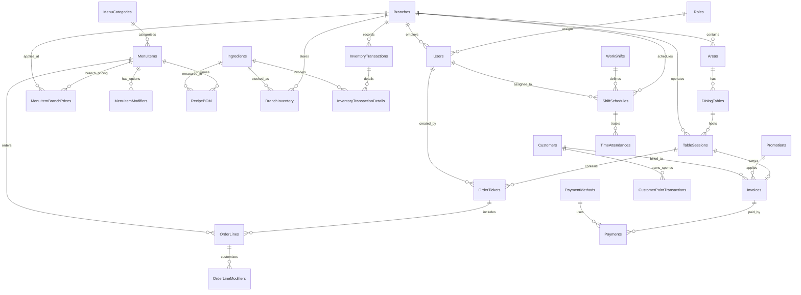

# Thiết kế Cơ sở dữ liệu Toàn diện — Hệ thống Order tại bàn (OrderPum)

Tài liệu này đặc tả toàn bộ cấu trúc cơ sở dữ liệu (Database Schema) cho hệ thống **Order tại bàn (QR + NV order hộ) — Chuỗi Nhà hàng OrderPum**, bao quát toàn bộ 14 module chức năng (STT 1–105) qua 4 giai đoạn phát triển.

---

## 1. Nguyên tắc thiết kế cốt lõi

1. **Hạn chế dùng Enum cứng (Table-driven design)**:
   - Các danh mục như Vai trò (`Roles`), Phương thức thanh toán (`PaymentMethods`), Trạng thái món (`OrderLineStatuses`), Loại giao dịch kho (`InventoryTransactionTypes`)... được thiết kế thành các **Bảng Master Data** có khóa chính, mã code duy nhất và cờ quản trị để dễ dàng tùy biến, mở rộng mà không cần sửa code hoặc migration phức tạp.
2. **Bảo toàn dữ liệu lịch sử (Price & Tax Snapshots)**:
   - Mọi dòng món (`OrderLines`), chi tiết hóa đơn (`Invoices`), định lượng kho (`RecipeBOM`) khi phát sinh giao dịch đều được snapshot lại tên món, đơn giá, tỷ lệ thuế VAT, phí dịch vụ tại thời điểm order/thanh toán. Thay đổi giá menu trong tương lai không làm sai lệch báo cáo tài chính quá khứ.
3. **Phân vùng dữ liệu đa chi nhánh nghiêm ngặt (Branch Multi-tenancy Isolation - STT 105)**:
   - Mọi bảng dữ liệu nghiệp vụ (Bàn, Menu giá riêng, Order, Kho, Chấm công, Hóa đơn) đều gắn trực tiếp `BranchId`. Nhân sự cấp chi nhánh chỉ truy xuất được dữ liệu thuộc chi nhánh của mình.
4. **Xóa mềm an toàn (Soft Delete)**:
   - Sử dụng cờ `IsDeleted` và `UpdatedAt` cho toàn bộ thực thể master data để bảo toàn toàn vẹn tham chiếu (Referential Integrity) đối với các bảng giao dịch lịch sử.
5. **Hệ thống khép kín nội bộ**:
   - CSDL tập trung toàn bộ nghiệp vụ nhà hàng (Order, POS, KDS, Kho NVL, Ca làm, CRM). Chỉ mở cổng giao tiếp API ra ngoài cho Cổng thanh toán (VNPay/Momo) và Hóa đơn điện tử (MISA/Viettel).

---

## 2. Sơ đồ Quan hệ Thực thể Tổng thể (ERD Diagram)

---

## 3. Danh mục Chi tiết các Bảng CSDL theo Module

---

### Module 1. Tài khoản, Vai trò & Phân quyền

#### 1.1. Bảng `Roles` (Danh mục Vai trò & Cấp bậc CSDL động)

> Bảng lưu trữ chức danh nhân sự động, thay thế enum cứng, hỗ trợ phân cấp thẩm quyền từ Cấp 1 đến Cấp 10.

| Tên cột       | Kiểu dữ liệu       | Nullable | Mặc định       | Mô tả                                                |
| :------------ | :----------------- | :------: | :------------- | :--------------------------------------------------- |
| `Id`          | `UNIQUEIDENTIFIER` |    PK    | `NEWID()`      | Khóa chính                                           |
| `Code`        | `NVARCHAR(50)`     |    NO    | —              | Mã vai trò duy nhất (`ChainDirector`, `Manager`...)  |
| `Name`        | `NVARCHAR(100)`    |    NO    | —              | Tên hiển thị tiếng Việt (Giám đốc chuỗi, Quản lý...) |
| `Level`       | `INT`              |    NO    | `5`            | Cấp bậc thẩm quyền (1: Cao nhất -> 10: Thấp nhất)    |
| `Description` | `NVARCHAR(500)`    |   YES    | `NULL`         | Mô tả phạm vi nhiệm vụ và quyền hạn                  |
| `IsSystem`    | `BIT`              |    NO    | `0`            | Cờ bảo vệ vai trò cốt lõi (không cho phép xóa)       |
| `IsActive`    | `BIT`              |    NO    | `1`            | Trạng thái cho phép gán cho tài khoản                |
| `IsDeleted`   | `BIT`              |    NO    | `0`            | Cờ xóa mềm                                           |
| `CreatedAt`   | `DATETIME2`        |    NO    | `GETUTCDATE()` | Thời gian tạo bản ghi                                |
| `UpdatedAt`   | `DATETIME2`        |   YES    | `NULL`         | Thời gian cập nhật cuối                              |

- **Chỉ mục (Index)**: `IX_Roles_Code` (Unique), `IX_Roles_Level`.

---

#### 1.2. Bảng `Permissions` & `RolePermissions` (Ma trận Phân quyền Chi tiết - STT 3)

> Cấu hình chi tiết quyền Xem/Thêm/Sửa/Xóa/Duyệt theo từng Module chức năng.

**Bảng `Permissions`**:
| Tên cột | Kiểu dữ liệu | Nullable | Mô tả |
| :--- | :--- | :---: | :--- |
| `Id` | `UNIQUEIDENTIFIER` | PK | Khóa chính |
| `ModuleCode` | `NVARCHAR(50)` | NO | Mã module (`Auth`, `Branch`, `Menu`, `Order`, `Inventory`...) |
| `ActionCode` | `NVARCHAR(50)` | NO | Mã hành động (`View`, `Create`, `Update`, `Delete`, `Approve`) |
| `Name` | `NVARCHAR(150)` | NO | Tên mô tả hành động |

**Bảng `RolePermissions`**:
| Tên cột | Kiểu dữ liệu | Nullable | Mô tả |
| :--- | :--- | :---: | :--- |
| `RoleId` | `UNIQUEIDENTIFIER` | PK, FK | Khóa ngoại tham chiếu `Roles(Id)` |
| `PermissionId` | `UNIQUEIDENTIFIER` | PK, FK | Khóa ngoại tham chiếu `Permissions(Id)` |

---

#### 1.3. Bảng `Users` (Tài khoản Người dùng & Nhân viên - STT 1, 4)

> Quản lý tài khoản đăng nhập qua SĐT/Email, hỗ trợ cả mật khẩu chuẩn và mã PIN 4–6 số cho nhân viên POS/Tablet.

| Tên cột          | Kiểu dữ liệu       | Nullable | Mặc định       | Mô tả                                                      |
| :--------------- | :----------------- | :------: | :------------- | :--------------------------------------------------------- |
| `Id`             | `UNIQUEIDENTIFIER` |    PK    | `NEWID()`      | Khóa chính                                                 |
| `PhoneOrEmail`   | `NVARCHAR(150)`    |    NO    | —              | Tên đăng nhập (Email hoặc SĐT duy nhất)                    |
| `DisplayName`    | `NVARCHAR(100)`    |    NO    | —              | Họ và tên hiển thị của nhân viên                           |
| `PasswordHash`   | `NVARCHAR(500)`    |    NO    | —              | Mật khẩu băm (BCrypt / SHA256 Salted)                      |
| `PinHash`        | `NVARCHAR(500)`    |   YES    | `NULL`         | Mã PIN băm (4–6 số đăng nhập nhanh tại quầy)               |
| `RoleId`         | `UNIQUEIDENTIFIER` |   YES    | `NULL`         | FK tham chiếu `Roles(Id)`                                  |
| `CustomRoleCode` | `NVARCHAR(50)`     |   YES    | `NULL`         | Mã vai trò snapshot                                        |
| `Role`           | `INT`              |    NO    | `5`            | Mã vai trò tương thích ngược                               |
| `BranchId`       | `UNIQUEIDENTIFIER` |   YES    | `NULL`         | FK tham chiếu `Branches(Id)` (Null nếu quản lý toàn chuỗi) |
| `IsLocked`       | `BIT`              |    NO    | `0`            | Cờ khóa tài khoản (chặn đăng nhập ngay lập tức)            |
| `IsDeleted`      | `BIT`              |    NO    | `0`            | Cờ xóa mềm                                                 |
| `CreatedAt`      | `DATETIME2`        |    NO    | `GETUTCDATE()` | Thời gian tạo tài khoản                                    |
| `UpdatedAt`      | `DATETIME2`        |   YES    | `NULL`         | Thời gian cập nhật cuối                                    |

- **Chỉ mục (Index)**: `IX_Users_PhoneOrEmail` (Unique, Where `IsDeleted = 0`), `IX_Users_RoleId`, `IX_Users_BranchId`.

---

#### 1.4. Bảng `StaffProfiles` (Hồ sơ Nhân viên & Lương - STT 5)

| Tên cột             | Kiểu dữ liệu       | Nullable | Mô tả                                              |
| :------------------ | :----------------- | :------: | :------------------------------------------------- |
| `UserId`            | `UNIQUEIDENTIFIER` |  PK, FK  | Khóa ngoại tham chiếu `Users(Id)`                  |
| `CitizenId`         | `NVARCHAR(20)`     |   YES    | Số CCCD / CMND                                     |
| `BirthDate`         | `DATE`             |   YES    | Ngày tháng năm sinh                                |
| `Gender`            | `NVARCHAR(10)`     |   YES    | Giới tính (Nam, Nữ, Khác)                          |
| `StartDate`         | `DATE`             |   YES    | Ngày bắt đầu vào làm                               |
| `ContractType`      | `NVARCHAR(50)`     |    NO    | Loại HĐLĐ (Fulltime, Parttime, Thử việc, Học việc) |
| `BaseSalary`        | `DECIMAL(18,2)`    |    NO    | Mức lương cơ bản (theo tháng hoặc theo giờ)        |
| `HourlyRate`        | `DECIMAL(18,2)`    |    NO    | Đơn giá lương theo giờ                             |
| `BankAccountNumber` | `NVARCHAR(50)`     |   YES    | Số tài khoản ngân hàng nhận lương                  |
| `BankName`          | `NVARCHAR(100)`    |   YES    | Tên ngân hàng                                      |

---

#### 1.5. Bảng `AuditLogs` (Nhật ký Hoạt động Hệ thống - STT 6)

| Tên cột      | Kiểu dữ liệu       |   Nullable   | Mô tả                                                                 |
| :----------- | :----------------- | :----------: | :-------------------------------------------------------------------- |
| `Id`         | `BIGINT`           | PK, Identity | Khóa chính tăng tự động                                               |
| `UserId`     | `UNIQUEIDENTIFIER` |     YES      | FK tham chiếu `Users(Id)` người thực hiện                             |
| `BranchId`   | `UNIQUEIDENTIFIER` |     YES      | FK tham chiếu `Branches(Id)`                                          |
| `Action`     | `NVARCHAR(100)`    |      NO      | Tên hành động (`CancelOrderLine`, `DiscountInvoice`, `ChangeRole`...) |
| `EntityName` | `NVARCHAR(100)`    |      NO      | Tên bảng/đối tượng bị tác động                                        |
| `EntityId`   | `NVARCHAR(100)`    |     YES      | ID của đối tượng bị tác động                                          |
| `OldValues`  | `NVARCHAR(MAX)`    |     YES      | Dữ liệu JSON trước khi thay đổi                                       |
| `NewValues`  | `NVARCHAR(MAX)`    |     YES      | Dữ liệu JSON sau khi thay đổi                                         |
| `IpAddress`  | `NVARCHAR(50)`     |     YES      | Địa chỉ IP của client                                                 |
| `CreatedAt`  | `DATETIME2`        |      NO      | Thời điểm ghi log                                                     |

---

### Module 2. Quản lý Chi nhánh / Chuỗi

#### 2.1. Bảng `Branches` (Danh mục Chi nhánh & Cấu hình Tài chính - STT 8, 99)

| Tên cột                   | Kiểu dữ liệu       | Nullable | Mặc định       | Mô tả                                           |
| :------------------------ | :----------------- | :------: | :------------- | :---------------------------------------------- |
| `Id`                      | `UNIQUEIDENTIFIER` |    PK    | `NEWID()`      | Khóa chính                                      |
| `Code`                    | `NVARCHAR(50)`     |    NO    | —              | Mã chi nhánh (`CN01`, `CN02` duy nhất)          |
| `Name`                    | `NVARCHAR(200)`    |    NO    | —              | Tên chi nhánh nhà hàng                          |
| `Address`                 | `NVARCHAR(300)`    |   YES    | `NULL`         | Địa chỉ cụ thể                                  |
| `Phone`                   | `NVARCHAR(50)`     |   YES    | `NULL`         | Hotline liên hệ chi nhánh                       |
| `OpenHours`               | `NVARCHAR(100)`    |   YES    | `NULL`         | Khung giờ hoạt động (VD: `08:00 - 22:30`)       |
| `ImageUrl`                | `NVARCHAR(500)`    |   YES    | `NULL`         | Ảnh đại diện mặt tiền chi nhánh                 |
| `TaxRatePercent`          | `DECIMAL(5,2)`     |    NO    | `8.00`         | Thuế suất VAT áp dụng (%)                       |
| `ServiceChargePercent`    | `DECIMAL(5,2)`     |    NO    | `0.00`         | Tỷ lệ phí dịch vụ (%)                           |
| `Currency`                | `NVARCHAR(10)`     |    NO    | `'VND'`        | Đơn vị tiền tệ hiển thị                         |
| `IsTaxIncludedInPrice`    | `BIT`              |    NO    | `0`            | Cờ xác định giá bán menu đã gồm VAT hay chưa    |
| `IsServiceChargeIncluded` | `BIT`              |    NO    | `0`            | Cờ xác định giá bán menu đã gồm phí DV hay chưa |
| `ReceiptHeaderNote`       | `NVARCHAR(500)`    |   YES    | `NULL`         | Tiêu đề/khẩu hiệu in trên đầu phiếu hóa đơn     |
| `ReceiptFooterNote`       | `NVARCHAR(500)`    |   YES    | `NULL`         | Lời cảm ơn in chân hóa đơn                      |
| `IsActive`                | `BIT`              |    NO    | `1`            | Trạng thái mở cửa / tạm đóng chi nhánh          |
| `IsDeleted`               | `BIT`              |    NO    | `0`            | Cờ xóa mềm                                      |
| `CreatedAt`               | `DATETIME2`        |    NO    | `GETUTCDATE()` | Thời gian tạo chi nhánh                         |
| `UpdatedAt`               | `DATETIME2`        |   YES    | `NULL`         | Thời gian cập nhật cuối                         |

- **Chỉ mục (Index)**: `IX_Branches_Code` (Unique), `IX_Branches_Name`.

---

### Module 3. Khu vực – Tầng – Bàn & Đặt bàn

#### 3.1. Bảng `Areas` (Khu vực / Tầng mặt bằng - STT 13)

| Tên cột        | Kiểu dữ liệu       | Nullable | Mô tả                                          |
| :------------- | :----------------- | :------: | :--------------------------------------------- |
| `Id`           | `UNIQUEIDENTIFIER` |    PK    | Khóa chính                                     |
| `BranchId`     | `UNIQUEIDENTIFIER` |    NO    | FK tham chiếu `Branches(Id)`                   |
| `Name`         | `NVARCHAR(100)`    |    NO    | Tên khu vực (Tầng 1, Sân vườn, Phòng VIP 1...) |
| `DisplayOrder` | `INT`              |    NO    | Thứ tự hiển thị trên sơ đồ                     |
| `IsActive`     | `BIT`              |    NO    | Trạng thái sử dụng                             |
| `IsDeleted`    | `BIT`              |    NO    | Cờ xóa mềm                                     |

---

#### 3.2. Bảng `DiningTables` (Bàn ăn & Mã QR - STT 14, 15, 16)

| Tên cột     | Kiểu dữ liệu       | Nullable | Mặc định      | Mô tả                                                            |
| :---------- | :----------------- | :------: | :------------ | :--------------------------------------------------------------- |
| `Id`        | `UNIQUEIDENTIFIER` |    PK    | `NEWID()`     | Khóa chính                                                       |
| `BranchId`  | `UNIQUEIDENTIFIER` |    NO    | —             | FK tham chiếu `Branches(Id)`                                     |
| `AreaId`    | `UNIQUEIDENTIFIER` |    NO    | —             | FK tham chiếu `Areas(Id)`                                        |
| `Code`      | `NVARCHAR(50)`     |    NO    | —             | Số/Mã bàn (`B01`, `B02`, `VIP01`...)                             |
| `Name`      | `NVARCHAR(100)`    |    NO    | —             | Tên hiển thị của bàn                                             |
| `Capacity`  | `INT`              |    NO    | `4`           | Số chỗ ngồi tối đa của bàn                                       |
| `QrToken`   | `NVARCHAR(100)`    |    NO    | —             | Mã Token bảo mật định danh để khách quét QR                      |
| `Status`    | `NVARCHAR(50)`     |    NO    | `'Available'` | Trạng thái: `Available`, `Occupied`, `Reserved`, `NeedsCleaning` |
| `PosX`      | `INT`              |    NO    | `0`           | Tọa độ X trên bản đồ sơ đồ tầng (Floor map)                      |
| `PosY`      | `INT`              |    NO    | `0`           | Tọa độ Y trên bản đồ sơ đồ tầng (Floor map)                      |
| `IsActive`  | `BIT`              |    NO    | `1`           | Trạng thái kích hoạt bàn                                         |
| `IsDeleted` | `BIT`              |    NO    | `0`           | Cờ xóa mềm                                                       |

- **Chỉ mục (Index)**: `IX_DiningTables_QrToken` (Unique), `IX_DiningTables_BranchId_AreaId`.

---

#### 3.3. Bảng `TableReservations` (Đặt bàn trước - STT 19, 20)

| Tên cột           | Kiểu dữ liệu       | Nullable | Mô tả                                                   |
| :---------------- | :----------------- | :------: | :------------------------------------------------------ |
| `Id`              | `UNIQUEIDENTIFIER` |    PK    | Khóa chính                                              |
| `BranchId`        | `UNIQUEIDENTIFIER` |    NO    | FK tham chiếu `Branches(Id)`                            |
| `TableId`         | `UNIQUEIDENTIFIER` |   YES    | FK tham chiếu `DiningTables(Id)` (nếu đã gán bàn trước) |
| `CustomerName`    | `NVARCHAR(100)`    |    NO    | Tên khách đặt bàn                                       |
| `CustomerPhone`   | `NVARCHAR(20)`     |    NO    | Số điện thoại liên hệ                                   |
| `GuestCount`      | `INT`              |    NO    | Số lượng khách dự kiến                                  |
| `ReservationTime` | `DATETIME2`        |    NO    | Thời gian khách đến nhận bàn                            |
| `DepositAmount`   | `DECIMAL(18,2)`    |    NO    | Tiền đặt cọc giữ chỗ (nếu có)                           |
| `Status`          | `NVARCHAR(50)`     |    NO    | `Pending`, `Confirmed`, `Seated`, `Cancelled`, `NoShow` |
| `Note`            | `NVARCHAR(500)`    |   YES    | Ghi chú yêu cầu đặc biệt của khách                      |

---

### Module 4. Thực đơn, Danh mục, Topping & Giá riêng

#### 4.1. Bảng `MenuCategories` (Danh mục Món ăn - STT 26)

| Tên cột        | Kiểu dữ liệu       | Nullable | Mô tả                                             |
| :------------- | :----------------- | :------: | :------------------------------------------------ |
| `Id`           | `UNIQUEIDENTIFIER` |    PK    | Khóa chính                                        |
| `Name`         | `NVARCHAR(150)`    |    NO    | Tên danh mục (Món Khai Vị, Món Nướng, Đồ Uống...) |
| `DisplayOrder` | `INT`              |    NO    | Thứ tự hiển thị trên Menu                         |
| `ImageUrl`     | `NVARCHAR(500)`    |   YES    | Ảnh minh họa danh mục                             |
| `IsActive`     | `BIT`              |    NO    | Trạng thái hiển thị                               |
| `IsDeleted`    | `BIT`              |    NO    | Cờ xóa mềm                                        |

---

#### 4.2. Bảng `MenuItems` (Món ăn / Đồ uống - STT 26, 30, 31)

| Tên cột              | Kiểu dữ liệu       | Nullable | Mô tả                                                               |
| :------------------- | :----------------- | :------: | :------------------------------------------------------------------ |
| `Id`                 | `UNIQUEIDENTIFIER` |    PK    | Khóa chính                                                          |
| `CategoryId`         | `UNIQUEIDENTIFIER` |    NO    | FK tham chiếu `MenuCategories(Id)`                                  |
| `Code`               | `NVARCHAR(50)`     |    NO    | Mã món duy nhất (`F01`, `D02`...)                                   |
| `Name`               | `NVARCHAR(200)`    |    NO    | Tên món ăn / đồ uống                                                |
| `BasePrice`          | `DECIMAL(18,2)`    |    NO    | Giá bán cơ sở tiêu chuẩn (VND)                                      |
| `Unit`               | `NVARCHAR(50)`     |    NO    | Đơn vị tính (Đĩa, Tô, Ly, Chai, Set...)                             |
| `ImageUrl`           | `NVARCHAR(500)`    |   YES    | Hình ảnh món chất lượng cao                                         |
| `Description`        | `NVARCHAR(1000)`   |   YES    | Mô tả hương vị, thành phần nguyên liệu                              |
| `KitchenStation`     | `NVARCHAR(50)`     |    NO    | Trạm chế biến phụ trách: `Kitchen` (Bếp nóng), `Bar` (Quầy pha chế) |
| `PreparationMinutes` | `INT`              |    NO    | Thời gian chế biến dự kiến (phút)                                   |
| `IsCombo`            | `BIT`              |    NO    | Cờ xác định món là Combo nhiều món                                  |
| `Is86ed`             | `BIT`              |    NO    | Cờ báo hết hàng nhanh (Tạm ngưng phục vụ - STT 31)                  |
| `IsActive`           | `BIT`              |    NO    | Trạng thái kinh doanh                                               |
| `IsDeleted`          | `BIT`              |    NO    | Cờ xóa mềm                                                          |

---

#### 4.3. Bảng `MenuItemBranchPrices` (Giá & Menu Riêng theo Chi nhánh - STT 10)

| Tên cột       | Kiểu dữ liệu       | Nullable | Mô tả                                                    |
| :------------ | :----------------- | :------: | :------------------------------------------------------- |
| `MenuItemId`  | `UNIQUEIDENTIFIER` |  PK, FK  | FK tham chiếu `MenuItems(Id)`                            |
| `BranchId`    | `UNIQUEIDENTIFIER` |  PK, FK  | FK tham chiếu `Branches(Id)`                             |
| `CustomPrice` | `DECIMAL(18,2)`    |   YES    | Giá bán riêng tại chi nhánh này (nếu null lấy BasePrice) |
| `IsAvailable` | `BIT`              |    NO    | Chi nhánh có bán món này hay không                       |
| `Is86ed`      | `BIT`              |    NO    | Cờ hết hàng riêng tại chi nhánh này                      |

---

#### 4.4. Bảng `MenuItemModifiers` (Tùy chọn Món / Topping - STT 28)

| Tên cột      | Kiểu dữ liệu       | Nullable | Mô tả                                                        |
| :----------- | :----------------- | :------: | :----------------------------------------------------------- |
| `Id`         | `UNIQUEIDENTIFIER` |    PK    | Khóa chính                                                   |
| `MenuItemId` | `UNIQUEIDENTIFIER` |    NO    | FK tham chiếu `MenuItems(Id)`                                |
| `Name`       | `NVARCHAR(100)`    |    NO    | Tên tùy chọn (VD: "Thêm Trân Châu", "Độ cay", "Lượng đường") |
| `ExtraPrice` | `DECIMAL(18,2)`    |    NO    | Đơn giá cộng thêm (0 nếu chỉ là ghi chú tùy biến)            |
| `IsRequired` | `BIT`              |    NO    | Bắt buộc chọn hay không                                      |
| `IsActive`   | `BIT`              |    NO    | Trạng thái tùy chọn                                          |

---

### Module 5. Xử lý Order, Phiên bàn & KDS Bếp/Bar

#### 5.1. Bảng `TableSessions` (Phiên phục vụ tại bàn - STT 21, 22)

> Quản lý toàn bộ vòng đời của một lượt khách ngồi tại bàn từ lúc mở bàn đến khi thanh toán xong.

| Tên cột               | Kiểu dữ liệu       | Nullable | Mặc định       | Mô tả                                                                                |
| :-------------------- | :----------------- | :------: | :------------- | :----------------------------------------------------------------------------------- |
| `Id`                  | `UNIQUEIDENTIFIER` |    PK    | `NEWID()`      | Khóa chính phiên                                                                     |
| `BranchId`            | `UNIQUEIDENTIFIER` |    NO    | —              | FK tham chiếu `Branches(Id)`                                                         |
| `TableId`             | `UNIQUEIDENTIFIER` |    NO    | —              | FK tham chiếu `DiningTables(Id)`                                                     |
| `SessionCode`         | `NVARCHAR(50)`     |    NO    | —              | Mã phiên (VD: `SES-260814-001`)                                                      |
| `GuestCount`          | `INT`              |    NO    | `1`            | Số lượng khách thực tế ngồi bàn                                                      |
| `OpenedAt`            | `DATETIME2`        |    NO    | `GETUTCDATE()` | Thời điểm mở bàn đón khách                                                           |
| `ClosedAt`            | `DATETIME2`        |   YES    | `NULL`         | Thời điểm khách thanh toán & rời bàn                                                 |
| `Status`              | `NVARCHAR(50)`     |    NO    | `'Open'`       | Trạng thái: `Open` (Đang phục vụ), `Paying` (Đang tính tiền), `Closed` (Đã hoàn tất) |
| `MergedIntoSessionId` | `UNIQUEIDENTIFIER` |   YES    | `NULL`         | FK tham chiếu phiên đích nếu ghép bàn (STT 18)                                       |

---

#### 5.2. Bảng `OrderTickets` (Lượt gửi món / Ticket Order - STT 21, 23)

> Mỗi lần nhân viên bấm "Gửi bếp" hoặc khách xác nhận giỏ hàng QR sẽ tạo ra một OrderTicket.

| Tên cột           | Kiểu dữ liệu       | Nullable | Mô tả                                                             |
| :---------------- | :----------------- | :------: | :---------------------------------------------------------------- |
| `Id`              | `UNIQUEIDENTIFIER` |    PK    | Khóa chính đợt gửi món                                            |
| `SessionId`       | `UNIQUEIDENTIFIER` |    NO    | FK tham chiếu `TableSessions(Id)`                                 |
| `TicketNumber`    | `INT`              |    NO    | Số thứ tự lần gọi món trong ca bàn (Lần 1, Lần 2...)              |
| `Source`          | `NVARCHAR(50)`     |    NO    | Nguồn order: `StaffAssisted` (NV hộ) hoặc `CustomerQr` (Khách QR) |
| `CreatedByUserId` | `UNIQUEIDENTIFIER` |   YES    | FK tham chiếu `Users(Id)` (nếu là nhân viên order hộ)             |
| `Note`            | `NVARCHAR(500)`    |   YES    | Ghi chú chung của đợt order                                       |
| `CreatedAt`       | `DATETIME2`        |    NO    | Thời điểm gửi order                                               |

---

#### 5.3. Bảng `OrderLines` (Chi tiết Từng món gọi & Trạng thái Chế biến KDS - STT 24, 49, 51–53)

> Lưu vết từng dòng món ăn, snapshot giá tại thời điểm gọi và trạng thái vòng đời chế biến realtime trên KDS.

| Tên cột             | Kiểu dữ liệu       | Nullable | Mặc định           | Mô tả                                                                                                                                                                         |
| :------------------ | :----------------- | :------: | :----------------- | :---------------------------------------------------------------------------------------------------------------------------------------------------------------------------- |
| `Id`                | `UNIQUEIDENTIFIER` |    PK    | `NEWID()`          | Khóa chính dòng món                                                                                                                                                           |
| `TicketId`          | `UNIQUEIDENTIFIER` |    NO    | —                  | FK tham chiếu `OrderTickets(Id)`                                                                                                                                              |
| `SessionId`         | `UNIQUEIDENTIFIER` |    NO    | —                  | FK tham chiếu `TableSessions(Id)`                                                                                                                                             |
| `MenuItemId`        | `UNIQUEIDENTIFIER` |    NO    | —                  | FK tham chiếu `MenuItems(Id)`                                                                                                                                                 |
| `ItemNameSnapshot`  | `NVARCHAR(200)`    |    NO    | —                  | Tên món lưu vết tại thời điểm gọi                                                                                                                                             |
| `UnitPriceSnapshot` | `DECIMAL(18,2)`    |    NO    | —                  | Đơn giá lưu vết tại thời điểm gọi                                                                                                                                             |
| `Quantity`          | `INT`              |    NO    | `1`                | Số lượng gọi món                                                                                                                                                              |
| `Note`              | `NVARCHAR(300)`    |   YES    | `NULL`             | Ghi chú chế biến (ít cay, không hành...)                                                                                                                                      |
| `KitchenStation`    | `NVARCHAR(50)`     |    NO    | `'Kitchen'`        | Trạm nhận: `Kitchen` (Bếp) hoặc `Bar` (Pha chế)                                                                                                                               |
| `Status`            | `NVARCHAR(50)`     |    NO    | `'PendingConfirm'` | `PendingConfirm` (Chờ NV duyệt QR - STT 24), `SentToKitchen` (Đã vào KDS), `Preparing` (Đang nấu), `Ready` (Đã nấu xong), `Served` (Đã mang ra bàn), `Cancelled` (Đã hủy món) |
| `CancelReason`      | `NVARCHAR(300)`    |   YES    | `NULL`             | Lý do hủy món (nếu bị hủy)                                                                                                                                                    |
| `CancelledByUserId` | `UNIQUEIDENTIFIER` |   YES    | `NULL`             | Người duyệt hủy món                                                                                                                                                           |
| `SentToKitchenAt`   | `DATETIME2`        |   YES    | `NULL`             | Thời điểm đẩy vào màn hình bếp                                                                                                                                                |
| `ReadyAt`           | `DATETIME2`        |   YES    | `NULL`             | Thời điểm bếp bấm xong món                                                                                                                                                    |
| `ServedAt`          | `DATETIME2`        |   YES    | `NULL`             | Thời điểm nhân viên mang món ra bàn                                                                                                                                           |

- **Chỉ mục (Index)**: `IX_OrderLines_SessionId`, `IX_OrderLines_Status_KitchenStation`.

---

#### 5.4. Bảng `OrderLineModifiers` (Chi tiết Topping kèm Dòng món)

| Tên cột                | Kiểu dữ liệu       | Nullable | Mô tả                          |
| :--------------------- | :----------------- | :------: | :----------------------------- |
| `Id`                   | `UNIQUEIDENTIFIER` |    PK    | Khóa chính                     |
| `OrderLineId`          | `UNIQUEIDENTIFIER` |    NO    | FK tham chiếu `OrderLines(Id)` |
| `ModifierNameSnapshot` | `NVARCHAR(100)`    |    NO    | Tên tùy chọn lưu vết           |
| `ExtraPriceSnapshot`   | `DECIMAL(18,2)`    |    NO    | Giá cộng thêm lưu vết          |

---

### Module 6. Thanh toán, Hóa đơn, Thu ngân (POS) & Khuyến mãi

#### 6.1. Bảng `Invoices` (Hóa đơn Thanh toán - STT 56–60)

| Tên cột                | Kiểu dữ liệu       | Nullable | Mặc định       | Mô tả                                         |
| :--------------------- | :----------------- | :------: | :------------- | :-------------------------------------------- |
| `Id`                   | `UNIQUEIDENTIFIER` |    PK    | `NEWID()`      | Khóa chính hóa đơn                            |
| `BranchId`             | `UNIQUEIDENTIFIER` |    NO    | —              | FK tham chiếu `Branches(Id)`                  |
| `SessionId`            | `UNIQUEIDENTIFIER` |    NO    | —              | FK tham chiếu `TableSessions(Id)`             |
| `InvoiceNumber`        | `NVARCHAR(50)`     |    NO    | —              | Số hóa đơn (VD: `HD-260814-0001`)             |
| `CustomerId`           | `UNIQUEIDENTIFIER` |   YES    | `NULL`         | FK tham chiếu `Customers(Id)`                 |
| `SubTotalAmount`       | `DECIMAL(18,2)`    |    NO    | `0`            | Tổng tiền món ăn nguyên giá                   |
| `DiscountAmount`       | `DECIMAL(18,2)`    |    NO    | `0`            | Tiền chiết khấu / giảm giá khuyến mãi         |
| `VoucherCode`          | `NVARCHAR(50)`     |   YES    | `NULL`         | Mã voucher áp dụng (nếu có)                   |
| `TaxRatePercent`       | `DECIMAL(5,2)`     |    NO    | `8.00`         | Tỷ lệ thuế VAT áp dụng                        |
| `TaxAmount`            | `DECIMAL(18,2)`    |    NO    | `0`            | Tiền thuế VAT tính ra                         |
| `ServiceChargePercent` | `DECIMAL(5,2)`     |    NO    | `0.00`         | Tỷ lệ phí dịch vụ áp dụng                     |
| `ServiceChargeAmount`  | `DECIMAL(18,2)`    |    NO    | `0`            | Tiền phí dịch vụ tính ra                      |
| `FinalAmount`          | `DECIMAL(18,2)`    |    NO    | `0`            | Tổng số tiền cuối cùng khách phải trả         |
| `CashierUserId`        | `UNIQUEIDENTIFIER` |    NO    | —              | FK tham chiếu `Users(Id)` thu ngân chốt bill  |
| `PaymentStatus`        | `NVARCHAR(50)`     |    NO    | `'Unpaid'`     | `Unpaid`, `PartiallyPaid`, `Paid`, `Refunded` |
| `EInvoiceRefCode`      | `NVARCHAR(100)`    |   YES    | `NULL`         | Mã tham chiếu hóa đơn điện tử (STT 103)       |
| `CreatedAt`            | `DATETIME2`        |    NO    | `GETUTCDATE()` | Thời gian tạo hóa đơn                         |
| `PaidAt`               | `DATETIME2`        |   YES    | `NULL`         | Thời gian hoàn tất thanh toán                 |

- **Chỉ mục (Index)**: `IX_Invoices_BranchId_CreatedAt`, `IX_Invoices_InvoiceNumber` (Unique).

---

#### 6.2. Bảng `PaymentMethods` (Bảng Master Danh mục Phương thức Thanh toán CSDL)

| Tên cột        | Kiểu dữ liệu       | Nullable | Mô tả                                                         |
| :------------- | :----------------- | :------: | :------------------------------------------------------------ |
| `Id`           | `UNIQUEIDENTIFIER` |    PK    | Khóa chính                                                    |
| `Code`         | `NVARCHAR(50)`     |    NO    | `Cash`, `VNPay`, `Momo`, `ZaloPay`, `BankTransfer`, `CardPos` |
| `Name`         | `NVARCHAR(100)`    |    NO    | Tiền mặt, Cổng VNPay, Ví MoMo, Chuyển khoản QR...             |
| `IsElectronic` | `BIT`              |    NO    | Cờ xác định là thanh toán điện tử kết nối cổng (STT 102)      |
| `IsActive`     | `BIT`              |    NO    | Trạng thái khả dụng                                           |

---

#### 6.3. Bảng `Payments` (Giao dịch Thanh toán Chi tiết - STT 61, 62)

| Tên cột           | Kiểu dữ liệu       | Nullable | Mô tả                                              |
| :---------------- | :----------------- | :------: | :------------------------------------------------- |
| `Id`              | `UNIQUEIDENTIFIER` |    PK    | Khóa chính giao dịch                               |
| `InvoiceId`       | `UNIQUEIDENTIFIER` |    NO    | FK tham chiếu `Invoices(Id)`                       |
| `PaymentMethodId` | `UNIQUEIDENTIFIER` |    NO    | FK tham chiếu `PaymentMethods(Id)`                 |
| `Amount`          | `DECIMAL(18,2)`    |    NO    | Số tiền thanh toán qua phương thức này             |
| `TransactionCode` | `NVARCHAR(100)`    |   YES    | Mã giao dịch ngân hàng / cổng thanh toán (STT 102) |
| `Status`          | `NVARCHAR(50)`     |    NO    | `Pending`, `Success`, `Failed`, `Cancelled`        |
| `PaidAt`          | `DATETIME2`        |    NO    | Thời điểm giao dịch thành công                     |

---

#### 6.4. Bảng `Promotions` & `Vouchers` (Khuyến mãi & Mã giảm giá - STT 63–68)

| Tên cột             | Kiểu dữ liệu       | Nullable | Mô tả                                                         |
| :------------------ | :----------------- | :------: | :------------------------------------------------------------ |
| `Id`                | `UNIQUEIDENTIFIER` |    PK    | Khóa chính chương trình KM                                    |
| `BranchId`          | `UNIQUEIDENTIFIER` |   YES    | FK `Branches(Id)` (Null nếu áp dụng toàn chuỗi)               |
| `Code`              | `NVARCHAR(50)`     |    NO    | Mã Voucher nhập vào (`SALE10`, `PUMOPEN`...)                  |
| `Name`              | `NVARCHAR(200)`    |    NO    | Tên chương trình khuyến mãi                                   |
| `DiscountType`      | `NVARCHAR(50)`     |    NO    | `Percent` (giảm %), `FixedAmount` (giảm tiền mặt), `FreeItem` |
| `DiscountValue`     | `DECIMAL(18,2)`    |    NO    | Giá trị giảm (10% hoặc 50.000đ)                               |
| `MaxDiscountAmount` | `DECIMAL(18,2)`    |   YES    | Số tiền giảm tối đa (với loại %)                              |
| `MinOrderAmount`    | `DECIMAL(18,2)`    |    NO    | Giá trị đơn hàng tối thiểu để được giảm                       |
| `StartAt`           | `DATETIME2`        |    NO    | Thời điểm bắt đầu                                             |
| `EndAt`             | `DATETIME2`        |    NO    | Thời điểm kết thúc                                            |
| `UsageLimit`        | `INT`              |   YES    | Tổng số lượt dùng tối đa                                      |
| `UsedCount`         | `INT`              |    NO    | Số lượt đã sử dụng                                            |
| `IsActive`          | `BIT`              |    NO    | Trạng thái kích hoạt                                          |

---

#### 6.5. Bảng `CashShifts` (Quản lý Ca Thu ngân & Đối soát Tiền két - STT 71, 72)

| Tên cột                | Kiểu dữ liệu       | Nullable | Mô tả                                   |
| :--------------------- | :----------------- | :------: | :-------------------------------------- |
| `Id`                   | `UNIQUEIDENTIFIER` |    PK    | Khóa chính ca thu ngân                  |
| `BranchId`             | `UNIQUEIDENTIFIER` |    NO    | FK tham chiếu `Branches(Id)`            |
| `CashierUserId`        | `UNIQUEIDENTIFIER` |    NO    | FK tham chiếu `Users(Id)` người trực ca |
| `StartTime`            | `DATETIME2`        |    NO    | Thời điểm mở ca                         |
| `EndTime`              | `DATETIME2`        |   YES    | Thời điểm kết ca                        |
| `InitialCash`          | `DECIMAL(18,2)`    |    NO    | Tiền mặt đầu ca trong két               |
| `SystemCalculatedCash` | `DECIMAL(18,2)`    |   YES    | Tiền mặt hệ thống tính theo hóa đơn     |
| `ActualCashEnd`        | `DECIMAL(18,2)`    |   YES    | Tiền mặt thực tế đếm được khi chốt ca   |
| `DifferenceAmount`     | `DECIMAL(18,2)`    |   YES    | Chênh lệch (Thừa / Thiếu tiền két)      |
| `Note`                 | `NVARCHAR(500)`    |   YES    | Giải trình chênh lệch                   |
| `Status`               | `NVARCHAR(50)`     |    NO    | `Open`, `Closed`                        |

---

### Module 7. Quản lý Kho & Định lượng Món (Inventory & BOM)

#### 7.1. Bảng `Ingredients` (Nguyên vật liệu kho - STT 34, 35)

| Tên cột        | Kiểu dữ liệu       | Nullable | Mô tả                                                  |
| :------------- | :----------------- | :------: | :----------------------------------------------------- |
| `Id`           | `UNIQUEIDENTIFIER` |    PK    | Khóa chính NVL                                         |
| `Code`         | `NVARCHAR(50)`     |    NO    | Mã nguyên liệu (`NVL-BO`, `NVL-SUA` duy nhất)          |
| `Name`         | `NVARCHAR(150)`    |    NO    | Tên nguyên liệu (Thịt bò Fuji, Sữa chua, Trân châu...) |
| `Unit`         | `NVARCHAR(50)`     |    NO    | Đơn vị đo lường (Kg, Gam, Lít, Chai, Hộp...)           |
| `MinThreshold` | `DECIMAL(18,3)`    |    NO    | Ngưỡng tồn kho tối thiểu (cảnh báo nhập hàng)          |
| `CostPrice`    | `DECIMAL(18,2)`    |    NO    | Giá vốn nhập tiêu chuẩn                                |
| `IsActive`     | `BIT`              |    NO    | Trạng thái theo dõi                                    |
| `IsDeleted`    | `BIT`              |    NO    | Cờ xóa mềm                                             |

---

#### 7.2. Bảng `BranchInventory` (Tồn kho Thực tế tại Chi nhánh - STT 36)

| Tên cột         | Kiểu dữ liệu       | Nullable | Mô tả                                         |
| :-------------- | :----------------- | :------: | :-------------------------------------------- |
| `BranchId`      | `UNIQUEIDENTIFIER` |  PK, FK  | FK tham chiếu `Branches(Id)`                  |
| `IngredientId`  | `UNIQUEIDENTIFIER` |  PK, FK  | FK tham chiếu `Ingredients(Id)`               |
| `CurrentStock`  | `DECIMAL(18,3)`    |    NO    | Số lượng tồn kho khả dụng hiện tại            |
| `ReservedStock` | `DECIMAL(18,3)`    |    NO    | Số lượng đang được giữ cho các order đang nấu |
| `LastAuditAt`   | `DATETIME2`        |   YES    | Thời điểm kiểm kê gần nhất                    |

---

#### 7.3. Bảng `RecipeBOM` (Định lượng Nguyên liệu Món ăn - STT 37, 38)

> Khi chế biến xong 1 món ăn, hệ thống tự động trừ kho nguyên liệu tương ứng theo tỷ lệ BOM.

| Tên cột            | Kiểu dữ liệu       | Nullable | Mô tả                                        |
| :----------------- | :----------------- | :------: | :------------------------------------------- |
| `MenuItemId`       | `UNIQUEIDENTIFIER` |  PK, FK  | FK tham chiếu `MenuItems(Id)`                |
| `IngredientId`     | `UNIQUEIDENTIFIER` |  PK, FK  | FK tham chiếu `Ingredients(Id)`              |
| `QuantityRequired` | `DECIMAL(18,3)`    |    NO    | Lượng nguyên vật liệu tiêu hao cho 1 phần ăn |

---

#### 7.4. Bảng `InventoryTransactions` & `InventoryTransactionDetails` (Phiếu Nhập/Xuất/Kiểm kê/Hủy kho - STT 39–42)

**Bảng `InventoryTransactions`**:
| Tên cột | Kiểu dữ liệu | Nullable | Mô tả |
| :--- | :--- | :---: | :--- |
| `Id` | `UNIQUEIDENTIFIER` | PK | Khóa chính phiếu kho |
| `BranchId` | `UNIQUEIDENTIFIER` | NO | FK tham chiếu `Branches(Id)` |
| `Code` | `NVARCHAR(50)` | NO | Số phiếu (`NK-260814-001`, `XK-260814-001`...) |
| `Type` | `NVARCHAR(50)` | NO | `Import` (Nhập kho), `Export` (Xuất hủy/chuyển), `AuditAdjustment` (Điều chỉnh kiểm kê) |
| `SupplierId` | `UNIQUEIDENTIFIER` | YES | FK tham chiếu `Suppliers(Id)` (với phiếu nhập) |
| `CreatedByUserId`| `UNIQUEIDENTIFIER`| NO | FK tham chiếu `Users(Id)` người lập phiếu |
| `TotalCost` | `DECIMAL(18,2)` | NO | Tổng giá trị phiếu kho |
| `CreatedAt` | `DATETIME2` | NO | Ngày lập phiếu |
| `Note` | `NVARCHAR(500)` | YES | Lý do nhập/xuất kho |

**Bảng `InventoryTransactionDetails`**:
| Tên cột | Kiểu dữ liệu | Nullable | Mô tả |
| :--- | :--- | :---: | :--- |
| `Id` | `UNIQUEIDENTIFIER` | PK | Khóa chính dòng phiếu |
| `TransactionId`| `UNIQUEIDENTIFIER`| NO | FK tham chiếu `InventoryTransactions(Id)` |
| `IngredientId` | `UNIQUEIDENTIFIER` | NO | FK tham chiếu `Ingredients(Id)` |
| `Quantity` | `DECIMAL(18,3)` | NO | Số lượng nhập / xuất |
| `UnitCost` | `DECIMAL(18,2)` | NO | Đơn giá vốn tại thời điểm giao dịch |
| `TotalCost` | `DECIMAL(18,2)` | NO | Thành tiền dòng nguyên liệu |

---

#### 7.5. Bảng `Suppliers` (Nhà cung cấp Nguyên vật liệu - STT 43)

| Tên cột    | Kiểu dữ liệu       | Nullable | Mô tả                      |
| :--------- | :----------------- | :------: | :------------------------- |
| `Id`       | `UNIQUEIDENTIFIER` |    PK    | Khóa chính nhà cung cấp    |
| `Name`     | `NVARCHAR(200)`    |    NO    | Tên công ty / nhà cung cấp |
| `Phone`    | `NVARCHAR(50)`     |   YES    | Số điện thoại              |
| `Address`  | `NVARCHAR(300)`    |   YES    | Địa chỉ nhà cung cấp       |
| `TaxCode`  | `NVARCHAR(50)`     |   YES    | Mã số thuế nhà cung cấp    |
| `IsActive` | `BIT`              |    NO    | Trạng thái hợp tác         |

---

### Module 8. Ca làm việc, Phân công & Chấm công

#### 8.1. Bảng `WorkShifts` (Danh mục Ca làm việc - STT 73)

| Tên cột     | Kiểu dữ liệu       | Nullable | Mô tả                                                 |
| :---------- | :----------------- | :------: | :---------------------------------------------------- |
| `Id`        | `UNIQUEIDENTIFIER` |    PK    | Khóa chính ca làm                                     |
| `BranchId`  | `UNIQUEIDENTIFIER` |   YES    | FK tham chiếu `Branches(Id)` (Null nếu áp dụng chung) |
| `Name`      | `NVARCHAR(100)`    |    NO    | Tên ca (Ca Sáng: 07:00-15:00, Ca Tối: 15:00-23:00...) |
| `StartTime` | `TIME`             |    NO    | Giờ bắt đầu ca làm                                    |
| `EndTime`   | `TIME`             |    NO    | Giờ kết thúc ca làm                                   |
| `IsActive`  | `BIT`              |    NO    | Trạng thái sử dụng                                    |

---

#### 8.2. Bảng `ShiftSchedules` (Lịch Phân công Ca làm - STT 74)

| Tên cột    | Kiểu dữ liệu       | Nullable | Mô tả                                         |
| :--------- | :----------------- | :------: | :-------------------------------------------- |
| `Id`       | `UNIQUEIDENTIFIER` |    PK    | Khóa chính lịch phân ca                       |
| `BranchId` | `UNIQUEIDENTIFIER` |    NO    | FK tham chiếu `Branches(Id)`                  |
| `UserId`   | `UNIQUEIDENTIFIER` |    NO    | FK tham chiếu `Users(Id)`                     |
| `ShiftId`  | `UNIQUEIDENTIFIER` |    NO    | FK tham chiếu `WorkShifts(Id)`                |
| `WorkDate` | `DATE`             |    NO    | Ngày làm việc phân công                       |
| `Status`   | `NVARCHAR(50)`     |    NO    | `Scheduled`, `Completed`, `Absent`, `Excused` |

---

#### 8.3. Bảng `TimeAttendances` (Chấm công Thực tế - STT 75, 76)

| Tên cột            | Kiểu dữ liệu       | Nullable | Mô tả                                     |
| :----------------- | :----------------- | :------: | :---------------------------------------- |
| `Id`               | `UNIQUEIDENTIFIER` |    PK    | Khóa chính chấm công                      |
| `ScheduleId`       | `UNIQUEIDENTIFIER` |   YES    | FK tham chiếu `ShiftSchedules(Id)`        |
| `UserId`           | `UNIQUEIDENTIFIER` |    NO    | FK tham chiếu `Users(Id)`                 |
| `BranchId`         | `UNIQUEIDENTIFIER` |    NO    | FK tham chiếu `Branches(Id)`              |
| `CheckInAt`        | `DATETIME2`        |    NO    | Thời điểm Check-in vào ca                 |
| `CheckOutAt`       | `DATETIME2`        |   YES    | Thời điểm Check-out ra ca                 |
| `TotalWorkHours`   | `DECIMAL(5,2)`     |   YES    | Tổng số giờ làm thực tế được tính lương   |
| `Status`           | `NVARCHAR(50)`     |    NO    | `PendingApproval`, `Approved`, `Rejected` |
| `ApprovedByUserId` | `UNIQUEIDENTIFIER` |   YES    | Người duyệt chấm công (STT 76)            |

---

### Module 9. Khách hàng thân thiết (CRM) & Đánh giá

#### 9.1. Bảng `Customers` (Hồ sơ Khách hàng Thân thiết - STT 83, 84)

| Tên cột        | Kiểu dữ liệu       | Nullable | Mô tả                                                    |
| :------------- | :----------------- | :------: | :------------------------------------------------------- |
| `Id`           | `UNIQUEIDENTIFIER` |    PK    | Khóa chính khách hàng                                    |
| `Phone`        | `NVARCHAR(20)`     |    NO    | Số điện thoại duy nhất                                   |
| `FullName`     | `NVARCHAR(150)`    |   YES    | Họ và tên khách hàng                                     |
| `Email`        | `NVARCHAR(150)`    |   YES    | Email liên hệ                                            |
| `MemberLevel`  | `NVARCHAR(50)`     |    NO    | Hạng thành viên: `Standard`, `Silver`, `Gold`, `Diamond` |
| `RewardPoints` | `INT`              |    NO    | Điểm thưởng tích lũy khả dụng                            |
| `TotalSpent`   | `DECIMAL(18,2)`    |    NO    | Tổng tích lũy chi tiêu trọn đời (VND)                    |
| `CreatedAt`    | `DATETIME2`        |    NO    | Ngày đăng ký thành viên                                  |

- **Chỉ mục (Index)**: `IX_Customers_Phone` (Unique).

---

#### 9.2. Bảng `CustomerPointTransactions` (Lịch sử Tích / Tiêu điểm - STT 86)

| Tên cột           | Kiểu dữ liệu       | Nullable | Mô tả                                                              |
| :---------------- | :----------------- | :------: | :----------------------------------------------------------------- |
| `Id`              | `UNIQUEIDENTIFIER` |    PK    | Khóa chính giao dịch điểm                                          |
| `CustomerId`      | `UNIQUEIDENTIFIER` |    NO    | FK tham chiếu `Customers(Id)`                                      |
| `InvoiceId`       | `UNIQUEIDENTIFIER` |   YES    | FK tham chiếu `Invoices(Id)`                                       |
| `Points`          | `INT`              |    NO    | Số điểm thay đổi (+ tích điểm, - đổi điểm giảm bill)               |
| `TransactionType` | `NVARCHAR(50)`     |    NO    | `EarnFromBill`, `RedeemOnBill`, `AdminAdjustment`, `BirthdayBonus` |
| `BalanceAfter`    | `INT`              |    NO    | Số dư điểm sau giao dịch                                           |
| `CreatedAt`       | `DATETIME2`        |    NO    | Thời điểm giao dịch                                                |

---

#### 9.3. Bảng `CustomerFeedbacks` (Đánh giá Trải nghiệm Món ăn & Dịch vụ - STT 91)

| Tên cột         | Kiểu dữ liệu       | Nullable | Mô tả                                     |
| :-------------- | :----------------- | :------: | :---------------------------------------- |
| `Id`            | `UNIQUEIDENTIFIER` |    PK    | Khóa chính phản hồi                       |
| `SessionId`     | `UNIQUEIDENTIFIER` |    NO    | FK tham chiếu `TableSessions(Id)`         |
| `RatingFood`    | `INT`              |    NO    | Điểm đánh giá món ăn (1 - 5 sao)          |
| `RatingService` | `INT`              |    NO    | Điểm đánh giá thái độ phục vụ (1 - 5 sao) |
| `Comment`       | `NVARCHAR(500)`    |   YES    | Ý kiến đóng góp của khách                 |
| `CreatedAt`     | `DATETIME2`        |    NO    | Thời điểm gửi đánh giá                    |

---

### Module 10. Thông báo Realtime & Cấu hình Hệ thống

#### 10.1. Bảng `Notifications` (Thông báo Realtime Nội bộ - STT 95–97)

| Tên cột           | Kiểu dữ liệu       | Nullable | Mô tả                                                                    |
| :---------------- | :----------------- | :------: | :----------------------------------------------------------------------- |
| `Id`              | `UNIQUEIDENTIFIER` |    PK    | Khóa chính thông báo                                                     |
| `BranchId`        | `UNIQUEIDENTIFIER` |    NO    | FK tham chiếu `Branches(Id)`                                             |
| `TargetRoleLevel` | `INT`              |   YES    | Cấp bậc vai trò nhận tin (VD: Level 4, 5...)                             |
| `TargetUserId`    | `UNIQUEIDENTIFIER` |   YES    | Nhân viên đích nhận tin (nếu gửi đích danh)                              |
| `Title`           | `NVARCHAR(200)`    |    NO    | Tiêu đề thông báo                                                        |
| `Message`         | `NVARCHAR(500)`    |    NO    | Nội dung chi tiết thông báo                                              |
| `Type`            | `NVARCHAR(50)`     |    NO    | `NewQrOrder`, `CallStaff`, `CallPayment`, `FoodReady`, `OutStockWarning` |
| `IsRead`          | `BIT`              |    NO    | Cờ trạng thái đã đọc                                                     |
| `CreatedAt`       | `DATETIME2`        |    NO    | Thời điểm phát sinh thông báo                                            |

---

#### 10.2. Bảng `SystemSettings` (Tham số Cấu hình Toàn Hệ thống)

| Tên cột       | Kiểu dữ liệu    | Nullable | Mô tả                                                 |
| :------------ | :-------------- | :------: | :---------------------------------------------------- |
| `Key`         | `NVARCHAR(100)` |    PK    | Khóa cấu hình (`BackupSchedule`, `MaxIdleMinutes`...) |
| `Value`       | `NVARCHAR(MAX)` |    NO    | Giá trị tham số                                       |
| `Description` | `NVARCHAR(500)` |   YES    | Diễn giải ý nghĩa tham số                             |
| `UpdatedAt`   | `DATETIME2`     |   YES    | Thời gian điều chỉnh                                  |

---

## 4. Bảng Tổng hợp Thống kê CSDL

| Nhóm nghiệp vụ                   | Số lượng bảng | Tên các bảng chính                                                                  |
| :------------------------------- | :-----------: | :---------------------------------------------------------------------------------- |
| **1. Tài khoản & Phân quyền**    |       5       | `Roles`, `Permissions`, `RolePermissions`, `Users`, `StaffProfiles`, `AuditLogs`    |
| **2. Chi nhánh & Chuỗi**         |       1       | `Branches`                                                                          |
| **3. Khu vực, Bàn & Đặt bàn**    |       3       | `Areas`, `DiningTables`, `TableReservations`                                        |
| **4. Thực đơn & Giá riêng**      |       4       | `MenuCategories`, `MenuItems`, `MenuItemBranchPrices`, `MenuItemModifiers`          |
| **5. Order, Phiên bàn & KDS**    |       4       | `TableSessions`, `OrderTickets`, `OrderLines`, `OrderLineModifiers`                 |
| **6. Thanh toán, Hóa đơn & KM**  |       5       | `Invoices`, `PaymentMethods`, `Payments`, `Promotions`, `CashShifts`                |
| **7. Kho & Định lượng (BOM)**    |       5       | `Ingredients`, `BranchInventory`, `RecipeBOM`, `InventoryTransactions`, `Suppliers` |
| **8. Ca làm & Chấm công**        |       3       | `WorkShifts`, `ShiftSchedules`, `TimeAttendances`                                   |
| **9. CRM Khách hàng & Feedback** |       3       | `Customers`, `CustomerPointTransactions`, `CustomerFeedbacks`                       |
| **10. Thông báo & Cấu hình**     |       2       | `Notifications`, `SystemSettings`                                                   |
| **TỔNG CỘNG**                    |  **35 Bảng**  | Toàn bộ chuỗi vận hành khép kín chuẩn Enterprise                                    |
